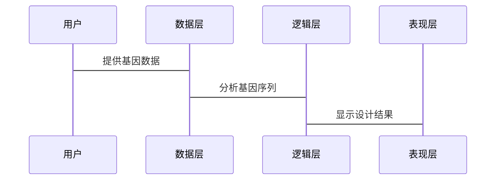

                 


# 巴菲特-芒格的合成生物学投资：生命编程的产业化

## 关键词：
- 巴菲特投资理念
- 芒格思维模型
- 合成生物学
- 产业化路径
- 数学模型
- 系统架构

## 摘要：
本文结合巴菲特的价值投资理念和芒格的多元思维模型，探讨合成生物学的投资机会和产业化路径。通过分析合成生物学的核心技术、市场应用和投资策略，提供系统的投资框架和实战指导。

---

# 第1章: 巴菲特与芒格的投资哲学概述

## 1.1 巴菲特的价值投资理念

### 1.1.1 价值投资的定义与核心原则
价值投资是一种长期投资策略，强调以低于内在价值的价格购买优质资产。核心原则包括：
1. 购买优质企业，而非市场波动。
2. 长期持有，避免频繁交易。
3. 耐心等待，避免短期诱惑。

**示例：巴菲特投资可口可乐的案例分析**
可口可乐的持续盈利能力使其成为巴菲特的长期投资目标。通过分析公司的财务状况、管理团队和市场地位，巴菲特确认其内在价值，并在股价合理时买入。

### 1.1.2 巴菲特的投资策略与成功案例
巴菲特的成功源于对企业的深度研究和对管理层的信任。他寻找那些具备持续竞争优势和良好管理的企业。

### 1.1.3 巴菲特投资理念的现代应用
随着科技发展，巴菲特的投资理念扩展到新兴领域，如合成生物学。他关注企业的长期增长潜力和竞争优势。

## 1.2 芒格的多元思维模型

### 1.2.1 多元思维模型的定义与特点
多元思维模型是芒格提出的一种思维方式，强调从多个学科角度分析问题，避免单一思维的局限性。

### 1.2.2 芒格思维模型在投资中的应用
芒格认为，投资者应通过跨学科分析，识别潜在风险和机会。例如，合成生物学涉及生物学、化学和工程学，多元思维模型帮助投资者全面评估项目可行性。

### 1.2.3 芒格与巴菲特合作的成功经验
两人合作的关键在于互补性：巴菲特专注于企业基本面分析，芒格提供跨学科视角，确保投资决策的全面性。

---

# 第2章: 合成生物学的科学基础

## 2.1 合成生物学的基本概念

### 2.1.1 合成生物学的定义与研究领域
合成生物学是通过设计和构建新的生物元件、装置和系统，或对现有自然生物系统进行改造，以实现特定功能的学科。

### 2.1.2 合成生物学的核心技术与方法
- **基因编辑技术**：如CRISPR-Cas9，用于精确修改DNA序列。
- **生物合成与代谢工程**：通过优化代谢途径提高产物产量。
- **合成基因回路**：设计合成基因回路，实现特定功能。

### 2.1.3 合成生物学的科学原理与应用前景
合成生物学利用生物系统的自组织和自复制特性，设计出能够执行特定任务的生物系统，应用于医疗、农业和能源领域。

## 2.2 合成生物学的关键技术

### 2.2.1 基因编辑技术（如CRISPR）
CRISPR-Cas9技术允许科学家精确编辑基因组，为合成生物学提供了强大的工具。通过设计特定的引导RNA，可以定点修改基因。

### 2.2.2 生物合成与代谢工程
代谢工程通过优化代谢途径，提高生物体的生产效率。例如，设计酵母菌生产特定化合物。

### 2.2.3 合成基因回路的设计与构建
合成基因回路是将多个基因元件组合，形成能够执行特定功能的网络。例如，设计一个逻辑门电路，用于响应环境信号。

---

# 第3章: 合成生物学的投资策略

## 3.1 巴菲特与芒格投资理念的结合

### 3.1.1 价值投资与合成生物学的契合点
合成生物学企业的长期价值在于其技术壁垒和市场潜力。巴菲特的价值投资理念适合评估这类企业的内在价值。

### 3.1.2 多元思维模型在合成生物学投资中的应用
芒格的多元思维模型帮助投资者从技术、市场和管理等多个角度评估合成生物学项目的风险和机会。

### 3.1.3 合成生物学投资的风险与机会
合成生物学项目面临技术不确定性、市场接受度和政策风险。但成功的项目可能带来高回报。

## 3.2 合成生物学投资的关键因素

### 3.2.1 技术成熟度与产业化潜力
投资者需评估技术的可行性和产业化路径。例如，CRISPR基因编辑技术的成熟度直接影响项目成功率。

### 3.2.2 市场需求与商业可行性
合成生物学产品需满足市场需求。例如，生物基材料的市场需求随着环保意识的增强而增加。

### 3.2.3 团队能力与企业战略
优秀的企业团队和清晰的战略规划是成功的关键。投资者应关注管理团队的经验和战略执行能力。

---

# 第4章: 合成生物学的产业化路径

## 4.1 技术转化与商业模式

### 4.1.1 技术转化的挑战与解决方案
技术转化需克服从实验室到工业生产的障碍。例如，设计高效的发酵工艺是合成生物学技术产业化的关键。

### 4.1.2 商业模式的设计与优化
合成生物学企业可采用订阅模式或按产量收费模式。例如，按生产的生物基产品数量收费。

### 4.1.3 产业化中的关键成功因素
成功因素包括技术可扩展性、生产成本和市场需求。例如，降低生产成本是提高市场竞争力的关键。

## 4.2 市场应用与投资机会

### 4.2.1 合成生物学在医疗、农业与能源领域的应用
- **医疗**：生产药物中间体。
- **农业**：开发耐旱作物。
- **能源**：生产生物燃料。

### 4.2.2 投资机会的识别与评估
投资者需关注市场需求、技术可行性和企业团队。例如，评估合成生物学企业在医疗领域的市场潜力。

---

# 第5章: 合成生物学的系统分析与数学模型

## 5.1 系统功能设计

### 5.1.1 领域模型（mermaid类图）


### 5.1.2 系统架构设计（mermaid架构图）


### 5.1.3 系统接口设计
系统接口包括：
- 数据输入接口：接收基因序列。
- 数据输出接口：输出实验结果。
- 用户接口：供研究人员输入参数。

### 5.1.4 系统交互（mermaid序列图）


## 5.2 数学模型与公式

### 5.2.1 合成生物学中的优化模型
优化模型用于设计基因回路，目标是最小化生产成本。例如，使用线性规划模型：

$$ \text{minimize } c^T x $$
$$ \text{subject to } A x = b $$

### 5.2.2 反应动力学模型
反应动力学模型描述生物系统的代谢过程：

$$ \frac{dx}{dt} = k x (K - x) $$

---

# 第6章: 合成生物学的项目实战

## 6.1 环境安装

### 6.1.1 安装Python和相关库
```bash
pip install numpy matplotlib
```

### 6.1.2 安装CRISPR设计工具
使用CRISPOR工具进行基因编辑设计。

## 6.2 核心实现

### 6.2.1 Python代码实现
```python
import numpy as np
import matplotlib.pyplot as plt

def simulate_growth(initial, rate, time):
    growth = initial * (1 + rate)**time
    return growth

initial = 100
rate = 0.1
time = 5
result = simulate_growth(initial, rate, time)
print(result)
```

### 6.2.2 代码解读
代码模拟生物系统的增长模型，计算初始值为100，增长率为10%，时间为5年的结果。

## 6.3 案例分析

### 6.3.1 投资决策
分析一家合成生物企业的市场潜力，评估其技术可行性和商业模式。

### 6.3.2 案例总结
总结投资经验，提出改进建议。

## 6.4 项目小结

### 6.4.1 项目成功因素
成功因素包括清晰的项目目标和有效的团队协作。

### 6.4.2 项目失败因素
失败因素包括技术不成熟和市场需求不足。

---

# 第7章: 总结与展望

## 7.1 总结

### 7.1.1 核心观点回顾
合成生物学的投资机会巨大，但需结合巴菲特的价值投资理念和芒格的多元思维模型。

### 7.1.2 投资策略小结
投资者应关注技术可行性和市场潜力，选择具备竞争优势的企业。

## 7.2 未来展望

### 7.2.1 未来投资趋势
合成生物学在医疗和能源领域的应用前景广阔，未来投资机会将增加。

### 7.2.2 对投资者的建议
建议投资者保持长期视角，深入研究企业基本面，并关注政策变化。

---

# 第8章: 最佳实践与注意事项

## 8.1 最佳实践

### 8.1.1 投资前的深入研究
投资者需全面了解企业的技术、市场和管理团队。

### 8.1.2 风险管理
分散投资，降低单一项目的风险。

### 8.1.3 长期视角
合成生物学项目通常需要长期投入，投资者需具备耐心。

## 8.2 小结

### 8.2.1 重要性强调
合成生物学的投资需要结合科学知识和投资理念。

### 8.2.2 未来展望
未来，合成生物学将与人工智能和大数据结合，推动更多创新。

---

通过系统的分析和实战指导，本文为投资者提供了合成生物学投资的全面框架和实践建议。结合巴菲特和芒格的投资理念，投资者可以在合成生物学领域找到长期价值。

