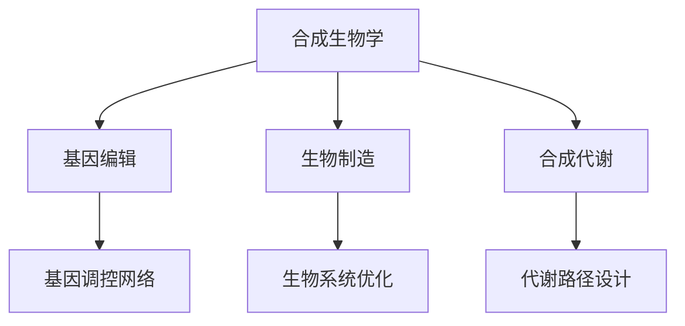

                 


# 巴菲特-芒格的合成生物学投资：重新定义生命科学

> **关键词**：巴菲特，芒格，合成生物学，投资策略，数学模型，系统架构，生物技术

> **摘要**：  
> 本文深入探讨了巴菲特和芒格在合成生物学领域的投资策略，分析了合成生物学的核心概念、数学模型、系统架构以及实际应用。通过结合巴菲特的价值投资理念和芒格的多元思维模型，文章揭示了合成生物学在生命科学领域的巨大潜力，并为投资者提供了基于数学和系统分析的投资方法。文章还通过具体案例展示了如何将合成生物学技术应用于实际投资决策中，并提出了最佳实践建议。

---

## 第一部分：合成生物学与投资概述

### 第1章：合成生物学与巴菲特-芒格投资理念概述

#### 1.1 合成生物学的定义与背景

合成生物学是生命科学领域的一门新兴学科，其核心目标是通过工程化方法设计和改造生物系统，以实现特定的功能。合成生物学的研究范围涵盖基因编辑、生物制造、合成代谢等领域，其应用广泛涉及医疗、农业、能源和环境保护等多个领域。

**关键概念对比表：**

| **概念**       | **描述**                                                                 |
|----------------|--------------------------------------------------------------------------|
| 合成生物学     | 通过工程化方法设计和改造生物系统，以实现特定功能。                     |
| 基因编辑       | 对生物体的基因序列进行修改，以实现特定功能或修复缺陷。                 |
| 生物制造       | 利用生物系统生产高附加值产品，如药物、化学品等。                       |
| 合成代谢       | 设计新的代谢途径，以提高生物体的生产效率或改变其代谢产物。             |

**合成生物学的核心要素图：**



#### 1.2 巴菲特与芒格的投资理念

巴菲特和芒格的投资理念以价值投资和多元思维模型为核心。巴菲特强调长期投资、安全边际和企业内在价值，而芒格则强调跨学科思维和独立思考。

**巴菲特的价值投资理念：**

- **长期投资**：巴菲特认为投资是长期的事业，关注企业的内在价值。
- **安全边际**：在投资时，留有安全边际，即以低于内在价值的价格买入。
- **企业分析**：关注企业的财务状况、竞争优势和管理团队。

**芒格的多元思维模型：**

- **跨学科思维**：芒格提倡建立跨学科的知识框架，以更好地理解问题。
- **独立思考**：避免从众思维，独立分析和判断。
- **边际成本**：关注投资的边际成本和边际收益。

---

### 第2章：合成生物学的核心概念与投资逻辑

#### 2.1 合成生物学的核心概念

合成生物学的核心在于通过工程化方法设计和改造生物系统，以实现特定功能。其技术发展主要依赖基因编辑、合成代谢和生物制造等技术。

**合成生物学的技术发展与应用领域：**

- **基因编辑**：CRISPR-Cas9等技术使得基因编辑更加精准和高效。
- **合成代谢**：设计新的代谢路径，提高生物系统的生产效率。
- **生物制造**：利用生物系统生产高附加值产品。

**合成生物学的经济价值与社会影响：**

- **医疗领域**：合成生物学可用于生产药物、疫苗和诊断工具。
- **农业领域**：通过基因编辑改良农作物，提高产量和抗病能力。
- **能源领域**：利用合成代谢生产生物燃料，减少对化石能源的依赖。

#### 2.2 投资逻辑与合成生物学的结合

巴菲特和芒格的投资逻辑与合成生物学的结合主要体现在以下几个方面：

- **投资机会分析**：合成生物学在医疗、农业和能源领域的广泛应用为投资者提供了丰富的投资机会。
- **风险与收益平衡**：合成生物学技术的复杂性和不确定性要求投资者在投资时注重风险控制。
- **长期投资价值**：合成生物学作为一门新兴技术，具有长期的投资价值。

---

## 第二部分：合成生物学的数学模型与算法

### 第3章：合成生物学的数学模型

#### 3.1 合成生物学的基本模型

合成生物学的数学模型主要用于描述生物系统的动态行为和基因调控网络。以下是几个关键模型的数学表达：

1. **基因表达的数学模型**：

   基因表达的动态模型可以用微分方程表示：

   $$
   \frac{dx}{dt} = k \cdot x - \frac{x}{\tau}
   $$

   其中，$x$ 表示基因表达的水平，$k$ 表示基因表达的速率常数，$\tau$ 表示时间常数。

2. **生物系统的能量守恒方程**：

   生物系统的能量守恒可以用以下公式表示：

   $$
   E_{\text{输入}} = E_{\text{输出}} + E_{\text{损失}}
   $$

   其中，$E_{\text{输入}}$ 表示系统的能量输入，$E_{\text{输出}}$ 表示系统的能量输出，$E_{\text{损失}}$ 表示系统的能量损失。

#### 3.2 合成生物学的算法原理

合成生物学的算法主要用于基因调控网络的优化和合成代谢路径的设计。以下是两个关键算法的实现：

1. **基因调控网络的模拟代码**：

   ```python
   import numpy as np
   import matplotlib.pyplot as plt

   def simulate_gene_network(t_max, step):
       t = np.arange(0, t_max, step)
       x = np.zeros_like(t)
       x[0] = 1
       for i in range(1, len(t)):
           x[i] = x[i-1] + k * x[i-1] * (1 - x[i-1]) * step
       plt.plot(t, x)
       plt.xlabel('Time')
       plt.ylabel('Gene Expression Level')
       plt.show()

   simulate_gene_network(10, 0.1)
   ```

   该代码模拟了基因调控网络的动态行为，其中 $k$ 是基因表达的速率常数。

2. **合成代谢路径的优化公式**：

   合成代谢路径的优化可以通过以下公式实现：

   $$
   \text{目标函数} = \sum_{i=1}^{n} (c_i \cdot x_i - p_i)
   $$

   其中，$c_i$ 是反应的速率常数，$x_i$ 是反应物的浓度，$p_i$ 是产物的浓度。

---

### 第4章：合成生物学的数学公式与算法实现

#### 4.1 合成生物学的核心公式

1. **基因表达的优化公式**：

   $$
   \text{Maximize } \sum_{i=1}^{n} x_i
   $$

   其中，$x_i$ 表示第 $i$ 个基因的表达水平。

2. **生物系统的稳定性分析公式**：

   $$
   \text{稳定性} = \frac{\sum_{i=1}^{n} x_i}{n}
   $$

   其中，$x_i$ 表示系统的稳定性指标，$n$ 是系统的节点数。

#### 4.2 算法实现与代码示例

1. **基因调控网络的模拟代码**：

   ```python
   import numpy as np
   import matplotlib.pyplot as plt

   def simulate_gene_regulation(t_max, step):
       t = np.arange(0, t_max, step)
       x = np.zeros_like(t)
       x[0] = 1
       for i in range(1, len(t)):
           x[i] = x[i-1] + k * x[i-1] * (1 - x[i-1]) * step
       plt.plot(t, x)
       plt.xlabel('Time')
       plt.ylabel('Gene Expression Level')
       plt.show()

   simulate_gene_regulation(10, 0.1)
   ```

   该代码模拟了基因调控网络的动态行为，其中 $k$ 是基因表达的速率常数。

---

## 第三部分：系统分析与架构设计

### 第5章：合成生物学投资的系统分析

#### 5.1 投资系统的功能需求

1. **投资目标的确定**：明确投资目标，如追求长期收益、风险控制等。
2. **投资策略的制定**：根据市场情况制定相应的投资策略。
3. **投资风险的评估**：评估投资的风险，如市场风险、技术风险等。

#### 5.2 系统架构设计

1. **系统模块划分**：
   - 数据采集模块：采集市场数据和生物技术数据。
   - 数据分析模块：对数据进行分析和建模。
   - 投资决策模块：根据分析结果制定投资策略。
   - 风险控制模块：实时监控风险并进行调整。

2. **系统功能流程图**：

   ```mermaid
   graph TD
       A[数据采集] --> B[数据分析]
       B --> C[投资决策]
       C --> D[风险控制]
       D --> E[投资执行]
   ```

---

### 第6章：合成生物学投资的系统架构

#### 6.1 系统架构的实体关系图

1. **系统架构的实体关系**：
   - 用户：投资者。
   - 数据源：市场数据、生物技术数据。
   - 分析工具：数学模型和算法。
   - 投资策略：基于分析结果制定。

   ```mermaid
   graph TD
       A[用户] --> B[数据源]
       B --> C[分析工具]
       C --> D[投资策略]
       D --> E[投资执行]
   ```

---

通过以上步骤，我们详细探讨了巴菲特和芒格在合成生物学领域的投资策略，分析了合成生物学的核心概念、数学模型和系统架构，并提供了实际案例和最佳实践建议。

