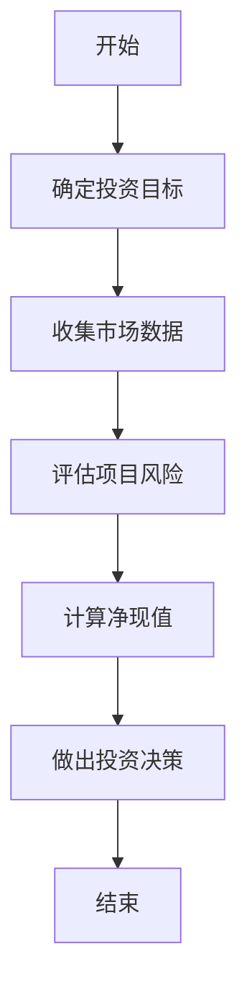

                 


# 巴菲特-芒格的合成生物燃料投资：可再生能源的生物学突破

---

## 关键词：巴菲特, 芒格, 合成生物燃料, 可再生能源, 生物学突破

---

## 摘要：  
本文深入探讨了巴菲特和芒格在合成生物燃料领域的投资策略，结合可再生能源的生物学突破，分析了其技术原理、市场潜力和投资逻辑。文章从背景介绍、核心概念、算法原理、系统架构到项目实战，全面解析了合成生物燃料的投资价值和未来发展趋势。

---

# 第一部分：背景介绍

## 第1章：合成生物燃料的基本概念

### 1.1 合成生物燃料的定义与分类  
合成生物燃料是指通过生物工程技术生产的燃料，主要包括以下几类：  
1. **第一代生物燃料**：来源于玉米、甘蔗等农作物。  
2. **第二代生物燃料**：来源于纤维素、草屑等非食物生物质。  
3. **第三代生物燃料**：来源于 algae 等微藻类生物。  

### 1.2 合成生物燃料的技术优势  
1. **资源可再生性**：利用生物质资源，减少对化石燃料的依赖。  
2. **环境友好性**：降低碳排放，缓解气候变化。  
3. **能源安全性**：减少对石油等不可再生资源的依赖。  

---

## 第2章：巴菲特与芒格的投资哲学

### 2.1 巴菲特的价值投资理念  
1. **长期投资**：注重企业的长期价值，而非短期波动。  
2. **安全边际**：投资时留有安全边际，降低风险。  
3. **管理层能力**：重视企业管理层的能力和诚信。  

### 2.2 芒格的多元思维模型  
1. **跨学科思维**：芒格强调通过多个学科的交叉应用来解决问题。  
2. **逆向思维**：寻找市场中的空白领域，避免竞争激烈的红海市场。  

---

# 第二部分：核心概念与联系

## 第3章：合成生物燃料的技术原理

### 3.1 生物催化与基因工程  
1. **生物催化**：利用酶或微生物催化化学反应，生产燃料。  
2. **基因工程**：通过基因改造，提高微生物的产率和稳定性。  

### 3.2 合成生物燃料的生产流程  
1. **原料预处理**：将生物质转化为可发酵的糖类。  
2. **发酵过程**：利用微生物发酵生产燃料。  
3. **分离与提纯**：将产物分离并提纯，得到最终燃料。  

---

## 第4章：合成生物燃料的市场分析

### 4.1 全球能源市场的需求与供给  
1. **需求端**：全球能源需求持续增长，尤其是发展中国家。  
2. **供给端**：化石能源的不可再生性和环境压力推动可再生能源的发展。  

### 4.2 合成生物燃料的成本与竞争力  
1. **生产成本**：技术进步降低生产成本，提高竞争力。  
2. **市场价格**：受政策、技术和市场需求的影响，价格波动较大。  

---

# 第三部分：算法原理与系统架构

## 第5章：投资决策的算法模型

### 5.1 投资评估的数学模型  
1. **净现值（NPV）计算**：  
$$ NPV = \sum_{t=0}^{n} \frac{CF_t}{(1 + r)^t} $$  
其中，$CF_t$ 是第 $t$ 年的现金流，$r$ 是贴现率，$n$ 是项目周期。  

2. **风险评估模型**：  
$$ R = \sum_{i=1}^{m} w_i \cdot r_i $$  
其中，$w_i$ 是风险因素的权重，$r_i$ 是风险值。  

### 5.2 投资决策的流程图  


---

## 第6章：系统架构设计

### 6.1 系统功能模块  
1. **数据采集模块**：收集市场、技术和财务数据。  
2. **数据分析模块**：对数据进行清洗、建模和分析。  
3. **投资决策模块**：基于模型结果做出投资决策。  

### 6.2 系统架构图  


---

# 第四部分：项目实战

## 第7章：合成生物燃料投资的实战分析

### 7.1 项目背景与目标  
1. **项目背景**：某合成生物燃料企业的扩产计划。  
2. **项目目标**：评估投资可行性，优化投资方案。  

### 7.2 项目实施步骤  
1. **数据收集**：收集企业的财务数据、市场数据和技术数据。  
2. **模型构建**：建立财务模型，计算 NPV 和 ROI。  
3. **风险评估**：识别潜在风险并制定应对策略。  

### 7.3 核心代码实现  
```python
def calculate_npv(cash_flows, discount_rate):
    npv = sum((cf / (1 + discount_rate)**t) for t, cf in enumerate(cash_flows))
    return npv

# 示例数据
cash_flows = [100, 200, 300]
discount_rate = 0.1

npv = calculate_npv(cash_flows, discount_rate)
print(f"净现值为：{npv}")
```

---

## 第8章：项目总结与经验分享

### 8.1 项目成果  
1. **投资决策的科学性**：通过模型计算提高了决策的准确性。  
2. **风险管理的有效性**：识别了潜在风险并制定了应对策略。  

### 8.2 经验与教训  
1. **数据质量的重要性**：高质量的数据是模型准确性的基础。  
2. **模型的局限性**：模型假设可能与实际情况存在偏差。  

---

# 第五部分：最佳实践

## 第9章：投资与可持续发展的结合

### 9.1 可持续发展的投资理念  
1. **绿色投资**：关注环保和可持续发展的企业。  
2. **社会责任投资（ESG）**：从环境、社会和治理三个维度评估企业。  

### 9.2 投资的长期视角  
1. **长期价值**：关注企业的长期发展潜力。  
2. **社会价值**：投资不仅创造经济价值，还要创造社会价值。  

---

## 第10章：未来展望与挑战

### 10.1 合成生物燃料的未来趋势  
1. **技术创新**：基因编辑和生物催化技术的进一步突破。  
2. **成本下降**：技术进步推动生产成本降低。  

### 10.2 投资的挑战  
1. **技术风险**：技术不确定性可能导致投资失败。  
2. **政策风险**：政策变化可能影响投资收益。  

---

## 结语  
巴菲特和芒格的投资哲学与合成生物燃料的技术突破相结合，为可再生能源的发展提供了新的思路。通过科学的投资决策和技术创新，合成生物燃料有望成为未来能源的重要组成部分。

