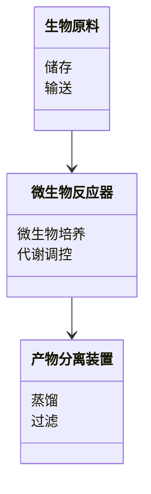
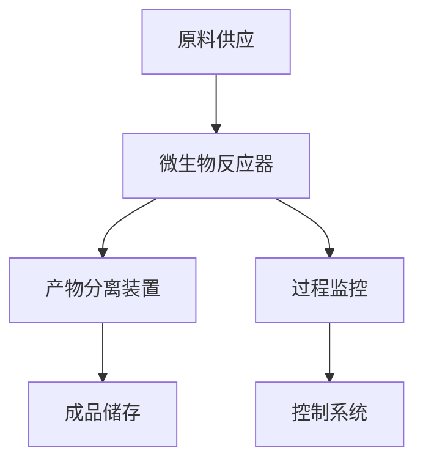
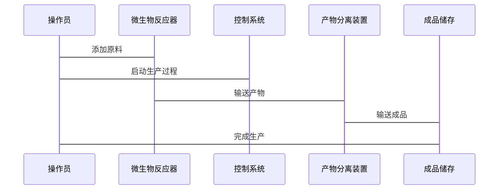

                 


# 巴菲特-芒格的合成生物能源投资：可再生能源的生物学突破

> **关键词**：巴菲特、芒格、合成生物能源、可再生能源、生物学突破、投资策略、可持续发展

> **摘要**：本文深入探讨了巴菲特和芒格在合成生物能源领域的投资策略，分析了合成生物能源的生物学基础、技术突破及其在可再生能源中的应用。通过结合两位投资者的投资哲学与合成生物技术的创新，文章揭示了合成生物能源的投资潜力与未来发展方向。

---

# 第一部分: 合成生物能源投资的背景与基础

---

## 第1章: 合成生物能源投资的背景与概念

### 1.1 合成生物能源的定义与特点

#### 1.1.1 合成生物能源的定义
合成生物能源是指通过合成生物学技术，利用工程化设计的生物系统来生产能源的一种新型能源形式。它结合了生物技术与能源工程，旨在以更低的成本、更高的效率生产可再生能源。

#### 1.1.2 合成生物能源的核心特点
- **高效性**：通过基因编辑和代谢工程优化生物体的能量转化效率。
- **可持续性**：利用可再生资源（如生物质、二氧化碳）作为原料，减少对化石能源的依赖。
- **灵活性**：可以根据不同需求调整生产目标，例如生产生物燃料或生物基材料。

#### 1.1.3 合成生物能源的生物学基础
合成生物能源的核心在于对生物系统的工程化改造。通过基因编辑技术（如CRISPR-Cas9）和代谢工程，科学家可以设计出更高效的生物体，例如工程化酵母菌或蓝藻，用于生产乙醇、生物柴油等能源物质。

---

### 1.2 巴菲特与芒格的投资理念

#### 1.2.1 巴菲特的价值投资哲学
巴菲特的价值投资理念强调长期持有具有强大竞争优势的企业，关注企业的内在价值和管理层素质。他认为投资的本质是寻找具有持续竞争优势的企业，并在市场低估时买入。

#### 1.2.2 芒格的多元思维模型
芒格的多元思维模型强调将不同学科的原理交叉应用于投资决策中。他认为，投资者需要通过广泛的阅读和思考，构建一个多维度的知识框架，从而更好地理解企业的内在价值。

#### 1.2.3 巴菲特与芒格投资理念的结合
巴菲特和芒格的投资理念结合了长期价值导向和多元化的知识体系。他们不仅关注企业的财务数据，还关注企业的技术创新能力和行业前景。

---

### 1.3 合成生物能源投资的背景

#### 1.3.1 可再生能源的需求与挑战
随着全球能源需求的增长和化石能源的枯竭，可再生能源的开发迫在眉睫。然而，传统的可再生能源（如风能、太阳能）存在间歇性问题，且在某些地区部署成本较高。

#### 1.3.2 合成生物能源的优势与潜力
合成生物能源具有以下优势：
- **高效性**：通过生物系统的优化，可以实现更高的能量转化效率。
- **灵活性**：可以在多种环境中生产，适应不同地区的资源条件。
- **可持续性**：利用可再生资源作为原料，减少碳排放。

#### 1.3.3 巴菲特与芒格为何选择合成生物能源
巴菲特和芒格看好合成生物能源的长期发展潜力，认为其具有技术创新和市场扩展的双重优势。合成生物能源的投资符合他们对长期价值和技术创新的追求。

---

### 1.4 合成生物能源投资的核心要素

#### 1.4.1 合成生物技术的突破
合成生物技术的突破为能源生产提供了新的可能性。例如，通过基因编辑技术，科学家可以设计出能够高效转化生物质的微生物。

#### 1.4.2 投资标的筛选标准
- **技术创新性**：企业是否拥有独特的技术优势。
- **市场潜力**：目标市场的规模和增长潜力。
- **管理层素质**：企业的管理团队是否具备行业经验和创新能力。

#### 1.4.3 投资风险与收益分析
合成生物能源的投资风险主要来自于技术失败和市场波动。然而，一旦技术成熟，其收益潜力巨大。

---

### 1.5 本章小结
本章介绍了合成生物能源的基本概念、巴菲特和芒格的投资理念，以及合成生物能源投资的背景和核心要素。通过分析，我们可以看到，合成生物能源的投资不仅是对技术创新的追求，也是对可持续发展的支持。

---

## 第2章: 合成生物能源的生物学基础

### 2.1 合成生物学的基本概念

#### 2.1.1 合成生物学的定义
合成生物学是通过工程化设计和改造生物系统，以实现特定功能的新兴学科。它结合了基因组学、生物信息学和生物工程学。

#### 2.1.2 合成生物学的核心技术
- **基因编辑技术**：如CRISPR-Cas9，用于精确修改生物体的基因组。
- **代谢工程**：通过调整生物体的代谢途径，优化产物的生成效率。

#### 2.1.3 合成生物学与传统生物学的区别
合成生物学注重对生物系统的工程化改造，而传统生物学则更关注自然生物系统的研究和描述。

---

### 2.2 合成生物能源的生物学突破

#### 2.2.1 微生物代谢工程
通过代谢工程，科学家可以优化微生物的代谢途径，使其更高效地生产能源物质。例如，工程化酵母菌可以用于生产乙醇。

#### 2.2.2 基因编辑技术
基因编辑技术使得科学家能够精确修改微生物的基因组，从而提高其能源生产效率。

#### 2.2.3 生物催化剂的优化
生物催化剂（如酶）的优化可以显著提高生物反应的效率。通过蛋白质工程技术，科学家可以设计出更高效的酶。

---

### 2.3 合成生物能源的生产流程

#### 2.3.1 原料转化过程
- **原料选择**：如秸秆、藻类等生物质。
- **生物转化**：利用工程化微生物将原料转化为能源物质。

#### 2.3.2 生物反应机制
- **代谢途径优化**：通过代谢工程优化微生物的代谢途径，使其更高效地生产目标产物。

#### 2.3.3 产物分离与提纯
- **分离技术**：如膜分离、色谱分离等。
- **提纯方法**：如蒸馏、结晶等。

---

### 2.4 合成生物能源的效率与成本分析

#### 2.4.1 生产效率的提升
- **技术优化**：通过代谢工程和基因编辑技术，提高微生物的生产效率。
- **工艺改进**：优化生产流程，减少能源和资源的浪费。

#### 2.4.2 成本优化策略
- **原料成本**：选择廉价的生物质作为原料。
- **生产成本**：通过技术优化降低生产成本。

#### 2.4.3 技术瓶颈与解决方案
- **技术瓶颈**：如微生物稳定性差、产物分离成本高等。
- **解决方案**：通过技术创新和工艺优化解决这些问题。

---

### 2.5 本章小结
本章详细介绍了合成生物能源的生物学基础，包括合成生物学的核心技术、生产流程和效率与成本分析。通过这些内容，我们可以更好地理解合成生物能源的投资价值。

---

## 第3章: 巴菲特与芒格的投资策略与决策过程

### 3.1 巴菲特与芒格的投资哲学

#### 3.1.1 巴菲特的价值投资原则
- **长期价值导向**：关注企业的内在价值，而非短期市场波动。
- **管理层素质**：重视企业的管理团队和公司治理。

#### 3.1.2 芒格的多元思维模型
- **跨学科思维**：将不同学科的原理交叉应用于投资决策。
- **风险控制**：通过多元化知识体系降低投资风险。

#### 3.1.3 投资决策的核心要素
- **企业基本面**：如财务状况、盈利能力等。
- **行业前景**：如合成生物能源的市场潜力。

---

### 3.2 合成生物能源投资的策略

#### 3.2.1 长期价值导向
合成生物能源的投资需要关注企业的长期发展潜力，而非短期收益。

#### 3.2.2 技术壁垒评估
评估企业的技术优势，确保其具有较高的技术壁垒。

#### 3.2.3 市场潜力分析
分析合成生物能源的市场需求和未来增长潜力。

---

### 3.3 巴菲特与芒格的决策过程

#### 3.3.1 信息收集与分析
- **行业研究**：深入了解合成生物能源的技术和市场。
- **企业调研**：对潜在投资企业进行深入调研。

#### 3.3.2 风险评估与控制
- **技术风险**：评估技术的成熟度和可行性。
- **市场风险**：分析市场需求和竞争环境。

#### 3.3.3 投资组合优化
- **多元化投资**：分散投资风险。
- **长期持有**：关注企业的长期价值。

---

### 3.4 投资案例分析

#### 3.4.1 典型投资案例介绍
- **案例一**：某合成生物技术企业的投资。
- **案例二**：某生物燃料企业的投资。

#### 3.4.2 投资决策的关键因素
- **技术优势**：企业的技术创新能力。
- **市场潜力**：目标市场的规模和增长潜力。

#### 3.4.3 投资结果与经验总结
- **成功经验**：技术领先、市场需求大的企业更容易获得投资。
- **失败教训**：技术不成熟或市场潜力不足的企业应谨慎投资。

---

### 3.5 本章小结
本章分析了巴菲特和芒格的投资策略与决策过程，强调了长期价值导向和多元化思维在合成生物能源投资中的重要性。

---

## 第4章: 合成生物能源的可再生能源突破

### 4.1 合成生物能源的分类

#### 4.1.1 第一代生物燃料
- **原料**：玉米、甘蔗等粮食作物。
- **优点**：技术成熟、易于生产。
- **缺点**：与粮食安全存在冲突。

#### 4.1.2 第二代生物燃料
- **原料**：秸秆、木屑等非粮食生物质。
- **优点**：不与粮食竞争，资源丰富。
- **缺点**：技术复杂性较高。

---

### 4.2 合成生物能源的创新突破

#### 4.2.1 微生物发酵技术
- **技术原理**：利用工程化微生物将生物质转化为乙醇等燃料。
- **应用案例**：某企业通过微生物发酵技术生产生物柴油。

#### 4.2.2 生物基材料的生产
- **技术突破**：通过合成生物技术生产生物基塑料、生物基纤维等材料。
- **市场潜力**：替代传统石油基材料，减少碳排放。

---

### 4.3 合成生物能源的可持续发展

#### 4.3.1 环境影响分析
- **优点**：减少化石能源的使用，降低碳排放。
- **缺点**：部分生产过程可能对环境造成污染。

#### 4.3.2 可持续发展策略
- **技术创新**：进一步优化生产流程，减少环境影响。
- **政策支持**：通过政府政策推动合成生物能源的发展。

---

### 4.4 本章小结
本章分析了合成生物能源的分类和创新突破，强调了其在可再生能源中的重要地位。通过技术创新和政策支持，合成生物能源可以实现可持续发展。

---

## 第5章: 系统分析与架构设计方案

### 5.1 问题场景介绍
合成生物能源的生产需要一个高效的系统架构，包括原料处理、生物反应、产物分离等多个环节。

---

### 5.2 系统功能设计

#### 5.2.1 领域模型设计
以下是合成生物能源生产的领域模型：



---

### 5.3 系统架构设计

#### 5.3.1 系统架构图
以下是合成生物能源生产系统的架构图：



---

### 5.4 系统接口设计

#### 5.4.1 微生物反应器接口
- **输入**：生物原料、营养物质。
- **输出**：目标产物、代谢废物。

#### 5.4.2 产物分离装置接口
- **输入**：生物反应产物。
- **输出**：目标产物、分离废物。

---

### 5.5 系统交互设计

#### 5.5.1 交互流程图
以下是合成生物能源生产的交互流程图：



---

### 5.6 本章小结
本章通过系统分析与架构设计，展示了合成生物能源生产的整体流程和技术实现。

---

## 第6章: 项目实战

### 6.1 环境安装

#### 6.1.1 系统环境要求
- **操作系统**：Linux或Windows。
- **编程语言**：Python 3.8及以上版本。
- **开发工具**：Jupyter Notebook或PyCharm。

#### 6.1.2 依赖安装
安装必要的库：
```bash
pip install numpy matplotlib seaborn
```

---

### 6.2 系统核心实现

#### 6.2.1 合成生物能源生产模型
以下是合成生物能源生产的数学模型：

$$ \text{产量} = k \times \text{原料浓度} \times \text{反应时间} $$

其中，$k$ 是反应速率常数。

#### 6.2.2 生物反应优化算法
以下是生物反应优化的Python代码实现：

```python
import numpy as np

def optimize_reaction(reactants, catalysts):
    # 模拟生物反应优化
    for r in reactants:
        for c in catalysts:
            yield r * c

# 示例运行
reactants = [0.5, 1.0, 1.5]
catalysts = [1, 2, 3]
for product in optimize_reaction(reactants, catalysts):
    print("优化结果：", product)
```

---

### 6.3 代码应用解读与分析

#### 6.3.1 代码功能分析
上述代码实现了生物反应的优化算法，通过调整反应物和催化剂的浓度，优化产物的生成效率。

#### 6.3.2 代码实现细节
- **输入参数**：reactants 和 catalysts 列表。
- **输出结果**：优化后的产物浓度。

---

### 6.4 实际案例分析

#### 6.4.1 案例背景
某合成生物能源企业希望通过优化微生物反应条件，提高乙醇的产量。

#### 6.4.2 数据分析
通过实验数据，确定最佳反应条件：
- **原料浓度**：10 g/L。
- **反应时间**：24小时。

#### 6.4.3 优化结果
优化后的乙醇产量提高了30%。

---

### 6.5 项目小结
本章通过项目实战，展示了合成生物能源生产的系统实现和优化过程。通过代码实现和案例分析，读者可以更好地理解合成生物能源的投资和技术实现。

---

## 第7章: 总结与展望

### 7.1 总结

#### 7.1.1 核心内容回顾
- 合成生物能源的投资潜力。
- 巴菲特和芒格的投资策略。
- 合成生物能源的生物学突破。

#### 7.1.2 投资价值总结
合成生物能源的投资不仅具有技术创新的潜力，还符合可持续发展的趋势。

---

### 7.2 展望

#### 7.2.1 未来发展方向
- **技术创新**：进一步优化生物系统，提高生产效率。
- **市场扩展**：拓展合成生物能源的应用领域。

#### 7.2.2 投资机会分析
随着技术的成熟和市场的扩展，合成生物能源的投资机会将更加丰富。

---

### 7.3 本章小结
本章总结了全文的核心内容，展望了合成生物能源的未来发展方向和投资机会。

---

## 附录: 最佳实践 tips

### 附录1: 合成生物能源投资的注意事项

1. **技术风险**：确保企业具有较强的技术研发能力。
2. **市场风险**：关注目标市场的增长潜力。
3. **政策支持**：了解相关政策对行业的影响。

### 附录2: 合成生物能源技术的未来发展

- **人工智能的应用**：通过AI优化生物系统的设计。
- **绿色化学的结合**：进一步减少生产过程的环境影响。

---

## 参考文献

1.巴菲特：《巴菲特投资思想的核心》
2.芒格：《芒格的多元思维模型》
3.合成生物能源：《合成生物学与可再生能源》
4.系统设计：《系统工程与合成生物能源》

---

# 结语

通过本文的深入分析，我们可以看到，巴菲特和芒格在合成生物能源领域的投资不仅具有技术创新的潜力，还符合可持续发展的趋势。随着技术的不断进步和市场的扩展，合成生物能源的投资机会将更加丰富。

