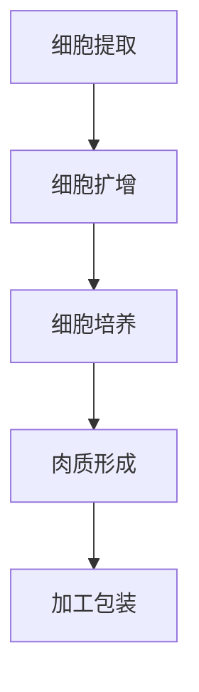

                 

# 巴菲特-芒格的合成食品投资：解决全球粮食危机

> 关键词：巴菲特，芒格，合成食品，投资策略，粮食危机，可持续发展

> 摘要：本文探讨了巴菲特和芒格在合成食品领域的投资策略，分析了合成食品如何解决全球粮食危机，并结合技术与市场的结合，提出了投资逻辑和风险管理策略。通过实际案例分析，展示了合成食品行业的投资潜力和未来发展方向。

---

## 第一部分：合成食品的背景与现状

### 第1章：合成食品的定义与技术基础

#### 1.1 合成食品的定义与分类

合成食品是指通过生物工程、化学合成或物理加工等技术制造的食品，旨在替代传统农业生产的食品。常见的合成食品包括细胞培养肉、植物基肉制品、实验室合成蛋白等。

| 合成食品分类 | 描述 |
|----------------|------|
| 细胞培养肉 | 通过细胞培养技术生产动物肉 |
| 植物基肉制品 | 通过植物蛋白加工制造类似肉类的产品 |
| 合成蛋白 | 通过发酵技术生产蛋白质 |

#### 1.2 合成食品的技术基础

##### 细胞培养肉的生产流程

##### 合成食品的技术挑战

- **技术瓶颈**：细胞培养肉的生产成本高、生产效率低。
- **市场接受度**：消费者对合成食品的接受度存在疑虑。
- **法规问题**：合成食品的监管框架尚未完善。

#### 1.3 合成食品的现状与挑战

- **全球合成食品市场的现状**：市场规模约为50亿美元，年增长率超过20%。
- **技术瓶颈**：生产成本高、技术不成熟。
- **市场接受度**：消费者对合成食品的认知不足，接受度较低。

### 第2章：合成食品与全球粮食危机

#### 2.1 全球粮食危机的现状

- **人口增长与粮食需求**：全球人口预计将在2050年达到90亿，粮食需求将增加50%。
- **气候变化对农业的影响**：气候变化导致农业减产，粮食供应链不稳定。
- **粮食供应链的脆弱性**：全球粮食供应链受到疫情、战争等影响，导致粮食价格波动。

#### 2.2 合成食品在解决粮食危机中的作用

- **高效率生产**：合成食品生产效率高，资源消耗少。
- **减少对传统农业的依赖**：合成食品可以减少对土地、水等资源的需求。
- **可持续发展的潜力**：合成食品生产过程中碳排放低，资源利用效率高。

#### 2.3 合成食品的未来展望

- **技术进步的潜力**：合成食品技术不断进步，生产成本下降。
- **市场规模的预测**：预计到2030年，合成食品市场规模将达到1000亿美元。
- **全球合作的重要性**：政府、企业、科研机构需要合作推动合成食品的发展。

---

## 第二部分：巴菲特与芒格的投资哲学

### 第3章：巴菲特与芒格的投资理念

#### 3.1 巴菲特的价值投资理论

- **价值投资的核心思想**：寻找被市场低估的优质企业，长期持有。
- **巴菲特的投资策略**：注重企业基本面分析，关注企业的竞争优势和管理层。
- **成功案例分析**：巴菲特投资可口可乐、苹果等公司，长期持有获得超额收益。

#### 3.2 芒格的多元思维模型

- **多元思维模型的定义**：通过多个学科的思维方式来分析问题。
- **芒格的思维方式**：关注企业的竞争优势、行业趋势、经济周期。
- **成功案例分析**：芒格投资喜马拉雅控股、富国银行等公司，注重企业的长期竞争优势。

#### 3.3 巴菲特与芒格投资理念的结合

- **价值投资与多元思维的结合**：巴菲特定位于低估的企业，芒格关注企业的竞争优势。
- **巴菲特与芒格的合作模式**：巴菲特定位于企业的价值，芒格关注企业的竞争优势。
- **长期投资策略**：巴菲特定位于长期持有，芒格关注企业的长期竞争优势。

### 第4章：巴菲特与芒格的投资逻辑

#### 4.1 巴菲特与芒格的投资逻辑

- **企业基本面分析**：关注企业的盈利能力、财务状况、管理层质量。
- **管理层评估**：关注管理层的诚信、能力和决策能力。
- **行业趋势判断**：关注行业的长期发展趋势。

#### 4.2 巴菲特与芒格的投资决策框架

##### 企业竞争优势分析

- **核心竞争力**：企业的核心竞争力是长期竞争优势的关键。
- **行业地位**：企业的行业地位决定了其市场影响力。
- **竞争优势的可持续性**：竞争优势是否能够在长期持续。

##### 财务指标评估

- **盈利能力**：ROE（净资产收益率）、净利润率等。
- **财务健康状况**：资产负债率、现金流等。
- **成长性**：收入增长率、净利润增长率等。

##### 行业周期性分析

- **行业周期**：行业处于成长期、成熟期还是衰退期。
- **行业趋势**：行业未来的发展趋势。
- **行业竞争格局**：行业的竞争格局是否有利于企业的长期发展。

#### 4.3 巴菲特与芒格的长期投资策略

- **长期持有的重要性**：长期持有优质企业，获得复利收益。
- **耐心与纪律的重要性**：耐心等待投资机会，纪律执行投资策略。
- **风险控制的策略**：分散投资、控制仓位、避免过度集中。

---

## 第三部分：合成食品行业的投资分析

### 第5章：合成食品行业的投资机会

#### 5.1 合成食品行业的市场潜力

- **市场规模预测**：预计到2030年，合成食品市场规模将达到1000亿美元。
- **市场增长驱动力**：消费者对健康食品的需求增加，环保意识增强。
- **市场竞争格局**：行业内竞争激烈，技术门槛高。

#### 5.2 合成食品行业的技术与市场结合

##### 合成食品的技术优势

- **高效率生产**：合成食品生产效率高，资源消耗少。
- **减少资源消耗**：合成食品生产过程中水、土地等资源消耗少。
- **环境友好**：合成食品生产过程中碳排放低。

##### 投资逻辑与风险管理

- **投资逻辑**：合成食品行业具有高成长性，技术进步快，市场潜力大。
- **风险管理策略**：关注技术风险、市场风险、政策风险。

---

## 第6章：合成食品行业的投资策略

#### 6.1 投资策略与风险管理

##### 投资策略

- **长期投资策略**：长期持有优质企业，获得复利收益。
- **价值投资策略**：寻找被市场低估的优质企业。
- **分散投资策略**：分散投资，降低风险。

##### 风险管理策略

- **技术风险**：关注企业的技术研发能力，避免技术落后。
- **市场风险**：关注市场的需求变化，避免市场萎缩。
- **政策风险**：关注政策变化，避免政策风险。

#### 6.2 合成食品行业的投资案例分析

##### 成功案例分析

- **Impossible Foods**：生产植物基肉制品，估值超过100亿美元。
- **Beyond Meat**：植物基肉制品生产商，上市后股价暴涨。

##### 失败案例分析

- ** Hampton Creek**：由于技术问题和市场竞争，最终失败。

---

## 结语

巴菲特和芒格的投资理念和策略为合成食品行业提供了重要的指导。合成食品行业具有巨大的市场潜力，但也面临技术、市场和政策等多重挑战。投资者需要结合巴菲特和芒格的投资哲学，制定科学的投资策略和风险管理策略，才能在合成食品行业中获得成功。

---

通过以上分析，我们可以看到，巴菲特和芒格的投资理念和策略在合成食品行业中具有重要的指导意义。合成食品行业具有巨大的市场潜力，但也面临技术、市场和政策等多重挑战。投资者需要结合巴菲特和芒格的投资哲学，制定科学的投资策略和风险管理策略，才能在合成食品行业中获得成功。

