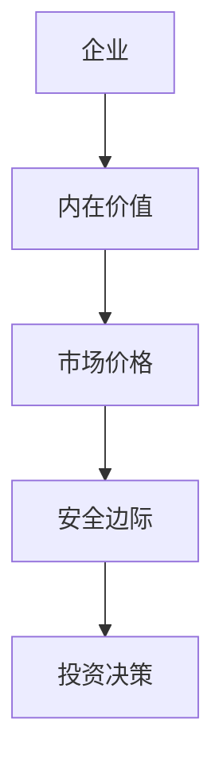
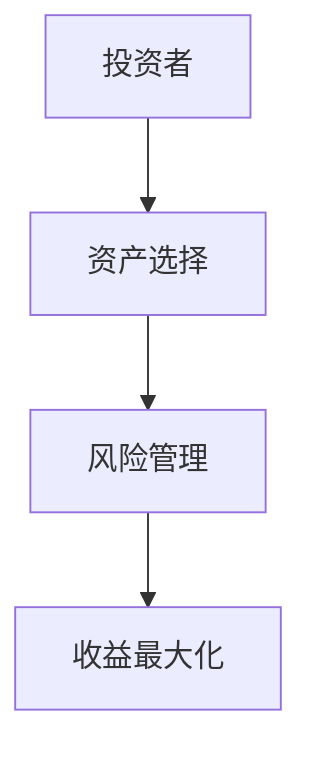

                 


# 巴菲特-芒格的后疫情时代投资策略：适应新常态

## 关键词：巴菲特，芒格，投资策略，后疫情时代，价值投资，安全边际，护城河

## 摘要：  
在后疫情时代，全球经济面临深刻变化，传统的投资策略需要适应新的经济环境。本文将深入分析巴菲特和芒格的投资理念，探讨其在后疫情时代的应用与调整，帮助投资者在新常态下制定有效的投资策略。通过详细阐述价值投资、安全边际、护城河等核心概念，并结合实际案例和数学模型，本文旨在为投资者提供清晰的理论指导和实践方法。

---

## 第一章：巴菲特-芒格投资策略概述

### 1.1 巴菲特与芒格的投资哲学

#### 1.1.1 价值投资的定义与特点  
价值投资是一种以低于内在价值的价格购买优质资产的投资策略。其核心在于寻找市场低估的公司，并长期持有。巴菲特和芒格将其发扬光大，强调对企业基本面的深入研究和对管理层的信任。

#### 1.1.2 后疫情时代全球经济的新常态  
疫情对全球经济造成了深远影响，线上经济崛起，消费习惯转变，企业面临数字化转型的压力。这些变化使得投资策略需要更加灵活和多元化。

#### 1.1.3 巴菲特-芒格策略在后疫情时代的适用性  
尽管全球经济环境发生变化，巴菲特和芒格的核心理念依然适用。他们强调的企业护城河、安全边际和长期视角在后疫情时代显得尤为重要。

### 1.2 巴菲特-芒格投资策略的核心理念

#### 1.2.1 价值投资的定义与特点  
价值投资的核心是寻找市场价格低于内在价值的股票。巴菲特强调，内在价值是企业未来现金流的现值，可以通过DCF模型计算。

#### 1.2.2 安全边际的概念与重要性  
安全边际是指市场价格与内在价值之间的差距，确保在市场波动中投资者不会遭受重大损失。芒格认为，安全边际是价值投资的基石。

#### 1.2.3 护城河与竞争优势的分析  
护城河是企业抵御竞争的核心能力，包括品牌优势、成本优势、技术壁垒等。巴菲特认为，拥有强大护城河的企业能够在长期竞争中占据优势。

### 1.3 巴菲特-芒格策略与其他投资策略的对比

#### 1.3.1 理论基础的对比  
价值投资与趋势投资、技术分析等策略在理论基础上有显著区别。价值投资注重基本面分析，而其他策略更关注市场趋势和技术指标。

#### 1.3.2 实践效果的对比  
长期来看，价值投资策略在市场波动中表现更为稳定，能够为投资者带来超额收益。但短期内可能面临市场低估的风险。

#### 1.3.3 适应性分析  
价值投资策略在后疫情时代依然适用，但需要根据经济环境的变化进行适当调整。例如，更加关注线上经济和科技企业的投资机会。

---

## 第二章：投资组合优化的数学模型

### 2.1 投资组合优化的基本原理

#### 2.1.1 投资组合的定义与目标  
投资组合是指投资者持有的多种资产的集合，旨在通过多样化降低风险并实现收益最大化。

#### 2.1.2 风险与收益的数学关系  
收益与风险呈正相关关系，投资者需要在收益与风险之间找到平衡点。现代投资组合理论（MPT）通过优化资产配置来实现这一目标。

#### 2.1.3 资产配置的优化模型  
资产配置是投资组合优化的核心，需要根据投资者的风险承受能力和收益目标进行动态调整。

### 2.2 巴菲特-芒格策略的数学表达

#### 2.2.1 价值投资的数学模型  
内在价值是企业未来现金流的现值，可以通过以下公式计算：

$$
\text{内在价值} = \sum_{t=1}^{n} \frac{CF_t}{(1+r)^t} + \frac{TV}{(1+r)^n}
$$

其中，\( CF_t \) 是第 \( t \) 年的现金流，\( r \) 是折现率，\( TV \) 是终值。

#### 2.2.2 安全边际的量化方法  
安全边际可以通过以下公式计算：

$$
\text{安全边际} = \text{内在价值} - \text{市场价格}
$$

#### 2.2.3 护城河的评估指标  
护城河的评估指标包括市场份额、利润率、品牌忠诚度等。

### 2.3 算法原理与实现

#### 2.3.1 投资组合优化算法  
使用Python实现投资组合优化的MPT模型：

```python
import numpy as np
import pandas as pd

# 示例数据：资产的收益率协方差矩阵
cov_matrix = np.array([[0.01, 0.005], [0.005, 0.02]])

# 计算最优权重
def optimal_weights(cov_matrix, returns):
    n = cov_matrix.shape[0]
    # 求解逆矩阵
    inv_cov = np.linalg.inv(cov_matrix)
    # 计算权重
    weights = inv_cov @ returns / (inv_cov @ returns).sum()
    return weights

returns = pd.Series([0.1, 0.15])
optimal_weights(cov_matrix, returns)
```

#### 2.3.2 价值投资算法  
使用DCF模型评估企业内在价值：

```python
def dcfvaluation(FCF, WACC, growth_rate, period):
    terminal_value = FCF[-1] * (1 + growth_rate) / (WACC - growth_rate)
    intrinsic_value = terminal_value / (1 + WACC)**period
    return intrinsic_value

# 示例数据
FCF = [100, 110, 121]
WACC = 0.1
growth_rate = 0.05
period = 3
DCF_valuation = dcfvaluation(FCF, WACC, growth_rate, period)
print(f"DCF内在价值：{DCF_valuation}")
```

---

## 第三章：系统分析与架构设计

### 3.1 疫情后经济格局的系统分析

#### 3.1.1 线上经济的崛起  
疫情推动了线上消费、远程办公和电子商务的快速发展，这些领域的投资机会显著增加。

#### 3.1.2 消费习惯的转变  
消费者行为的变化对企业的商业模式和投资策略提出了新的要求。

#### 3.1.3 科技与医疗行业的投资机会  
疫情加速了科技和医疗行业的创新，这些领域的投资潜力巨大。

### 3.2 系统架构设计

#### 3.2.1 领域模型设计  
使用Mermaid绘制领域模型图，展示投资机会的分布和关键因素。



#### 3.2.2 系统架构设计  
使用Mermaid绘制系统架构图，展示投资策略的实现过程。



---

## 第四章：项目实战

### 4.1 环境安装

#### 4.1.1 投资分析工具  
使用Excel或Python（Pandas、NumPy）进行投资分析。

### 4.2 核心实现

#### 4.2.1 护城河评估  
以亚马逊为例，分析其护城河：强大的物流网络和品牌忠诚度。

#### 4.2.2 安全边际计算  
以苹果为例，计算其安全边际：

市场价格 = $150，内在价值 = $180，则安全边际 = $30。

### 4.3 案例分析

#### 4.3.1 巴菲特投资苹果的案例  
分析巴菲特投资苹果的逻辑：苹果强大的护城河和长期增长潜力。

---

## 第五章：最佳实践与总结

### 5.1 投资策略的优化

#### 5.1.1 长期投资的重要性  
巴菲特和芒格的成功离不开长期投资的坚持。

#### 5.1.2 风险管理的技巧  
合理分散投资、设置止损点等方法可以有效降低风险。

### 5.2 小结

#### 5.2.1 本章总结  
巴菲特和芒格的投资策略在后疫情时代依然适用，但需要根据经济环境的变化进行适当调整。

#### 5.2.2 投资建议  
投资者应注重长期视角，选择具有强大护城河的企业，并保持适度的分散投资。

---

## 第六章：注意事项与拓展阅读

### 6.1 投资风险提示

#### 6.1.1 市场波动风险  
市场波动可能影响投资收益，投资者需保持耐心。

#### 6.1.2 信息滞后风险  
投资决策基于过去数据，未来可能发生不可预测的变化。

### 6.2 拓展阅读

#### 6.2.1 经典书籍推荐  
- 《巴菲特传》
- 《芒格传》
- 《投资学原理》

#### 6.2.2 网络资源  
- 巴菲特股东大会 transcripts
- 芒格智慧的格栅理论

---

## 结语

后疫情时代，巴菲特和芒格的投资策略为我们提供了宝贵的指导。通过深入理解价值投资的核心理念，并结合数学模型和实际案例，投资者可以在新常态下制定有效的投资策略。希望本文能够帮助读者在复杂多变的经济环境中找到成功投资的方向。

