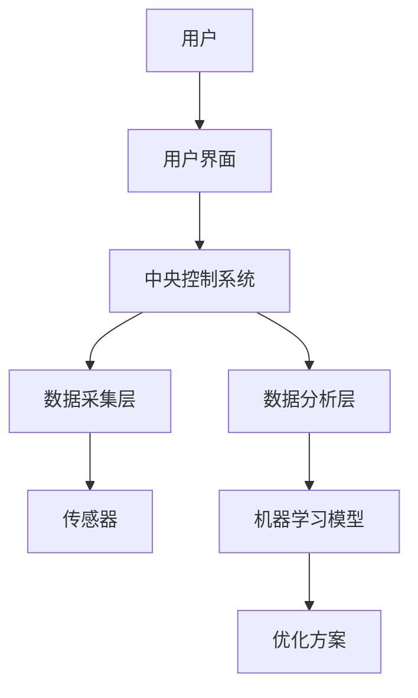

                 


# 巴菲特-芒格的垂直农业投资：未来食品生产的新模式

---

## 关键词：
- 巴菲特，芒格，垂直农业，投资模式，未来食品生产，技术支撑，社会影响

---

## 摘要：
本文探讨了巴菲特和芒格在垂直农业领域的投资策略，分析了垂直农业作为一种新兴的食品生产模式的潜力。文章从垂直农业的概念、技术基础、投资逻辑、社会影响等方面展开，结合巴菲特和芒格的投资哲学，详细阐述了垂直农业的投资优势、挑战及未来发展趋势。通过技术分析和实际案例，本文揭示了垂直农业如何改变传统农业模式，并为投资者提供了 valuable insights。

---

## 第1章：垂直农业的背景与发展

### 1.1 垂直农业的概念与特点

#### 1.1.1 垂直农业的定义
垂直农业是一种通过垂直空间利用和高科技技术实现高效作物种植的农业模式。它通常在封闭或半封闭的环境中进行，利用垂直层叠的种植架进行作物生产，减少土地使用面积。

#### 1.1.2 垂直农业的核心特点
- **高效土地利用**：通过层叠种植，垂直农业显著减少了土地需求。
- **资源节约**：相比传统农业，垂直农业在水、能源和肥料的使用上更加高效。
- **可控环境**：通过调节光照、温度、湿度等条件，实现作物的最佳生长环境。
- **全年生产**：垂直农业能够实现作物的全年连续生产，不受季节限制。

#### 1.1.3 与传统农业的对比
| 特性          | 垂直农业                          | 传统农业                          |
|---------------|-----------------------------------|------------------------------------|
| 土地使用       | 高效利用垂直空间                 | 大面积平面土地                     |
| 资源效率       | 高，水、能源、肥料使用少         | 低，资源浪费较多                   |
| 生产周期       | 短，可全年生产                   | 长，季节性限制                     |
| 环境影响       | 小，污染少                       | 大，可能涉及化肥、农药污染         |

### 1.2 垂直农业的背景与发展

#### 1.2.1 全球粮食安全问题的现状
- 人口增长导致粮食需求增加。
- 土地资源有限，传统农业难以满足未来需求。
- 气候变化加剧了农业生产的不确定性。

#### 1.2.2 技术进步对农业的影响
- 农业技术的创新推动了农业生产方式的变革。
- 物联网、人工智能等技术的应用提高了农业生产的效率。

#### 1.2.3 垂直农业的兴起与发展趋势
- 城市化进程加快，垂直农业在城市中的应用潜力巨大。
- 技术进步降低了垂直农业的生产成本，使其更具竞争力。

---

## 第2章：巴菲特与芒格的投资哲学

### 2.1 巴菲特的投资理念

#### 2.1.1 价值投资理论
- 巴菲特强调投资企业的内在价值，寻找具有长期竞争优势的企业。
- 他注重企业的财务健康状况，包括低债务、稳定的现金流等。

#### 2.1.2 长期投资的重要性
- 巴菲特主张长期持有优质资产，避免频繁交易。
- 他认为短期市场波动不应影响长期投资决策。

#### 2.1.3 对管理层的信任
- 巴菲特注重企业管理层的诚信和能力，认为优秀的企业管理层能够创造持续的价值。

### 2.2 芒格的多元思维模型

#### 2.2.1 多元思维模型概述
- 芒格强调通过多学科知识的整合来做出决策。
- 他建议投资者将不同领域的知识联系起来，形成一个完整的思维框架。

#### 2.2.2 决策框架
- 通过跨学科知识分析问题，避免单一视角的局限性。
- 强调逆向思维，从反面思考问题。

#### 2.2.3 知识的整合与应用
- 将物理学、心理学、经济学等知识应用于投资决策。
- 通过多元思维模型提高决策的准确性和全面性。

### 2.3 巴菲特与芒格的合作模式

#### 2.3.1 合作历史
- 巴菲特和芒格自1950年代起开始合作，共同管理巴菲特合伙有限公司。
- 他们的合作基于对投资理念的一致性和长期的信任。

#### 2.3.2 投资决策分工
- 巴菲特负责整体投资策略和资产配置。
- 芒格负责具体投资标的的分析和筛选。

#### 2.3.3 长期合作关系
- 他们的合作持续了数十年，成为投资界的经典案例。
- 这种合作模式被广泛认为是成功投资的重要因素。

---

## 第3章：垂直农业的投资逻辑

### 3.1 投资优势

#### 3.1.1 高效土地利用
- 通过层叠种植，垂直农业大幅提高了土地使用效率。
- 在城市中，垂直农业可以利用闲置空间进行生产，减少了物流成本。

#### 3.1.2 稳定的生产周期
- 垂直农业不受季节限制，能够实现全年生产。
- 生产周期的稳定性降低了市场波动对生产的影响。

#### 3.1.3 抗风险能力
- 垂直农业的可控环境减少了自然灾害对生产的影响。
- 多样化的种植模式能够分散风险，避免单一作物价格波动带来的损失。

### 3.2 投资挑战

#### 3.2.1 初始投资成本高
- 垂直农业需要大量的初期投资用于设施建设和技术设备采购。
- 这可能对资金有限的投资者构成障碍。

#### 3.2.2 技术门槛高
- 垂直农业依赖先进的技术支持，如物联网、人工智能等。
- 技术的复杂性可能增加投资风险。

#### 3.2.3 市场接受度问题
- 消费者对垂直农业产品的接受度可能较低。
- 市场推广和品牌建设需要时间和资金投入。

---

## 第4章：巴菲特与芒格的垂直农业投资案例

### 4.1 经典投资案例分析

#### 4.1.1 某垂直农业企业的投资决策
- 投资标的：一家专注于垂直种植技术的企业。
- 投资理由：该企业拥有先进的种植技术和高效的管理模式。
- 投资回报：通过长期持有，企业价值显著提升，实现可观的回报。

#### 4.1.2 投资决策的关键因素
- 企业的技术创新能力。
- 管理层的专业能力和战略眼光。
- 市场需求的潜力和可行性。

### 4.2 投资回报分析

#### 4.2.1 投资回报的计算方法
- 内部收益率（IRR）：衡量投资回报的重要指标。
- 净现值（NPV）：评估投资项目的经济可行性。

#### 4.2.2 长期投资回报的预测
- 通过模型预测垂直农业行业的增长潜力。
- 分析市场需求和竞争格局，预测未来回报。

#### 4.2.3 风险与回报的平衡
- 通过分散投资降低风险。
- 结合多元思维模型评估潜在风险。

---

## 第5章：垂直农业的技术支撑

### 5.1 智能温室的设计

#### 5.1.1 温室结构
- 多层结构设计，充分利用垂直空间。
- 可调节的光照、温度和湿度系统。

#### 5.1.2 植物生长监测
- 使用传感器实时监测作物生长环境。
- 数据分析优化生长条件。

### 5.2 物联网的应用

#### 5.2.1 数据采集
- 传感器收集土壤湿度、光照强度等数据。
- 数据传输到中央控制系统。

#### 5.2.2 智能控制
- 中央系统根据数据调整温室环境。
- 自动化灌溉和施肥系统。

### 5.3 AI算法优化

#### 5.3.1 数据分析与预测
- 利用机器学习模型预测作物生长周期。
- 分析历史数据优化种植方案。

#### 5.3.2 系统优化
- AI算法优化温室环境参数。
- 提高资源利用效率，降低成本。

### 5.4 系统架构设计

#### 5.4.1 系统组成
- 数据采集层：传感器、摄像头等。
- 数据处理层：中央控制系统、数据分析模块。
- 用户界面层：供用户监控和操作的界面。

#### 5.4.2 系统架构图


### 5.5 代码实现

#### 5.5.1 简单的环境监测代码
```python
import serial
import time

ser = serial.Serial('COM3', 9600)  # 假设串口为COM3，波特率为9600

while True:
    if ser.in_waiting:
        data = ser.readline().decode().strip()
        print(f"Current temperature: {data}°C")
        time.sleep(1)
```

#### 5.5.2 简单的环境控制代码
```python
import RPi.GPIO as GPIO
import time

# 设置 GPIO 模式
GPIO.setmode(GPIO.BCM)

# 定义继电器引脚
relay_pin = 18

# 初始化继电器
GPIO.setup(relay_pin, GPIO.OUT)

try:
    while True:
        # 模拟环境数据
        temperature = 25  # 假设温度达到目标值
        if temperature > 24:
            # 打开继电器，启动风扇
            GPIO.output(relay_pin, GPIO.HIGH)
            print("风扇已启动")
        else:
            GPIO.output(relay_pin, GPIO.LOW)
            print("风扇已关闭")
        time.sleep(5)
except KeyboardInterrupt:
    GPIO.cleanup()
```

---

## 第6章：垂直农业的社会影响

### 6.1 粮食安全

#### 6.1.1 解决粮食短缺问题
- 垂直农业能够提高粮食产量，缓解粮食短缺问题。
- 通过高效利用土地，满足未来人口增长的粮食需求。

#### 6.1.2 城市化与粮食供应
- 在城市中推广垂直农业，减少粮食运输成本和时间。
- 提高城市居民的食品安全性。

### 6.2 环境效益

#### 6.2.1 减少环境压力
- 垂直农业减少了传统农业对土地的依赖，缓解土地资源压力。
- 通过高效资源利用，减少化肥和农药的使用，降低环境污染。

#### 6.2.2 可持续发展
- 垂直农业是一种可持续的生产方式，符合绿色发展的理念。
- 减少碳排放，降低能源消耗。

### 6.3 社会责任

#### 6.3.1 提供健康食品
- 垂直农业能够生产高质量、无污染的食品。
- 通过技术创新提高食品营养价值和安全性。

#### 6.3.2 创造就业机会
- 垂直农业的发展需要大量技术人员和管理人员。
- 促进农业现代化，创造新的就业机会。

---

## 第7章：垂直农业的未来展望

### 7.1 未来趋势

#### 7.1.1 技术进步
- 人工智能和物联网技术的进一步发展将推动垂直农业的技术创新。
- 自动化和智能化水平的提高将降低成本，提高效率。

#### 7.1.2 投资机会
- 垂直农业的市场需求不断增加，投资机会广泛。
- 技术进步和市场扩展将吸引更多投资者进入该领域。

### 7.2 投资机会分析

#### 7.2.1 市场潜力
- 全球垂直农业市场规模持续增长。
- 城市化进程加快，垂直农业在城市中的应用潜力巨大。

#### 7.2.2 技术创新
- 新型种植技术、智能控制系统和数据分析技术的创新将为投资者带来更多的机会。
- 技术领先的企业将在竞争中占据优势。

### 7.3 可持续发展

#### 7.3.1 绿色农业
- 垂直农业是一种绿色农业模式，符合可持续发展的要求。
- 通过资源高效利用，减少对环境的影响。

#### 7.3.2 未来农业的蓝图
- 垂直农业将成为未来农业的重要组成部分。
- 技术与商业模式的创新将推动垂直农业的进一步发展。

---

## 第8章：总结与展望

### 8.1 总结

- 巴菲特和芒格的投资策略为垂直农业的发展提供了 valuable insights。
- 垂直农业作为一种新兴的食品生产模式，具有广阔的发展前景。
- 技术进步和社会需求将推动垂直农业的持续发展。

### 8.2 展望

- 垂直农业将成为未来农业的重要方向。
- 技术创新和商业模式的优化将推动行业进一步发展。
- 投资者应关注垂直农业的投资机会，抓住未来的发展趋势。

---

## 参考文献

1. 巴菲特，沃伦·E. (1985). 《巴菲特投资思想》.
2. 芒格，查理. (2007). 《查理·芒格的思维方式》.
3. Smith, J. (2020). 《垂直农业：未来食品生产的革命》.
4. Greenfield, A. (2019). 《智能温室设计与实现》.

---

## 附录：垂直农业技术术语表

- **垂直农业（Vertical Farming）**：通过层叠种植实现高效作物生产的农业模式。
- **智能温室（Smart Greenhouse）**：利用物联网和人工智能技术控制温室环境的设施。
- **多元思维模型（多元思维模型）**：芒格提出的一种通过多学科知识整合进行决策的方法。

---

以上是《巴菲特-芒格的垂直农业投资：未来食品生产的新模式》的完整目录大纲和内容概览。接下来，将按照上述结构撰写具体的章节内容，详细讲解每个部分的核心概念、技术细节和实际案例，以确保文章的深度和可读性。

