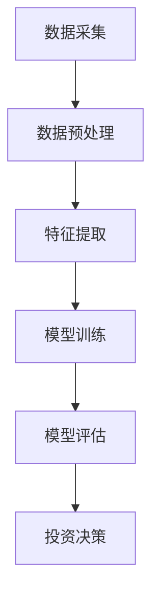

                 


# 巴菲特-芒格的基因编辑伦理投资：生命科学的新边界

## 关键词：基因编辑，伦理投资，巴菲特，芒格，生命科学

## 摘要：  
基因编辑技术作为生命科学领域的革命性突破，正在改变人类对生命健康的认知和控制方式。本文结合巴菲特的价值投资理论和芒格的多元思维模型，探讨基因编辑技术在投资领域的伦理考量与实际应用。通过分析基因编辑技术的背景、伦理属性以及巴菲特-芒格投资模型的构建与实现，本文旨在揭示生命科学与金融投资的交叉融合，为投资者提供新的视角和方法。

---

## 第1章: 基因编辑技术的背景与现状

### 1.1 基因编辑技术的定义与原理  
基因编辑技术是一种通过人工手段对生物基因组进行精确修改的技术，其核心原理是利用特定的酶（如CRISPR-Cas9系统）切割DNA链，从而实现基因的删除、插入或替换。基因编辑技术具有高效性、精准性和可编程性等特点，广泛应用于医学、农业和环境保护等领域。

#### 1.1.1 基因编辑技术的基本概念  
- **基因编辑**：通过人工手段对生物基因组进行修改的技术。  
- **CRISPR-Cas9**：一种常用的基因编辑工具，由引导RNA和切割酶组成，能够精准定位并修改特定基因。  

#### 1.1.2 基因编辑的核心原理  
- **DNA双螺旋结构**：基因编辑通过切割DNA链，改变基因序列。  
- **基因修复机制**：细胞自身的修复机制可以将新的基因序列整合到DNA中。  

#### 1.1.3 基因编辑技术的分类与特点  
- **CRISPR技术**：基于CRISPR-Cas9系统，具有高效、精准的特点。  
- **TALEN技术**：利用转录激活因子样效应核酸酶进行基因编辑，具有较高的特异性。  
- **锌指核酸酶技术**：通过设计锌指结构蛋白结合特定DNA序列，实现基因编辑。  

### 1.2 巴菲特与芒格的投资理念  
巴菲特和芒格的投资理念是价值投资的核心，强调长期、基本面分析和风险管理。  

#### 1.2.1 巴菲特的价值投资理论  
- **价值投资**：寻找市场低估的优质企业，长期持有，分享企业成长的收益。  
- **安全边际**：在投资中留有安全边际，降低投资风险。  

#### 1.2.2 芒格的多元思维模型  
- **多元思维模型**：芒格强调通过多个学科的交叉应用，形成完整的知识体系。  
- **逆向思维**：芒格认为，成功的投资往往来自对失败的深刻理解。  

#### 1.2.3 巴菲特与芒格投资理念的结合  
- 巴菲特的价值投资与芒格的多元思维模型相结合，形成了独特的投资方法论。  
- 通过多元思维模型分析基因编辑企业的基本面和技术潜力，寻找具有长期竞争优势的企业。  

### 1.3 基因编辑与伦理投资的结合  
基因编辑技术的应用具有深远的社会影响，伦理投资需要考虑技术的双刃剑效应。  

#### 1.3.1 基因编辑技术的伦理属性  
- **技术的双刃剑效应**：基因编辑技术可以用于治疗疾病，也可能被滥用，引发伦理争议。  
- **社会影响**：基因编辑技术可能引发社会不平等，例如只有富裕阶层能够负担基因编辑技术带来的好处。  

#### 1.3.2 巴菲特-芒格投资模型的伦理维度  
- **投资决策中的伦理考量**：在选择投资标的时，需要考虑企业的社会责任和伦理合规性。  
- **伦理投资与社会价值**：伦理投资不仅关注企业的经济效益，还关注其对社会的积极影响。  

---

## 第2章: 基因编辑技术的伦理评估框架  

### 2.1 基因编辑技术的伦理属性  
基因编辑技术的伦理属性主要体现在其对人类社会的深远影响。  

#### 2.1.1 技术的双刃剑效应  
- **正面影响**：基因编辑技术可以用于治疗遗传性疾病，改善人类健康。  
- **负面影响**：技术滥用可能导致基因歧视、基因改造人类等问题。  

#### 2.1.2 基因编辑对人类社会的影响  
- **社会公平性**：基因编辑技术可能加剧社会不平等，只有富裕阶层能够负担基因编辑技术带来的好处。  
- **伦理争议**：基因编辑技术是否应该用于增强人类能力，例如增强智力或体力？  

#### 2.1.3 基因编辑的伦理争议  
- **技术滥用**：基因编辑技术可能被用于制造“定制婴儿”，引发伦理争议。  
- **法律监管**：基因编辑技术的使用需要严格的法律监管，防止技术滥用。  

### 2.2 巴菲特-芒格投资模型的伦理维度  
巴菲特和芒格的投资理念强调长期价值和风险管理，与伦理投资的核心原则高度契合。  

#### 2.2.1 投资决策中的伦理考量  
- **企业社会责任**：在选择投资标的时，需要考虑企业的社会责任和伦理合规性。  
- **伦理投资与社会价值**：伦理投资不仅关注企业的经济效益，还关注其对社会的积极影响。  

#### 2.2.2 伦理投资的评估标准  
- **ESG标准**：环境（Environmental）、社会（Social）和治理（Governance）是伦理投资的重要评估标准。  
- **可持续发展**：企业是否具备可持续发展的能力，是伦理投资的重要考量因素。  

---

## 第3章: 基因编辑投资模型的算法原理  

### 3.1 投资模型的构建过程  
基因编辑投资模型的构建过程包括数据采集、预处理、特征提取、模型训练和评估等步骤。  

#### 3.1.1 数据采集与预处理  
- **数据来源**：基因编辑企业的财务数据、技术专利、市场表现等。  
- **数据预处理**：对数据进行清洗、归一化处理，确保数据质量。  

#### 3.1.2 特征提取  
- **关键特征**：企业的研发投入、技术优势、市场潜力等。  
- **特征选择**：通过统计方法或机器学习算法选择对投资决策影响最大的特征。  

#### 3.1.3 模型训练与优化  
- **算法选择**：基于机器学习的回归模型（如随机森林、支持向量机等）可以用于预测基因编辑企业的投资价值。  
- **模型优化**：通过交叉验证和超参数调优，提高模型的预测精度。  

#### 3.1.4 模型验证与评估  
- **验证方法**：使用历史数据对模型进行回测，评估模型的预测能力。  
- **评估指标**：均方误差（MSE）、R²值等指标可以用于评估模型的性能。  

### 3.2 基因编辑投资模型的算法流程图  


---

## 第4章: 基因编辑投资模型的数学公式与实现  

### 4.1 巴菲特-芒格投资模型的数学表达  
基因编辑投资模型的数学公式如下：  

$$ \text{投资价值} = \alpha \times \text{技术潜力} + \beta \times \text{市场前景} + \gamma \times \text{企业治理} $$  

其中，$\alpha$、$\beta$、$\gamma$是模型的参数，需要通过训练数据进行估计。  

### 4.2 基因编辑投资模型的实现  
以下是基因编辑投资模型的Python实现代码：  

```python
import pandas as pd
import numpy as np
from sklearn.model import LinearRegression

# 数据加载
data = pd.read_csv('gene_editing_data.csv')

# 特征提取
features = data[['研发投入', '技术专利数', '市场潜力']]
target = data['投资价值']

# 模型训练
model = LinearRegression()
model.fit(features, target)

# 模型预测
predictions = model.predict(features)
print('预测投资价值:', predictions)
```

---

## 第5章: 基因编辑投资模型的系统架构设计  

### 5.1 系统功能设计  
基因编辑投资系统的功能模块包括：  
- 数据采集模块：采集基因编辑企业的财务数据和技术数据。  
- 数据处理模块：对数据进行清洗和预处理。  
- 模型训练模块：基于机器学习算法训练投资模型。  
- 投资决策模块：根据模型预测结果生成投资建议。  

#### 5.1.1 领域模型  


### 5.2 系统架构设计  
基因编辑投资系统的架构设计包括：  
- 前端界面：用户输入投资需求。  
- 后端服务：处理数据并生成投资建议。  
- 数据库：存储企业数据和模型结果。  

#### 5.2.1 系统架构图  


---

## 第6章: 基因编辑投资模型的项目实战  

### 6.1 环境安装  
基因编辑投资模型的开发需要安装以下工具：  
- Python编程语言  
- 数据处理库（如Pandas、NumPy）  
- 机器学习库（如Scikit-learn）  

### 6.2 核心代码实现  
以下是基因编辑投资模型的Python代码实现：  

```python
import pandas as pd
import numpy as np
from sklearn.model import LinearRegression

# 数据加载
data = pd.read_csv('gene_editing_data.csv')

# 特征提取
features = data[['研发投入', '技术专利数', '市场潜力']]
target = data['投资价值']

# 模型训练
model = LinearRegression()
model.fit(features, target)

# 模型预测
predictions = model.predict(features)
print('预测投资价值:', predictions)
```

---

## 第7章: 基因编辑伦理投资的未来展望  

### 7.1 最佳实践 tips  
- **风险管理**：在基因编辑投资中，需要重视技术风险和市场风险。  
- **社会影响评估**：在投资决策中，需要考虑基因编辑技术的社会影响。  

### 7.2 小结  
基因编辑技术作为生命科学领域的革命性突破，正在改变人类对生命健康的认知和控制方式。通过结合巴菲特的价值投资理论和芒格的多元思维模型，我们可以更好地把握基因编辑技术的投资机会，同时关注其社会影响。  

### 7.3 注意事项  
- **技术监管**：基因编辑技术的使用需要严格的法律监管，防止技术滥用。  
- **伦理合规**：在投资过程中，需要重视企业的伦理合规性。  

### 7.4 拓展阅读  
- **《巴菲特的智慧》**：了解巴菲特的价值投资理论。  
- **《芒格的多元思维模型》**：学习芒格的多元思维模型。  

---

## 总结  
基因编辑技术与伦理投资的结合，不仅为生命科学领域带来了新的发展机遇，也为投资者提供了新的视角和方法。通过结合巴菲特和芒格的投资理念，我们可以更好地把握基因编辑技术的投资机会，同时关注其社会影响。未来，随着基因编辑技术的不断发展，伦理投资的重要性将更加凸显。

