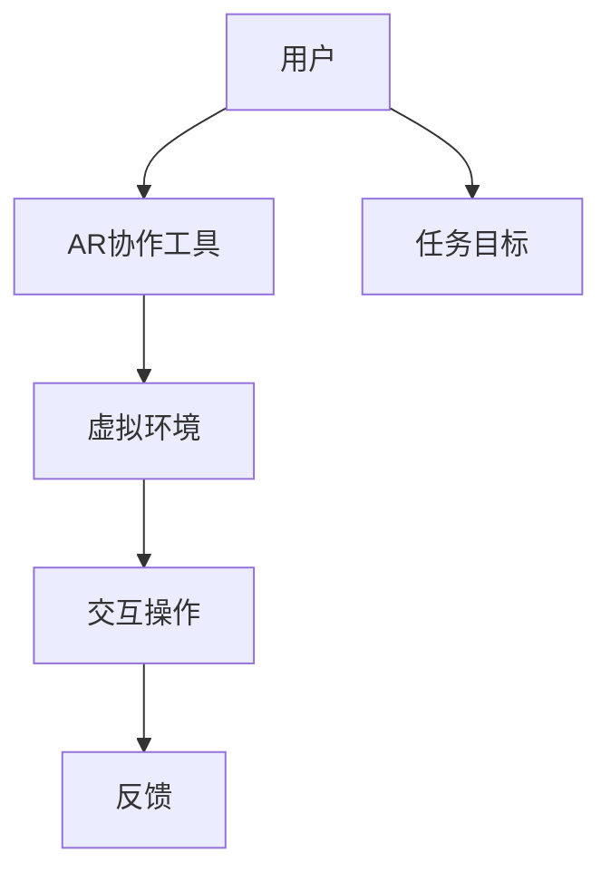
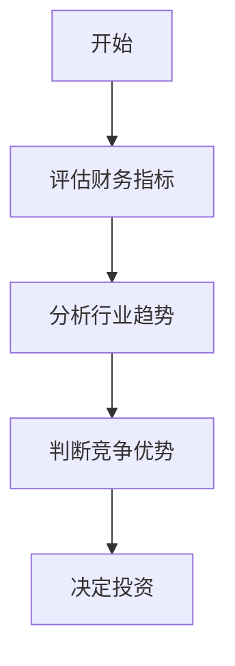
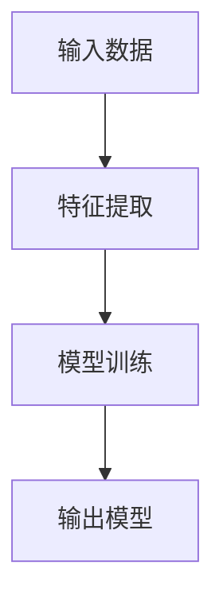
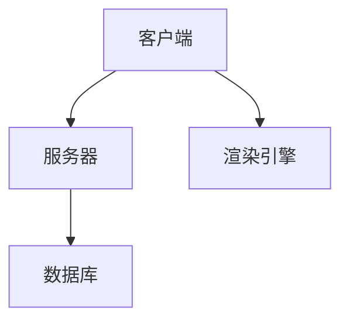
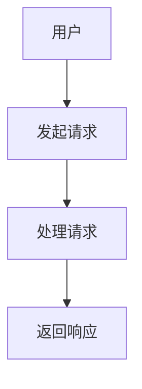

                 


# 巴菲特-芒格的增强现实协作工具投资：远程办公的未来

> 关键词：巴菲特，芒格，增强现实，协作工具，远程办公，投资策略

> 摘要：本文探讨了巴菲特和芒格的投资理念，特别是如何应用于增强现实协作工具，分析其在远程办公中的潜力和影响。通过技术分析和案例研究，揭示了AR协作工具的未来发展方向。

---

# 第一部分：背景介绍

## 第1章：问题背景

### 1.1 增强现实协作工具的定义

- **增强现实（AR）**：通过计算机生成的虚拟信息，增强用户对真实环境的感知。
- **协作工具**：用于多人协作的软件或设备，如共享白板、实时翻译等。

### 1.2 远程办公的现状与挑战

- **问题背景**：疫情推动远程办公普及，但现有工具存在效率低下、互动性差等问题。
- **问题描述**：传统协作工具依赖屏幕共享，缺乏沉浸式体验，影响效率。
- **问题解决**：AR技术可提供更直观的协作体验，提升效率和沉浸感。

### 1.3 边界与外延

- **边界**：专注于AR技术在协作工具中的应用，不涉及其他远程办公技术。
- **外延**：涵盖AR技术在教育、医疗等领域的应用潜力。

## 第2章：核心概念与联系

### 2.1 投资理念与AR技术的结合

- **巴菲特的价值投资**：长期关注企业的内在价值，注重基本面分析。
- **芒格的多元思维模型**：跨学科思考，寻找投资机会。

### 2.2 AR协作工具的属性对比

| 属性        | 传统协作工具       | 增强现实协作工具   |
|-------------|--------------------|--------------------|
| 交互方式     | 基于屏幕共享       | 基于AR环境         |
| 沉浸感       | 较低               | 较高               |
| 适用场景     | 适用于简单协作     | 适用于复杂协作     |

### 2.3 实体关系图



---

# 第二部分：算法原理讲解

## 第3章：投资模型的算法实现

### 3.1 巴菲特价值投资模型

- **模型定义**：评估企业内在价值，寻找低估股票。
- **算法流程**：



### 3.2 投资评估公式

$$
\text{内在价值} = \frac{\text{现金流}}{\text{折现率}}
$$

## 第4章：AR协作工具的技术实现

### 4.1 三维建模算法

- **算法流程**：



### 4.2 网络同步算法

- **同步机制**：使用区块链技术确保数据一致性。

$$
\text{同步时间} = \frac{\text{网络延迟}}{\text{带宽}}
$$

---

# 第三部分：系统分析与架构设计

## 第5章：系统功能设计

### 5.1 功能模块

- **用户界面模块**：提供直观的操作界面。
- **三维渲染模块**：实现虚拟环境渲染。
- **网络通信模块**：支持实时数据传输。

### 5.2 系统架构



## 第6章：接口设计

### 6.1 API设计

- **RESTful API**：提供用户认证、数据同步等功能。

### 6.2 交互流程



---

# 第四部分：项目实战

## 第7章：环境安装与配置

### 7.1 环境要求

- **操作系统**：Windows 10或更高版本。
- **开发工具**：Visual Studio、Unity。

### 7.2 核心代码实现

```python
def calculate_intrinsic_value(cash_flow, discount_rate):
    return cash_flow / discount_rate
```

## 第8章：案例分析

### 8.1 应用场景

- **虚拟会议**：团队成员在虚拟空间中协作，提升效率。

### 8.2 项目总结

- **优势**：沉浸式体验、高效协作。
- **挑战**：技术复杂性、网络延迟。

---

# 附录

## 1. 最佳实践

- 定期更新技术栈，优化系统性能。
- 提供用户培训，提升使用效率。

## 2. 小结

通过结合巴菲特和芒格的投资理念，AR协作工具在远程办公中展现出巨大潜力，未来将成为主流协作方式。

## 3. 注意事项

- 投资需谨慎，AR技术的应用仍需克服技术瓶颈。
- 数据安全是关键，需加强隐私保护。

## 4. 拓展阅读

- 推荐书籍：《巴菲特投资策略》、《AR技术与应用》。
- 在线资源：TechCrunch、VentureBeat关于AR协作工具的文章。

---

# 结语

巴菲特和芒格的投资理念为AR协作工具提供了新的视角，结合先进技术，远程办公的未来将更加高效和沉浸。

