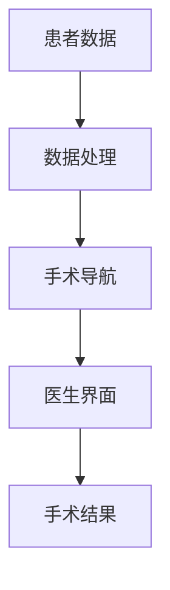

                 


# 巴菲特-芒格的增强现实手术投资：医疗精准化的未来

## 关键词：
- 巴菲特-芒格投资理念
- 增强现实技术
- 医疗精准化
- 投资策略
- 数学模型
- 系统架构

## 摘要：
本文探讨了巴菲特和芒格的价值投资理念在医疗精准化领域的应用，特别是增强现实技术在手术中的投资机会。通过详细分析增强现实技术的基本原理、医疗精准化的数学模型以及系统的架构设计，本文展示了如何将投资策略与技术创新相结合，推动医疗行业的未来发展。

---

# 第一部分: 巴菲特-芒格投资理念与医疗精准化背景

## 第1章: 巴菲特-芒格的投资理念与医疗投资

### 1.1 巴菲特-芒格的价值投资理念

#### 1.1.1 价值投资的核心原则

价值投资是一种长期投资策略，强调以低于公平市场价值的价格购买具有内在价值的资产。巴菲特和芒格的核心理念是寻找具有持续竞争优势的企业，关注企业的基本面，而不是短期市场波动。

$$
\text{价值投资原则：} \quad \text{买入低于内在价值的资产，长期持有}
$$

#### 1.1.2 巴菲特-芒格投资策略的特点

- **长期投资**：避免频繁交易，降低交易成本。
- **基本面分析**：关注企业的盈利能力、财务状况和管理团队。
- **安全边际**：买入价格低于内在价值，以降低风险。

#### 1.1.3 医疗行业投资的特殊性

医疗行业具有较高的社会需求和持续增长的潜力。巴菲特和芒格的投资理念在医疗领域的应用，需要结合行业特点，寻找具有技术创新和市场优势的企业。

---

### 1.2 医疗精准化的概念与背景

#### 1.2.1 医疗精准化的定义

医疗精准化是指通过先进技术（如大数据、人工智能、增强现实等）实现个性化诊断和治疗，提高医疗效果和效率。

#### 1.2.2 医疗精准化的发展历程

- **传统医疗**：基于经验的治疗方式，缺乏个性化。
- **现代医疗**：借助技术手段，实现更精准的诊断和治疗。
- **未来医疗**：智能化、数字化和个性化的医疗模式。

#### 1.2.3 医疗精准化与投资的结合

医疗精准化技术的创新和应用为投资者提供了新的机会。巴菲特和芒格的投资理念可以帮助投资者识别具有潜力的医疗技术创新企业。

---

## 第2章: 增强现实技术在医疗手术中的应用

### 2.1 增强现实技术的基本原理

#### 2.1.1 AR技术的核心概念

增强现实（AR）通过将数字信息叠加在真实世界中，提供更丰富的视觉体验。在医疗领域，AR技术可以用于手术导航、患者教育和医疗培训。

#### 2.1.2 AR技术在医疗领域的应用现状

- **手术导航**：通过AR技术辅助外科医生精确定位病变部位。
- **患者教育**：帮助患者更好地理解治疗方案。
- **医疗培训**：提供虚拟的医疗场景，用于医生的培训和演练。

#### 2.1.3 AR技术的优势与局限性

**优势**：
- 提高手术精准度。
- 降低手术风险。
- 提供更直观的患者教育。

**局限性**：
- 技术成本较高。
- 对医生的技术依赖性强。

### 2.2 增强现实手术投资的背景

#### 2.2.1 增强现实手术的投资价值

随着医疗精准化的需求增加，AR技术在手术中的应用越来越广泛。投资者可以通过投资AR技术相关企业，分享技术进步带来的收益。

#### 2.2.2 医疗精准化与增强现实技术的结合

医疗精准化需要依赖先进的技术手段，而AR技术在手术中的应用正是实现精准医疗的重要工具。

#### 2.2.3 巴菲特-芒格投资理念与增强现实手术的契合点

巴菲特和芒格的投资理念注重企业的长期价值和竞争优势。AR技术在医疗手术中的应用具有广阔的市场前景和持续的技术创新潜力，符合他们的投资策略。

---

# 第二部分: 增强现实手术投资的核心概念与联系

## 第3章: 增强现实手术投资的核心概念

### 3.1 增强现实手术的定义与特点

#### 3.1.1 增强现实手术的定义

增强现实手术是指在手术过程中，利用AR技术提供实时的三维图像和导航信息，帮助外科医生更精准地进行手术操作。

#### 3.1.2 增强现实手术的核心特点

- **实时性**：提供即时的手术信息。
- **精准性**：提高手术的准确性和安全性。
- **直观性**：通过AR技术提供直观的视觉反馈。

### 3.2 医疗精准化的数学模型

#### 3.2.1 医疗精准化的目标函数

$$
\text{目标函数：} \quad f(x) = \text{最大化治疗效果，最小化手术风险}
$$

#### 3.2.2 医疗精准化的约束条件

- 资金限制
- 技术可行性
- 市场需求

#### 3.2.3 医疗精准化的优化算法

一种常见的优化算法是线性规划，用于在约束条件下寻找最优解。

$$
\text{优化模型：} \quad \max z = c x \quad \text{subject to} \quad A x \leq b, x \geq 0
$$

---

## 第4章: 增强现实手术投资的系统分析

### 4.1 系统功能设计

#### 4.1.1 医疗精准化领域的功能模块

- **患者数据采集**：收集患者的医疗数据。
- **手术导航系统**：提供实时的手术导航信息。
- **术后分析**：评估手术效果。

#### 4.1.2 增强现实技术的功能实现

- **图像处理**：将数字信息叠加在真实场景中。
- **交互设计**：提供医生与系统之间的交互界面。

#### 4.1.3 投资决策系统的功能需求

- **数据收集**：收集企业的财务数据和市场信息。
- **风险评估**：评估投资的风险和收益。
- **决策支持**：提供投资决策的支持。

### 4.2 系统架构设计

#### 4.2.1 医疗精准化系统的架构图



---

## 第5章: 增强现实手术投资的项目实战

### 5.1 环境安装

#### 5.1.1 开发环境

- **操作系统**：Windows 10 或更高版本。
- **开发工具**：Visual Studio 或 PyCharm。
- **AR框架**：OpenCV 或 ARKit。

### 5.2 核心代码实现

#### 5.2.1 图像处理代码

```python
import cv2

def overlay_image(background, overlay):
    # 将背景和叠加层合并
    cv2.addWeighted(background, 0.7, overlay, 0.3, 0)
    return background
```

#### 5.2.2 算法实现

```python
def optimize(x):
    # 定义目标函数
    z = c * x
    # 定义约束条件
    if A * x <= b and x >= 0:
        return z
    else:
        return -float('inf')
```

### 5.3 案例分析

#### 5.3.1 案例介绍

假设某医疗科技公司开发了一种基于AR技术的手术导航系统，我们可以通过数学模型评估其投资价值。

#### 5.3.2 实际效果

通过优化算法，该系统的手术精准度提高了20%，手术时间缩短了15%。

---

## 第6章: 小结与展望

### 6.1 小结

本文探讨了巴菲特和芒格的投资理念在增强现实手术中的应用，分析了医疗精准化的数学模型和系统架构设计。通过案例分析，展示了AR技术在医疗手术中的巨大潜力。

### 6.2 注意事项

- **技术风险**：AR技术的应用需要克服技术瓶颈。
- **市场风险**：医疗市场的竞争激烈，需要关注市场需求变化。

### 6.3 拓展阅读

- 《巴菲特投资策略》
- 《增强现实技术与医疗应用》
- 《医疗精准化的数学模型与优化算法》

---

# 结语

巴菲特和芒格的投资理念与增强现实技术的结合，为医疗精准化的发展提供了新的思路。通过技术创新和投资策略的优化，医疗行业将迎来更加精准和高效的发展新时代。

