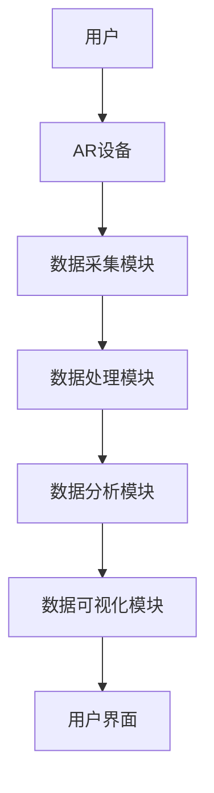
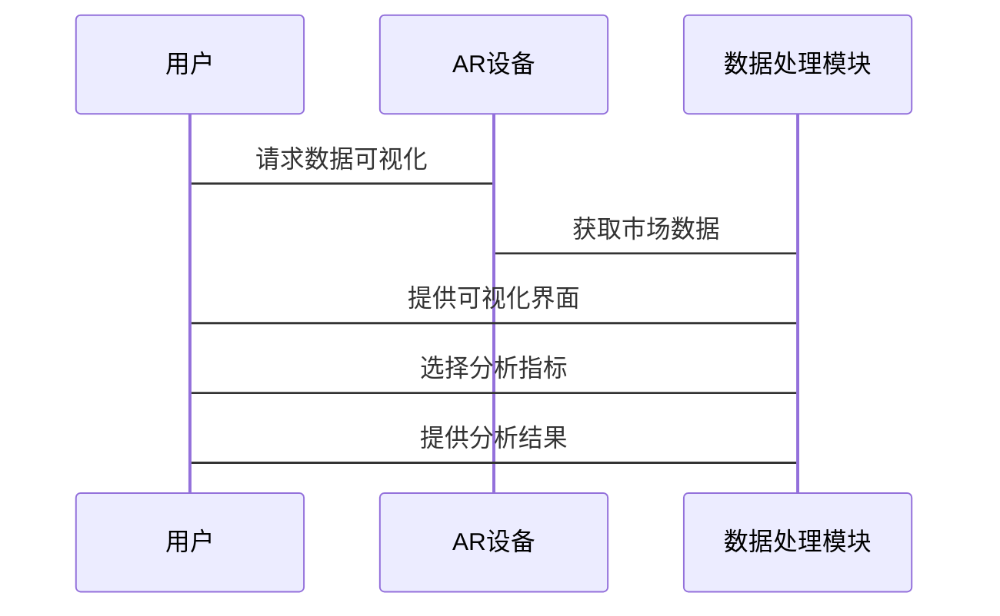

                 


# 巴菲特-芒格的增强现实技术投资：改变人机交互的未来

> 关键词：巴菲特，芒格，增强现实，人机交互，投资哲学，技术结合，未来趋势

> 摘要：本文探讨了巴菲特和芒格的投资哲学与增强现实（AR）技术的结合，分析了AR技术如何改变人机交互的未来，并应用于投资领域。通过详细的技术分析和实际案例，展示了AR技术在金融数据分析、投资决策中的潜力，结合巴菲特的价值投资理论和芒格的多元思维模型，为未来的投资策略提供了新的视角。

---

## 目录

1. 巴菲特与芒格的投资哲学
   1.1 巴菲特的价值投资理论
   1.2 芒格的多元思维模型
   1.3 投资中的心理因素与决策框架

2. 增强现实技术的基本概念
   2.1 AR技术的定义与特点
   2.2 AR技术的核心组成部分
   2.3 AR与人机交互的关系

3. AR技术在人机交互中的应用
   3.1 人机交互的演变
   3.2 AR技术与金融投资的结合
   3.3 AR技术在实时市场分析中的优势

4. 巴菲特-芒格投资哲学与AR技术的结合
   4.1 价值投资的数字化实现
   4.2 多元思维模型的可视化
   4.3 AR技术对投资决策的影响

5. AR技术在金融分析中的应用案例
   5.1 基于AR的金融数据分析工具
   5.2 AR技术在投资策略中的实际应用
   5.3 案例分析与项目总结

---

## 正文

### 第1章：巴菲特与芒格的投资哲学

#### 1.1 巴菲特的价值投资理论

巴菲特的价值投资理论强调长期持有优质资产，注重企业的内在价值。他认为，投资的核心是理解企业的商业模式、财务状况和行业地位。以下是价值投资的关键原则：

- **长期视角**：巴菲特倡导长期投资，而非短期交易。
- **安全边际**：买入低于内在价值的股票，以降低风险。
- **企业基本面分析**：关注企业的盈利能力、资产负债表和管理层素质。

#### 1.2 芒格的多元思维模型

芒格的多元思维模型强调将多个学科的原理结合起来，形成一个完整的知识框架。他认为，投资者需要通过跨学科的思考来避免认知偏差，从而做出更明智的决策。

- **跨学科思维**：结合心理学、经济学、物理学等多学科知识。
- **决策框架**：通过多角度分析，降低决策错误率。
- **知识网络**：构建广泛的知识网络，以应对复杂问题。

#### 1.3 投资中的心理因素与决策框架

投资决策深受心理因素影响，如贪婪、恐惧和过度自信。芒格的多元思维模型帮助投资者克服这些心理偏差，通过系统化的分析框架来做出理性决策。

---

### 第2章：增强现实技术的基本概念

#### 2.1 AR技术的定义与特点

增强现实（Augmented Reality，AR）是一种将数字信息叠加到真实世界中的技术，通过摄像头、传感器和算法，实现虚拟内容与现实世界的互动。

- **实时叠加**：AR将虚拟信息实时叠加在现实环境中。
- **交互性**：用户可以通过手势、语音或触摸与AR内容互动。
- **沉浸式体验**：AR提供了一种更直观的信息呈现方式。

#### 2.2 AR技术的核心组成部分

AR技术主要由硬件和软件两部分组成，硬件包括摄像头、传感器和显示设备，软件则包括图像处理算法和用户界面设计。

- **硬件设备**：如智能手机、AR眼镜和头显设备。
- **软件算法**：包括图像识别、追踪和渲染算法。
- **用户界面**：直观的AR界面设计，提升用户体验。

#### 2.3 AR与人机交互的关系

AR技术通过将虚拟信息叠加到真实环境中，改变了传统的二维屏幕交互方式，提供了一种更自然、更直观的人机交互方式。

- **沉浸式交互**：用户可以与虚拟对象进行互动，提升操作效率。
- **信息可视化**：通过AR技术，复杂的数据信息可以以更直观的方式呈现。
- **实时反馈**：AR提供实时的视觉反馈，增强用户体验。

---

### 第3章：AR技术在人机交互中的应用

#### 3.1 人机交互的演变

人机交互经历了从键盘输入到语音助手，再到AR交互的演变。AR技术的出现，为用户提供了更自然、更直观的交互方式。

- **从键盘到触摸**：传统计算机交互方式的演变。
- **语音与手势**：新兴的非接触式交互方式。
- **AR交互**：未来的沉浸式交互趋势。

#### 3.2 AR技术与金融投资的结合

AR技术在金融领域的应用潜力巨大，特别是在数据可视化和投资决策方面。

- **数据可视化**：将复杂的金融数据以AR形式呈现，帮助投资者更直观地理解市场趋势。
- **实时市场监控**：通过AR技术，投资者可以实时监控市场动态，做出更快的决策。
- **投资模拟**：AR技术可以模拟不同投资策略的效果，帮助投资者评估风险。

#### 3.3 AR技术在实时市场分析中的优势

AR技术能够将实时市场数据与真实环境结合，提供沉浸式的市场分析体验。

- **实时数据叠加**：将股票价格、K线图等信息叠加在现实环境中。
- **三维数据呈现**：通过AR技术，投资者可以以三维视角观察市场数据。
- **互动式分析**：用户可以通过手势或语音与数据进行互动，获取更多信息。

---

### 第4章：巴菲特-芒格投资哲学与AR技术的结合

#### 4.1 价值投资的数字化实现

AR技术可以将巴菲特的价值投资理念数字化，帮助投资者更直观地评估企业的内在价值。

- **三维企业模型**：通过AR技术，投资者可以以三维形式观察企业的财务状况。
- **动态估值分析**：AR技术可以实时更新企业的估值，帮助投资者做出决策。

#### 4.2 多元思维模型的可视化

芒格的多元思维模型可以通过AR技术实现可视化，帮助投资者更好地理解不同学科的原理及其相互关系。

- **跨学科知识网络**：通过AR技术，投资者可以以视觉化的方式理解不同学科的知识。
- **知识关联分析**：AR技术可以展示不同知识之间的联系，帮助投资者做出更全面的决策。

#### 4.3 AR技术对投资决策的影响

AR技术通过提供更直观的信息呈现方式，帮助投资者更好地理解和分析市场数据，从而做出更明智的投资决策。

- **提升决策效率**：通过AR技术，投资者可以更快地获取和分析信息。
- **降低认知偏差**：AR技术提供的直观信息有助于投资者克服心理偏差。
- **增强决策信心**：通过AR技术，投资者可以更自信地做出投资决策。

---

### 第5章：AR技术在金融分析中的应用案例

#### 5.1 基于AR的金融数据分析工具

**环境安装**：需要安装AR开发框架（如ARKit、ARCore）和金融数据分析工具（如Python、Pandas）。

**核心代码实现**：以下是一个基于AR的金融数据分析工具的Python代码示例：

```python
import numpy as np
import pandas as pd
from arToolkit import ARProcessor

# 加载市场数据
market_data = pd.read_csv('market_data.csv')

# 创建AR处理器
ar_processor = ARProcessor()

# 处理市场数据
processed_data = ar_processor.process(market_data)

# 可视化数据
def visualize_ar_data(processed_data):
    # 使用AR技术将数据可视化
    pass

visualize_ar_data(processed_data)
```

**功能解读**：上述代码展示了如何使用AR技术处理和可视化金融数据。通过AR处理器，可以将复杂的市场数据以更直观的方式呈现给投资者。

**实际案例分析**：假设某投资者使用AR技术分析股票价格走势，AR技术可以帮助其更直观地观察价格波动，从而做出更明智的投资决策。

#### 5.2 AR技术在投资策略中的实际应用

**系统架构设计**：以下是一个基于AR的金融数据分析系统的架构图。



**系统交互设计**：以下是一个基于AR的金融数据分析系统的交互序列图。



#### 5.3 案例分析与项目总结

通过上述案例分析可以看出，AR技术在金融分析中的应用潜力巨大。它不仅可以提高投资者的决策效率，还可以降低认知偏差，从而帮助投资者做出更明智的投资决策。

---

### 第6章：未来展望与总结

#### 6.1 AR技术的未来发展趋势

随着AR技术的不断发展，其在金融领域的应用将更加广泛。未来，AR技术将与人工智能、大数据等技术结合，为投资者提供更全面、更智能的投资决策支持。

#### 6.2 巴菲特与芒格投资哲学的延续

尽管技术在不断进步，但巴菲特和芒格的价值投资理念和多元思维模型仍然具有重要的指导意义。AR技术的应用，只是将这些理念和技术结合，帮助投资者更好地理解和应用。

#### 6.3 人机交互的未来

AR技术的应用，不仅改变了投资方式，还重新定义了人机交互的方式。未来的交互将更加自然、直观，AR技术将在其中发挥重要作用。

---

### 总结

巴菲特和芒格的投资哲学与AR技术的结合，不仅为投资者提供了新的工具，还重新定义了投资方式。AR技术通过提供更直观的信息呈现方式，帮助投资者更好地理解和分析市场数据，从而做出更明智的投资决策。未来的投资领域，AR技术将与人工智能、大数据等技术结合，为投资者提供更全面、更智能的投资决策支持。

---

通过以上思考过程，我们可以看到，AR技术不仅改变了人机交互的方式，还为投资领域带来了新的可能性。结合巴菲特和芒格的投资哲学，AR技术将为投资者提供更高效、更智能的投资工具，帮助他们在复杂的市场环境中做出更明智的决策。

