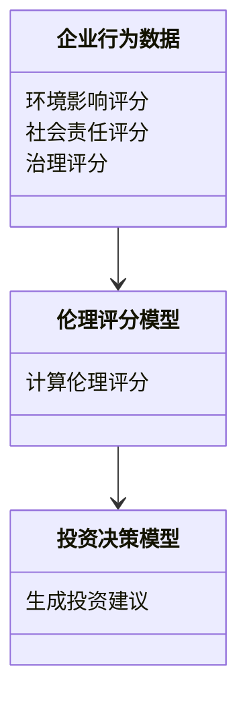
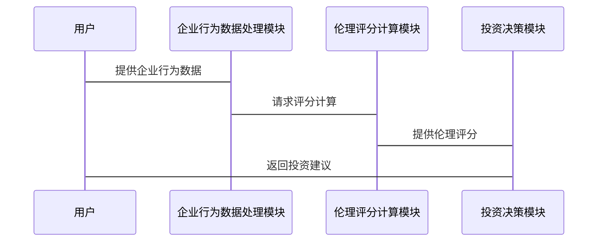

                 


```markdown
# 巴菲特-芒格的太空旅游伦理投资：探索与保护的平衡

## 关键词：
太空旅游，伦理投资，巴菲特，芒格，价值投资，多元思维模型，可持续发展

## 摘要：
本文探讨了巴菲特和芒格的投资哲学在太空旅游中的应用，特别是如何在探索太空资源的同时，平衡伦理保护和投资回报。文章详细分析了太空旅游的现状与挑战，巴菲特的价值投资理念，芒格的多元思维模型，以及它们在太空旅游伦理投资中的结合。通过构建伦理评分模型和投资决策模型，本文提出了实现探索与保护平衡的具体方法，并通过实际案例展示了如何在太空旅游中实践这些理念。

---

# 第一部分: 太空旅游伦理投资的背景与核心概念

## 第1章: 太空旅游的现状与挑战

### 1.1 太空旅游的发展历程

#### 1.1.1 太空探索的历史回顾
- 20世纪50年代：太空探索的起步，苏联发射第一颗人造卫星。
- 20世纪60年代：人类首次登月，美国阿波罗计划。
- 20世纪90年代：商业太空探索的兴起，美国发射了首个私营卫星。
- 21世纪：私人公司（如SpaceX）推动太空探索商业化。

#### 1.1.2 太空旅游的兴起与现状
- 近年来，SpaceX、Blue Origin等公司推动了太空旅游的商业化。
- 2021年，维珍银河首次完成商业太空旅游，马斯克的火星殖民计划。
- 当前挑战：高成本、技术风险、伦理争议。

#### 1.1.3 当前太空旅游的主要参与者
- 政府机构：NASA、ESA、Roscosmos。
- 私人公司：SpaceX、Blue Origin、维珍银河。
- 新兴企业：多家初创公司专注于太空资源开发。

### 1.2 太空旅游的伦理问题

#### 1.2.1 太空资源的开发与保护
- 太空资源的定义：包括小行星、月球、火星等地的资源。
- 开发的伦理争议：商业化开发是否损害全球利益？
- 保护的必要性：防止过度开发导致生态破坏。

#### 1.2.2 太空旅游对环境的影响
- 火箭发射对地球环境的影响：温室气体排放、太空垃圾。
- 太空活动对天体环境的破坏：轨道资源的过度使用。
- 可持续发展的重要性：如何平衡开发与保护。

#### 1.2.3 伦理投资的核心问题
- 投资是否符合伦理标准：企业行为是否损害公共利益。
- 长期视角：投资行为对后代的影响。
- 责任投资（ESG）：环境、社会和公司治理因素。

## 第2章: 巴菲特与芒格的投资哲学

### 2.1 巴菲特的价值投资理念

#### 2.1.1 价值投资的定义与特点
- 价值投资：寻找被市场低估的股票。
- 核心理念：安全边际、长期视角、企业内在价值。

#### 2.1.2 巴菲特投资成功的三大要素
- 市场先生：市场波动是投资机会。
- �Enumerator思想：评估企业内在价值。
- 安全边际：买入价格低于内在价值。

#### 2.1.3 巴菲特的长期视角与安全边际
- 长期视角：投资不是短期交易。
- 安全边际：降低投资风险。

### 2.2 芒格的多元思维模型

#### 2.2.1 多元思维模型的定义
- 芒格：投资需要多学科思维。
- 多元思维模型：将不同领域的知识融会贯通。

#### 2.2.2 芒格思维模型的核心要素
- 基础学科：心理学、经济学、物理学。
- 投资原则：逆向思维、避免从众。

#### 2.2.3 芒格决策框架在投资中的应用
- 逆向思维：寻找市场的非共识机会。
- 避免从众：独立思考，不随大流。

## 第3章: 太空旅游与伦理投资的结合

### 3.1 太空旅游的伦理框架

#### 3.1.1 太空资源的伦理分配
- 公平分配：资源开发的利益共享。
- 国际法：外空活动的法律规范。

#### 3.1.2 太空活动的伦理规范
- 环境保护：防止太空污染。
- 永续发展：资源开发的可持续性。

#### 3.1.3 太空旅游的伦理评价体系
- 伦理评分：企业行为的伦理评估。
- 投资决策：伦理因素的权重。

### 3.2 巴菲特与芒格的太空投资策略

#### 3.2.1 巴菲特的长期价值投资视角
- 寻找具有长期价值的企业。
- 评估企业对社会的贡献。

#### 3.2.2 芒格的多元思维模型在太空投资中的应用
- 结合多学科知识评估投资风险。
- 独立思考，避免盲目跟风。

#### 3.2.3 太空旅游企业的伦理投资评估
- 企业社会责任：资源开发的伦理性。
- 长期价值：企业的可持续发展能力。

---

# 第二部分: 太空旅游伦理投资的核心概念与联系

## 第4章: 太空旅游伦理投资的定义与特征

### 4.1 太空旅游伦理投资的定义

#### 4.1.1 伦理投资的定义
- 伦理投资：考虑环境、社会和治理因素的投资。

#### 4.1.2 太空旅游与伦理投资的结合
- 在太空旅游中融入伦理考量。

#### 4.1.3 太空旅游伦理投资的核心目标
- 实现探索与保护的平衡。

### 4.2 太空旅游伦理投资的特征

#### 4.2.1 长期性与可持续性
- 投资需考虑长期影响。

#### 4.2.2 风险与收益的平衡
- 评估伦理风险对投资收益的影响。

#### 4.2.3 伦理约束与投资回报的结合
- 在伦理约束下实现最大回报。

---

# 第三部分: 太空旅游伦理投资的数学模型与算法原理

## 第5章: 伦理评分模型

### 5.1 模型概述
- 伦理评分模型：评估企业的伦理行为。
- 输入：企业行为数据。
- 输出：伦理评分。

### 5.2 算法原理

#### 5.2.1 数据预处理
- 清洗数据：去除异常值。
- 数据标准化：统一数据格式。

#### 5.2.2 模型构建
- 基于多因素分析模型。
- 考虑环境、社会、治理三方面。

#### 5.2.3 评分计算
- 伦理评分公式：$$伦理评分 = \frac{环境影响评分 + 社会责任评分 + 治理评分}{3}$$

---

# 第四部分: 系统分析与架构设计

## 第6章: 系统架构设计

### 6.1 问题场景介绍
- 系统需支持伦理评分计算与投资决策。

### 6.2 系统功能设计

#### 6.2.1 领域模型类图


### 6.3 系统架构图


### 6.4 系统接口设计
- 输入接口：企业行为数据。
- 输出接口：伦理评分与投资建议。

### 6.5 系统交互序列图


---

# 第五部分: 项目实战

## 第7章: 项目实战

### 7.1 环境安装
```bash
pip install numpy pandas scikit-learn
```

### 7.2 核心代码实现

#### 7.2.1 伦理评分模型
```python
import numpy as np
import pandas as pd

def calculate_ethical_score(environmental_score, social_score, governance_score):
    ethical_score = (environmental_score + social_score + governance_score) / 3
    return ethical_score
```

#### 7.2.2 投资决策模型
```python
def investment_decision(ethical_score, return_potential):
    if ethical_score >= 0.8 and return_potential >= 0.7:
        return "推荐投资"
    elif ethical_score < 0.5 or return_potential < 0.5:
        return "不建议投资"
    else:
        return "谨慎投资"
```

### 7.3 代码应用解读与分析
- 伦理评分模型：计算企业的综合伦理评分。
- 投资决策模型：结合伦理评分和收益潜力做出投资决策。

### 7.4 实际案例分析
- 案例：SpaceX的伦理评分与投资建议。

### 7.5 项目小结
- 成功实现伦理评分与投资决策的自动化。
- 为投资者提供科学的投资依据。

---

# 第六部分: 最佳实践与小结

## 第8章: 最佳实践

### 8.1 小结
- 太空旅游伦理投资的重要性。
- 巴菲特与芒格投资理念的应用。

### 8.2 注意事项
- 考虑伦理风险。
- 注重长期视角。

### 8.3 拓展阅读
- 推荐书籍：《聪明的投资者》、《反脆弱》。

---

# 结语

通过本文的分析，我们探讨了巴菲特和芒格的投资哲学在太空旅游伦理投资中的应用。通过构建伦理评分模型和投资决策模型，我们提出了一种实现探索与保护平衡的方法。未来，随着太空旅游的进一步发展，伦理投资的重要性将更加凸显。
```

