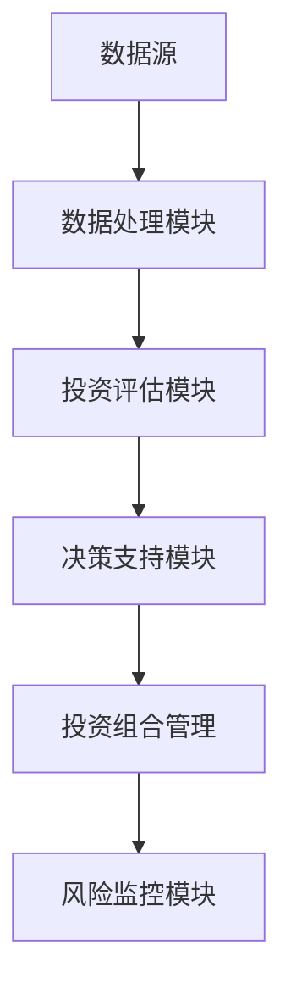

                 


```markdown
# 巴菲特-芒格的太空资源开发伦理投资：探索与保护的平衡

> 关键词：巴菲特, 芒格, 太空资源开发, 伦理投资, 可持续发展

> 摘要：本文探讨了巴菲特和芒格的投资哲学在太空资源开发中的应用，结合伦理投资的核心原则，分析了如何在探索太空资源的同时，平衡保护地球环境与经济利益。通过构建伦理投资模型，结合系统架构设计和项目实战案例，详细阐述了太空资源开发中的投资策略与风险管理，提出了在可持续发展框架下的最佳实践。

---

## 第一部分: 巴菲特-芒格的太空资源开发投资背景

### 第1章: 太空资源开发的现状与挑战

#### 1.1 太空资源开发的定义与范围
- 太空资源开发的定义
- 主要开发领域：小行星、月球、火星等
- 当前技术与经济挑战：技术门槛高、成本高昂、法律不确定性

#### 1.2 巴菲特与芒格的投资哲学
- 巴菲特的价值投资理念：长期持有、安全边际
- 芒格的多元思维模型：跨学科思考、独立判断
- 投资哲学在太空资源开发中的适用性

---

## 第二部分: 太空资源开发的伦理框架

### 第2章: 太空资源开发的伦理原则

#### 2.1 经济伦理
- 投资的经济可行性
- 利润与社会责任的平衡
- 资源分配的公平性

#### 2.2 社会伦理
- 人类共同利益
- 太空探索的普惠性
- 知识共享与合作

#### 2.3 环境伦理
- 太空资源开发对地球环境的影响
- 可持续发展的原则
- 生态平衡与保护

### 第3章: 太空资源开发的法律与政策

#### 3.1 国际法与太空资源开发
- 《外层空间条约》的核心条款
- 太空资源开发的法律争议
- 国际合作与竞争

#### 3.2 各国政策与法规
- 美国、俄罗斯、欧盟的太空政策
- 中国的太空探索与投资
- 商业太空公司的法律地位

#### 3.3 伦理投资的法律框架
- 伦理投资的法律依据
- 投资者责任与义务
- 政府监管与企业自律

---

## 第三部分: 巴菲特-芒格投资策略在太空资源开发中的应用

### 第4章: 巴菲特-芒格投资策略的核心要素

#### 4.1 巴菲特的价值投资策略
- 核心竞争力分析
- 财务健康状况评估
- 管理团队能力判断
- 安全边际计算

#### 4.2 芒格的多元思维模型
- 跨学科思考的重要性
- 独立判断的实践
- 复数决策的优化

### 第5章: 太空资源开发中的投资策略

#### 5.1 项目选择标准
- 技术可行性评估
- 经济可行性分析
- 社会与环境影响评估

#### 5.2 风险评估与管理
- 技术风险
- 市场风险
- 政策风险
- 法律风险

#### 5.3 投资组合优化
- 分散投资的重要性
- 风险与收益的平衡
- 长期投资策略的制定

---

## 第四部分: 太空资源开发的伦理投资模型

### 第6章: 伦理投资模型的构建

#### 6.1 模型的输入变量
- 投资项目的经济指标
- 社会影响评估指标
- 环境影响评估指标
- 风险调整系数

#### 6.2 模型的计算过程
- 经济价值评估：DCF模型
- 社会价值评估：利益相关者分析
- 环境价值评估：生态影响分析
- 综合价值评估：加权计算

#### 6.3 模型的输出结果
- 投资价值评分
- 伦理合规性评分
- 投资风险等级

### 第7章: 伦理投资模型的数学公式

#### 7.1 投资价值计算公式
$$ V = \frac{CF}{(r - g)} $$
- CF：现金流
- r：折现率
- g：增长率

#### 7.2 风险调整后的价值计算
$$ V_{\text{adjusted}} = V \times (1 - \text{风险系数}) $$

#### 7.3 综合价值评估公式
$$ V_{\text{total}} = \alpha V_{\text{经济}} + \beta V_{\text{社会}} + \gamma V_{\text{环境}} $$

---

## 第五部分: 太空资源开发的系统架构设计

### 第8章: 系统功能设计

#### 8.1 数据收集与处理
- 数据源：卫星数据、地面观测、文献资料
- 数据处理：清洗、整合、分析
- 数据存储：数据库设计与管理

#### 8.2 投资评估与决策支持
- 投资评估模块：模型计算与结果展示
- 决策支持模块：风险预警与优化建议
- 投资组合管理：动态调整与监控

#### 8.3 风险管理与监控
- 风险识别：技术、市场、政策风险
- 风险评估：概率与影响分析
- 风险监控：实时数据采集与分析

### 第9章: 系统架构设计

#### 9.1 系统架构图


#### 9.2 系统功能模块
- 数据处理模块：数据清洗、转换、存储
- 投资评估模块：模型计算、结果输出
- 决策支持模块：可视化、报告生成
- 风险监控模块：实时预警、策略调整

---

## 第六部分: 项目实战与案例分析

### 第10章: 项目实战

#### 10.1 环境安装
- 开发工具：Python、数据库、可视化工具
- 依赖安装：Pandas、NumPy、Matplotlib、Scikit-learn

#### 10.2 核心实现源代码
```python
def calculate_investment_value(cf, r, g):
    return cf / (r - g)

def calculate_ethical_score(value, risk_coefficient):
    return value * (1 - risk_coefficient)

# 示例数据
cf = 100000000
r = 0.08
g = 0.05
risk_coefficient = 0.2

value = calculate_investment_value(cf, r, g)
ethical_value = calculate_ethical_score(value, risk_coefficient)
print(f"投资价值：{value}")
print(f"伦理调整后价值：{ethical_value}")
```

#### 10.3 代码应用解读
- 投资价值计算：DCF模型的应用
- 伦理调整：风险系数的计算与应用
- 可视化分析：结果的图表展示

### 第11章: 案例分析

#### 11.1 案例背景
- 项目：小行星采矿
- 投资方：商业太空公司
- 技术： asteroid mining technology

#### 11.2 案例分析
- 经济可行性：收益与成本分析
- 社会影响：就业、技术扩散
- 环境影响：太空碎片、生态破坏

#### 11.3 伦理评估
- 经济价值：高
- 社会价值：中
- 环境风险：高

---

## 第七部分: 总结与展望

### 第12章: 总结

#### 12.1 核心结论
- 巴菲特-芒格投资哲学在太空资源开发中的适用性
- 伦理投资模型的构建与应用
- 系统架构设计的可行性

#### 12.2 投资注意事项
- 风险管理的重要性
- 长期投资的耐心
- 社会责任的践行

### 第13章: 未来展望

#### 13.1 技术进步的推动
- 新技术的应用：AI、大数据
- 可持续发展的技术突破
- 跨学科研究的深入

#### 13.2 投资策略的优化
- 伦理投资模型的改进
- 数据驱动的决策支持
- 全球化与本地化的平衡

#### 13.3 可持续发展的重要性
- 环境保护的核心地位
- 社会公平的实践
- 经济发展的平衡

---

## 第八部分: 最佳实践与小结

### 第14章: 最佳实践

#### 14.1 投资策略 tips
- 长期视角：注重投资项目的可持续性
- 风险管理：建立多层次的风险预警机制
- 跨学科思维：整合多领域知识进行决策

#### 14.2 伦理投资 tips
- 综合评估：经济、社会、环境三者的平衡
- 透明与公开：信息披露的重要性
- 合作与共享：知识与资源的共享

### 第15章: 项目小结

#### 15.1 项目总结
- 成功经验：模型构建与实际应用的结合
- 改进建议：数据收集与模型优化
- 未来方向：技术与伦理的进一步融合

---

## 第九部分: 总结与拓展阅读

### 第16章: 总结

#### 16.1 核心思想回顾
- 巴菲特-芒格投资哲学在太空资源开发中的应用
- 伦理投资模型的构建与实践
- 系统架构设计与项目实现

#### 16.2 未来研究方向
- 太空资源开发的法律与伦理问题
- 伦理投资模型的优化与扩展
- 技术进步对投资策略的影响

### 第17章: 拓展阅读

#### 17.1 相关书籍推荐
- 《巴菲特的智慧》
- 《芒格的多元思维模型》
- 《可持续发展投资指南》

#### 17.2 相关论文与研究报告
- 太空资源开发的伦理问题研究
- 价值投资在新兴领域的应用
- 可持续发展与经济利益的平衡

---

## 结语

通过本文的探讨，我们深入分析了巴菲特和芒格的投资哲学在太空资源开发中的应用，结合伦理投资的核心原则，提出了一个系统的投资模型和架构设计。未来，随着技术的进步和伦理观念的深化，太空资源开发的伦理投资将更加注重可持续发展和社会责任，为人类的共同利益做出更大的贡献。
```

