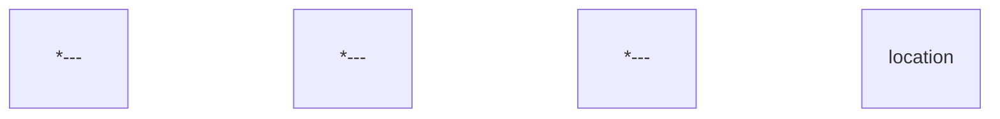
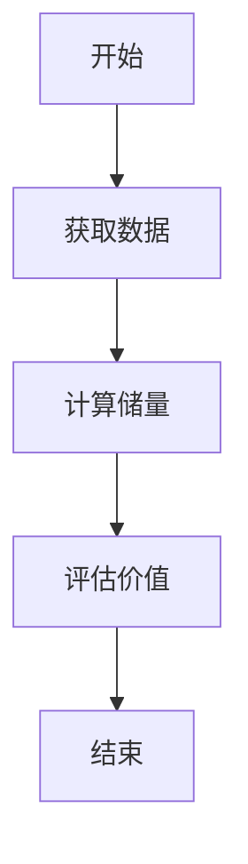
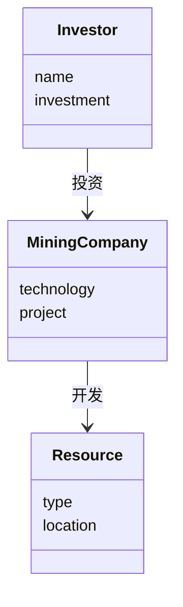

                 


```markdown
# 巴菲特-芒格的太空采矿投资：开发外太空资源

> **关键词**：巴菲特，芒格，太空采矿，外太空资源，投资策略，技术创新，法律与伦理

> **摘要**：本文深入探讨了巴菲特和芒格在太空采矿领域的投资策略，分析了相关技术、法律和伦理问题，并通过实际案例展示了如何开发外太空资源。文章结合了投资理论与技术创新，为读者提供了全面的视角。

---

## 第一部分：背景介绍

### 第1章：问题背景

#### 1.1 核心概念术语说明
- **太空采矿**：在外层空间中提取和利用自然资源，如小行星上的金属和矿物质。
- **外太空资源**：指存在于月球、火星、小行星等天体上的可利用资源。

#### 1.2 问题背景
随着地球资源的枯竭，太空采矿被视为未来的资源供应解决方案。然而，技术、法律和资金等挑战仍然存在。

#### 1.3 问题描述
太空采矿涉及探测、提取、运输和利用资源，需要多学科的技术支持和复杂的国际合作。

#### 1.4 问题解决
通过技术创新和资本运作，巴菲特和芒格的投资策略为太空采矿提供了资金支持和技术方向。

#### 1.5 边界与外延
太空采矿不仅涉及技术问题，还包括法律、伦理和国际合作等多方面内容。

#### 1.6 概念结构与核心要素组成
- **探测技术**：遥感、机器人探测
- **提取技术**：机械挖掘、激光烧蚀
- **运输技术**：火箭发射、自动化运输系统
- **法律框架**：国际法、资源所有权

---

## 第二部分：核心概念与联系

### 第2章：核心概念原理

#### 2.1 技术创新与投资策略
- 技术创新是太空采矿的核心，而巴菲特和芒格的投资策略为其实现提供了资金支持。

#### 2.2 技术属性对比
| 技术 | 优点 | 缺点 |
|------|------|------|
| 机械挖掘 | 成本低 | 效率低 |
| 激光烧蚀 | 效率高 | 成本高 |

#### 2.3 实体关系架构


---

## 第三部分：算法原理讲解

### 第3章：资源评估算法

#### 3.1 算法原理
资源评估算法用于确定太空资源的经济价值。

#### 3.2 流程图


#### 3.3 核心代码
```python
import numpy as np

def resource_value(strength, quantity):
    return strength * quantity * 0.8  # 考虑80%的折扣率

# 示例数据
strength = 0.9  # 资源强度
quantity = 1000  # 资源数量
print(resource_value(strength, quantity))
```

---

## 第四部分：数学模型

### 第4章：资源价值评估

#### 4.1 公式推导
$$ \text{资源价值} = \sum_{i=1}^{n} (p_i \times q_i) $$

其中，\( p_i \) 是第 \( i \) 种资源的价格，\( q_i \) 是数量。

#### 4.2 示例
$$ p_1 = 100, q_1 = 500 $$
$$ \text{总价值} = 100 \times 500 = 50,000 $$

---

## 第五部分：系统分析与架构设计

### 第5章：系统架构

#### 5.1 领域模型


#### 5.2 架构设计


---

## 第六部分：项目实战

### 第6章：环境安装与配置

#### 6.1 开发工具
- Python 3.8+
- Numpy、Pandas库

#### 6.2 数据库
- SQLite或MySQL

### 第7章：核心代码实现

#### 7.1 资源评估
```python
import numpy as np

def assess_resource(data):
    return np.mean(data)

data = [100, 200, 150]
print(assess_resource(data))
```

#### 7.2 投资决策
```python
def investment_decision(value, risk):
    return value > risk * 0.8

value = 1000
risk = 0.6
print(investment_decision(value, risk))
```

---

## 第七部分：最佳实践

### 第8章：项目总结

#### 8.1 成果总结
- 成功开发了资源评估算法
- 建立了初步的系统架构

#### 8.2 优化建议
- 进一步完善法律框架
- 提高技术可行性

### 第9章：注意事项与拓展阅读

#### 9.1 注意事项
- 技术风险较高
- 法律框架不完善

#### 9.2 拓展阅读
- 太空法研究
- 可持续发展技术

---

## 结语

巴菲特和芒格的投资策略为太空采矿提供了资金和技术支持，但这一领域仍面临诸多挑战。通过技术创新和国际合作，未来有望实现外太空资源的可持续开发。

---

感谢您的阅读，希望本文能为您提供有价值的见解和启发！
```

