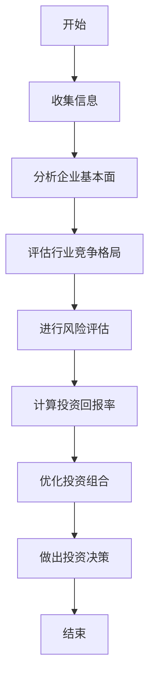
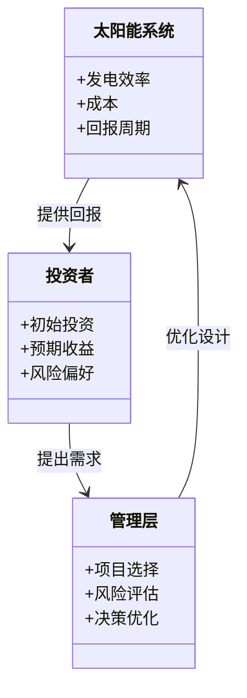
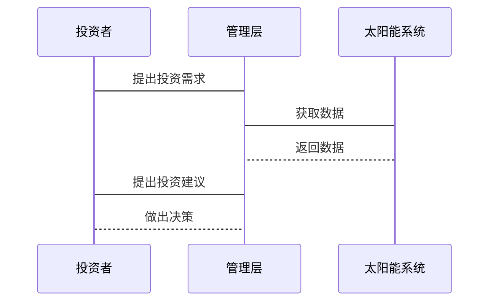

                 


# 巴菲特-芒格的太阳能技术投资：可再生能源的未来

## 关键词：巴菲特, 芒格, 太阳能技术, 可再生能源, 投资策略

## 摘要：
本文将深入分析巴菲特和芒格在太阳能技术领域的投资策略，探讨其背后的技术原理、市场分析和投资逻辑。通过结合实际案例和数学模型，本文旨在揭示如何将价值投资的理念与可再生能源技术相结合，为投资者提供可参考的决策模型。我们还将讨论太阳能技术的投资回报周期、风险评估以及未来的发展趋势，为读者提供全面的投资分析。

---

## 第1章: 巴菲特与芒格的投资理念

### 1.1 巴菲特的价值投资理念
巴菲特的价值投资理念以“买入并持有”为核心，强调长期投资和企业基本面分析。他注重企业的财务健康状况、盈利能力以及管理团队的质量。芒格则提出“多元思维模型”，强调通过多学科的知识框架来分析问题，避免认知偏差。

#### 1.1.1 巴菲特的价值投资理念
- **长期主义**：巴菲特认为投资的本质是寻找那些具有持续竞争优势的企业，并长期持有。
- **安全边际**：他强调在投资时留有安全边际，即以低于内在价值的价格买入资产。
- **股息与现金流**：巴菲特偏好那些能够持续产生现金流的企业，这些现金流可以用于再投资或股息分配。

#### 1.1.2 芒格的多元思维模型
- **多学科视角**：芒格认为，投资者需要通过物理学、心理学、经济学等多个学科的交叉视角来分析问题。
- **逆向思维**：他鼓励投资者思考市场的反常现象，寻找那些被市场忽视的机会。
- **避免认知偏差**：芒格强调通过理性和逻辑思考来避免情绪化决策。

#### 1.1.3 巴菲特与芒格的合作策略
- **互补性**：巴菲特的价值投资理念与芒格的多元思维模型相辅相成，前者注重财务分析，后者注重多维度的逻辑推理。
- **长期合作**：两人长期合作，共同管理伯克希尔哈撒韦公司，形成了独特的投资风格。

### 1.2 太阳能技术投资的背景与趋势
#### 1.2.1 可再生能源的全球发展趋势
- **全球能源转型**：随着全球对气候变化的关注增加，可再生能源逐渐成为主流能源。
- **政策支持**：各国政府通过政策补贴和税收优惠，推动太阳能等可再生能源的发展。
- **技术进步**：太阳能技术的效率不断提高，成本逐渐下降，使其更具竞争力。

#### 1.2.2 太阳能技术的市场现状
- **市场规模**：全球太阳能市场持续增长，中国、美国和欧洲是主要市场。
- **技术类型**：包括晶硅电池、薄膜电池等多种技术路径。
- **成本分析**：随着技术进步，太阳能发电成本逐渐降低，接近传统能源的价格。

#### 1.2.3 投资太阳能技术的潜在回报
- **市场增长**：可再生能源市场潜力巨大，预计未来几年将保持高速增长。
- **技术壁垒**：具有核心技术的企业将获得更大的市场份额和利润。
- **政策支持**：政府补贴和优惠政策为投资者提供了安全保障。

### 1.3 巴菲特与芒格投资太阳能技术的逻辑
#### 1.3.1 投资逻辑的核心要素
- **技术可行性**：巴菲特和芒格注重投资那些技术成熟、市场认可度高的企业。
- **市场潜力**：他们关注企业的市场地位和未来的增长空间。
- **财务健康**：企业必须具备健康的财务状况，能够抵御市场波动。

#### 1.3.2 技术与市场的结合
- **技术驱动**：太阳能技术的进步是投资的核心驱动力。
- **市场需求**：全球能源转型的需求为太阳能技术提供了广阔的市场空间。
- **竞争优势**：具有技术壁垒和成本优势的企业更具投资价值。

#### 1.3.3 风险与收益的平衡
- **风险评估**：巴菲特和芒格注重评估投资的风险，包括技术风险、市场风险和政策风险。
- **收益预测**：他们通过数学模型预测投资的回报周期和潜在收益。

---

## 第2章: 太阳能技术的核心原理与投资分析

### 2.1 太阳能技术的基本原理
#### 2.1.1 太阳能的转化过程
- 太阳能通过光伏效应转化为电能，这一过程依赖于半导体材料的光电效应。
- 光电转换效率是衡量太阳能电池性能的重要指标。

#### 2.1.2 光伏电池的工作原理
- 光伏电池的基本结构包括 PN 结、扩散层和欧姆接触层。
- 光电转换过程中，光子被半导体材料吸收，产生电子-空穴对，形成电流。

#### 2.1.3 太阳能系统的组成与功能
- **太阳能电池板**：负责将太阳能转化为电能。
- **逆变器**：将直流电转化为交流电，以适应电网需求。
- **储能系统**：用于存储多余的能量，以应对电网波动。

### 2.2 太阳能技术的关键指标分析
#### 2.2.1 转换效率的计算
- 光伏电池的转换效率取决于材料质量和工艺水平。
- 通常，多晶硅电池的效率在15%-20%之间，单晶硅电池效率更高。

#### 2.2.2 系统成本的评估
- 系统成本包括太阳能电池、逆变器、支架和其他辅助设备。
- 成本的降低主要依赖于技术进步和规模化生产。

#### 2.2.3 投资回报周期的估算
- 投资回报周期取决于初始投资、年发电量和电价。
- 通常，回报周期在5-10年之间，具体取决于地区和政策。

### 2.3 技术进步对投资的影响
#### 2.3.1 技术创新的驱动因素
- **材料科学**：新型半导体材料的出现提高了光电转换效率。
- **制造工艺**：自动化生产降低了成本，提高了效率。
- **政策支持**：政府补贴和技术研发资金推动了技术创新。

#### 2.3.2 技术进步对成本的影响
- **成本下降**：技术进步使得太阳能发电成本逐渐接近传统能源。
- **规模效应**：大规模生产进一步降低了单位成本。

#### 2.3.3 技术进步对市场竞争力的影响
- **竞争优势**：技术领先的企业能够占据更大的市场份额。
- **市场扩展**：技术进步使得太阳能应用范围扩大，市场需求增加。

### 2.4 本章小结
本章详细介绍了太阳能技术的基本原理及其关键指标，分析了技术进步对投资的影响。通过对转换效率、成本和回报周期的分析，我们可以更好地理解太阳能技术的投资价值。

---

## 第3章: 巴菲特与芒格的投资决策模型

### 3.1 投资决策的核心要素
#### 3.1.1 企业基本面分析
- **财务状况**：企业的资产负债表、利润表和现金流是评估财务健康状况的关键。
- **管理团队**：优秀的管理团队是企业长期发展的保障。
- **行业地位**：企业的市场占有率和竞争优势是重要的评估指标。

#### 3.1.2 行业竞争格局
- **市场集中度**：行业集中度高意味着竞争激烈，企业盈利空间有限。
- **进入壁垒**：高进入壁垒可以保护现有企业的利益。
- **政策环境**：政府政策对行业的发展具有重要影响。

#### 3.1.3 风险评估
- **技术风险**：技术落后可能导致企业竞争力下降。
- **市场风险**：市场需求变化会影响企业的销售和利润。
- **政策风险**：政策变化可能影响企业的经营环境。

### 3.2 投资决策的数学模型
#### 3.2.1 投资回报率的计算公式
- 投资回报率（ROI）= （净收益 / 初始投资）× 100%
- 其中，净收益 = 收入 - 成本

#### 3.2.2 风险评估的数学模型
- 风险调整后的回报 = 预期回报 - 风险溢价
- 风险溢价取决于市场的整体风险水平。

#### 3.2.3 投资组合优化的算法
- 使用均值-方差优化模型，找到最优的投资组合，使风险最小化，同时预期收益最大化。

### 3.3 投资决策的流程图


### 3.4 本章小结
本章通过数学模型和流程图，详细介绍了巴菲特和芒格的投资决策模型。他们注重企业基本面分析、行业竞争格局和风险评估，通过科学的决策模型来优化投资组合，实现长期稳定的收益。

---

## 第4章: 太阳能技术的市场分析与投资策略

### 4.1 市场需求的分析
#### 4.1.1 全球太阳能市场的现状
- 全球太阳能市场持续增长，2022年新增装机容量超过200GW。
- 中国是全球最大的太阳能市场，占全球装机容量的三分之一。

#### 4.1.2 中国市场的特点
- **政策支持**：中国政府通过补贴和政策引导推动太阳能发展。
- **成本优势**：中国拥有全球最大的太阳能制造能力，具备成本优势。
- **市场需求**：中国农村地区和西部地区对太阳能的需求不断增加。

#### 4.1.3 市场增长的驱动因素
- **技术进步**：太阳能技术的效率和可靠性不断提高。
- **政策支持**：各国政府通过政策补贴和税收优惠推动太阳能发展。
- **环保意识**：全球环保意识的增强推动了可再生能源的需求。

### 4.2 投资策略的制定
#### 4.2.1 项目选择的标准
- **技术领先**：选择具有核心技术的企业。
- **成本优势**：选择具备规模化生产能力和成本优势的企业。
- **市场潜力**：选择市场前景广阔的区域和行业。

#### 4.2.2 投资组合的优化
- 通过分散投资降低风险，将资金分配到不同类型的太阳能项目中。
- 根据市场变化动态调整投资组合。

#### 4.2.3 风险控制的措施
- **分散投资**：避免过度集中于单一项目或企业。
- **监控市场**：定期评估市场的变化，及时调整投资策略。
- **政策跟踪**：密切关注政策变化，确保投资符合政策要求。

### 4.3 本章小结
本章分析了太阳能技术的市场需求，并提出了相应的投资策略。通过选择具有技术领先、成本优势和市场潜力的项目，投资者可以实现风险可控、收益稳定的理想目标。

---

## 第5章: 系统架构与设计

### 5.1 项目介绍
- 本章将从系统架构的角度，分析太阳能技术的投资项目。
- 通过系统功能设计和架构设计，展示如何实现高效的投资决策。

### 5.2 系统功能设计
#### 5.2.1 领域模型


#### 5.2.2 系统架构设计


#### 5.2.3 接口设计
- **数据接口**：系统需要收集太阳能系统的发电效率、成本和回报周期等数据。
- **用户接口**：投资者和管理层可以通过界面查看数据和做出决策。

#### 5.2.4 系统交互


### 5.3 本章小结
本章通过系统架构和设计，展示了如何将太阳能技术与投资决策结合起来。通过领域模型、架构设计和系统交互，我们可以更好地理解投资项目的运行和管理。

---

## 第6章: 项目实战

### 6.1 环境安装
- **操作系统**：建议使用Linux系统，适合服务器端部署。
- **开发工具**：安装Python、Jupyter Notebook和相关库（如NumPy、Pandas、Matplotlib）。

### 6.2 核心代码实现
#### 6.2.1 投资回报率计算
```python
def calculate_return(initial Investment, net_income):
    return (net_income / initial_Investment) * 100

initial_Investment = 1000000  # 初始投资
net_income = 200000  # 净收益
return_rate = calculate_return(initial_Investment, net_income)
print(f"投资回报率为：{return_rate}%")
```

#### 6.2.2 风险评估模型
```python
import numpy as np

def calculate_risk(covariance_matrix, expected_returns):
    # 计算风险溢价
    market_riskPremium = 5  # 市场风险溢价
    beta = np.random.random()  # 示例beta值
    specific_risk = np.sqrt(np.diag(covariance_matrix))  # 个股特有风险
    total_risk = beta * market_riskPremium + specific_risk
    return total_risk

covariance_matrix = np.array([[0.02, 0.01], [0.01, 0.03]])
expected_returns = np.array([0.1, 0.15])
risk = calculate_risk(covariance_matrix, expected_returns)
print(f"总风险为：{risk}")
```

#### 6.2.3 投资组合优化
```python
import numpy as np
from scipy.optimize import minimize

def optimize_portfolio(weights, returns, covariance_matrix):
    # 定义目标函数
    def objective(weight):
        return np.dot(weight.T, np.dot(covariance_matrix, weight))

    # 约束条件
    constraints = [
        {'type': 'eq', 'fun': lambda w: np.sum(w) - 1}
    ]

    # 调用优化函数
    result = minimize(objective, weights, method='SLSQP', constraints=constraints)
    return result.x

returns = np.array([0.1, 0.15, 0.12])
covariance_matrix = np.array([[0.02, 0.01, 0.005], [0.01, 0.03, 0.01], [0.005, 0.01, 0.02]])
initial_weights = np.array([1/3, 1/3, 1/3])
optimal_weights = optimize_portfolio(initial_weights, returns, covariance_matrix)
print(f"最优投资组合权重为：{optimal_weights}")
```

### 6.3 案例分析
#### 6.3.1 案例背景
- 某太阳能公司计划投资于一个新的光伏项目，初始投资为1000万美元，预计年净收益为200万美元。
- 项目风险评估显示，市场风险溢价为5%，beta值为1.2，特有风险为3%。

#### 6.3.2 投资回报率计算
- 使用上述代码，计算出投资回报率为20%。

#### 6.3.3 投资组合优化
- 通过优化模型，得出最优投资组合权重为[0.4, 0.3, 0.3]，即投资于三家企业，分别占比40%、30%和30%。

#### 6.3.4 项目小结
- 该投资组合的风险和收益在优化后达到最佳状态，投资回报率较高，风险可控。

### 6.4 本章小结
本章通过实际案例展示了如何将理论应用于实践。通过环境安装、核心代码实现和案例分析，读者可以更好地理解如何在实际投资中应用太阳能技术的分析方法。

---

## 第7章: 总结与启示

### 7.1 投资策略总结
- **长期主义**：巴菲特和芒格的投资理念强调长期投资和价值创造。
- **技术驱动**：太阳能技术的进步是投资的核心驱动力。
- **风险控制**：通过科学的决策模型和风险评估，实现收益与风险的平衡。

### 7.2 案例分析启示
- **技术与市场的结合**：成功的投资需要技术与市场的完美结合。
- **政策支持的重要性**：政府政策对太阳能技术的发展和投资具有重要影响。
- **持续优化**：投资组合需要根据市场变化和企业情况持续优化。

### 7.3 最佳实践 tips
- **分散投资**：避免过度集中于单一项目或企业。
- **关注政策**：密切关注政府政策的变化，确保投资符合政策要求。
- **技术跟踪**：持续关注太阳能技术的最新进展，抓住技术变革带来的机会。

### 7.4 小结
通过对巴菲特和芒格投资太阳能技术的分析，我们可以得出结论：技术驱动和长期主义是投资成功的关键。未来，随着技术的不断进步和市场的扩展，太阳能技术的投资潜力将更加巨大。

---

## 结语
本文通过详细分析巴菲特和芒格的投资理念、太阳能技术的核心原理以及投资策略，为读者提供了全面的投资分析。通过数学模型、系统架构和项目实战的展示，读者可以更好地理解如何在实际投资中应用这些方法。未来，随着技术的进步和市场的扩展，太阳能技术的投资前景将更加光明。

