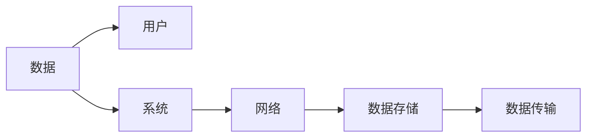

                 


# 巴菲特-芒格的数据安全投资：数字时代的新机遇

## 关键词：数据安全，巴菲特，芒格，投资策略，数字时代，数据加密

## 摘要：本文探讨了在数字时代，巴菲特和芒格的投资理念如何应用于数据安全领域。通过分析数据安全的核心概念、算法原理和系统架构设计，本文揭示了数据安全投资的新机遇，并提供了实际案例和最佳实践，帮助投资者在数字时代中抓住数据安全投资的机遇。

---

# 第一部分：数据安全投资的背景与核心概念

## 第1章：数据安全投资的背景与现状

### 1.1 数据安全的重要性

#### 1.1.1 数字时代的数据安全挑战

在数字时代，数据已成为企业的核心资产。随着云计算、物联网和人工智能等技术的广泛应用，数据的存储、传输和处理变得更加复杂。数据 breaches、网络攻击和隐私泄露等问题频发，给企业和个人带来了巨大的损失。数据安全的重要性日益凸显，已成为企业生存和发展的关键因素。

#### 1.1.2 数据安全对企业的核心价值

数据安全不仅关乎企业的声誉和法律责任，还直接影响企业的业务连续性和盈利能力。通过有效的数据安全措施，企业可以保护客户数据、知识产权和内部机密，避免因数据泄露而造成的财务损失和声誉损害。此外，数据安全也是企业合规性的重要组成部分，符合相关法律法规要求，避免罚款和法律纠纷。

#### 1.1.3 全球数据安全投资现状与趋势

近年来，全球数据安全投资持续增长。根据市场研究机构的报告，全球数据安全市场规模已超过千亿美元，并预计将以年均两位数的速度增长。随着数据隐私法规的日益严格和网络安全威胁的不断增加，企业和社会对数据安全的投资意愿和投入力度也在不断增加。

### 1.2 巴菲特与芒格的投资理念

#### 1.2.1 巴菲特的价值投资原则

巴菲特的价值投资理念强调长期投资、安全边际和企业内在价值。他认为，投资者应该选择具有强大护城河、良好管理和稳定财务状况的企业进行投资。这种理念强调长期稳健的投资回报，而不是短期的市场波动。

#### 1.2.2 芒格的多元思维模型

芒格的多元思维模型强调将多个学科的知识结合起来，以形成对问题的全面理解。他认为，投资者应该从多个角度分析问题，避免单一思维的局限性。这种思维方式可以帮助投资者更好地识别投资机会和风险。

#### 1.2.3 投资理念与数据安全的结合

将巴菲特和芒格的投资理念应用到数据安全领域，可以帮助投资者识别具有长期价值和竞争优势的数据安全企业。这些企业通常具有强大的技术能力、良好的市场声誉和稳定的客户关系。通过长期投资这些企业，投资者可以在数据安全领域获得稳健的回报。

### 1.3 数据安全投资的核心要素

#### 1.3.1 数据安全威胁的多样性

数据安全威胁多种多样，包括病毒、木马、钓鱼攻击、数据泄露等。这些威胁可能来自内部员工、外部攻击者或技术漏洞。因此，数据安全投资需要全面考虑各种威胁来源和类型。

#### 1.3.2 数据安全防护的多层次性

数据安全防护需要从多个层次进行，包括技术防护、管理措施和员工培训等。技术防护包括加密、防火墙和入侵检测系统等；管理措施包括制定安全政策和风险评估；员工培训则可以提高员工的安全意识和防范能力。

#### 1.3.3 数据安全投资的长期性

数据安全是一个长期的过程，需要持续的投资和维护。随着技术的发展和威胁的演变，数据安全措施需要不断更新和优化。因此，数据安全投资需要具备长期性，而不仅仅是短期的解决方案。

## 1.4 本章小结

本章介绍了数据安全的重要性及其在数字时代的挑战，探讨了巴菲特和芒格的投资理念，并分析了数据安全投资的核心要素。通过这些内容，读者可以理解数据安全投资的背景和基本概念，为后续的深入分析奠定基础。

---

## 第2章：数据安全的核心概念与联系

### 2.1 数据安全的核心概念

#### 2.1.1 数据安全的定义与属性

数据安全是指通过技术、管理和措施保护数据的机密性、完整性和可用性。机密性确保只有授权人员可以访问数据；完整性确保数据在存储和传输过程中不被篡改；可用性确保数据在需要时可以被访问。

#### 2.1.2 数据安全的关键要素

数据安全的关键要素包括数据分类、访问控制、加密技术和安全审计等。数据分类可以帮助企业识别重要数据并采取相应的保护措施；访问控制确保只有授权人员可以访问数据；加密技术可以防止数据在传输和存储过程中被窃取；安全审计则可以评估数据安全措施的有效性。

#### 2.1.3 数据安全与隐私保护的关系

数据安全与隐私保护密切相关。隐私保护强调个人数据的私密性和合法性，而数据安全则是实现隐私保护的技术手段。通过数据安全措施，可以有效保护个人隐私，防止数据被滥用或泄露。

### 2.2 数据安全威胁的实体关系图

以下是数据安全威胁的实体关系图：



### 2.3 数据安全防护的流程图

以下是数据安全防护的流程图：


### 2.4 本章小结

本章通过定义和属性，详细解释了数据安全的核心概念，并通过实体关系图和流程图展示了数据安全威胁和防护的结构。这些内容为后续的数据安全投资分析提供了理论基础。

---

## 第3章：数据安全投资的算法原理

### 3.1 数据加密算法

#### 3.1.1 常见加密算法概述

常见的数据加密算法包括对称加密和非对称加密。对称加密算法如AES（高级加密标准）加密速度快，适用于大量数据的加密；非对称加密算法如RSA（ Rivest-Shamir-Adleman）安全性高，适用于数字签名和身份验证。

#### 3.1.2 RSA算法的原理与应用

RSA算法基于大整数分解的困难性，通过公钥和私钥对数据进行加密和解密。公钥用于加密，私钥用于解密。RSA算法广泛应用于数字签名、数据传输和身份验证等领域。

#### 3.1.3 AES算法的实现与优化

AES算法是一种块加密算法，支持128、192和256位的密钥长度。AES算法通过多轮的加法和乘法操作对数据进行加密，具有高效性和安全性。优化措施包括使用硬件加速和并行计算，以提高加密速度。

### 3.2 数据安全的数学模型

#### 3.2.1 数据完整性校验

数据完整性校验通过计算数据的哈希值来验证数据的完整性。常见的哈希函数包括MD5、SHA-1和SHA-256等。哈希值可以用来检测数据在传输过程中是否被篡改。

$$ hash(x) = \sum_{i=1}^{n} x_i \mod 256 $$

#### 3.2.2 数据加密模型

数据加密模型可以表示为：

$$ E(x) = x \times k \mod m $$

其中，x是明文，k是密钥，m是模数。

### 3.3 数据安全算法的优化与实现

#### 3.3.1 算法优化策略

通过优化算法实现，可以提高加密和解密的速度。例如，使用更高效的算法实现方式、减少算法的计算复杂度等。

#### 3.3.2 算法实现的代码示例

以下是一个简单的AES加密实现示例：

```python
from cryptography import fernet

# 生成密钥
key = fernet.Fernet.generate_key()
cipher = fernet.Fernet(key)

# 加密数据
plaintext = "This is a secret message"
encrypted_text = cipher.encrypt(plaintext.encode())

# 解密数据
decrypted_text = cipher.decrypt(encrypted_text).decode()

print("密钥:", key)
print("加密后的文本:", encrypted_text)
print("解密后的文本:", decrypted_text)
```

### 3.4 本章小结

本章通过介绍常见的加密算法和数学模型，详细讲解了数据安全算法的原理和实现。通过代码示例，读者可以更好地理解加密算法的应用和优化方法。

---

## 第4章：数据安全投资的系统架构设计

### 4.1 系统功能设计

#### 4.1.1 数据采集模块

数据采集模块负责收集企业内部和外部的数据，包括用户数据、交易数据和日志数据等。这些数据需要经过清洗和预处理，以便后续的分析和存储。

#### 4.1.2 数据处理模块

数据处理模块对采集到的数据进行清洗、转换和增强。清洗数据包括去除重复数据和填补缺失值；转换数据包括数据格式转换和数据标准化；数据增强包括增加数据的多样性和完整性。

#### 4.1.3 数据存储模块

数据存储模块负责将处理后的数据存储到数据库中。数据库可以选择关系型数据库（如MySQL）或非关系型数据库（如MongoDB），具体取决于数据的结构和访问需求。

### 4.2 系统架构图

以下是系统架构图：


### 4.3 系统接口设计

#### 4.3.1 数据采集接口

数据采集接口用于接收来自各种数据源的数据，包括API接口和文件接口。接口设计需要考虑数据格式、数据传输协议和错误处理机制。

#### 4.3.2 数据加密接口

数据加密接口用于对敏感数据进行加密处理。加密接口需要支持多种加密算法，并提供加密和解密的API。

#### 4.3.3 数据查询接口

数据查询接口用于根据用户的需求，从数据库中查询相关的数据。查询接口需要支持复杂的查询条件，并返回结构化或非结构化的数据。

### 4.4 系统交互流程图

以下是系统交互流程图：


### 4.5 本章小结

本章通过系统功能设计和架构图，展示了数据安全系统的整体结构和各模块之间的关系。通过接口设计和交互流程图，读者可以更好地理解系统的运作方式。

---

## 第5章：数据安全投资的项目实战

### 5.1 环境配置

在进行数据安全项目之前，需要进行环境配置。包括安装必要的软件和工具，配置网络环境和数据库环境等。以下是常见的环境配置步骤：

1. 安装操作系统和数据库。
2. 配置网络防火墙和安全组。
3. 安装开发工具和编程语言（如Python、Java）。
4. 配置版本控制工具（如Git）。

### 5.2 系统核心实现源代码

以下是数据安全系统的核心实现代码示例：

```python
import hashlib

# 数据哈希校验
def data_integrity_check(data):
    # 计算数据的哈希值
    hash_value = hashlib.sha256(data.encode()).hexdigest()
    return hash_value

# 数据加密
def data_encryption(data, key):
    cipher = fernet.Fernet(key)
    encrypted_data = cipher.encrypt(data.encode())
    return encrypted_data

# 数据解密
def data_decryption(encrypted_data, key):
    cipher = fernet.Fernet(key)
    decrypted_data = cipher.decrypt(encrypted_data).decode()
    return decrypted_data
```

### 5.3 代码应用解读与分析

以上代码示例展示了数据完整性校验和加密解密的功能。通过哈希校验，可以确保数据在传输过程中未被篡改；通过加密和解密，可以保护数据的机密性。这些功能是数据安全系统的核心组成部分。

### 5.4 实际案例分析

以下是某企业数据安全项目的实际案例分析：

1. **项目背景**：某企业发现其客户数据频繁被黑客攻击，导致数据泄露和客户投诉。
2. **解决方案**：企业采用了数据加密和访问控制措施，对客户数据进行加密存储，并限制员工对敏感数据的访问权限。
3. **实施步骤**：
   - 数据分类和标记。
   - 数据加密和存储。
   - 访问控制和权限管理。
   - 定期安全审计和漏洞扫描。
4. **项目成果**：数据泄露事件减少，客户满意度提高，企业声誉得到保护。

### 5.5 本章小结

本章通过项目实战，展示了数据安全系统的环境配置、核心实现和实际案例。通过这些内容，读者可以更好地理解数据安全投资的实际应用和实施步骤。

---

## 第6章：数据安全投资的最佳实践

### 6.1 投资策略 tips

1. **长期投资**：数据安全是一个长期的过程，需要持续的投资和维护。
2. **选择可靠的技术和供应商**：选择具有强大技术能力和良好市场声誉的数据安全产品和服务。
3. **定期评估和优化**：定期评估数据安全措施的有效性，并根据新的威胁和法规进行优化。
4. **员工培训和意识提升**：通过培训提高员工的数据安全意识，减少人为错误导致的安全漏洞。

### 6.2 小结

数据安全投资需要综合考虑技术、管理和人员等多个方面。通过制定合理的投资策略和最佳实践，可以在数字时代中抓住数据安全投资的新机遇，实现长期的稳健回报。

### 6.3 注意事项

1. **数据隐私法规**：遵守相关法律法规，如GDPR（通用数据保护条例）和CCPA（加利福尼亚消费者隐私法案）。
2. **技术选型**：选择适合企业需求和技术能力的数据安全技术。
3. **风险评估**：定期进行风险评估，识别潜在的安全漏洞和威胁。

### 6.4 拓展阅读

1. **《The Value of Security》**：巴菲特和芒格的价值投资理念在数据安全领域的应用。
2. **《Data Security: A Comprehensive Guide》**：数据安全的全面指南。
3. **《Cybersecurity for Dummies》**：数据安全的通俗读物。

---

## 结语

在数字时代，数据安全已成为企业和个人不可忽视的重要问题。通过将巴菲特和芒格的投资理念应用到数据安全领域，投资者可以在数据安全投资中找到新的机遇。本文通过详细分析数据安全的核心概念、算法原理和系统架构设计，并结合实际案例和最佳实践，为读者提供了全面的数据安全投资指南。

希望本文能帮助读者更好地理解数据安全投资的重要性，并在实际投资中取得成功。

