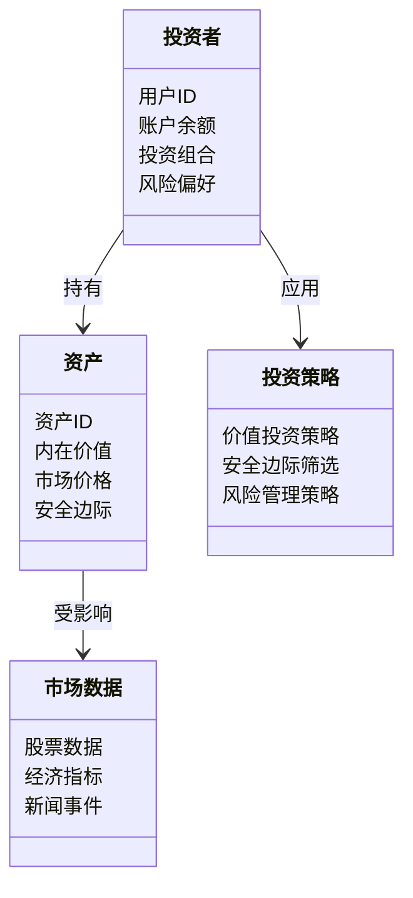
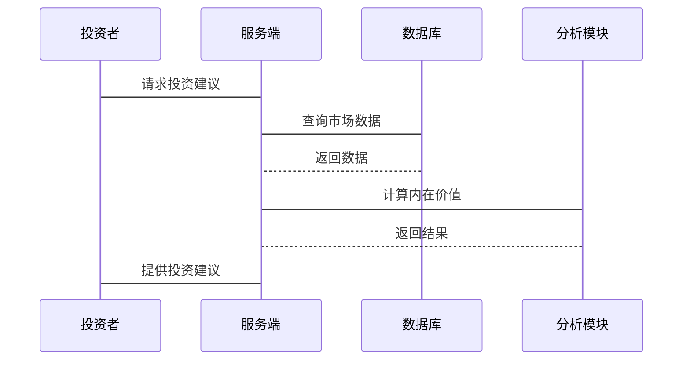

                 


# 巴菲特-芒格的新兴市场投资策略：机遇与风险的平衡

> 关键词：巴菲特，芒格，新兴市场，投资策略，风险管理，价值投资，安全边际

> 摘要：本文深入探讨了巴菲特和芒格在新兴市场中的投资策略，分析了他们如何在新兴市场中寻找机遇并平衡风险。通过结合他们的投资哲学和实际案例，本文详细阐述了新兴市场的特点、价值投资的核心要素、风险管理的重要性以及如何在新兴市场中应用这些策略。文章还通过数学模型和系统架构的设计，展示了如何将这些策略转化为可操作的投资决策支持系统。

---

## 第一部分: 巴菲特与芒格的投资理念概述

### 第1章: 巴菲特与芒格的投资哲学

#### 1.1 巴菲特与芒格的背景介绍

##### 1.1.1 巴菲特的投资理念
- 巴菲特是价值投资的代表人物，他的投资理念基于“先生存，后发财”的原则。
- 他强调安全边际，即以低于内在价值的价格买入优质资产。
- 巴菲特注重企业的财务健康状况，尤其是现金流和盈利能力。

##### 1.1.2 芒格的多元思维模型
- 芒格倡导“多元思维模型”，即通过多学科的知识框架来分析问题。
- 他认为，投资不仅仅是对一家公司的分析，而是对整个经济体系的理解。
- 芒格的决策基于对“人类认知局限”的深刻理解，强调避免情绪化决策。

##### 1.1.3 巴菲特与芒格合作的历史与成就
- 巴菲特和芒格的合作始于1959年，两人共同创立了伯克希尔哈撒韦公司。
- 他们的合作使伯克希尔从一家纺织公司转型为一家多元化的金融帝国。
- 他们的投资理念和方法被全球投资者广泛学习和借鉴。

#### 1.2 投资理念的核心要素

##### 1.2.1 价值投资的定义与特征
- 价值投资是一种以低于市场价买入优质资产的投资策略。
- 价值投资的核心是寻找市场先生的错误定价。
- 巴菲特将价值投资定义为“买入便宜的东西，而不是便宜的东西”。

##### 1.2.2 安全边际的概念与重要性
- 安全边际是指买入价格与内在价值之间的差距。
- 巴菲特认为，安全边际是保护投资者免受市场波动影响的重要屏障。
- 安全边际越大，投资风险越小。

##### 1.2.3 长期思维与复利效应
- 巴菲特强调长期思维，认为投资的复利效应是创造财富的关键。
- 他主张以时间换空间，通过长期持有优质资产实现财富增长。
- 复利效应要求投资者注重投资的稳定性和持续性。

##### 1.2.4 风险管理与投资组合的构建
- 巴菲特认为，风险管理是投资成功的关键。
- 他强调分散投资的重要性，但反对过度分散。
- 投资组合的构建需要基于对企业内在价值的深刻理解和对风险的准确评估。

### 第2章: 新兴市场的特点与投资机遇

#### 2.1 新兴市场的定义与分类

##### 2.1.1 新兴市场的定义
- 新兴市场是指那些经济增长迅速、市场潜力巨大的发展中国家市场。
- 新兴市场通常包括中国、印度、巴西、俄罗斯等国家。

##### 2.1.2 新兴市场的特点
- 经济增长快：新兴市场的GDP增长通常高于发达市场。
- 市场规模大：新兴市场的人口基数大，消费市场潜力巨大。
- 市场波动性高：新兴市场的股票和货币波动性通常高于发达市场。
- 制度差异：新兴市场的法律、金融制度与发达市场存在差异。

##### 2.1.3 新兴市场的投资机会与挑战
- 投资机会：新兴市场的高增长潜力和低估资产提供了巨大的投资机会。
- 挑战：新兴市场的政治风险、经济波动和制度差异增加了投资难度。

#### 2.2 巴菲特与芒格对新兴市场的看法

##### 2.2.1 巴菲特对新兴市场的投资策略
- 巴菲特对新兴市场的看法较为谨慎，他认为新兴市场的波动性和不确定性较高。
- 他倾向于投资新兴市场中的优质企业，尤其是那些具有强大竞争优势和可持续盈利能力的企业。
- 巴菲特认为，新兴市场的投资需要更长的时间来验证企业的内在价值。

##### 2.2.2 芒格对新兴市场的独特见解
- 芒格认为，新兴市场的投资机会与挑战并存，关键在于识别具有竞争优势的企业。
- 他强调新兴市场的多元文化背景和复杂性，认为投资者需要具备跨文化的知识和理解。
- 芒格认为，新兴市场的投资需要更加注重企业的治理结构和管理层素质。

##### 2.2.3 新兴市场与发达市场的对比分析
- 从市场成熟度来看，发达市场更加成熟，而新兴市场更具增长潜力。
- 从投资标的来看，发达市场注重稳定性和分红，而新兴市场注重成长性和盈利能力。
- 从风险来看，新兴市场的风险更高，但潜在回报也更大。

---

## 第二部分: 投资策略与风险管理

### 第3章: 巴菲特-芒格投资策略的核心要素

#### 3.1 安全边际的计算与应用

##### 3.1.1 安全边际的定义与计算方法
- 安全边际=内在价值-市场价格。
- 巴菲特的安全边际通常要求在30%以上。

##### 3.1.2 安全边际的应用
- 通过安全边际筛选出具有投资价值的企业。
- 在市场波动中，安全边际为投资者提供了保护。

#### 3.2 价值投资的数学模型与公式

##### 3.2.1 现金流折现模型（DCF模型）
- 企业内在价值=未来现金流的现值。
- 公式：$$ V = \sum_{t=1}^{n} \frac{CF_t}{(1+r)^t} $$
- 其中，\( V \) 为内在价值，\( CF_t \) 为第 \( t \) 年的现金流，\( r \) 为折现率。

##### 3.2.2 内在价值的计算步骤
1. 估计未来现金流。
2. 确定合理的折现率。
3. 计算未来现金流的现值。
4. 对比市场价格与内在价值，确定安全边际。

#### 3.3 风险管理的策略与方法

##### 3.3.1 风险的分类与识别
- 系统性风险：市场波动、经济周期等。
- 非系统性风险：企业-specific风险。

##### 3.3.2 风险管理的策略
- 分散投资：通过投资不同行业和地区的资产来降低风险。
- 严格筛选：选择具有强大竞争优势和良好治理的企业。
- 定期评估：定期重新评估投资组合的风险和收益。

---

## 第三部分: 系统分析与架构设计

### 第4章: 投资决策支持系统的构建

#### 4.1 问题场景介绍
- 投资者需要一个系统来辅助新兴市场的投资决策。
- 系统需要整合多来源数据，提供分析和建议。

#### 4.2 系统功能设计

##### 4.2.1 领域模型（Mermaid 类图）


#### 4.3 系统架构设计（Mermaid 架构图）


#### 4.4 系统接口设计
- API接口：
  - 获取资产数据
  - 计算内在价值
  - 生成投资建议

#### 4.5 系统交互（Mermaid 序列图）


---

## 第四部分: 项目实战

### 第5章: 新兴市场投资策略的实战应用

#### 5.1 环境安装
- 安装Python、Pandas、Matplotlib等工具。
- 安装金融数据API（如Yahoo Finance）。

#### 5.2 核心代码实现

##### 5.2.1 计算内在价值的代码
```python
import pandas as pd
import yfinance as yf

def calculate_intrinsic_value(ticker, discount_rate):
    # 获取股票数据
    df = yf.download(ticker, start='2020-01-01', end='2023-12-31')
    # 计算现金流（简化为净利润）
    CF = df['Adj Close'] * 100000
    # 计算现值
    present_value = sum(CF / (1 + discount_rate)**t for t in range(len(CF)))
    return present_value

print(calculate_intrinsic_value('AAPL', 0.05))
```

##### 5.2.2 计算安全边际的代码
```python
def calculate_margin_of_safety(ticker):
    # 获取市场价格
    df = yf.download(ticker, start='2020-01-01', end='2023-12-31')
    price = df['Adj Close'].iloc[-1]
    # 计算内在价值（简化）
    intrinsic_value = price * 1.5
    margin_of_safety = (intrinsic_value - price) / price * 100
    return margin_of_safety

print(calculate_margin_of_safety('AAPL'))
```

#### 5.3 代码解读与分析
- 计算内在价值的代码使用现金流折现模型，简化为净利润乘以假设的数值。
- 安全边际的代码通过比较市场价格和内在价值，计算出安全边际百分比。

#### 5.4 案例分析
- 以印度市场为例，分析新兴市场的投资机会。
- 通过代码计算某印度企业的内在价值和安全边际。
- 对比市场价格与内在价值，给出投资建议。

---

## 第五部分: 总结与展望

### 第6章: 小结与最佳实践

#### 6.1 小结
- 巴菲特和芒格的投资策略在新兴市场中仍然适用。
- 新兴市场的高增长潜力和低估资产提供了巨大的投资机会。
- 投资者需要注重安全边际、长期思维和风险管理。

#### 6.2 最佳实践
- 选择具有强大竞争优势和良好治理的企业。
- 通过分散投资降低风险。
- 定期评估投资组合，及时调整策略。

#### 6.3 注意事项
- 新兴市场的波动性较高，需要谨慎操作。
- 投资者需要具备跨文化的知识和理解。
- 避免情绪化决策，坚持长期思维。

#### 6.4 拓展阅读
- 巴菲特的《巴菲特致股东的信》
- 芒格的《穷查理宝典》
- 《投资学》相关书籍

---

通过本文的分析，我们可以看到，巴菲特和芒格的投资策略在新兴市场中仍然具有重要的指导意义。新兴市场的高增长潜力和低估资产为投资者提供了巨大的机会，但同时也带来了更高的风险。投资者需要结合价值投资的核心要素和风险管理的策略，才能在新兴市场中实现稳健的投资回报。

