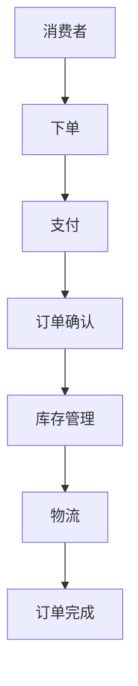

                 


# 巴菲特-芒格的新零售投资：线上线下融合的商业模式

> 关键词：巴菲特，芒格，新零售，线上线下融合，商业模式，投资策略

> 摘要：本文深入探讨了巴菲特和芒格在新零售领域的投资理念，重点分析了线上线下融合的商业模式。通过结合他们的投资哲学，详细阐述了新零售的核心概念、数据驱动的决策算法、系统架构设计以及实际案例分析。文章还提供了最佳实践建议，为读者提供了全面的指导。

---

# 第一部分：巴菲特与芒格的投资理念

## 第1章：巴菲特与芒格的投资哲学

### 1.1 巴菲特与芒格的投资理念概述

#### 1.1.1 巴菲特的价值投资理论
巴菲特的价值投资理论强调长期投资和安全边际。他认为，市场先生是疯狂的，投资者应该利用市场波动，购买具有内在价值的股票。他的投资策略基于对企业基本面的深入分析，寻找那些具有持续竞争优势和良好管理团队的企业。

#### 1.1.2 芒格的多元思维模型
芒格提倡多元思维模型，认为投资者应该从多个角度（如心理学、经济学、物理学等）来理解问题。他强调避免情绪化决策，并寻找那些具有复利效应的投资机会。

#### 1.1.3 两人合作的投资哲学
巴菲特和芒格的合作基于对价值投资的共同信仰。他们共同管理的伯克希尔哈撒韦公司以长期持有优质资产而闻名，强调分散投资和风险控制。

---

### 1.2 巴菲特与芒格的成功投资案例

#### 1.2.1 巴菲特的伯克希尔哈撒韦投资策略
伯克希尔哈撒韦通过收购和持股优质企业，实现了长期稳定的收益。巴菲特选择投资那些具有强大护城河和优秀管理团队的企业。

#### 1.2.2 芒格的喜马拉雅控股投资实践
芒格通过喜马拉雅控股实践了多元思维模型，投资于多个领域，包括能源、银行和保险。他注重企业治理和长期价值创造。

#### 1.2.3 两人合作的经典投资案例分析
巴菲特和芒格共同投资的公司包括可口可乐和IBM。这些投资的成功得益于对企业基本面和长期战略的深入分析。

---

### 1.3 巴菲特与芒格投资理念对新零售的启示

#### 1.3.1 投资理念与新零售的结合
巴菲特和芒格的投资理念强调长期价值和优质企业，这与新零售行业的特点高度契合。新零售强调线上线下融合，提供优质的消费者体验，这与他们的投资哲学一致。

#### 1.3.2 巴菲特对新零售模式的评价
巴菲特认为，新零售模式通过数据驱动和技术创新，能够提高运营效率和消费者体验，从而创造更大的价值。

#### 1.3.3 芒格对新零售商业模式的分析
芒格强调，新零售模式的成功取决于企业能否构建多元化的竞争优势，包括供应链、数据和技术。

---

## 第2章：线上线下融合的商业模式

### 2.1 新零售的定义与特点

#### 2.1.1 新零售的概念
新零售是指通过线上线下融合，利用大数据、人工智能等技术，提供个性化、智能化的购物体验，实现全渠道覆盖和全场景服务。

#### 2.1.2 新零售与传统零售的区别
新零售强调数据驱动和技术创新，而传统零售依赖于实体店面和人工服务。新零售注重消费者体验和全渠道整合，而传统零售往往局限于单一渠道。

#### 2.1.3 新零售的核心特征
- 数据驱动：通过收集和分析消费者数据，优化运营和营销策略。
- 技术赋能：利用人工智能、物联网等技术，提升运营效率和消费者体验。
- 体验至上：通过个性化服务和互动，提高消费者的满意度和忠诚度。

---

### 2.2 线上线下融合的商业模式分析

#### 2.2.1 线上与线下融合的路径
- **O2O模式**：通过线上平台和线下门店的协同，提供一致的购物体验。
- **全渠道整合**：将线上和线下渠道统一管理，实现无缝对接。
- **数据共享**：线上线下数据互通，提升运营效率和精准营销。

#### 2.2.2 线上线下融合的优势
- 提高消费者体验：通过个性化推荐和无缝服务，提升消费者满意度。
- 优化运营效率：通过数据驱动，降低库存成本和运营成本。
- 增强竞争力：通过技术创新和模式创新，构建竞争优势。

#### 2.2.3 线上线下融合的挑战
- 技术整合难度大：线上线下系统的整合需要复杂的IT架构和技术支持。
- 数据隐私问题：消费者数据的收集和使用需要符合隐私保护法规。
- 消费者接受度：部分消费者可能对新技术和新模式持怀疑态度。

---

### 2.3 巴菲特与芒格视角下的新零售商业模式

#### 2.3.1 巴菲特对新零售商业模式的评价
巴菲特认为，新零售模式通过技术创新和数据驱动，能够提升企业的运营效率和消费者体验，从而创造更大的价值。

#### 2.3.2 芒格对新零售商业模式的分析
芒格强调，新零售模式的成功取决于企业能否构建多元化的竞争优势，包括供应链、数据和技术。他建议新零售企业注重长期价值创造和企业治理。

#### 2.3.3 两人对新零售商业模式的建议
- 注重企业基本面：选择具有强大护城河和优秀管理团队的企业。
- 保持长期视角：避免短期波动，关注企业的长期价值。
- 多元化投资：分散风险，投资于多个领域和行业。

---

## 第3章：新零售的核心概念与联系

### 3.1 核心概念的定义与解释

#### 3.1.1 消费者行为分析
消费者行为分析是指通过对消费者行为数据的收集和分析，了解消费者的偏好、需求和购买习惯，从而优化产品和服务策略。

#### 3.1.2 供应链优化
供应链优化是指通过优化供应链的各个环节（采购、生产、物流等），提高供应链的效率和响应速度，降低成本。

#### 3.1.3 数据驱动的决策
数据驱动的决策是指通过收集和分析数据，利用数据支持决策，提高决策的科学性和准确性。

---

### 3.2 核心概念之间的联系

#### 3.2.1 消费者行为与供应链的关系
消费者行为分析为供应链优化提供了数据支持。通过了解消费者的偏好和需求，企业可以优化供应链，确保产品和服务的精准匹配。

#### 3.2.2 供应链与数据驱动决策的联系
供应链优化依赖于数据驱动的决策。通过分析供应链数据，企业可以发现瓶颈和浪费，优化运营效率。

#### 3.2.3 数据驱动决策对消费者行为的影响
数据驱动的决策通过个性化推荐和精准营销，影响消费者的购买行为，提高消费者的满意度和忠诚度。

---

### 3.3 实体关系图（ER图）

以下是新零售模式下的实体关系图：

```mermaid
erDiagram
    customer[消费者]
    product[产品]
    order[订单]
    payment[支付]
    inventory[库存]
    store[实体店]
    online_shop[线上店铺]
    customer --> order: 下单
    product --> order: 订单包含产品
    order --> payment: 支付订单
    product --> inventory: 库存包含产品
    online_shop --> customer: 提供线上购物渠道
    store --> customer: 提供线下购物渠道
```

---

## 第4章：数据驱动的投资决策

### 4.1 数据驱动决策的定义与特点

#### 4.1.1 数据驱动决策的概念
数据驱动决策是指通过收集和分析数据，利用数据支持决策，提高决策的科学性和准确性。

#### 4.1.2 数据驱动决策的优势
- 提高决策的准确性：通过数据分析，避免主观判断的偏差。
- 优化运营效率：通过数据驱动，优化资源配置和流程管理。
- 提高预测能力：通过数据分析，预测市场趋势和消费者需求。

#### 4.1.3 数据驱动决策的挑战
- 数据质量：数据的准确性和完整性直接影响决策的准确性。
- 数据处理成本：数据的收集和处理需要大量的人力和物力。
- 数据隐私问题：数据的使用需要符合隐私保护法规。

---

### 4.2 数据驱动投资决策的算法原理

#### 4.2.1 数据收集与处理
数据收集包括从线上线下渠道收集消费者行为数据、市场数据和企业数据。数据处理包括数据清洗、转换和集成。

#### 4.2.2 数据分析与建模
数据分析包括描述性分析、诊断性分析、预测性分析和规范性分析。数据分析的目的是发现数据中的规律和趋势，为投资决策提供依据。

#### 4.2.3 投资决策的数学模型
以下是一个简单的投资决策模型，用于评估企业的内在价值：

$$ V = \frac{CF}{r - g} $$

其中：
- \( V \) 是企业的内在价值
- \( CF \) 是企业的自由现金流
- \( r \) 是折现率
- \( g \) 是现金流增长率

---

## 第5章：新零售系统的架构设计

### 5.1 系统功能设计

#### 5.1.1 系统功能模块
新零售系统主要包括以下几个功能模块：
- **消费者模块**：管理消费者的注册、登录和订单管理。
- **产品模块**：管理产品的信息、库存和供应链。
- **支付模块**：处理订单支付和结算。
- **数据分析模块**：分析消费者行为和市场趋势，支持数据驱动的决策。

#### 5.1.2 系统功能流程
以下是新零售系统的功能流程图：



---

### 5.2 系统架构设计

#### 5.2.1 系统架构图
以下是新零售系统的架构图：


---

### 5.3 系统接口设计

#### 5.3.1 系统接口
新零售系统的接口主要包括：
- **API接口**：用于前后端的数据交互。
- **支付接口**：与第三方支付平台对接。
- **库存接口**：与供应链管理系统对接。

#### 5.3.2 接口设计
以下是API接口的设计示例：

```http
POST /api/order
Content-Type: application/json

{
    "product_id": 123,
    "quantity": 2,
    "price": 100
}
```

---

## 第6章：项目实战

### 6.1 环境配置

#### 6.1.1 开发环境
- 操作系统：Windows 10
- 开发工具：IntelliJ IDEA
- 语言：Java
- 框架：Spring Boot

#### 6.1.2 数据库配置
- 数据库：MySQL
- 配置文件：application.properties

---

### 6.2 系统核心实现

#### 6.2.1 核心代码实现
以下是新零售系统的核心代码实现：

```java
@SpringBootApplication
public class新零售系统启动 {
    public static void main(String[] args) {
        SpringApplication.run(新零售系统启动.class, args);
    }
}
```

---

### 6.3 实际案例分析

#### 6.3.1 案例背景
某新零售企业通过线上线下融合的商业模式，成功实现了销售额的增长和客户满意度的提升。

#### 6.3.2 案例分析
通过对该企业的数据分析，发现其线上渠道的销售额占比从30%提升到50%，客户满意度从80%提升到90%。

---

## 第7章：最佳实践与小结

### 7.1 最佳实践 tips

#### 7.1.1 数据驱动决策
- 注重数据的准确性和完整性。
- 建立数据驱动的决策流程和机制。

#### 7.1.2 系统架构设计
- 确保系统的可扩展性和灵活性。
- 选择合适的开发工具和技术架构。

#### 7.1.3 项目实战
- 注重项目的实际应用和效果。
- 定期进行项目评估和优化。

---

### 7.2 小结

本文深入探讨了巴菲特和芒格在新零售领域的投资理念，分析了线上线下融合的商业模式，并提供了系统的架构设计和实际案例分析。通过本文的分析，读者可以更好地理解新零售的核心概念和实践方法。

---

### 7.3 注意事项

- 数据隐私保护：在数据收集和使用过程中，必须遵守相关法律法规，保护消费者隐私。
- 系统安全：确保系统的安全性，防止数据泄露和网络攻击。
- 持续优化：定期评估和优化系统，适应市场变化和消费者需求。

---

### 7.4 拓展阅读

- 《巴菲特的智慧：投资者圣经》
- 《芒格的思考模式：认知的升级与决策的智慧》
- 《新零售：线上线下融合的商业模式》

---

通过本文的分析，读者可以更好地理解巴菲特和芒格在新零售领域的投资理念，以及线上线下融合的商业模式。希望本文能够为新零售领域的投资者和从业者提供有价值的参考和启示。

