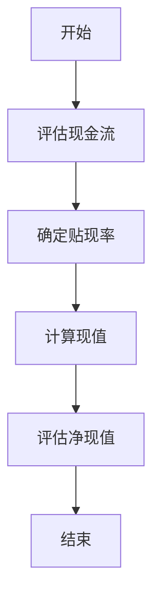
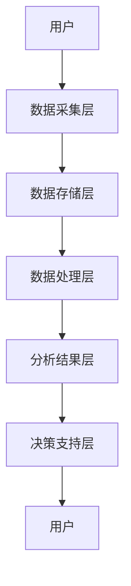

                 


# 巴菲特-芒格的智慧城市投资：城市化3.0的投资机会

## 关键词：巴菲特，芒格，智慧城市，城市化3.0，投资机会，价值投资，多元思维模型

## 摘要：本文探讨了巴菲特和芒格的投资理念如何应用于智慧城市的投资，特别是在城市化3.0阶段的机会。通过分析智慧城市的定义、投资价值、算法模型和系统架构，文章提供了详细的分析和实战案例，帮助投资者理解和应用这些理念。

---

# 正文

## 第一部分：背景介绍

### 第1章：城市化3.0的背景

#### 1.1 城市化3.0的定义与特征
城市化3.0是智慧城市的高级阶段，强调智能化、可持续性和高效性。它结合了物联网、大数据和人工智能技术，以优化城市资源利用和居民生活质量。

#### 1.2 巴菲特与芒格的投资理念
巴菲特的价值投资强调长期价值和安全边际，而芒格的多元思维模型则注重跨学科思考，寻找投资中的多维优势。

#### 1.3 智慧城市投资的现状与趋势
随着技术进步和城市化的需求，智慧城市投资成为热点，城市化3.0阶段的投资潜力巨大。

---

## 第二部分：核心概念与联系

### 第2章：智慧城市的组成部分

#### 2.1 智慧城市的技术基础
包括物联网、大数据、人工智能等技术，这些技术支撑智慧城市的运行和管理。

#### 2.2 智慧城市的基础设施
如智能交通、能源管理和环境监测系统，这些是智慧城市运作的基础。

#### 2.3 智慧城市的政策环境
政府政策和法规对智慧城市的建设和投资至关重要。

### 第3章：巴菲特与芒格理念的结合

#### 3.1 巴菲特视角下的智慧城市投资
关注长期价值，寻找具有持续增长潜力的智慧城市项目。

#### 3.2 芒格视角下的智慧城市投资
通过多元思维模型，评估智慧城市的多方面因素，寻找投资机会。

---

## 第三部分：算法原理与数学模型

### 第4章：智慧城市的评估模型

#### 4.1 现金流贴现模型（DCF）
用于评估智慧城市项目的未来现金流，计算其现值。

#### 4.2 算法流程图


#### 4.3 Python代码实现
```python
def discounted_cash_flow(cash_flows, discount_rate):
    return sum(cf / (1 + discount_rate)**i for i, cf in enumerate(cash_flows))

# 示例
cash_flows = [100, 200, 300]
discount_rate = 0.1
print(discounted_cash_flow(cash_flows, discount_rate))
```

### 第5章：数学模型详细分析

#### 5.1 现金流贴现模型公式
$$DCF = \sum_{t=1}^{n} \frac{CF_t}{(1 + r)^t}$$
其中，CF_t是第t年的现金流，r是贴现率。

#### 5.2 内部收益率公式
$$IRR = r \text{ 使得 } \sum_{t=1}^{n} \frac{CF_t}{(1 + r)^t} = 0$$

---

## 第四部分：系统架构与设计

### 第6章：智慧城市投资分析系统

#### 6.1 系统功能设计
包括数据采集、分析模块、决策支持等。

#### 6.2 系统架构图


#### 6.3 接口设计
REST API用于各模块之间的数据传输和交互。

#### 6.4 交互流程
用户输入投资参数，系统分析并输出结果。

---

## 第五部分：项目实战

### 第7章：智能交通系统的投资分析

#### 7.1 环境配置
安装Python、数据处理库等工具。

#### 7.2 核心代码实现
```python
import pandas as pd

def analyze_traffic_system(data):
    # 数据处理
    return pd.DataFrame(data)

# 示例数据
data = {'year': [2020, 2021, 2022], 'revenue': [100, 200, 300]}
df = analyze_traffic_system(data)
print(df)
```

#### 7.3 案例分析
分析智能交通系统的DCF模型，评估其投资价值。

---

## 第六部分：最佳实践与小结

### 第8章：投资小结

#### 8.1 投资策略总结
长期投资、价值投资，结合多元思维模型。

#### 8.2 投资注意事项
关注政策、技术发展和项目可行性。

#### 8.3 拓展阅读
推荐相关书籍和资源，深入学习投资理念。

---

## 总结

本文系统地分析了巴菲特和芒格的投资理念在智慧城市中的应用，通过详细的技术分析和实战案例，为投资者提供了有效的指导。未来，随着城市化3.0的发展，智慧城市的投资机会将更加丰富，值得深入研究和实践。

---

