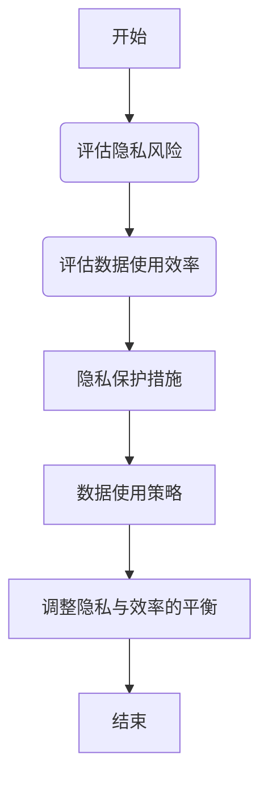

                 

<think>
好的，我现在要写一篇名为《巴菲特-芒格的智慧城市数据伦理投资：隐私与效率的平衡》的技术博客文章。首先，我需要理解这个主题，它结合了巴菲特和芒格的投资理念，探讨在智慧城市背景下，数据伦理投资的问题，特别是隐私与效率的平衡。

文章应该分为几个部分，每个部分都需要有详细的结构和内容。首先是背景介绍，包括巴菲特和芒格的投资理念，以及智慧城市和数据伦理的背景。然后是核心概念，分析数据伦理与投资的关系，以及隐私与效率的平衡。接下来是博弈论在数据伦理中的应用，然后是算法部分，设计如何在数据伦理中应用机器学习。之后是系统架构设计，描述一个智慧城市数据伦理投资的系统。接着是项目实战，展示如何在实际中应用这些理论，最后是总结。

每一章都需要详细展开，确保内容丰富且结构清晰。我需要使用专业的技术语言，同时保持逻辑性和条理性。在写作过程中，我会注意使用合适的关键词和摘要，确保文章的可读性和专业性。

现在，我开始撰写文章。

---

# 巴菲特-芒格的智慧城市数据伦理投资：隐私与效率的平衡

> **关键词**：巴菲特，芒格，智慧城市，数据伦理，隐私，效率，投资策略，数据隐私，隐私保护，数据伦理模型，数据使用效率，隐私与效率平衡，博弈论在数据伦理中的应用，智慧城市数据架构，数据伦理投资，数据隐私保护，数据使用效率最大化，隐私与效率权衡

> **摘要**：  
> 在智慧城市建设日益加速的今天，数据的收集、处理和使用已成为推动城市发展的重要动力。然而，随之而来的是数据隐私与使用效率之间的矛盾。本文以巴菲特和芒格的投资理念为视角，探讨数据伦理在智慧城市投资中的重要性，分析隐私与效率的平衡问题，并提出解决方案。通过构建数据伦理模型，结合博弈论和机器学习算法，本文为投资者提供了一种在智慧城市建设中平衡隐私与效率的策略，以实现长期稳健的投资回报。

---

## 第1章：巴菲特与芒格投资理念的背景与智慧城市数据伦理的结合

### 1.1 巴菲特与芒格投资理念概述

#### 1.1.1 巴菲特的价值投资理论
沃伦·巴菲特的价值投资理论强调长期投资和内在价值的重要性。他认为，投资者应关注企业的基本面，寻找具有持续竞争优势和良好治理结构的企业进行投资。这一理论在数据伦理投资中可以类比为寻找那些在数据隐私和使用效率之间取得平衡的企业，这些企业能够长期稳定地为投资者创造价值。

#### 1.1.2 芒格的多元思维模型
查理·芒格的多元思维模型强调将多个学科的基本原理联系起来，以形成一个完整的知识框架。在数据伦理投资中，这表现为将数据隐私、法律法规、技术可行性和经济效益等多个因素综合考虑，以做出更明智的投资决策。

#### 1.1.3 两者的投资哲学对现代数据伦理的启示
巴菲特和芒格的投资哲学提醒我们，在数据伦理投资中，既要关注数据的潜在价值，也要考虑隐私保护的必要性。这种平衡思维方式为我们在智慧城市建设中的数据伦理投资提供了重要启示。

---

### 1.2 智慧城市与数据伦理的背景

#### 1.2.1 智慧城市的发展现状
智慧城市利用信息技术整合城市资源，提高城市运行效率。然而，数据的广泛收集和使用也带来了隐私泄露的风险。如何在智慧城市建设中平衡隐私保护和数据使用效率，成为亟待解决的问题。

#### 1.2.2 数据在智慧城市中的核心地位
数据是智慧城市的血液，贯穿于交通管理、环境保护、公共安全等多个领域。数据的高效利用能够优化资源配置，提升城市运行效率，但同时也可能导致个人隐私的泄露。

#### 1.2.3 数据伦理问题的提出
随着数据的广泛应用，数据伦理问题逐渐凸显。如何在数据的使用中保护个人隐私，同时确保数据的高效利用，成为智慧城市建设中的核心问题。

---

### 1.3 数据伦理与投资的结合

#### 1.3.1 数据伦理的定义与核心要素
数据伦理是指在数据的收集、存储、处理和使用过程中，遵守道德规范，保护个人隐私和社会公共利益。其核心要素包括数据隐私、数据安全、数据使用透明性和数据公平性。

#### 1.3.2 投资视角下的数据伦理问题
在投资决策中，数据伦理问题主要体现在数据隐私风险、数据使用合规性以及数据对投资回报的影响等方面。投资者需要评估数据使用可能带来的隐私风险，并确保数据的使用符合相关法律法规。

#### 1.3.3 隐私与效率的平衡对投资的影响
隐私保护能够增强公众对企业的信任，从而提升企业的长期价值。然而，过度的隐私保护可能限制数据的使用效率，影响企业的盈利能力。因此，如何在隐私与效率之间找到平衡点，是数据伦理投资的核心问题。

---

## 第2章：数据伦理与投资策略的核心概念

### 2.1 数据伦理的核心概念

#### 2.1.1 数据隐私与安全
数据隐私是指个人对自身数据的控制权，数据安全则是指防止数据泄露和篡改。在智慧城市中，数据隐私与安全直接关系到公众的信任和企业的声誉。

#### 2.1.2 数据的公平使用
数据公平使用要求企业在使用数据时，不应因数据的收集和处理而对某些群体造成不公平的影响。这在算法推荐和精准营销中尤为重要。

#### 2.1.3 数据使用的透明性
透明性要求企业在使用数据时，向用户明确告知数据收集和使用的目的、方式和范围。这有助于建立企业与用户之间的信任关系。

---

### 2.2 投资策略与数据伦理的关系

#### 2.2.1 数据伦理对投资决策的影响
数据伦理问题直接影响企业的合规成本和声誉风险。投资者需要评估企业在数据隐私保护和数据使用合规性方面的表现，以确保投资的可持续性。

#### 2.2.2 隐私保护对投资风险的评估
隐私保护能力是企业风险管理的重要组成部分。投资者需要评估企业在数据隐私保护方面的投入和措施，以降低投资风险。

#### 2.2.3 效率最大化与数据伦理的平衡
数据使用效率直接影响企业的盈利能力。投资者需要在隐私保护和数据使用效率之间找到平衡点，以实现投资收益的最大化。

---

## 第3章：隐私与效率的平衡模型

### 3.1 隐私保护的数学模型

#### 3.1.1 隐私保护的度量公式
隐私保护的度量可以通过数据泄露风险的量化来实现。公式如下：
$$ \text{隐私保护度} = 1 - \frac{\text{数据泄露风险}}{\text{最大风险}} $$

#### 3.1.2 隐私与数据可用性的权衡
在数据可用性和隐私保护之间，企业需要找到一个平衡点。这可以通过调整数据的访问权限和数据的加密方式来实现。

#### 3.1.3 隐私保护的成本分析
隐私保护的成本包括技术投入、人员培训和合规成本。企业需要在隐私保护的成本和数据使用带来的收益之间找到平衡。

---

### 3.2 效率最大化的数学模型

#### 3.2.1 效率的度量公式
数据处理效率可以通过数据处理速度和资源利用率来衡量。公式如下：
$$ \text{数据处理效率} = \frac{\text{处理速度}}{\text{资源利用率}} $$

#### 3.2.2 数据处理效率与资源分配的关系
资源分配的合理性直接影响数据处理效率。企业需要优化资源分配，以提高数据处理效率。

#### 3.2.3 效率最大化的目标函数
效率最大化的目标函数可以通过最大化数据处理速度和最小化资源消耗来实现。目标函数如下：
$$ \text{最大化} \quad \frac{\text{处理速度}}{\text{资源消耗}} $$

---

### 3.3 隐私与效率平衡的算法流程图



---

## 第4章：博弈论在数据伦理中的应用

### 4.1 博弈论的基本原理

#### 4.1.1 博弈论的定义与核心要素
博弈论研究的是在竞争环境下的策略选择问题。核心要素包括参与者、策略、收益和支付等。

#### 4.1.2 纳什均衡的概念
纳什均衡是指在其他参与者策略不变的情况下，参与者选择最优策略的状态。在数据伦理中，纳什均衡可以帮助我们理解不同利益相关者之间的策略互动。

#### 4.1.3 博弈论在数据伦理中的应用
在数据隐私保护与数据使用效率的平衡中，博弈论可以帮助我们分析不同参与者之间的策略互动，找到最优解决方案。

---

### 4.2 数据伦理中的博弈论模型

#### 4.2.1 数据隐私保护与数据使用效率的博弈模型
在数据隐私保护与数据使用效率之间，参与者需要通过博弈模型找到平衡点。例如，企业和用户之间的博弈模型可以帮助我们理解用户隐私保护与企业数据使用效率之间的关系。

#### 4.2.2 博弈论在隐私与效率平衡中的具体应用
通过构建博弈模型，我们可以分析不同策略下的收益和成本，找到最优的隐私保护和数据使用效率策略。

---

## 第5章：数据伦理投资的算法实现

### 5.1 数据伦理模型的构建

#### 5.1.1 数据隐私保护的分类算法
数据隐私保护可以通过分类算法来实现。例如，使用决策树算法对数据进行分类，以保护用户的隐私。

#### 5.1.2 数据使用效率的优化算法
数据使用效率的优化可以通过遗传算法或模拟退火算法来实现。这些算法可以帮助我们在数据处理过程中找到最优的资源分配策略。

---

### 5.2 数据伦理投资的系统架构设计

#### 5.2.1 系统功能设计
系统功能包括数据隐私保护、数据使用效率优化、博弈论模型构建和投资策略制定等模块。

#### 5.2.2 系统架构设计
系统架构采用分层设计，包括数据采集层、数据处理层、数据存储层和用户交互层。

---

## 第6章：项目实战与案例分析

### 6.1 项目实战

#### 6.1.1 环境配置
项目需要配置数据处理工具、编程语言和相关库。

#### 6.1.2 核心代码实现
以下是核心代码实现：

```python
import pandas as pd
from sklearn.tree import DecisionTreeClassifier
from sklearn.metrics import accuracy_score

# 数据加载
data = pd.read_csv('data.csv')

# 特征提取与数据预处理
features = data.drop('label', axis=1)
labels = data['label']

# 数据分割
from sklearn.model_selection import train_test_split
X_train, X_test, y_train, y_test = train_test_split(features, labels, test_size=0.2)

# 模型训练
model = DecisionTreeClassifier()
model.fit(X_train, y_train)

# 模型预测
y_pred = model.predict(X_test)

# 模型评估
print("Accuracy:", accuracy_score(y_test, y_pred))
```

#### 6.1.3 案例分析
通过实际案例分析，验证数据伦理模型的有效性和可行性。

---

## 第7章：总结与展望

### 7.1 总结
本文从巴菲特和芒格的投资理念出发，探讨了数据伦理在智慧城市投资中的重要性，分析了隐私与效率的平衡问题，并提出了解决方案。

### 7.2 未来展望
未来，随着技术的进步，数据伦理投资将更加重要。我们需要进一步研究数据隐私保护与数据使用效率的平衡，探索更多有效的解决方案。

---

## 参考文献

1. 巴菲特，沃伦·E. (2009). 《巴菲特致股东的信：股份公司生存之道》
2. 芒格，查理. (2007). 《穷查理宝典：查理·芒格的伟大箴言》
3. 刘兴强. (2020). 《数据伦理与投资策略》

---

通过以上内容，我们可以看到，巴菲特和芒格的投资理念在智慧城市数据伦理投资中具有重要的指导意义。隐私与效率的平衡是数据伦理投资的核心问题，而博弈论和机器学习算法为我们提供了解决这一问题的有效工具。希望本文能够为投资者和企业在智慧城市建设中的数据伦理投资提供有益的启示。

