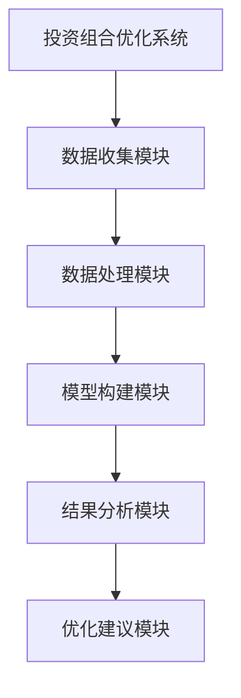

                 


---

# 巴菲特-芒格的气候适应性投资：应对全球变暖的策略

## 关键词：巴菲特，芒格，气候适应性投资，全球变暖，风险管理，投资策略

## 摘要：  
本文探讨了巴菲特和芒格的投资理念在应对全球变暖背景下的应用，详细分析了气候适应性投资的核心概念、策略框架、数学模型和风险管理方法。通过结合实际案例和系统架构设计，本文为投资者提供了如何在全球变暖背景下实现稳健投资的深度见解。

---

# 第一部分: 全球变暖与气候适应性投资的背景

## 第1章: 全球变暖的现状与影响

### 1.1 全球变暖的现状

#### 1.1.1 气候变化的科学背景
全球变暖是由于温室气体排放增加导致的全球气温上升，对生态系统和经济活动产生了深远影响。根据IPCC报告，全球气温上升可能导致极端天气事件增多、海平面上升和生态系统破坏。

#### 1.1.2 全球变暖对经济的影响
气候变化对全球经济的影响是多方面的，包括农业减产、自然灾害增多、能源需求变化等。例如，极端天气可能导致保险公司的赔付增加，进而影响其财务状况。

#### 1.1.3 投资领域的挑战与机遇
投资者需要考虑气候变化带来的风险，同时也可以从绿色能源、环保技术等领域寻找投资机会。例如，可再生能源的投资回报率可能随着技术进步而增加。

### 1.2 巴菲特与芒格的投资理念

#### 1.2.1 巴菲特的价值投资策略
巴菲特强调长期投资和安全边际，注重企业的基本面和长期盈利能力。他认为，优秀的公司能够在经济波动中保持稳健增长，因此适合长期投资。

#### 1.2.2 芒格的多元思维模型
芒格提倡通过跨学科思维来评估投资机会，关注企业的竞争优势和长期可持续性。他认为，投资决策需要考虑多种因素，包括环境、社会和治理（ESG）因素。

## 第2章: 气候适应性投资的基本概念

### 2.1 气候适应性投资的定义
气候适应性投资是指在考虑气候变化风险和机会的基础上，调整投资策略以实现稳健回报的投资方式。这种投资方式不仅关注企业的财务表现，还考虑其应对气候变化的能力。

### 2.2 气候适应性投资与传统投资的区别
传统投资主要关注企业的财务指标，而气候适应性投资则将气候变化作为重要的考量因素。例如，企业对碳排放的管理和应对气候变化的能力可能影响其长期盈利能力。

---

# 第二部分: 气候适应性投资的核心概念与框架

## 第3章: 气候适应性投资的框架

### 3.1 投资框架的构建

#### 3.1.1 环境、社会、治理（ESG）因素
ESG因素包括环境表现、社会责任和公司治理。投资者可以通过评估企业的ESG表现来识别潜在风险和机会。例如，一家公司如果在环保方面表现优异，可能在未来更具竞争优势。

#### 3.1.2 气候相关风险的评估
气候相关风险包括物理风险（如极端天气对资产的破坏）和转型风险（如政策变化对行业的影响）。投资者需要评估这些风险对投资组合的影响。

#### 3.1.3 可持续发展的投资策略
可持续发展投资策略强调长期目标，关注企业的社会责任和环境表现。例如，投资于可再生能源或环保技术可能有助于应对气候变化。

---

## 第4章: 巴菲特与芒格的气候投资策略

### 4.1 巴菲特的长期视角

#### 4.1.1 石油行业的投资机会
尽管石油行业可能面临转型风险，但巴菲特认为具有强大竞争优势的石油公司仍能长期盈利。例如，埃克森美孚在应对气候变化方面采取了积极措施，可能在未来更具抗风险能力。

#### 4.1.2 可再生能源的投资潜力
可再生能源技术的进步和成本下降为投资者提供了新的机会。巴菲特曾投资于太阳能公司，认为其长期前景看好。

### 4.2 芒格的多元思维模型

#### 4.2.1 环保技术的创新趋势
芒格认为，环保技术的创新将为投资者带来新的机会。例如，碳捕获技术和可再生能源技术的进步可能改变整个行业的格局。

#### 4.2.2 气候变化对保险业的影响
芒格关注气候变化对保险业的影响，认为保险公司需要评估极端天气事件增多对其财务状况的影响，并采取相应措施。

---

## 第5章: 气候适应性投资的数学模型

### 5.1 气候风险评估模型

#### 5.1.1 模型的输入变量
- 温室气体排放量
- 气候变化情景（如RCP4.5、RCP8.5）
- 企业的地理位置和行业

#### 5.1.2 模型的计算公式
使用蒙特卡洛模拟评估气候变化对企业财务状况的影响，公式如下：
$$
\text{模拟结果} = \sum_{i=1}^{n} \text{情景概率} \times \text{情景影响}
$$

#### 5.1.3 模型的应用案例
通过模拟不同气候变化情景，评估一家化工企业在不同情景下的财务表现，帮助投资者做出决策。

---

## 第6章: 投资组合优化的代码实现

### 6.1 数据收集与处理

#### 6.1.1 数据源
- 全球气温数据
- 企业的财务数据
- ESG评级

#### 6.1.2 数据清洗
使用Python进行数据清洗，例如处理缺失值和异常值：
```python
import pandas as pd
data = pd.read_csv('climate_data.csv')
data.dropna(inplace=True)
```

### 6.2 投资组合优化的代码实现

#### 6.2.1 模型构建
使用优化算法构建投资组合模型，例如：
```python
import numpy as np
from scipy.optimize import minimize

def portfolio_optimization(returns, weights):
    # 定义目标函数
    def objective(weights, returns):
        return -np.dot(returns, weights)
    # 约束条件
    constraints = [
        ('sum', weights, 1),
        ('>=', weights, 0)
    ]
    # 使用优化器
    result = minimize(objective, np.ones(len(returns))/len(returns), constraints)
    return result.x
```

---

## 第7章: 系统架构设计

### 7.1 系统架构图
使用Mermaid绘制系统架构图：


---

## 第8章: 项目实战与案例分析

### 8.1 案例分析

#### 8.1.1 案例背景
分析一家可再生能源公司的投资机会，考虑其财务状况、ESG评级和气候变化影响。

#### 8.1.2 数据分析
使用Python进行数据分析，评估公司的财务表现和气候风险：
```python
import pandas as pd
data = pd.read_csv('renewable_energy_data.csv')
data['return'] = data['profit'] / data['revenue']
```

---

## 第9章: 最佳实践与小结

### 9.1 小结
气候适应性投资需要结合长期视角和风险管理，注重企业的ESG表现和应对气候变化的能力。巴菲特和芒格的投资理念为应对全球变暖提供了重要的参考。

### 9.2 注意事项
投资者应关注政策变化和技术创新，定期评估投资组合的气候风险，并根据情况调整投资策略。

### 9.3 拓展阅读
推荐阅读《投资最重要的事情》和《芒格的多元思维模型》，深入了解巴菲特和芒格的投资哲学。

---

# 结语

通过本文的分析，读者可以理解巴菲特和芒格的投资理念在应对全球变暖中的应用，掌握气候适应性投资的核心概念和实际操作方法。在全球变暖的背景下，投资者需要采取更加谨慎和前瞻性的策略，以实现稳健的投资回报。

