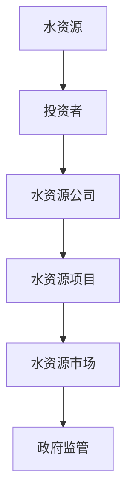
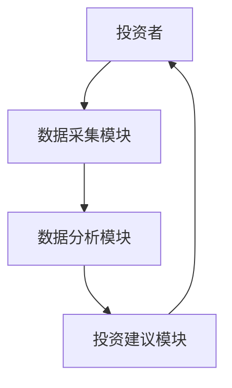

                 


# 巴菲特-芒格的水资源投资：稀缺资源的战略价值

## 关键词：巴菲特, 芒格, 水资源投资, 稀缺资源, 战略价值, 投资策略, 价值投资

## 摘要：本文深入探讨巴菲特和芒格在水资源投资中的策略和理念，分析水资源作为稀缺资源的战略价值，结合技术与经济视角，解析其投资成功的关键因素，并提供实际案例和系统化的投资分析框架。

---

# 正文

## 第一部分：水资源投资的背景与核心理念

### 第1章：水资源的经济价值与投资机会

#### 1.1 水资源的全球现状与经济价值

水资源是生命之源，支撑着全球经济和社会的运转。随着全球人口增长、气候变化和工业化进程加快，水资源的稀缺性日益凸显。以下是水资源的全球现状与经济价值的详细分析：

- **水资源的稀缺性与分布不均**：全球水资源分布极不均衡，部分地区面临严重短缺，而其他地区则相对过剩。这种不均衡导致水资源成为一种具有高度战略价值的稀缺资源。
- **水资源的经济价值与社会影响**：水资源不仅是农业、工业和生活的基本需求，还具有重要的生态价值。在经济层面，水资源的供应直接影响到地区的经济发展和企业的生产成本。
- **水资源投资的潜在回报与风险**：由于水资源的稀缺性和不可替代性，投资水资源相关企业或项目通常具有较高的回报潜力，但也伴随着较高的风险，尤其是政策风险和环境风险。

#### 1.2 巴菲特与芒格的投资理念

巴菲特和芒格的投资哲学是价值投资的典范，强调长期价值、安全边际和基本面分析。以下是他们的核心理念：

- **巴菲特的价值投资理念**：
  - **长期价值**：巴菲特关注企业的长期价值，而非短期市场波动。
  - **安全边际**：他强调以低于内在价值的价格买入优质资产。
  - **管理层能力**：巴菲特派特别关注企业管理层的能力和诚信。
- **芒格的多元思维模型**：
  - **跨学科思维**：芒格提倡将多个领域的知识结合起来，形成全面的分析框架。
  - **逆向思维**：他建议从反方向思考问题，寻找别人忽视的投资机会。
  - **避免情绪化决策**：芒格强调理性决策，避免被市场情绪左右。

#### 1.3 巴菲特与芒格在水资源投资中的成功案例

巴菲特和芒格在水资源投资中有着丰富的成功经验。以下是几个经典案例：

- **可口可乐的投资**：巴菲特长期持有可口可乐的股票，部分原因在于其强大的品牌和全球广泛的分销网络，这些都离不开水资源的支持。
- **富国银行的投资**：富国银行通过有效的水资源管理，降低了运营成本，提高了利润率，吸引了巴菲特的关注。
- **其他案例**：如通用磨坊、卡夫食品等，这些企业在水资源管理上的成功也间接推动了巴菲特的投资决策。

### 第2章：水资源投资的核心概念与分析框架

#### 2.1 水资源投资的核心概念

水资源投资的核心概念包括其稀缺性、经济价值和战略意义。以下是详细分析：

- **稀缺性与定价机制**：水资源的稀缺性导致其价格波动大，投资回报率高。
- **经济属性与社会属性**：水资源不仅是经济活动的生产要素，还具有重要的社会价值。
- **长期性与周期性**：水资源投资具有较长的周期性，需要考虑长期的市场变化和政策影响。

#### 2.2 核心概念的属性对比

以下是水资源投资与其他投资形式的对比分析：

| 投资类型 | 稀缺性 | 经济价值 | 风险 | 回报周期 |
|----------|--------|----------|------|-----------|
| 水资源   | 高     | 高       | 高   | 长        |
| 房地产   | 中     | 高       | 高   | 中         |
| 股票     | 低     | 中       | 中   | 短         |

#### 2.3 水资源投资的ER实体关系图

以下是水资源投资的ER实体关系图：



---

## 第二部分：水资源投资的算法原理与数学模型

### 第3章：水资源投资的算法原理

#### 3.1 投资决策的逻辑框架

水资源投资的决策过程可以分为以下几个步骤：

1. **市场分析**：分析水资源市场的供需情况，确定投资方向。
2. **公司基本面分析**：评估目标公司的财务状况、管理层能力和竞争优势。
3. **估值与定价**：使用DCF模型等方法对目标公司进行估值，确定其内在价值。
4. **风险评估**：识别潜在风险，如政策风险、环境风险和市场波动风险。
5. **投资组合优化**：根据风险承受能力和收益目标，构建最优投资组合。

#### 3.2 投资模型的数学公式

以下是DCF模型的详细公式：

$$DCF = \sum_{t=1}^{n} \frac{CF_t}{(1 + r)^t} + \frac{TV}{(1 + r)^n}$$

其中：
- \(CF_t\) 是第t年的现金流
- \(r\) 是折现率
- \(TV\) 是终值
- \(n\) 是项目的寿命

### 第4章：系统分析与架构设计

#### 4.1 投资决策支持系统的功能设计

以下是投资决策支持系统的功能设计：

- **数据采集**：收集市场数据、公司财务数据等。
- **数据分析**：使用机器学习算法进行预测和分析。
- **投资建议**：基于分析结果，提供投资建议。

#### 4.2 系统架构设计

以下是系统架构设计：



---

## 第三部分：项目实战与最佳实践

### 第5章：项目实战

#### 5.1 案例分析

以某水务公司为例，以下是分析步骤：

1. **数据收集**：收集该公司的财务数据、市场数据等。
2. **模型构建**：使用DCF模型进行估值。
3. **投资决策**：根据估值结果，决定是否投资。

#### 5.2 代码实现

以下是DCF模型的Python代码：

```python
import numpy as np

def dcf_model(cash_flows, discount_rate, terminal_value):
    n = len(cash_flows)
    dcf = 0
    for t in range(n):
        dcf += cash_flows[t] / (1 + discount_rate)**t
    dcf += terminal_value / (1 + discount_rate)**n
    return dcf

# 示例数据
cash_flows = [100, 150, 200]
discount_rate = 0.1
terminal_value = 500

# 计算DCF
DCF = dcf_model(cash_flows, discount_rate, terminal_value)
print("DCF Value:", DCF)
```

### 第6章：最佳实践

#### 6.1 小结

水资源投资具有高度的战略价值，投资者需要结合巴菲特和芒格的投资理念，进行深入的市场分析和基本面分析。

#### 6.2 注意事项

- **风险控制**：高度重视政策风险和环境风险。
- **长期视角**：关注企业的长期价值，避免短期波动。
- **多元化投资**：构建多元化的投资组合，降低风险。

#### 6.3 拓展阅读

- 《巴菲特选股法则》
- 《芒格的投资思维》
- 《水资源经济学》

---

## 结语

水资源作为稀缺资源，具有重要的战略价值。巴菲特和芒格的投资理念为我们提供了宝贵的指导，但在实际投资中，仍需结合具体情况进行深入分析。通过系统的分析框架和数学模型，我们可以更好地把握水资源投资的机会和风险，实现长期稳定的收益。

