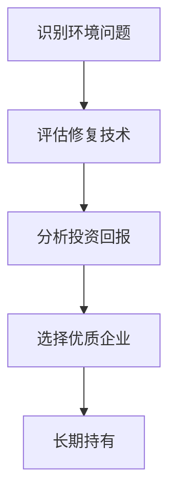
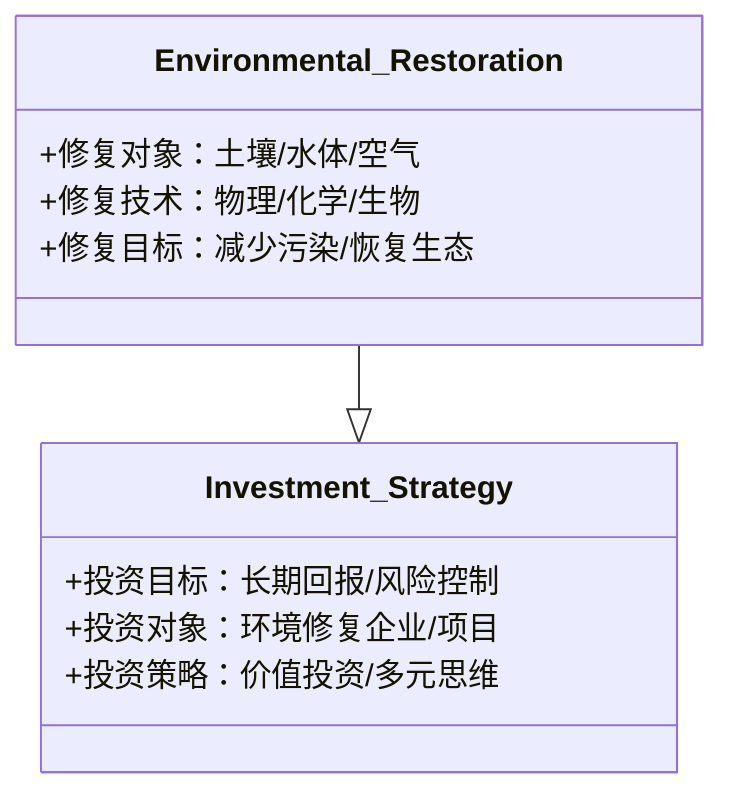
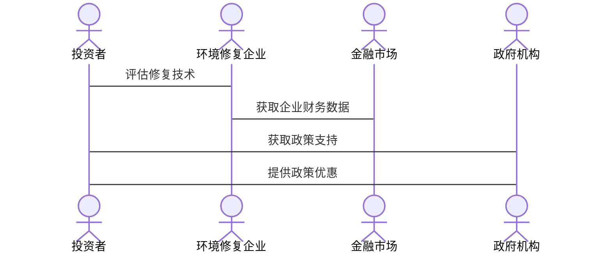

                 


# 巴菲特-芒格的环境修复技术投资：应对气候危机

## 关键词：巴菲特，芒格，环境修复技术，气候危机，投资策略，可持续发展

## 摘要：  
巴菲特和芒格以其卓越的投资理念闻名，但在应对气候危机的背景下，他们的投资策略如何与环境修复技术相结合？本文从环境修复技术的背景与意义入手，分析巴菲特和芒格的投资理念，探讨环境修复技术在应对气候危机中的作用，并结合实际案例，详细阐述环境修复技术投资的决策流程、系统架构和最佳实践。

---

## 第一部分: 环境修复技术投资的背景与意义

### 第1章: 环境修复技术的背景与意义

#### 1.1 环境修复技术的背景
##### 1.1.1 环境问题的现状与挑战
当前，全球面临严重的环境问题，如气候变化、水资源污染、土壤退化等。这些问题不仅威胁生态系统的稳定性，还对人类的生存和发展构成了重大挑战。环境修复技术作为一种解决方案，旨在通过科技手段修复被破坏的环境，恢复生态平衡。

##### 1.1.2 环境修复技术的定义与分类
环境修复技术是指通过工程技术、生物技术或其他手段，对受污染或退化的环境进行修复和重建的技术。常见的环境修复技术包括：
- **物理修复**：通过机械方法清除污染物。
- **化学修复**：利用化学反应分解或转化污染物。
- **生物修复**：利用微生物或其他生物体分解污染物。
- **植物修复**：通过植物吸收或分解污染物。

##### 1.1.3 环境修复技术投资的重要性
环境修复技术的投资不仅有助于解决环境问题，还能带来经济效益。例如，修复被污染的土地可以提高其商业价值，修复水体可以改善水资源利用效率，修复森林可以增强碳汇能力。

#### 1.2 巴菲特与芒格的投资理念
##### 1.2.1 巴菲特的价值投资原则
巴菲特的价值投资理念强调长期持有优质资产，注重企业的基本面和长期盈利能力。他认为，投资的核心是找到具有持续竞争优势的企业，并在市场低估时买入。

##### 1.2.2 芒格的多元思维模型
芒格提倡多元思维模型，认为投资者应该从多个角度（如物理学、生物学、心理学等）分析问题，避免单一维度的决策错误。这种思维方式可以帮助投资者更好地识别环境修复技术的潜在价值。

##### 1.2.3 两人投资理念的结合
巴菲特和芒格的投资理念结合了长期价值和多元思维，这为环境修复技术投资提供了独特的视角。他们不仅关注技术的短期效益，还考虑其长期的环境和社会价值。

#### 1.3 环境修复技术与气候危机的关联
##### 1.3.1 气候变化对全球经济的影响
气候变化导致极端天气事件增多，农业生产不稳定，海平面上升等问题，对全球经济造成了深远的影响。环境修复技术可以减缓气候变化的影响，例如通过碳汇技术吸收二氧化碳。

##### 1.3.2 环境修复技术在应对气候危机中的作用
环境修复技术可以通过减少污染物排放、提高资源利用效率等方式，减缓气候变化的速度。例如，土壤修复技术可以提高土地的碳汇能力，减少温室气体的排放。

##### 1.3.3 巴菲特-芒格投资理念与环境修复技术的契合点
巴菲特和芒格的投资理念与环境修复技术的长期性和系统性特点高度契合。他们注重长期价值和多元思维，这与环境修复技术的投资周期长、涉及领域广的特点相匹配。

---

## 第二部分: 环境修复技术的核心概念与联系

### 第2章: 环境修复技术的核心原理

#### 2.1 环境修复技术的核心原理
##### 2.1.1 环境修复技术的分类与特点
环境修复技术可以根据修复对象（如土壤、水体、空气）和修复方法（物理、化学、生物）进行分类。每种技术都有其独特的优势和局限性，例如：
- **物理修复**：操作简单，但可能破坏环境结构。
- **化学修复**：见效快，但可能产生二次污染。
- **生物修复**：环保性强，但修复速度较慢。

##### 2.1.2 各类环境修复技术的优缺点对比
| 技术类型 | 优点 | 缺点 |
|----------|------|------|
| 物理修复 | 操作简单，成本低 | 可能破坏环境结构 |
| 化学修复 | 修复速度快 | 可能产生二次污染 |
| 生物修复 | 环保性强 | 修复速度较慢 |

##### 2.1.3 环境修复技术的数学模型与公式
环境修复技术的数学模型可以用于预测修复效果和投资回报。例如，土壤修复的碳汇能力可以通过以下公式计算：
$$ \text{碳汇能力} = k \times \text{修复面积} \times \text{修复深度} $$
其中，$k$ 是修复效率系数。

#### 2.2 巴菲特-芒格投资策略与环境修复技术的结合
##### 2.2.1 巴菲特的长期价值投资策略
巴菲特的长期价值投资策略强调选择那些具有持续竞争优势和良好管理的企业。在环境修复技术投资中，这可以转化为选择那些技术领先、市场前景广阔的企业。

##### 2.2.2 芒格的多元思维模型在环境修复技术投资中的应用
芒格的多元思维模型可以帮助投资者从多个角度分析环境修复技术的潜力。例如，从物理学的角度分析修复技术的可行性，从经济学的角度分析投资回报的可能性。

##### 2.2.3 环境修复技术投资的决策流程图


#### 2.3 环境修复技术与气候危机的实体关系图
```mermaid
erDiagram
    Climate_Crisis --|> Environmental_Issues
    Environmental_Issues --|> Restoration_Technologies
    Restoration_Technologies --|> Investment_Opportunities
    Investment_Opportunities --|> Buffett_Munger_Strategy
    Buffett_Munger_Strategy --|> Sustainable_Development
```

---

## 第三部分: 环境修复技术投资的系统分析与架构设计

### 第3章: 系统分析与架构设计方案

#### 3.1 问题场景介绍
在应对气候危机的背景下，环境修复技术投资需要考虑的技术、经济和社会因素复杂多样。例如，选择哪种修复技术、如何评估投资风险、如何管理投资组合等。

#### 3.2 项目介绍
以土壤修复项目为例，假设我们选择一家专注于生物修复技术的企业进行投资。我们需要分析该企业的技术优势、市场前景和财务状况。

#### 3.3 系统功能设计
##### 3.3.1 领域模型


##### 3.3.2 系统架构设计


##### 3.3.3 系统接口设计
环境修复技术投资系统需要与多个外部系统接口，例如：
- 环境数据系统：获取实时环境数据。
- 金融市场系统：获取企业财务数据和市场信息。
- 政策支持系统：获取政府政策支持。

##### 3.3.4 系统交互设计


---

## 第四部分: 项目实战与投资策略

### 第4章: 项目实战

#### 4.1 环境修复技术投资的环境影响评估
以某土壤修复项目为例，评估其对环境的影响：
- **正面影响**：减少土壤污染，提高土地利用率。
- **负面影响**：修复过程可能产生二次污染。

#### 4.2 投资回报分析
通过数学模型计算投资回报：
$$ \text{投资回报} = \text{修复面积} \times \text{修复成本} \times \text{修复效率} $$
假设修复面积为100公顷，修复成本为100元/平方米，修复效率为0.9，则投资回报为：
$$ 100 \times 100 \times 0.9 = 9000 \text{元} $$

#### 4.3 投资组合管理
为了分散风险，投资者可以将资金分散投资于多个环境修复项目。例如：
- 40% 投资于土壤修复项目。
- 30% 投资于水体修复项目。
- 30% 投资于空气修复项目。

#### 4.4 投资策略调整
根据市场变化和环境状况，定期调整投资组合。例如，如果土壤修复技术的市场前景不佳，可以减少对该领域的投资，增加对空气修复技术的投资。

---

## 第五部分: 最佳实践与总结

### 第5章: 最佳实践

#### 5.1 投资策略 tips
- 选择具有长期竞争优势的环境修复技术企业。
- 多元化投资，分散风险。
- 关注政府政策和市场动态。

#### 5.2 小结
巴菲特和芒格的投资理念与环境修复技术投资高度契合。通过长期价值投资和多元思维模型，投资者可以更好地把握环境修复技术的投资机会，为应对气候危机贡献力量。

#### 5.3 注意事项
- 环境修复技术的投资周期长，需耐心等待回报。
- 修复技术的选择需结合具体环境问题，避免一刀切。
- 注重风险管理，避免过度集中投资。

#### 5.4 拓展阅读
- 《巴菲特传》：了解巴菲特的投资理念。
- 《芒格传》：学习芒格的多元思维模型。
- 《环境修复技术手册》：深入了解环境修复技术的原理和应用。

---

## 总结
巴菲特和芒格的投资理念为环境修复技术投资提供了独特的视角。通过长期价值投资和多元思维模型，投资者可以在应对气候危机的同时实现经济效益。环境修复技术的投资不仅有助于解决环境问题，还能为投资者带来可观的回报。未来，随着技术的进步和政策的支持，环境修复技术投资将发挥更大的作用。

--- 

# END

