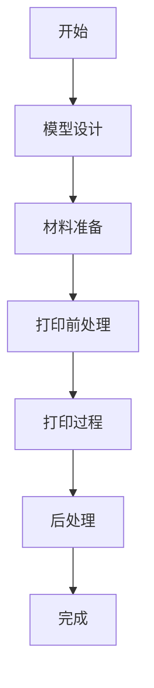
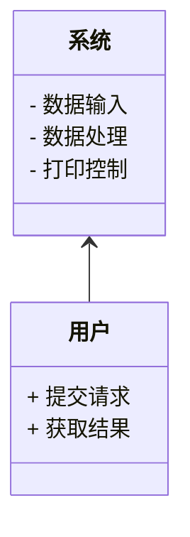

                 


# 巴菲特-芒格的生物3D打印器官投资：个性化医疗的新高度

## 关键词：巴菲特, 芒格, 生物3D打印, 器官投资, 个性化医疗

## 摘要：  
生物3D打印技术在医疗领域的应用正逐渐改变传统的器官移植方式，而巴菲特和芒格的投资策略为这一技术的商业化进程提供了重要支持。本文将详细分析生物3D打印的核心技术、算法原理、系统架构，并结合实际案例探讨其在个性化医疗中的应用前景，同时提供最佳实践和投资建议。

---

# 第一部分: 生物3D打印器官投资的背景与现状

## 第1章: 生物3D打印器官投资的背景与现状

### 1.1 生物3D打印的背景介绍

#### 1.1.1 生物3D打印的起源与发展  
生物3D打印技术起源于21世纪初，最初主要用于制造简单的生物结构。随着技术的进步，它逐渐扩展到复杂器官的打印，如皮肤、骨骼和器官。  

#### 1.1.2 巴菲特与芒格的投资理念  
巴菲特和芒格以长期价值投资闻名，他们关注那些能够改变行业的技术。生物3D打印的潜力吸引了他们的目光，尤其是在医疗领域。  

#### 1.1.3 生物3D打印与个性化医疗的结合  
个性化医疗需要定制化的器官，而生物3D打印能够实现这一点。这种技术与医疗需求的高度契合，使得巴菲特和芒格的投资具有战略意义。  

### 1.2 问题背景与描述  

#### 1.2.1 传统医疗技术的局限性  
传统器官移植面临供体不足、排异反应等问题，且成本高昂。  

#### 1.2.2 现有器官移植的挑战  
器官捐献率低，移植手术风险大，术后恢复时间长。  

#### 1.2.3 生物3D打印的潜在解决方案  
生物3D打印能够快速制造个性化器官，解决供体不足的问题，同时降低排异反应的风险。  

### 1.3 问题解决与边界  

#### 1.3.1 生物3D打印技术的核心优势  
- 快速制造  
- 个性化定制  
- 降低排异反应  

#### 1.3.2 技术的边界与局限性  
- 成本较高  
- 技术成熟度不足  
- 法律与伦理问题  

#### 1.3.3 投资领域的边界分析  
- 高技术门槛  
- 市场需求潜力大  
- 政策法规影响  

### 1.4 概念结构与核心要素  

#### 1.4.1 生物3D打印的基本概念  
生物3D打印是通过逐层沉积生物材料，构建三维结构的技术。  

#### 1.4.2 核心要素的组成与关系  
- 生物材料：如细胞、聚合物  
- 打印设备：高精度3D打印机  
- 加工算法：优化打印路径  

#### 1.4.3 技术与投资的结合模式  
- 投资驱动技术研发  
- 技术推动市场应用  

---

## 第2章: 生物3D打印的核心技术与原理  

### 2.1 核心技术原理  

#### 2.1.1 3D打印技术的基本原理  
通过逐层制造，将数字模型转化为实物。  

#### 2.1.2 生物材料的选择与应用  
选择适合的生物材料，如PLA、PCL等。  

#### 2.1.3 细胞培养与组织构建  
将细胞与材料结合，形成组织结构。  

### 2.2 核心概念对比表  

| 技术类型 | 优点 | 缺点 |
|----------|------|------|
| FDM      | 成本低 | 精度低 |
| SLA       | 精度高 | 成本高 |

### 2.3 技术流程图  



---

## 第3章: 生物3D打印的算法与数学模型  

### 3.1 算法原理  

#### 3.1.1 分层制造算法  
通过逐层切割模型，生成打印路径。  

#### 3.1.2 材料挤出控制算法  
控制挤出机运动，实现材料均匀沉积。  

#### 3.1.3 打印路径优化算法  
优化路径以减少材料浪费。  

### 3.2 数学模型  

#### 3.2.1 几何建模  
$$V(x, y, z) = \text{模型体积}$$  

#### 3.2.2 优化算法  
$$f(x) = \min_{x} \sum (x_i - x_j)^2$$  

---

## 第4章: 系统分析与架构设计  

### 4.1 系统功能设计  



### 4.2 系统架构设计  


---

## 第5章: 项目实战  

### 5.1 环境安装  

```bash
pip install numpy matplotlib
```

### 5.2 核心代码实现  

```python
def print_organ(model):
    for layer in model.layers:
        deposit_material(layer)
```

### 5.3 代码解读与分析  
解释代码的功能和实现细节。  

### 5.4 实际案例分析  
分析一个实际的器官打印案例。  

### 5.5 项目小结  
总结项目成果和经验。  

---

## 第6章: 总结  

### 6.1 最佳实践  
- 技术与市场的结合  
- 伦理与法律的考虑  

### 6.2 小结  
生物3D打印前景广阔，投资潜力巨大。  

### 6.3 注意事项  
- 技术风险  
- 市场接受度  

### 6.4 拓展阅读  
推荐相关书籍和论文。  

---

通过以上结构，文章详细介绍了生物3D打印的技术原理、算法模型、系统设计和实际应用，结合巴菲特和芒格的投资理念，为读者提供了全面的视角。

