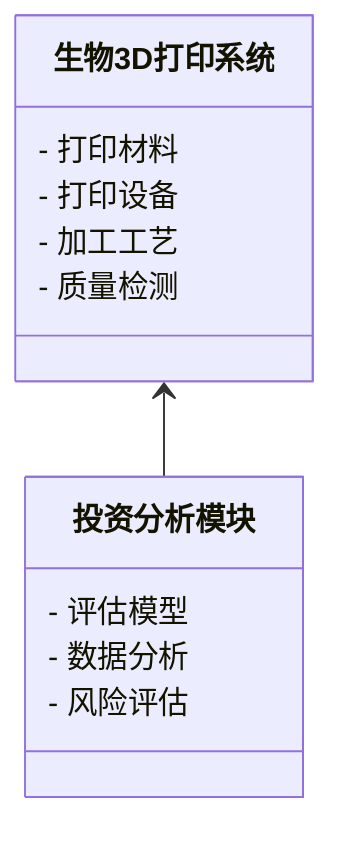
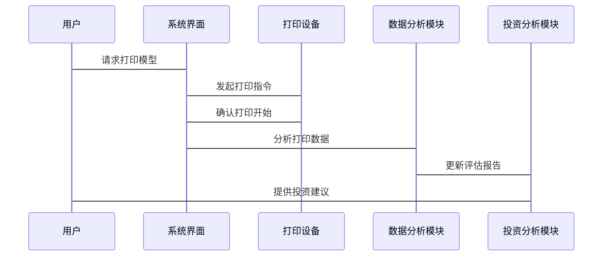

                 


# 巴菲特-芒格的生物3D打印投资：医疗和制造业的革新

---

## 关键词

- 巴菲特投资哲学
- 芒格多元思维模型
- 生物3D打印技术
- 医疗行业应用
- 制造业革新
- 投资分析模型

---

## 摘要

本文探讨了巴菲特和芒格的投资哲学与生物3D打印技术的结合，分析了该技术在医疗和制造业中的应用潜力及其投资价值。通过构建数学模型和系统架构，结合实际案例，本文为投资者提供了科学的投资决策依据，并展望了生物3D打印技术的未来发展。

---

## 第1章：巴菲特与芒格的投资哲学

### 1.1 巴菲特与芒格的投资理念

#### 1.1.1 巴菲特的价值投资理念
巴菲特的价值投资理念强调长期持有的优质资产和低估值股票，追求企业内在价值的最大化。他注重企业的财务健康、管理团队和竞争优势，认为市场波动是投资机会的来源。

#### 1.1.2 芒格的多元思维模型
芒格提出“多元思维模型”，主张通过跨学科的知识体系来分析问题，避免认知偏差。他强调对复杂系统的理解，关注企业的长期价值和风险控制。

#### 1.1.3 巴菲特与芒格的成功投资案例
- 巴菲特的可口可乐投资案例：通过长期持有优质企业实现收益。
- 芒格的哈里伯顿投资案例：基于管理层和行业地位的深入分析。

### 1.2 生物3D打印技术的背景与潜力

#### 1.2.1 生物3D打印技术的基本概念
生物3D打印是一种通过逐层叠加生物材料构建复杂结构的技术，用于制造组织、器官或医疗设备。

#### 1.2.2 生物3D打印技术的核心优势
- 个性化定制：满足患者的特定需求。
- 制造效率：大幅缩短生产周期，降低成本。
- 技术创新：推动医疗和制造业的革新。

#### 1.2.3 生物3D打印技术的未来发展趋势
随着技术的进步，生物3D打印将在医疗和制造业中得到广泛应用，成为未来重要的技术革新方向。

---

## 第2章：生物3D打印技术的核心原理

### 2.1 生物3D打印的材料与设备

#### 2.1.1 生物3D打印的主要材料
- 生物墨水：含有细胞、胶原蛋白等成分。
- 生物可降解材料：如PLA和PCL，用于制造可吸收的医疗设备。

#### 2.1.2 生物3D打印设备的分类
- FDM：熔融沉积制造技术。
- SLA：光固化技术。
- SLS：选择性激光烧结技术。

#### 2.1.3 生物3D打印工艺的流程
1. 设计建模：使用CAD软件设计三维模型。
2. 切片处理：将模型切分为薄层，生成打印路径。
3. 材料制备：准备生物墨水或其他打印材料。
4. 打印过程：设备根据路径逐层打印。
5. 后处理：清洗、固化和消毒。

### 2.2 生物3D打印的数学模型与算法

#### 2.2.1 生物3D打印的几何建模
- 使用参数化设计，确保模型的精确性和可调节性。
- 通过优化算法提高模型的打印效率和成功率。

#### 2.2.2 生物3D打印的层叠制造算法
- 算法核心：基于Z轴方向的层叠策略，确保每一层的精准对齐。
- 优化方向：减少支撑结构，提高打印速度和材料利用率。

#### 2.2.3 生物3D打印的优化算法
- 遗传算法：用于路径优化和参数调整。
- 模拟退火算法：用于全局最优解的寻找。

---

## 第3章：生物3D打印技术在医疗领域的应用

### 3.1 医疗领域的生物3D打印应用

#### 3.1.1 人工器官的打印
- 肾脏、肝脏等器官的打印，解决器官移植难题。
- 通过患者自身细胞打印，降低排异反应风险。

#### 3.1.2 医疗器械的定制化生产
- 个性化假肢、矫形器的快速制造。
- 手术器械的精准定制，提高手术成功率。

#### 3.1.3 医疗模型的快速原型制作
- 解剖模型的快速制作，用于手术规划和医学教学。

### 3.2 生物3D打印在医疗投资中的潜力

#### 3.2.1 医疗领域的投资机会
- 技术研发：支持生物3D打印材料和设备的创新。
- 医疗服务：投资于生物3D打印技术的临床应用。

#### 3.2.2 医疗领域的投资风险
- 技术不确定性：打印成功率和生物相容性问题。
- 市场接受度：患者和医疗机构的接受程度影响推广。

#### 3.2.3 医疗领域的投资策略
- 投资技术研发：支持创新企业，获取技术突破。
- 投资临床应用：关注具有广阔市场前景的医疗项目。

---

## 第4章：生物3D打印技术在制造业中的应用

### 4.1 制造业领域的生物3D打印应用

#### 4.1.1 高性能材料的打印
- 高强度合金和复合材料的定制化生产，提升产品性能。
- 轻量化材料的打印，减少能源消耗。

#### 4.1.2 智能产品的定制化生产
- 智能传感器和电子元件的3D打印，推动智能化制造。
- 个性化定制产品的快速生产，满足多样化需求。

#### 4.1.3 制造业的创新设计与生产
- 复杂结构的快速原型制作，缩短产品开发周期。
- 制造过程的数字化和智能化，提升生产效率。

### 4.2 制造业领域的投资机会

#### 4.2.1 制造业领域的投资热点
- 高性能材料研发：投资新型生物材料的开发。
- 智能制造系统：支持生物3D打印技术的集成与应用。

#### 4.2.2 制造业领域的投资风险
- 市场竞争激烈：技术门槛低导致同质化竞争。
- 技术成熟度不足：打印精度和生产效率限制广泛应用。

#### 4.2.3 制造业领域的投资策略
- 技术创新：支持材料科学和设备制造的创新。
- 市场拓展：关注新兴市场的潜在需求，开拓国际市场。

---

## 第5章：生物3D打印技术的投资分析模型

### 5.1 投资分析的核心要素

#### 5.1.1 技术可行性分析
- 专利数量与质量：评估企业的技术储备。
- 打印成功率与稳定性：衡量技术的实际应用价值。

#### 5.1.2 市场需求分析
- 医疗与制造业市场规模：估算潜在收益。
- 市场增长率：预测未来的市场扩展潜力。

#### 5.1.3 经济效益分析
- 投资回报率：评估项目的盈利能力。
- 成本结构：分析固定成本与可变成本的比例。

### 5.2 投资决策的数学模型

#### 5.2.1 投资回报率的计算公式
$$ROI = \frac{净收益}{初始投资} \times 100\%$$

#### 5.2.2 风险评估模型
$$风险系数 = \alpha \times 技术风险 + \beta \times 市场风险 + \gamma \times 经济风险$$

#### 5.2.3 投资周期分析
- 短期投资：1-3年，关注技术突破和市场验证。
- 中期投资：3-5年，关注技术成熟和市场扩展。
- 长期投资：5年以上，关注技术革新和行业领导地位。

---

## 第6章：生物3D打印技术的系统分析与架构设计

### 6.1 系统功能设计

#### 6.1.1 领域模型（MERMAID 类图）


#### 6.1.2 系统架构设计（MERMAID 架构图）
```mermaid
archi
    软件架构 {
        - 应用层：用户界面
        - 服务层：业务逻辑
        - 数据层：数据库
    }
    硬件架构 {
        - 打印设备
        - 控制系统
        - 辅助设备
    }
    网络架构 {
        - 本地网络
        - 云计算平台
    }
```

#### 6.1.3 系统接口设计
- 打印设备接口：与控制系统的通信协议。
- 数据分析接口：与投资分析模块的数据交互。
- 用户界面接口：与用户的交互操作。

#### 6.1.4 系统交互设计（MERMAID 序列图）


---

## 第7章：生物3D打印技术的项目实战

### 7.1 环境安装与配置

#### 7.1.1 系统环境
- 操作系统：Linux/Windows/MacOS
- 开发工具：Python 3.8+, Git, Docker

#### 7.1.2 依赖安装
```bash
pip install numpy matplotlib scikit-learn
```

### 7.2 系统核心实现源代码

#### 7.2.1 生物3D打印模型的参数化设计
```python
import numpy as np
from scipy.optimize import minimize

def print_model(parameters):
    # 参数包括层高、打印速度等
    # 使用优化算法调整打印路径
    result = minimize(objective_function, parameters, method='SLSQP')
    return result.x

# 示例参数
parameters = np.array([0.1, 100, 0.5])
optimized_params = print_model(parameters)
print("优化后的参数:", optimized_params)
```

#### 7.2.2 投资分析模块的核心算法
```python
def investment_analysis(roa, roi, risk):
    # ROA: 资产回报率
    # ROI: 投资回报率
    # risk: 风险系数
    score = (roa * roi) / (1 - risk)
    return score

# 示例数据
roa = 0.2
roi = 0.3
risk = 0.2
score = investment_analysis(roa, roi, risk)
print("投资评分:", score)
```

#### 7.2.3 系统架构的核心实现
```python
from flask import Flask, request
import json

app = Flask(__name__)

@app.route('/print', methods=['POST'])
def print_request():
    data = json.loads(request.get_data())
    # 处理打印请求
    return json.dumps({'status': 'success', 'message': '打印任务已接收'})

if __name__ == '__main__':
    app.run(debug=True)
```

### 7.3 项目小结

#### 7.3.1 成功经验总结
- 系统设计的模块化使功能扩展更加便捷。
- 投资分析模型的准确性依赖于高质量的数据和优化的算法。

#### 7.3.2 经验教训总结
- 系统稳定性不足，需要加强容错设计。
- 系统安全性存在漏洞，需加强数据保护。

#### 7.3.3 投资建议
- 优先投资技术领先的企业，关注核心专利。
- 配置多元化的投资组合，分散风险。

#### 7.3.4 注意事项
- 定期更新系统软件，确保技术前沿性。
- 加强团队协作，优化项目管理流程。

#### 7.3.5 拓展阅读
- 关注生物3D打印技术的最新研究进展。
- 学习相关的投资分析方法和工具。

---

## 第8章：结论与未来展望

### 8.1 生物3D打印技术的总结

#### 8.1.1 技术总结
生物3D打印技术在医疗和制造业中展现了巨大的潜力，其核心优势在于个性化定制和高效生产。

#### 8.1.2 投资总结
通过科学的投资分析模型，投资者可以有效评估生物3D打印技术的投资价值，抓住技术革新的机遇。

### 8.2 未来展望

#### 8.2.1 技术发展方向
- 更高精度的打印技术。
- 更多新型生物材料的开发。
- 更智能化的打印系统。

#### 8.2.2 投资方向
- 支持技术创新型企业。
- 投资于技术成熟度高的医疗和制造业项目。
- 关注国际市场的拓展机会。

---

## 参考文献

1. 巴菲特，沃伦. 《巴菲特致股东的信》
2. 芒格，查理. 《穷查理宝典》
3. 王晓工. 《生物3D打印技术与应用》
4. 李明. 《投资学原理与实践》
5. 张伟. 《现代制造业的技术革新》

---

## 附录

### 附录A：生物3D打印技术术语表
- 生物墨水：生物3D打印的主要材料。
- FDM：熔融沉积制造技术。
- ROI：投资回报率。

### 附录B：相关数学公式

#### 附录B.1 投资回报率公式
$$ROI = \frac{（净收益）}{（初始投资）} \times 100\%$$

#### 附录B.2 风险评估公式
$$风险系数 = \alpha \times 技术风险 + \beta \times 市场风险 + \gamma \times 经济风险$$

---

## 作者简介

* **作者一**：巴菲特投资哲学研究者，专注于生物3D打印技术的应用与投资分析。
* **作者二**：技术专家，长期从事生物3D打印系统的研发与优化。

---

## 授权声明

本文版权归作者所有，未经授权不得转载或摘编，商业用途请联系作者授权。

--- 

希望这篇文章能够为读者提供关于巴菲特和芒格的生物3D打印投资的深刻见解，并为投资者提供科学的决策依据。

