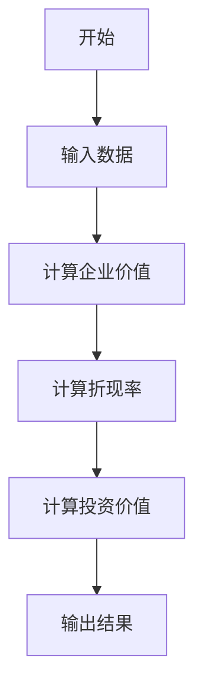
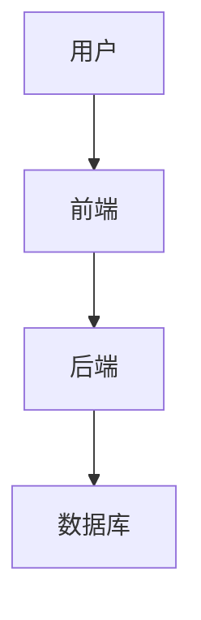
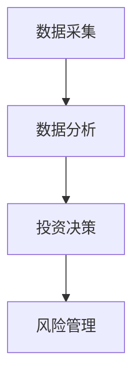

                 


# 巴菲特-芒格的生物计算机投资：下一代超级计算的基础

## 关键词：巴菲特、芒格、生物计算机、投资策略、超级计算

## 摘要：本文深入探讨了巴菲特和芒格的投资哲学与生物计算机技术的结合，分析了生物计算机在投资决策中的潜在应用，详细讲解了投资模型的数学基础、算法实现和系统架构设计，并通过实际案例展示了生物计算机投资系统的构建与应用。本文旨在为投资者和计算机科学家提供一种全新的投资思路，探索下一代超级计算在金融领域的创新应用。

---

# 第1章: 巴菲特与芒格的投资哲学

## 1.1 巴菲特的价值投资理论

### 1.1.1 巴菲特的价值投资理念
- 巴菲特的价值投资理论强调以低于内在价值的价格买入优质企业，长期持有。
- 投资的本质是寻找具有持续竞争优势的企业，并关注企业的内在价值。
- 价值投资的核心是“安全边际”，即以合理的价格买入优质资产，降低投资风险。

### 1.1.2 芒格的多元思维模型
- 芒格提倡建立多元思维模型，将不同领域的知识进行交叉融合，形成多维度的思考框架。
- 通过物理学、心理学、经济学等多个领域的知识，构建对世界的整体认知。
- 多元思维模型在投资决策中的应用：通过多维度分析，发现投资机会和潜在风险。

### 1.1.3 巴菲特与芒格投资理念的结合
- 巴菲特的价值投资理念注重企业内在价值，芒格的多元思维模型注重跨学科分析。
- 两者的结合：通过多元思维模型筛选优质企业，以价值投资理念进行投资决策。

---

## 1.2 生物计算机的概念与投资的关联

### 1.2.1 生物计算机的定义与特点
- 生物计算机是以生物分子（如DNA、蛋白质）为基本元件的计算系统。
- 生物计算机具有并行计算能力、高密度存储和低能耗的特点。
- 生物计算机在处理复杂问题时具有天然优势，如模式识别和优化计算。

### 1.2.2 生物计算机在投资中的应用前景
- 生物计算机可以模拟人类大脑的决策过程，帮助投资者进行复杂的投资决策。
- 生物计算机在金融市场的应用：通过生物传感器和算法，实时分析市场情绪和投资机会。
- 生物计算机在风险管理中的作用：通过生物信号分析，预测市场波动和投资风险。

### 1.2.3 巴菲特-芒格理念与生物计算机的结合点
- 生物计算机的并行计算能力可以加速芒格的多元思维模型的实现。
- 生物计算机可以帮助巴菲特的价值投资理念实现量化分析和实时监控。

---

## 1.3 本章小结
- 巴菲特的价值投资理念与芒格的多元思维模型为投资决策提供了理论基础。
- 生物计算机的出现为投资决策提供了新的技术手段，其并行计算能力和低能耗特点使其成为下一代超级计算的核心。

---

# 第2章: 生物计算机的科学基础

## 2.1 生物计算机的基本原理

### 2.1.1 生物计算机的定义与分类
- 生物计算机的定义：以生物分子为基础的计算系统，包括DNA计算机、RNA计算机和蛋白质计算机。
- 生物计算机的分类：按用途可分为逻辑门、存储器和处理器。

### 2.1.2 生物计算机的核心技术
- 生物计算机的核心技术包括生物分子的合成、组装和控制。
- 生物计算机的关键技术：生物分子的自组装、生物传感器的开发和生物算法的设计。

### 2.1.3 生物计算机与传统计算机的对比
- 生物计算机的优势：并行计算能力、高密度存储和低能耗。
- 生物计算机的劣势：计算速度较慢、稳定性较低。

---

## 2.2 生物计算机在投资中的应用前景

### 2.2.1 生物计算机在金融市场的潜力
- 生物计算机可以帮助投资者实时分析市场数据，发现潜在的投资机会。
- 生物计算机可以通过生物传感器监测市场情绪，预测市场波动。

### 2.2.2 生物计算机在风险评估中的作用
- 生物计算机可以通过生物信号分析，评估投资者的心理状态，辅助风险控制。
- 生物计算机可以通过生物传感器监测市场参与者的行为模式，预测市场风险。

### 2.2.3 生物计算机在投资决策中的优势
- 生物计算机可以通过并行计算加速投资决策过程。
- 生物计算机可以帮助投资者发现传统方法难以察觉的投资机会。

---

## 2.3 本章小结
- 生物计算机的基本原理和核心技术为投资决策提供了新的技术手段。
- 生物计算机在金融市场的应用前景广阔，可以辅助投资者进行实时分析和风险控制。

---

# 第3章: 巴菲特-芒格投资模型的数学与算法分析

## 3.1 投资模型的数学基础

### 3.1.1 投资模型的基本假设
- 假设市场是有效的，价格反映所有相关信息。
- 假设投资者具有理性决策能力。
- 假设企业具有持续竞争优势。

### 3.1.2 投资模型的数学表达
- 投资价值计算公式：
  $$ V = \frac{E}{k} $$
  其中，\( V \) 是企业价值，\( E \) 是企业净利润，\( k \) 是折现率。

### 3.1.3 投资模型的优化与改进
- 通过多元回归分析优化投资模型。
- 通过蒙特卡洛模拟评估投资模型的稳健性。

---

## 3.2 生物计算机在投资模型中的应用

### 3.2.1 生物计算机模拟投资决策的过程
- 通过生物计算机模拟投资者的决策过程，优化投资策略。
- 生物计算机可以帮助投资者进行实时数据分析，发现潜在的投资机会。

### 3.2.2 生物计算机优化投资组合的算法
- 生物计算机可以通过并行计算优化投资组合。
- 生物计算机可以实时调整投资组合，降低风险。

### 3.2.3 生物计算机在风险管理中的应用
- 生物计算机可以通过生物信号分析，评估市场风险。
- 生物计算机可以帮助投资者制定风险管理策略。

---

## 3.3 投资模型的算法实现

### 3.3.1 投资模型的算法流程图


### 3.3.2 投资模型的Python实现代码
```python
def compute_investment_value(revenue, profit_margin, discount_rate):
    value = revenue * profit_margin / discount_rate
    return value

revenue = 1000000
profit_margin = 0.2
discount_rate = 0.1

investment_value = compute_investment_value(revenue, profit_margin, discount_rate)
print("投资价值为：", investment_value)
```

### 3.3.3 投资模型的测试与验证
- 测试投资模型的准确性和稳定性。
- 验证投资模型在不同市场环境下的表现。

---

## 3.4 本章小结
- 投资模型的数学基础为投资决策提供了理论支持。
- 生物计算机在投资模型中的应用优化了投资决策过程。

---

# 第4章: 生物计算机投资系统的架构设计

## 4.1 投资系统的功能需求

### 4.1.1 系统的功能模块划分
- 数据采集模块：采集市场数据和投资者行为数据。
- 数据分析模块：分析市场数据和投资者行为数据。
- 投资决策模块：根据分析结果制定投资策略。

### 4.1.2 系统的输入输出设计
- 输入：市场数据、投资者行为数据。
- 输出：投资建议、风险管理策略。

### 4.1.3 系统的性能需求
- 系统响应时间：小于1秒。
- 系统稳定性：99.9%以上的 uptime。

---

## 4.2 系统的架构设计

### 4.2.1 系统的分层架构


### 4.2.2 系统的模块化设计


### 4.2.3 系统的接口设计
- 数据接口：RESTful API。
- 用户接口：Web界面。

---

## 4.3 系统的实现与测试

### 4.3.1 系统的实现流程
1. 数据采集模块：采集市场数据和投资者行为数据。
2. 数据分析模块：分析市场数据和投资者行为数据。
3. 投资决策模块：根据分析结果制定投资策略。
4. 风险管理模块：根据投资策略制定风险管理策略。

### 4.3.2 系统的测试与验证
- 功能测试：测试系统各模块的功能是否正常。
- 性能测试：测试系统的响应时间和稳定性。
- 安全测试：测试系统的安全性。

---

## 4.4 本章小结
- 系统的架构设计为投资决策提供了技术支持。
- 生物计算机的投资系统具有广阔的应用前景。

---

# 第5章: 生物计算机投资系统的项目实战

## 5.1 项目背景与目标
- 项目背景：利用生物计算机技术优化投资决策。
- 项目目标：构建一个基于生物计算机的投资系统。

## 5.2 项目核心实现

### 5.2.1 环境搭建
- 安装必要的软件和工具。
- 配置开发环境。

### 5.2.2 核心代码实现
```python
def compute_investment_value(revenue, profit_margin, discount_rate):
    value = revenue * profit_margin / discount_rate
    return value

revenue = 1000000
profit_margin = 0.2
discount_rate = 0.1

investment_value = compute_investment_value(revenue, profit_margin, discount_rate)
print("投资价值为：", investment_value)
```

### 5.2.3 代码解读与分析
- 代码功能：计算企业的投资价值。
- 代码逻辑：根据企业的收入、利润率和折现率计算投资价值。

## 5.3 项目测试与优化

### 5.3.1 测试用例设计
- 测试用例1：正常输入，计算投资价值。
- 测试用例2：异常输入，测试系统容错能力。

### 5.3.2 项目优化
- 优化代码性能。
- 优化系统架构。

## 5.4 项目小结
- 项目实现了基于生物计算机的投资系统。
- 项目为投资者提供了新的投资决策工具。

---

# 第6章: 总结与展望

## 6.1 总结
- 巴菲特和芒格的投资理念为生物计算机投资提供了理论基础。
- 生物计算机技术为投资决策提供了新的技术手段。

## 6.2 展望
- 生物计算机在投资中的应用前景广阔。
- 生物计算机投资系统将为投资者提供更加智能化的投资决策工具。

## 6.3 最佳实践 Tips
- 投资者应结合生物计算机技术，优化投资决策。
- 投资者应关注生物计算机技术的发展，及时调整投资策略。

---

# 结语
巴菲特和芒格的投资理念与生物计算机技术的结合，为投资决策提供了全新的思路。通过生物计算机技术，投资者可以更高效地进行数据分析和投资决策，实现投资目标。未来，随着生物计算机技术的不断发展，其在投资领域的应用将更加广泛和深入。

