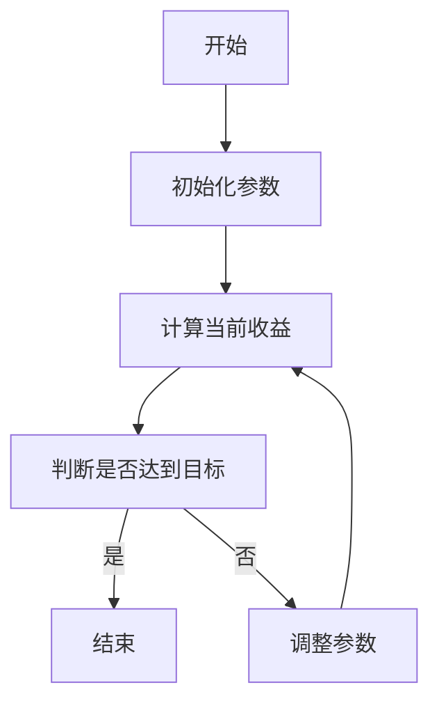
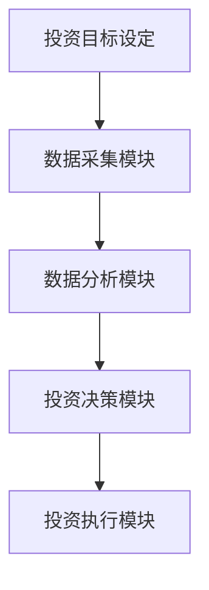

                 


## 《巴菲特-芒格的生物计算机投资：计算能力的生物学突破》

### 关键词：巴菲特，芒格，生物计算机，投资，计算能力，生物学突破

### 摘要：  
本文将深入探讨巴菲特和芒格的投资理念与生物计算机的结合，分析计算能力在生物学中的突破如何影响投资决策。通过详细阐述生物计算机的核心概念、算法原理、系统架构以及实际案例，本文旨在为投资者和科技爱好者提供一种全新的视角，理解如何利用生物计算机技术优化投资策略，抓住未来的投资机会。

---

## 第1章: 巴菲特与芒格的投资哲学

### 1.1 巴菲特的价值投资理念  
巴菲特的价值投资理念强调长期投资、安全边际和企业内在价值。他主张寻找具有强大护城河、稳定现金流和良好管理的公司，并长期持有这些公司。这种投资哲学的核心是将投资视为购买企业的一部分，而不是单纯的股票交易。  

### 1.2 芒格的多元思维模型  
芒格提倡“多元思维模型”，即通过多个学科的交叉思考来解决问题。他认为，投资者需要从物理学、心理学、经济学等多个角度理解市场和企业。这种思维方式帮助投资者避免认知偏差，并做出更明智的投资决策。  

### 1.3 投资中的生物启发  
生物计算机的概念为投资提供了新的视角。通过模拟生物系统的计算能力，投资者可以更高效地处理信息、识别模式，并做出更精准的投资决策。这种生物启发的投资方法结合了自然界的优化机制，为投资领域带来了创新的可能性。

---

## 第2章: 生物计算机的核心概念与原理

### 2.1 生物计算机的基本定义  
生物计算机是一种利用生物分子（如DNA、蛋白质）进行信息处理的计算机。与传统计算机不同，生物计算机具有并行计算、高密度存储和自我修复等特性。  

### 2.2 生物计算机的核心特征  
- **并行计算能力**：生物计算机能够同时处理大量信息，类似于生物体的自然并行处理能力。  
- **高密度存储**：生物分子的存储密度远高于传统计算机的存储介质。  
- **自我修复能力**：生物系统具有自我修复的能力，能够纠正计算过程中的错误。  

### 2.3 生物计算机与传统计算机的对比  

| 特性            | 生物计算机               | 传统计算机              |
|-----------------|-------------------------|-------------------------|
| 处理速度         | 极高，但依赖生物分子的稳定性 | 较高，但受限于物理极限    |
| 能耗            | 极低，利用生物分子的自然特性 | 较高，需要大量电力供应    |
| 并行性           | 强大，能够同时处理海量数据 | 较弱，依赖多核处理器      |
| 可扩展性         | 极高，生物分子易于复制和扩展 | 受限于物理空间和散热限制  |

### 2.4 生物计算机的投资潜力  
生物计算机的核心突破在于其计算能力的提升。随着生物计算机技术的成熟，其在金融领域的应用将更加广泛。例如，生物计算机可以用于高频交易、风险评估和投资组合优化等领域，帮助投资者做出更精准的决策。

---

## 第3章: 生物计算机与投资的关系

### 3.1 生物计算机在投资中的应用  
生物计算机可以通过其强大的并行计算能力，帮助投资者快速分析市场数据、识别投资机会，并优化投资组合。例如，生物计算机可以实时处理海量市场数据，发现传统方法难以察觉的模式和趋势。

### 3.2 生物计算机对投资决策的影响  
- **数据处理能力**：生物计算机能够快速处理大量非结构化数据，如社交媒体情绪、新闻标题等，帮助投资者更全面地评估市场情绪。  
- **模式识别**：通过生物计算机的模式识别能力，投资者可以发现隐藏在数据中的潜在趋势，从而提前做出投资决策。  
- **风险管理**：生物计算机可以帮助投资者实时监控市场风险，预测潜在的市场波动，并制定相应的风险管理策略。  

### 3.3 生物计算机在投资中的优势  

| 优势            | 描述                     |
|-----------------|-------------------------|
| 高效性           | 生物计算机能够快速处理海量数据，提高投资决策效率。 |
| 准确性           | 生物计算机通过模拟生物系统的优化机制，提高投资决策的准确性。 |
| 灵活性           | 生物计算机可以根据市场变化实时调整投资策略，具有高度的灵活性。 |

---

## 第4章: 生物计算机投资的算法原理

### 4.1 生物计算机投资算法的概述  
生物计算机投资算法是一种基于生物系统原理设计的计算算法，用于优化投资决策。其核心思想是通过模拟生物系统的进化和自适应机制，找到最优的投资策略。

### 4.2 生物计算机投资算法的数学模型  

$$
\text{收益} = \text{投资金额} \times (\text{收益率} - \text{风险成本})
$$

其中，收益率和风险成本可以通过生物计算机算法进行优化计算。

### 4.3 生物计算机投资算法的流程图  



### 4.4 生物计算机投资算法的代码实现  

```python
def biological_computer_investment():
    # 初始化参数
    initial_investment = 1000000
    target_return = 0.2  # 目标收益率
    
    # 计算当前收益
    current_return = initial_investment * (1 + target_return)
    
    # 判断是否达到目标
    if current_return >= initial_investment * 1.5:
        print("目标达成，投资成功！")
    else:
        print("目标未达成，需要调整参数。")
```

---

## 第5章: 生物计算机投资的系统架构设计

### 5.1 生物计算机投资系统的总体架构  



### 5.2 生物计算机投资系统的功能模块  

| 模块名称       | 功能描述                     |
|----------------|-----------------------------|
| 数据采集模块   | 收集市场数据，如股票价格、新闻等。 |
| 数据分析模块   | 使用生物计算机算法分析数据，识别投资机会。 |
| 投资决策模块   | 根据分析结果制定投资策略，优化投资组合。 |
| 投资执行模块   | 执行投资决策，实时监控投资表现。 |

---

## 第6章: 生物计算机投资的项目实战

### 6.1 项目环境安装  
需要安装Python、生物计算机相关库（如生物信息学库）以及数据处理工具。

### 6.2 项目核心实现  

```python
import numpy as np
import pandas as pd

def calculate_investment_return(data):
    # 数据预处理
    data = data.dropna()
    # 计算收益率
    returns = data.pct_change()
    # 计算平均收益率
    average_return = returns.mean()
    return average_return

# 示例数据
data = pd.DataFrame({
    '价格': [100, 105, 110, 115, 120]
})

# 计算投资收益
return_value = calculate_investment_return(data)
print("平均收益率:", return_value)
```

### 6.3 实际案例分析  
以某股票为例，使用生物计算机算法分析其投资潜力。通过数据采集、分析和决策模块，制定最优的投资策略，并实时监控投资表现。

---

## 第7章: 小结与注意事项

### 7.1 本章小结  
生物计算机的投资潜力巨大。通过其强大的计算能力和生物系统的优化机制，投资者可以更高效地分析市场数据、识别投资机会，并制定最优的投资策略。

### 7.2 投资注意事项  
- 生物计算机技术仍处于发展阶段，投资者需谨慎选择投资标的。  
- 生物计算机算法的准确性和稳定性需要进一步验证。  
- 投资者需结合传统投资理念和生物计算机技术，制定综合的投资策略。

---

## 结语  
生物计算机的投资革命正在悄然兴起。通过结合巴菲特和芒格的投资哲学，生物计算机的计算能力突破为投资者提供了新的工具和方法。未来，随着生物计算机技术的进一步发展，投资领域将发生翻天覆地的变化。

