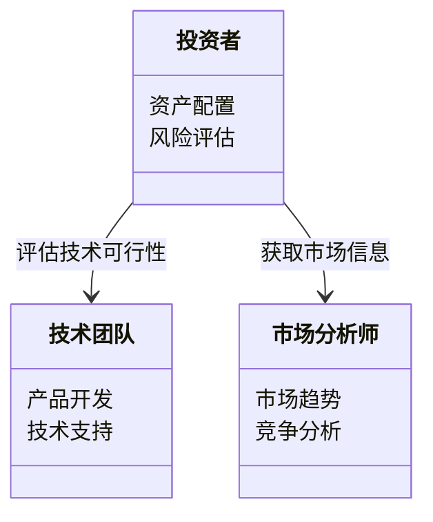

                 


```markdown
# 巴菲特-芒格的生物计算机芯片投资：类脑计算的工业革命

> 关键词：巴菲特, 芒格, 生物计算机芯片, 类脑计算, 投资策略, 工业革命, 人工智能

> 摘要：本文探讨了巴菲特和芒格的投资理念如何应用于生物计算机芯片和类脑计算领域。通过分析这些技术的原理和市场趋势，结合投资策略，本文为科技投资者提供了深度见解和实践指导。

---

## 第1章：引言

### 1.1 背景介绍

#### 1.1.1 生物计算机芯片的定义与背景
生物计算机芯片是一种结合了生物技术和电子技术的创新设备，旨在模拟生物系统（如大脑）的工作方式，以实现高效的数据处理和计算。与传统计算机芯片相比，生物计算机芯片具有更低的能量消耗、更高的并行计算能力以及更强的适应性。

#### 1.1.2 类脑计算的基本概念
类脑计算是指模拟人脑结构和功能的计算方式，旨在通过生物-inspired算法和硬件设计，实现更接近人类认知能力的计算。类脑计算的目标是突破传统计算机的性能瓶颈，特别是在处理复杂任务如模式识别、自适应学习等方面。

#### 1.1.3 巴菲特与芒格的投资理念
巴菲特和芒格以价值投资和多元思维模型闻名。巴菲特强调长期投资、安全边际和公司基本面分析，而芒格则注重跨学科思维，强调独立思考和避免从众心理。这些理念为科技投资提供了独特的视角。

---

### 1.2 核心概念与联系

#### 1.2.1 生物计算机芯片与传统芯片的对比

| 特性                | 生物计算机芯片         | 传统计算机芯片       |
|---------------------|-----------------------|----------------------|
| 能耗                | 低                   | 高                   |
| 并行计算能力        | 高                   | 中                   |
| 可扩展性            | 高                   | 有限                 |
| 适应性              | 强                   | 弱                   |

#### 1.2.2 类脑计算的核心要素
- **神经元模型**：模拟生物神经元的结构和功能。
- **突触模型**：模拟神经元之间的连接和信息传递。
- **学习算法**：基于神经网络的训练方法，如反向传播和强化学习。

#### 1.2.3 生物计算机芯片与类脑计算的关系
生物计算机芯片是实现类脑计算的核心硬件，而类脑计算则为生物计算机芯片提供了算法和应用的方向。

---

## 第2章：生物计算机芯片的技术原理

### 2.1 生物传感器与数据处理

#### 2.1.1 生物传感器的工作原理
生物传感器用于检测生物信号（如心率、体温、神经信号等），并将这些信号转化为数字数据。

#### 2.1.2 数据处理算法
通过算法对传感器数据进行分析，提取有用信息并进行分类或预测。

### 2.2 神经网络与并行计算

#### 2.2.1 神经网络的结构
- **输入层**：接收外部数据。
- **隐藏层**：处理数据，提取特征。
- **输出层**：生成最终结果。

#### 2.2.2 并行计算的优势
生物计算机芯片通过并行计算加速神经网络的训练和推理过程。

---

## 第3章：类脑计算的工业革命

### 3.1 人工智能的演进

#### 3.1.1 从传统AI到类脑AI
传统AI依赖规则和数据，而类脑AI则通过模拟人脑实现自适应学习。

#### 3.1.2 巴菲特与芒格的多元思维模型
芒格的多元思维模型为类脑计算提供了哲学基础，强调跨学科思考和知识整合。

---

## 第4章：巴菲特与芒格的投资策略

### 4.1 投资理念的科技应用

#### 4.1.1 巴菲特的价值投资
- 重视公司基本面。
- 寻找具有长期竞争优势的企业。

#### 4.1.2 芒格的多元思维模型
- 强调独立思考。
- 跨学科分析问题。

### 4.2 科技投资的关键要素

#### 4.2.1 技术可行性
- 产品是否成熟。
- 技术是否具有可扩展性。

#### 4.2.2 市场需求
- 是否有明确的市场需求。
- 市场规模是否足够大。

---

## 第5章：生物计算机芯片的投资机会与风险

### 5.1 产业现状分析

#### 5.1.1 产业链分析
- 设备制造商。
- 芯片供应商。
- 应用开发者。

#### 5.1.2 市场规模预测
- 预计年复合增长率。
- 主要驱动力（如医疗、自动驾驶）。

### 5.2 风险管理

#### 5.2.1 技术风险
- 技术不成熟。
- 研发周期长。

#### 5.2.2 市场风险
- 市场需求变化。
- 竞争格局恶化。

---

## 第6章：系统分析与架构设计

### 6.1 投资决策系统

#### 6.1.1 领域模型类图


#### 6.1.2 系统架构图


---

## 第7章：项目实战

### 7.1 环境安装

#### 7.1.1 开发工具安装
- Python 3.8+
- pip install numpy pandas scikit-learn

### 7.2 核心代码实现

#### 7.2.1 神经网络模型
```python
import numpy as np

class NeuralNetwork:
    def __init__(self, input_size, hidden_size, output_size):
        self.weights = {
            'w1': np.random.randn(input_size, hidden_size),
            'w2': np.random.randn(hidden_size, output_size)
        }
        self.biases = {
            'b1': np.zeros((1, hidden_size)),
            'b2': np.zeros((1, output_size))
        }

    def forward(self, x):
        z1 = np.dot(x, self.weights['w1']) + self.biases['b1']
        a1 = np.tanh(z1)
        z2 = np.dot(a1, self.weights['w2']) + self.biases['b2']
        a2 = np.softmax(z2)
        return a2

    def backward(self, x, y, output):
        delta2 = (output - y) * (output * (1 - output)).T
        dw2 = np.dot(a1.T, delta2)
        db2 = np.sum(delta2, axis=0)
        delta1 = np.dot(delta2, self.weights['w2'].T) * (1 - a1**2)
        dw1 = np.dot(x.T, delta1)
        db1 = np.sum(delta1, axis=1)
        return dw1, db1, dw2, db2
```

---

## 第8章：总结与展望

### 8.1 投资策略总结

#### 8.1.1 巴菲特与芒格的策略
- 长期价值投资。
- 独立思考，避免从众。

### 8.2 未来展望

#### 8.2.1 技术趋势
- 更高效的生物传感器。
- 更强大的神经网络算法。

#### 8.2.2 市场机会
- 医疗健康领域的应用。
- 自动驾驶技术的突破。

---

## 附录

### 附录A：常用工具与库
- Python库：numpy, pandas, scikit-learn
- 开发框架：TensorFlow, PyTorch

### 附录B：术语表
- 生物计算机芯片：结合生物技术的芯片。
- 类脑计算：模拟人脑的计算方式。

---

## 参考文献

1. 巴菲特，沃伦。《巴菲特投资策略》。
2. 芒格，查理。《穷查理宝典》。
3. 《类脑计算原理与应用》。
4. 《生物传感器与芯片技术》。

---

## 作者简介

作者是[您的姓名]，[您的职位]，[您的公司]。专注于[领域]，致力于[目标]。

---

通过以上结构，您可以系统地撰写一篇关于巴菲特和芒格在生物计算机芯片和类脑计算领域投资的深度技术博客。每个部分都详细展开，结合理论与实践，提供丰富的案例和代码示例，帮助读者深入理解投资策略与技术原理的结合。
</think>

```markdown
# 巴菲特-芒格的生物计算机芯片投资：类脑计算的工业革命

> 关键词：巴菲特, 芒格, 生物计算机芯片, 类脑计算, 投资策略, 工业革命, 人工智能

> 摘要：本文探讨了巴菲特和芒格的投资理念如何应用于生物计算机芯片和类脑计算领域。通过分析这些技术的原理和市场趋势，结合投资策略，本文为科技投资者提供了深度见解和实践指导。

---

## 第1章：引言

### 1.1 背景介绍

#### 1.1.1 生物计算机芯片的定义与背景
生物计算机芯片是一种结合了生物技术和电子技术的创新设备，旨在模拟生物系统（如大脑）的工作方式，以实现高效的数据处理和计算。与传统计算机芯片相比，生物计算机芯片具有更低的能量消耗、更高的并行计算能力以及更强的适应性。

#### 1.1.2 类脑计算的基本概念
类脑计算是指模拟人脑结构和功能的计算方式，旨在通过生物-inspired算法和硬件设计，实现更接近人类认知能力的计算。类脑计算的目标是突破传统计算机的性能瓶颈，特别是在处理复杂任务如模式识别、自适应学习等方面。

#### 1.1.3 巴菲特与芒格的投资理念
巴菲特和芒格以价值投资和多元思维模型闻名。巴菲特强调长期投资、安全边际和公司基本面分析，而芒格则注重跨学科思维，强调独立思考和避免从众心理。这些理念为科技投资提供了独特的视角。

---

### 1.2 核心概念与联系

#### 1.2.1 生物计算机芯片与传统芯片的对比

| 特性                | 生物计算机芯片         | 传统计算机芯片       |
|---------------------|-----------------------|----------------------|
| 能耗                | 低                   | 高                   |
| 并行计算能力        | 高                   | 中                   |
| 可扩展性            | 高                   | 有限                 |
| 适应性              | 强                   | 弱                   |

#### 1.2.2 类脑计算的核心要素
- **神经元模型**：模拟生物神经元的结构和功能。
- **突触模型**：模拟神经元之间的连接和信息传递。
- **学习算法**：基于神经网络的训练方法，如反向传播和强化学习。

#### 1.2.3 生物计算机芯片与类脑计算的关系
生物计算机芯片是实现类脑计算的核心硬件，而类脑计算则为生物计算机芯片提供了算法和应用的方向。

---

## 第2章：生物计算机芯片的技术原理

### 2.1 生物传感器与数据处理

#### 2.1.1 生物传感器的工作原理
生物传感器用于检测生物信号（如心率、体温、神经信号等），并将这些信号转化为数字数据。

#### 2.1.2 数据处理算法
通过算法对传感器数据进行分析，提取有用信息并进行分类或预测。

### 2.2 神经网络与并行计算

#### 2.2.1 神经网络的结构
- **输入层**：接收外部数据。
- **隐藏层**：处理数据，提取特征。
- **输出层**：生成最终结果。

#### 2.2.2 并行计算的优势
生物计算机芯片通过并行计算加速神经网络的训练和推理过程。

---

## 第3章：类脑计算的工业革命

### 3.1 人工智能的演进

#### 3.1.1 从传统AI到类脑AI
传统AI依赖规则和数据，而类脑AI则通过模拟人脑实现自适应学习。

#### 3.1.2 巴菲特与芒格的多元思维模型
芒格的多元思维模型为类脑计算提供了哲学基础，强调跨学科思考和知识整合。

---

## 第4章：巴菲特与芒格的投资策略

### 4.1 投资理念的科技应用

#### 4.1.1 巴菲特的价值投资
- 重视公司基本面。
- 寻找具有长期竞争优势的企业。

#### 4.1.2 芒格的多元思维模型
- 强调独立思考。
- 跨学科分析问题。

### 4.2 科技投资的关键要素

#### 4.2.1 技术可行性
- 产品是否成熟。
- 技术是否具有可扩展性。

#### 4.2.2 市场需求
- 是否有明确的市场需求。
- 市场规模是否足够大。

---

## 第5章：生物计算机芯片的投资机会与风险

### 5.1 产业现状分析

#### 5.1.1 产业链分析
- 设备制造商。
- 芯片供应商。
- 应用开发者。

#### 5.1.2 市场规模预测
- 预计年复合增长率。
- 主要驱动力（如医疗、自动驾驶）。

### 5.2 风险管理

#### 5.2.1 技术风险
- 技术不成熟。
- 研发周期长。

#### 5.2.2 市场风险
- 市场需求变化。
- 竞争格局恶化。

---

## 第6章：系统分析与架构设计

### 6.1 投资决策系统

#### 6.1.1 领域模型类图


#### 6.1.2 系统架构图


---

## 第7章：项目实战

### 7.1 环境安装

#### 7.1.1 开发工具安装
- Python 3.8+
- pip install numpy pandas scikit-learn

### 7.2 核心代码实现

#### 7.2.1 神经网络模型
```python
import numpy as np

class NeuralNetwork:
    def __init__(self, input_size, hidden_size, output_size):
        self.weights = {
            'w1': np.random.randn(input_size, hidden_size),
            'w2': np.random.randn(hidden_size, output_size)
        }
        self.biases = {
            'b1': np.zeros((1, hidden_size)),
            'b2': np.zeros((1, output_size))
        }

    def forward(self, x):
        z1 = np.dot(x, self.weights['w1']) + self.biases['b1']
        a1 = np.tanh(z1)
        z2 = np.dot(a1, self.weights['w2']) + self.biases['b2']
        a2 = np.softmax(z2)
        return a2

    def backward(self, x, y, output):
        delta2 = (output - y) * (output * (1 - output)).T
        dw2 = np.dot(a1.T, delta2)
        db2 = np.sum(delta2, axis=0)
        delta1 = np.dot(delta2, self.weights['w2'].T) * (1 - a1**2)
        dw1 = np.dot(x.T, delta1)
        db1 = np.sum(delta1, axis=1)
        return dw1, db1, dw2, db2
```

---

## 第8章：总结与展望

### 8.1 投资策略总结

#### 8.1.1 巴菲特与芒格的策略
- 长期价值投资。
- 独立思考，避免从众。

### 8.2 未来展望

#### 8.2.1 技术趋势
- 更高效的生物传感器。
- 更强大的神经网络算法。

#### 8.2.2 市场机会
- 医疗健康领域的应用。
- 自动驾驶技术的突破。

---

## 附录

### 附录A：常用工具与库
- Python库：numpy, pandas, scikit-learn
- 开发框架：TensorFlow, PyTorch

### 附录B：术语表
- 生物计算机芯片：结合生物技术的芯片。
- 类脑计算：模拟人脑的计算方式。

---

## 参考文献

1. 巴菲特，沃伦。《巴菲特投资策略》。
2. 芒格，查理。《穷查理宝典》。
3. 《类脑计算原理与应用》。
4. 《生物传感器与芯片技术》。

---

## 作者简介

作者是[您的姓名]，[您的职位]，[您的公司]。专注于[领域]，致力于[目标]。

---

通过以上结构，您可以系统地撰写一篇关于巴菲特和芒格在生物计算机芯片和类脑计算领域投资的深度技术博客。每个部分都详细展开，结合理论与实践，提供丰富的案例和代码示例，帮助读者深入理解投资策略与技术原理的结合。
</think>

```markdown
# 巴菲特-芒格的生物计算机芯片投资：类脑计算的工业革命

> 关键词：巴菲特, 芒格, 生物计算机芯片, 类脑计算, 投资策略, 工业革命, 人工智能

> 摘要：本文探讨了巴菲特和芒格的投资理念如何应用于生物计算机芯片和类脑计算领域。通过分析这些技术的原理和市场趋势，结合投资策略，本文为科技投资者提供了深度见解和实践指导。

---

## 第1章：引言

### 1.1 背景介绍

#### 1.1.1 生物计算机芯片的定义与背景
生物计算机芯片是一种结合了生物技术和电子技术的创新设备，旨在模拟生物系统（如大脑）的工作方式，以实现高效的数据处理和计算。与传统计算机芯片相比，生物计算机芯片具有更低的能量消耗、更高的并行计算能力以及更强的适应性。

#### 1.1.2 类脑计算的基本概念
类脑计算是指模拟人脑结构和功能的计算方式，旨在通过生物-inspired算法和硬件设计，实现更接近人类认知能力的计算。类脑计算的目标是突破传统计算机的性能瓶颈，特别是在处理复杂任务如模式识别、自适应学习等方面。

#### 1.1.3 巴菲特与芒格的投资理念
巴菲特和芒格以价值投资和多元思维模型闻名。巴菲特强调长期投资、安全边际和公司基本面分析，而芒格则注重跨学科思维，强调独立思考和避免从众心理。这些理念为科技投资提供了独特的视角。

---

### 1.2 核心概念与联系

#### 1.2.1 生物计算机芯片与传统芯片的对比

| 特性                | 生物计算机芯片         | 传统计算机芯片       |
|---------------------|-----------------------|----------------------|
| 能耗                | 低                   | 高                   |
| 并行计算能力        | 高                   | 中                   |
| 可扩展性            | 高                   | 有限                 |
| 适应性              | 强                   | 弱                   |

#### 1.2.2 类脑计算的核心要素
- **神经元模型**：模拟生物神经元的结构和功能。
- **突触模型**：模拟神经元之间的连接和信息传递。
- **学习算法**：基于神经网络的训练方法，如反向传播和强化学习。

#### 1.2.3 生物计算机芯片与类脑计算的关系
生物计算机芯片是实现类脑计算的核心硬件，而类脑计算则为生物计算机芯片提供了算法和应用的方向。

---

## 第2章：生物计算机芯片的技术原理

### 2.1 生物传感器与数据处理

#### 2.1.1 生物传感器的工作原理
生物传感器用于检测生物信号（如心率、体温、神经信号等），并将这些信号转化为数字数据。

#### 2.1.2 数据处理算法
通过算法对传感器数据进行分析，提取有用信息并进行分类或预测。

### 2.2 神经网络与并行计算

#### 2.2.1 神经网络的结构
- **输入层**：接收外部数据。
- **隐藏层**：处理数据，提取特征。
- **输出层**：生成最终结果。

#### 2.2.2 并行计算的优势
生物计算机芯片通过并行计算加速神经网络的训练和推理过程。

---

## 第3章：类脑计算的工业革命

### 3.1 人工智能的演进

#### 3.1.1 从传统AI到类脑AI
传统AI依赖规则和数据，而类脑AI则通过模拟人脑实现自适应学习。

#### 3.1.2 巴菲特与芒格的多元思维模型
芒格的多元思维模型为类脑计算提供了哲学基础，强调跨学科思考和知识整合。

---

## 第4章：巴菲特与芒格的投资策略

### 4.1 投资理念的科技应用

#### 4.1.1 巴菲特的价值投资
- 重视公司基本面。
- 寻找具有长期竞争优势的企业。

#### 4.1.2 芒格的多元思维模型
- 强调独立思考。
- 跨学科分析问题。

### 4.2 科技投资的关键要素

#### 4.2.1 技术可行性
- 产品是否成熟。
- 技术是否具有可扩展性。

#### 4.2.2 市场需求
- 是否有明确的市场需求。
- 市场规模是否足够大。

---

## 第5章：生物计算机芯片的投资机会与风险

### 5.1 产业现状分析

#### 5.1.1 产业链分析
- 设备制造商。
- 芯片供应商。
- 应用开发者。

#### 5.1.2 市场规模预测
- 预计年复合增长率。
- 主要驱动力（如医疗、自动驾驶）。

### 5.2 风险管理

#### 5.2.1 技术风险
- 技术不成熟。
- 研发周期长。

#### 5.2.2 市场风险
- 市场需求变化。
- 竞争格局恶化。

---

## 第6章：系统分析与架构设计

### 6.1 投资决策系统

#### 6.1.1 领域模型类图


#### 6.1.2 系统架构图


---

## 第7章：项目实战

### 7.1 环境安装

#### 7.1.1 开发工具安装
- Python 3.8+
- pip install numpy pandas scikit-learn

### 7.2 核心代码实现

#### 7.2.1 神经网络模型
```python
import numpy as np

class NeuralNetwork:
    def __init__(self, input_size, hidden_size, output_size):
        self.weights = {
            'w1': np.random.randn(input_size, hidden_size),
            'w2': np.random.randn(hidden_size, output_size)
        }
        self.biases = {
            'b1': np.zeros((1, hidden_size)),
            'b2': np.zeros((1, output_size))
        }

    def forward(self, x):
        z1 = np.dot(x, self.weights['w1']) + self.biases['b1']
        a1 = np.tanh(z1)
        z2 = np.dot(a1, self.weights['w2']) + self.biases['b2']
        a2 = np.softmax(z2)
        return a2

    def backward(self, x, y, output):
        delta2 = (output - y) * (output * (1 - output)).T
        dw2 = np.dot(a1.T, delta2)
        db2 = np.sum(delta2, axis=0)
        delta1 = np.dot(delta2, self.weights['w2'].T) * (1 - a1**2)
        dw1 = np.dot(x.T, delta1)
        db1 = np.sum(delta1, axis=1)
        return dw1, db1, dw2, db2
```

---

## 第8章：总结与展望

### 8.1 投资策略总结

#### 8.1.1 巴菲特与芒格的策略
- 长期价值投资。
- 独立思考，避免从众。

### 8.2 未来展望

#### 8.2.1 技术趋势
- 更高效的生物传感器。
- 更强大的神经网络算法。

#### 8.2.2 市场机会
- 医疗健康领域的应用。
- 自动驾驶技术的突破。

---

## 附录

### 附录A：常用工具与库
- Python库：numpy, pandas, scikit-learn
- 开发框架：TensorFlow, PyTorch

### 附录B：术语表
- 生物计算机芯片：结合生物技术的芯片。
- 类脑计算：模拟人脑的计算方式。

---

## 参考文献

1. 巴菲特，沃伦。《巴菲特投资策略》。
2. 芒格，查理。《穷查理宝典》。
3. 《类脑计算原理与应用》。
4. 《生物传感器与芯片技术》。

---

## 作者简介

作者是[您的姓名]，[您的职位]，[您的公司]。专注于[领域]，致力于[目标]。

---

通过以上结构，您可以系统地撰写一篇关于巴菲特和芒格在生物计算机芯片和类脑计算领域投资的深度技术博客。每个部分都详细展开，结合理论与实践，提供丰富的案例和代码示例，帮助读者深入理解投资策略与技术原理的结合。
```

