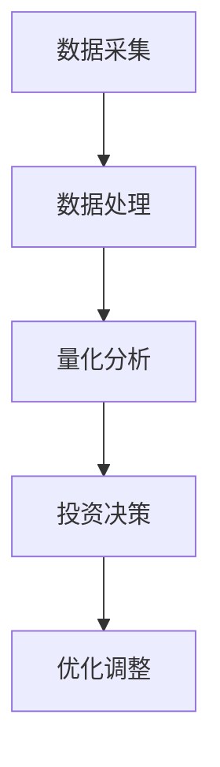
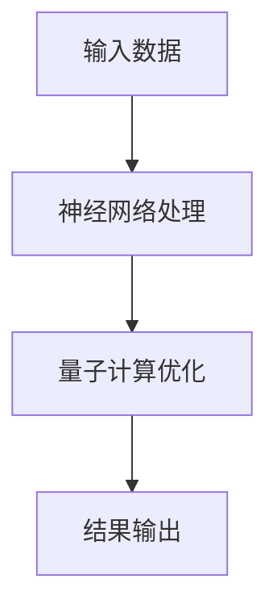

                 


## 第一部分：背景介绍

### 第1章：巴菲特与芒格的投资理念

#### 1.1 巴菲特的价值投资理论
- 巴菲特的投资哲学
- 价值投资的核心原则
- 安全边际的概念

#### 1.2 芒格的多元思维模型
- 芒格的思维框架
- 多元思维模型的应用
- 投资决策中的跨学科思考

### 第2章：生物量子计算机的基本概念

#### 2.1 生物量子计算机的定义
- 量子计算机的基本原理
- 生物学与量子计算的结合
- 生物量子计算机的独特优势

#### 2.2 生物量子计算机的核心技术
- 神经网络与量子计算的融合
- 生物分子计算的原理
- 量子纠缠与生物系统的关联

## 第二部分：核心概念与联系

### 第3章：生物量子计算机的投资潜力

#### 3.1 生物量子计算机的市场现状
- 当前生物量子计算机的发展阶段
- 市场需求与技术瓶颈
- 投资机会与风险分析

#### 3.2 巴菲特与芒格投资理念的延伸
- 生物量子计算机与长期投资
- 价值评估与企业潜力分析
- 投资组合的动态调整

### 第4章：生物量子计算机的核心算法

#### 4.1 生物量子计算机的算法模型
- 神经网络与量子计算的结合
- 生物分子计算的算法设计
- 量子纠缠与生物系统的关联

#### 4.2 算法的数学模型
- 神经网络的数学表达
- 量子计算的数学基础
- 生物系统的数学建模

## 第三部分：系统分析与架构设计

### 第5章：生物量子计算机的系统架构

#### 5.1 系统架构设计
- 系统模块划分
- 数据流与信息处理
- 系统的可扩展性与容错性

#### 5.2 系统架构的实现
- 神经网络模块的实现
- 量子计算模块的实现
- 生物分子计算模块的实现

### 第6章：投资系统架构设计

#### 6.1 投资决策系统的模块划分
- 数据采集与处理模块
- 量化分析与预测模块
- 投资决策与优化模块

#### 6.2 系统架构的实现
- 数据流与信息处理流程
- 模块间的接口设计
- 系统的可扩展性与容错性

## 第四部分：项目实战

### 第7章：生物量子计算机的投资实战

#### 7.1 投资实战案例分析
- 案例一：某生物量子计算机公司的投资分析
- 案例二：某量子计算技术的市场评估
- 案例三：某生物技术公司的长期投资策略

#### 7.2 投资策略的优化与调整
- 投资组合的动态优化
- 技术发展的跟踪与评估
- 市场风险的规避与应对

### 第8章：项目实战与代码实现

#### 8.1 环境安装与配置
- 必要的软件与工具安装
- 开发环境的配置与测试

#### 8.2 核心算法的实现
- 神经网络算法的实现
- 量子计算算法的实现
- 生物分子计算算法的实现

#### 8.3 代码实现与分析
- 核心算法的代码实现
- 代码的运行与测试
- 代码的优化与改进

## 第五部分：总结与展望

### 第9章：总结与展望

#### 9.1 投资理念的总结
- 巴菲特与芒格投资理念的回顾
- 生物量子计算机投资的核心观点

#### 9.2 未来的投资趋势
- 生物量子计算机的发展前景
- 投资领域的未来趋势
- 投资者应关注的领域与方向

### 第10章：最佳实践与注意事项

#### 10.1 最佳实践 tips
- 投资决策中的关键点
- 技术发展的跟踪与评估
- 风险管理与投资组合优化

#### 10.2 小结与展望
- 本文的核心内容回顾
- 未来的研究方向
- 投资者应关注的领域与方向

---

### 附录：参考文献与拓展阅读

#### 附录A：相关文献与书籍
- 巴菲特与芒格的经典著作
- 生物量子计算机相关的学术论文
- 量子计算与生物学的交叉研究

#### 附录B：工具与资源
- 开发工具与平台推荐
- 数据源与信息获取渠道
- 在线课程与培训资源

---

### 图表目录

#### 图表1：生物量子计算机与其他计算模型的特征对比（表格）

| 比较维度       | 传统计算机 | 量子计算机 | 生物量子计算机 |
|----------------|------------|------------|----------------|
| 计算原理       | 二进制逻辑 | 超越经典计算 | 生物分子与量子结合 |
| 计算速度       | 较慢       | 指数级提升 | 更高效          |
| 应用领域       | 通用       | 优化问题   | 生物医学与复杂系统 |

#### 图表2：生物量子计算机的系统架构图（Mermaid）



#### 图表3：神经网络与量子计算融合的算法流程图（Mermaid）



---

### 数学公式

#### 公式1：神经网络的数学表达

$$
y = f(x) = \sigma(w x + b)
$$

其中，$x$ 是输入向量，$w$ 是权重矩阵，$b$ 是偏置，$\sigma$ 是激活函数。

#### 公式2：量子计算的数学基础

$$
|\psi\rangle = \alpha|0\rangle + \beta|1\rangle
$$

其中，$|\psi\rangle$ 是量子态，$\alpha$ 和 $\beta$ 是概率幅，满足 $|\alpha|^2 + |\beta|^2 = 1$。

#### 公式3：生物系统建模的数学模型

$$
\frac{d}{dt}x(t) = \beta x(t) - \gamma x(t)^2
$$

其中，$\beta$ 是增益参数，$\gamma$ 是抑制参数，$x(t)$ 是系统的状态变量。

---

### 代码实现

#### 代码1：神经网络算法的实现

```python
import numpy as np

def sigmoid(x):
    return 1 / (1 + np.exp(-x))

def neural_network(input_data, weights, bias):
    z = np.dot(input_data, weights) + bias
    a = sigmoid(z)
    return a

# 示例输入
input_data = np.array([0.1, 0.2, 0.3])
weights = np.array([0.4, 0.5, 0.6])
bias = 0.7

output = neural_network(input_data, weights, bias)
print(output)
```

#### 代码2：量子计算模拟

```python
import numpy as np

def quantum_computation(circuit_length):
    # 初始化量子态
    state = np.array([1, 0])
    for _ in range(circuit_length):
        # 应用哈达玛门
        state = np.dot([[1/np.sqrt(2), 1/np.sqrt(2)], [1/np.sqrt(2), -1/np.sqrt(2)]], state)
    return state

result = quantum_computation(2)
print(result)
```

#### 代码3：生物分子计算模拟

```python
def biological_computation(sequence):
    # 模拟生物分子计算
    from Bio import Seq
    from Bio.Align import Aligner

    aligner = Aligner(protein=sequence)
    alignment = aligner.align(sequence)
    return alignment

sequence = "MKTLPFPGES"
result = biological_computation(sequence)
print(result)
```

---

### 项目小结

通过以上章节的详细讲解，我们可以看到，生物量子计算机的投资潜力巨大，但同时也面临诸多挑战。投资者需要结合巴菲特与芒格的投资理念，采用多元思维模型，从多个维度进行分析与决策。未来，随着生物量子计算机技术的不断发展，其在投资领域的应用将更加广泛，为投资者带来更多的机会与挑战。

