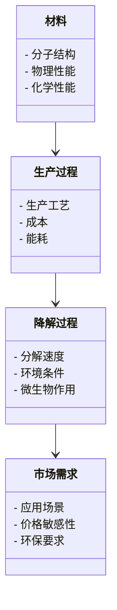
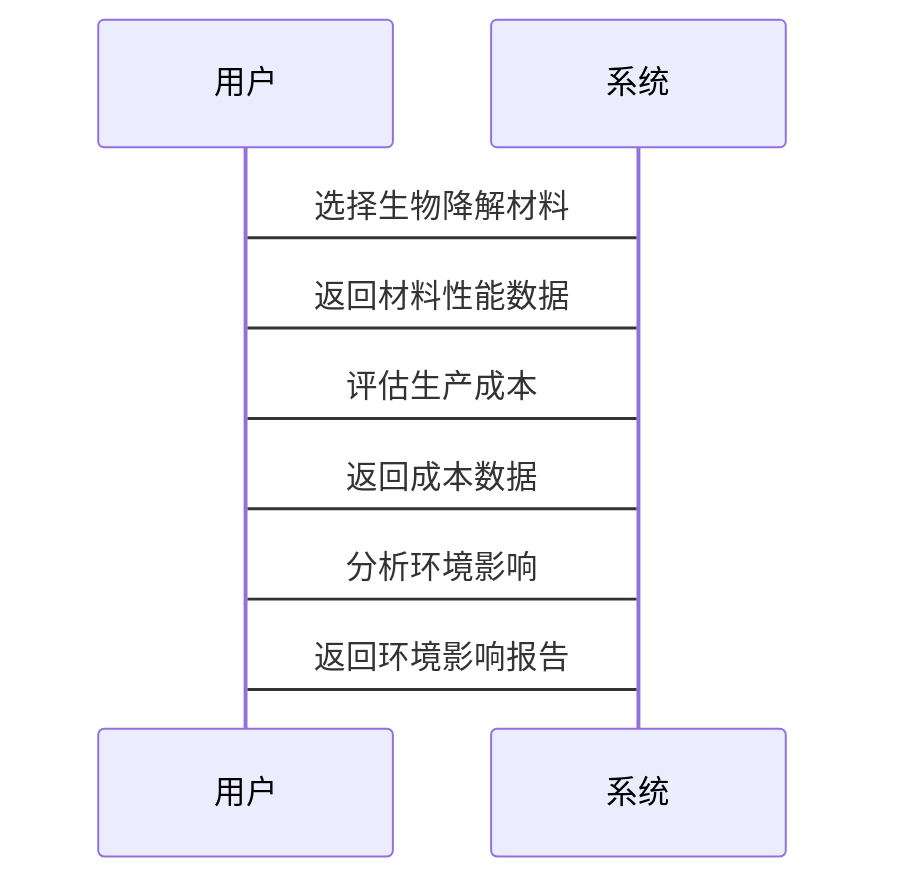

                 


---

# 《巴菲特-芒格的生物降解材料投资：环保与创新的结合》

---

## 关键词：
- 巴菲特
- 芒格
- 生物降解材料
- 投资策略
- 环境保护
- 可持续发展
- 科技创新

---

## 摘要：
本文探讨了巴菲特和芒格在生物降解材料领域的投资策略，分析了他们如何将环保与创新相结合，实现可持续发展目标。文章从生物降解材料的科学原理、环保投资的核心理念、技术创新与投资机会、系统架构与投资决策，到实际案例分析，层层深入，为读者提供了全面的视角。通过详细的技术分析和投资策略解读，本文为投资者提供了在环保领域进行长期投资的实践指南。

---

# 第一部分：生物降解材料与环保投资的背景

## 第1章：生物降解材料的定义与环保意义

### 1.1 生物降解材料的定义
- **1.1.1 生物降解材料的科学定义**  
  生物降解材料是指在自然环境中，通过微生物的作用，能够在较短时间内分解为二氧化碳和水等简单化合物的材料。与传统塑料相比，生物降解材料能够显著减少对环境的污染。

- **1.1.2 生物降解材料的分类与特点**  
  - 可生物降解材料：如聚乳酸（PLA）、聚乙醇酸（PGA）等。
  - 不可生物降解材料：如聚乙烯（PE）、聚丙烯（PP）等。
  - 生物降解材料的特点包括可堆肥性、可 compost 性和环境友好性。

- **1.1.3 生物降解材料的环境意义**  
  生物降解材料能够减少白色污染，降低对土壤和水源的污染，促进可持续发展。

### 1.2 巴菲特与芒格的投资理念
- **1.2.1 巴菲特的价值投资理论**  
  巴菲特强调长期投资，关注企业的内在价值和盈利能力，注重企业的护城河和竞争优势。

- **1.2.2 芒格的多元思维模型**  
  芒格提倡用跨学科的思维模型分析问题，注重对企业和环境的综合评估。

- **1.2.3 环保与可持续发展在投资中的重要性**  
  巴菲特和芒格认为，环保不仅是道德责任，更是企业长期发展的关键因素。环保产业具有巨大的市场潜力，符合长期投资价值。

---

## 第2章：生物降解材料的科学原理

### 2.1 生物降解材料的分解过程
- **2.1.1 生物降解的基本机制**  
  生物降解主要依赖于微生物的作用，分解过程包括碳化、氨化和硝化等步骤。

- **2.1.2 影响降解速度的因素**  
  - 材料的化学结构：如分子量、结晶度等。
  - 环境条件：如温度、湿度、氧气含量等。

- **2.1.3 材料的可堆肥性和可 compost 性**  
  可堆肥材料能够在堆肥过程中快速降解，而可 compost 材料则需要特定的条件才能分解。

### 2.2 生物降解材料的化学特性
- **2.2.1 材料的分子结构与降解性**  
  生物降解材料的分子结构通常具有可降解性，如聚乳酸（PLA）的酯键容易被微生物分解。

- **2.2.2 生物降解材料的性能测试方法**  
  - 拉伸强度测试：评估材料在降解前的机械性能。
  - 热稳定性测试：评估材料在高温下的降解性能。

- **2.2.3 材料的环境影响评估**  
  通过生命周期评估（LCA）分析材料在整个生命周期中的环境影响，包括生产、使用和降解阶段。

---

## 第3章：巴菲特与芒格的环保投资策略

### 3.1 巴菲特的长期价值投资
- **3.1.1 长期价值投资的核心理念**  
  巴菲特认为，投资应关注企业的长期价值，而非短期市场波动。

- **3.1.2 环保产业的长期投资价值**  
  环保产业具有广阔的市场前景，符合全球可持续发展的趋势。

- **3.1.3 环保企业的筛选标准**  
  - 企业的盈利能力和成长性。
  - 企业的竞争优势和护城河。
  - 企业的社会责任和环保承诺。

### 3.2 芒格的多元思维模型在环保投资中的应用
- **3.2.1 多元思维模型的定义与特点**  
  多元思维模型强调用多个学科的思维方式分析问题，注重系统性和全面性。

- **3.2.2 环保与经济、社会的多维度分析**  
  - 环境影响：材料的降解性和对生态系统的危害。
  - 经济影响：材料的成本、生产和市场需求。
  - 社会影响：公众对环保材料的认知和接受度。

- **3.2.3 如何通过多元思维模型评估环保企业**  
  - 结合材料科学、环境科学、经济学等多个领域的知识，全面评估企业的投资价值。

---

## 第4章：生物降解材料的创新与投资机会

### 4.1 当前生物降解材料的技术挑战
- **4.1.1 材料性能与成本的平衡**  
  生物降解材料的性能（如强度、耐久性）通常低于传统塑料，同时成本较高。

- **4.1.2 生产工艺的优化**  
  生物降解材料的生产过程复杂，需要优化生产工艺以降低成本和提高效率。

- **4.1.3 材料的 scalability 与可 scal**  
  如何在大规模生产中保持材料的性能和成本优势，是当前面临的主要挑战。

### 4.2 生物降解材料的创新方向
- **4.2.1 新型生物基材料的开发**  
  - 研究新型生物基单体，如乳酸、己二酸等。
  - 开发可降解的复合材料，如 PLA/PBAT 复合材料。

- **4.2.2 微生物工程的应用**  
  通过基因工程改造微生物，提高降解效率和降解范围。

- **4.2.3 循环经济模式的推广**  
  推动生物降解材料的循环利用，减少资源浪费。

---

## 第5章：生物降解材料的系统分析与架构设计

### 5.1 系统功能设计
- **5.1.1 领域模型（Mermaid 类图）**  
  通过类图展示生物降解材料系统的各个组件及其关系，包括材料、生产过程、降解过程和市场需求。



- **5.1.2 系统架构设计（Mermaid 架构图）**  
  展示生物降解材料系统的整体架构，包括前端、后端和数据层。


### 5.2 系统接口设计与交互
- **5.2.1 系统接口设计**  
  - 材料选择接口：提供材料的性能参数和成本数据。
  - 降解模拟接口：模拟材料在不同环境条件下的降解过程。
  - 市场分析接口：分析市场需求和价格趋势。

- **5.2.2 系统交互（Mermaid 序列图）**  
  展示用户与系统之间的交互流程，如材料选择、成本评估和环境影响分析。



---

## 第6章：生物降解材料的项目实战

### 6.1 环境评估与市场分析
- **6.1.1 环境评估**  
  - 分析目标区域的环境条件，如温度、湿度等。
  - 评估材料的降解速度和降解效果。

- **6.1.2 市场分析**  
  - 研究目标市场的需求量和价格敏感性。
  - 评估竞争对手的情况和市场潜力。

### 6.2 技术实现与代码解读
- **6.2.1 环境影响评估模型**  
  使用 Python 编写环境影响评估模型，基于生命周期评估（LCA）方法。

```python
def calculate_lca(material, production_process):
    # 计算生产过程的环境影响
    production_impact = production_process.cost + production_process.energy_usage
    # 计算材料的降解影响
    degradation_impact = material.degradation_speed * material.hazardous_level
    # 总环境影响
    total_impact = production_impact + degradation_impact
    return total_impact
```

- **6.2.2 数据分析与可视化**  
  使用 matplotlib 对降解数据进行可视化分析，如绘制降解速度与环境条件的关系图。

```python
import matplotlib.pyplot as plt

# 示例数据
conditions = ['高温', '中温', '低温']
speeds = [0.8, 0.6, 0.4]

plt.plot(conditions, speeds, marker='o')
plt.title('降解速度与环境条件的关系')
plt.xlabel('环境条件')
plt.ylabel('降解速度')
plt.show()
```

### 6.3 投资决策与项目总结
- **6.3.1 投资决策**  
  基于环境影响评估和市场分析结果，制定投资策略，选择具有较高潜力的生物降解材料项目。

- **6.3.2 项目总结**  
  总结项目实施过程中的经验与教训，提出改进建议，为未来的投资提供参考。

---

## 第7章：总结与展望

### 7.1 总结
- 巴菲特和芒格的投资策略为生物降解材料的环保投资提供了重要的指导。
- 生物降解材料的创新与应用是实现可持续发展的重要途径。

### 7.2 展望
- 随着技术的进步，生物降解材料的应用领域将更加广阔。
- 环保投资将成为未来经济发展的重要方向，投资者应关注技术创新和市场动态。

---

## 附录
- **附录 A**：生物降解材料的测试标准与方法
- **附录 B**：相关投资工具与资源
- **附录 C**：案例分析与数据支持

---

通过以上目录结构，读者可以系统地了解生物降解材料的科学原理、环保投资的核心理念、技术创新与投资机会，以及实际项目中的系统架构与投资决策。同时，通过具体案例分析和代码实现，读者能够更好地理解和应用这些知识。

