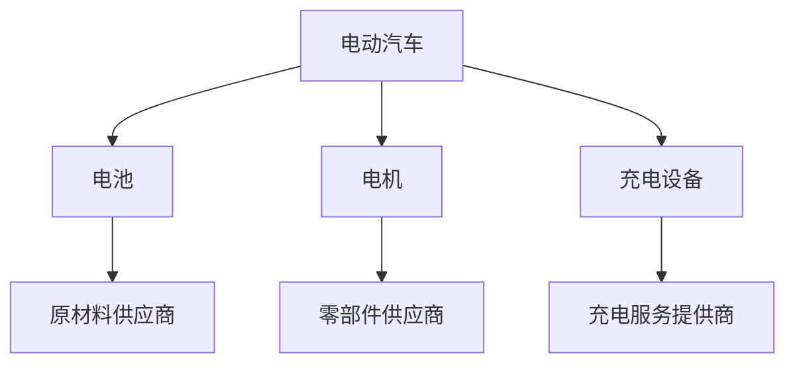
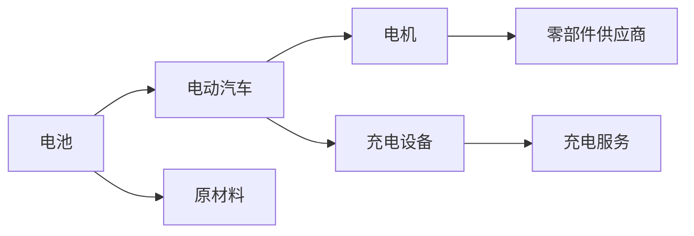

                 

# 巴菲特-芒格的电动汽车产业链投资：全面布局未来出行

## 关键词：巴菲特，芒格，电动汽车产业链，投资策略，电动汽车，产业链分析

## 摘要：本文系统分析了巴菲特和芒格在电动汽车产业链上的投资策略，从产业链的核心概念到系统架构，再到实战案例，深入探讨了他们如何布局未来出行方式。通过详细的技术分析和实际案例解读，本文为读者提供了全面理解电动汽车产业链投资的深度洞察。

---

# 第一部分: 电动汽车产业链投资背景与现状

# 第1章: 电动汽车产业链的现状与发展趋势

## 1.1 电动汽车产业链的定义与构成

### 1.1.1 电动汽车产业链的定义
电动汽车产业链是指从原材料供应、电池制造、电机生产、充电设备到整车制造、充电服务等环节构成的完整产业生态。

### 1.1.2 产业链的主要构成环节
- 上游：原材料（锂、镍、钴等）、电池组件（正负极材料、电解液等）
- 中游：电池制造（锂离子电池、镍氢电池等）、电机生产、电控系统
- 下游：整车制造、充电设备、充电服务

### 1.1.3 产业链的上下游关系
通过原材料供应、零部件生产、整车制造和充电服务，形成一个从上游到下游的完整生态链。

## 1.2 电动汽车行业的现状与未来趋势

### 1.2.1 全球电动汽车市场的增长现状
近年来，全球电动汽车销量持续增长，主要驱动力包括政策支持、环保需求和技术进步。

### 1.2.2 电动汽车行业的技术进步
电池技术的进步显著提升了电动汽车的续航能力和安全性，电机技术的优化提高了能效。

### 1.2.3 未来出行方式的演变趋势
电动汽车将成为主流，共享出行、自动驾驶等新技术将改变未来的出行方式。

## 1.3 巴菲特与芒格的投资理念概述

### 1.3.1 巴菲特的价值投资理念
巴菲特注重企业的内在价值，寻找具备持续盈利能力的企业进行长期投资。

### 1.3.2 芒格的多元思维模型
芒格强调多学科思维，注重风险控制和企业护城河。

### 1.3.3 两人投资理念的异同点
- 相同点：长期投资、价值导向
- 不同点：巴菲特更关注财务指标，芒格更关注企业竞争力和风险管理。

## 1.4 巴菲特与芒格为何布局电动汽车产业链

### 1.4.1 电动汽车行业的战略重要性
电动汽车是全球能源转型和环保的重要方向，具备巨大的市场潜力。

### 1.4.2 巴菲特与芒格的投资逻辑
- 巴菲特看好电动汽车的市场增长和企业的长期盈利能力。
- 芒格关注行业的技术壁垒和企业的竞争优势。

### 1.4.3 产业链投资的长期性与稳定性
电动汽车产业链具备长期增长潜力，投资具有较高的稳定性。

## 1.5 本章小结
本章分析了电动汽车产业链的现状和未来趋势，介绍了巴菲特和芒格的投资理念，并探讨了他们布局电动汽车产业链的原因。

---

# 第二部分: 电动汽车产业链的核心概念与联系

# 第2章: 电动汽车产业链的核心要素分析

## 2.1 电动汽车产业链的实体关系图

## 2.2 核心概念的属性对比

| 概念 | 属性 | 描述 |
|------|------|------|
| 电池 | 能量密度 | 单位体积的能量存储能力 |
| 电机 | 效率 | 转换电能为机械能的效率 |
| 充电设备 | 充电速度 | 充电时间与电池容量的关系 |

## 2.3 产业链的关键环节分析

### 2.3.1 电池技术
电池技术是电动汽车的核心，直接影响续航能力和成本。

### 2.3.2 电机系统
高效电机是提升能效和性能的关键。

### 2.3.3 充电设施
充电设施的完善性直接影响用户体验和市场扩展。

## 2.4 产业链的系统架构设计

---

# 第三部分: 巴菲特与芒格的投资策略与分析

# 第3章: 巴菲特与芒格的投资策略解析

## 3.1 巴菲特的投资策略

### 3.1.1 价值投资的核心要素
- 企业盈利能力
- 财务状况
- 行业地位

### 3.1.2 电动汽车产业链中的投资标的
- 特斯拉（电池技术、电动汽车制造）
- 比亚迪（电池、整车制造）

## 3.2 芒格的投资策略

### 3.2.1 多元思维模型的应用
- 分析企业的竞争优势
- 评估行业的风险和不确定性

### 3.2.2 电动汽车产业链中的投资标的
- 特斯拉（技术创新）
- 洪桥集团（充电服务）

## 3.3 两人投资策略的协同效应

### 3.3.1 资源配置的协同
- 巴菲特的资金支持
- 芒格的风险控制

### 3.3.2 信息共享与决策优化
通过信息共享，优化投资决策。

---

# 第四部分: 电动汽车产业链的系统分析

# 第4章: 电动汽车产业链的系统架构

## 4.1 系统功能设计

### 4.1.1 电池管理系统
- 监控电池状态
- 优化电池使用

### 4.1.2 电机控制系统
- 调节电机转速
- 优化能量输出

## 4.2 系统架构设计

---

# 第五部分: 项目实战与案例分析

# 第5章: 电动汽车产业链投资实战分析

## 5.1 特斯拉的分析与解读

### 5.1.1 特斯拉的核心竞争力
- 技术创新
- 全球布局

### 5.1.2 投资价值分析
- 市场地位
- 技术领先性

## 5.2 比亚迪的分析与解读

### 5.2.1 比亚迪的业务模式
- 整车制造
- 电池生产

### 5.2.2 投资价值分析
- 产业链整合能力
- 成本优势

---

# 第六部分: 总结与展望

# 第6章: 总结与展望

## 6.1 本章小结
总结全文，强调巴菲特和芒格在电动汽车产业链投资中的策略和成功经验。

## 6.2 投资注意事项
- 风险控制
- 长期视角

## 6.3 未来展望
电动汽车行业的技术进步和市场扩展，将继续推动产业链投资的增长。

---

通过以上目录，读者可以系统地了解巴菲特和芒格在电动汽车产业链的投资策略，从理论到实践，从分析到总结，全面掌握电动汽车产业链的投资机会和挑战。

