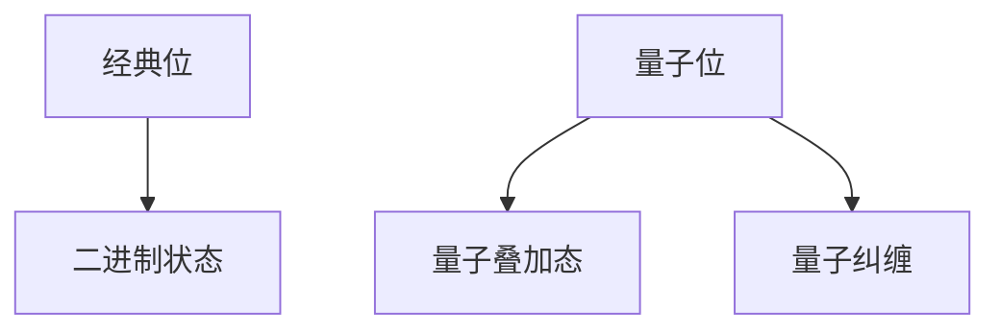
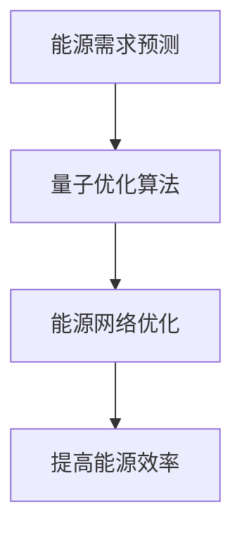
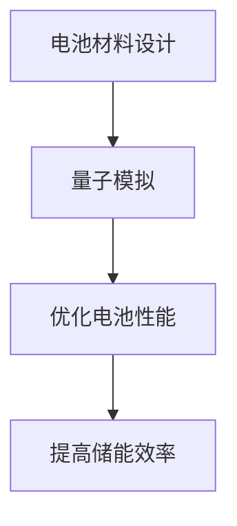
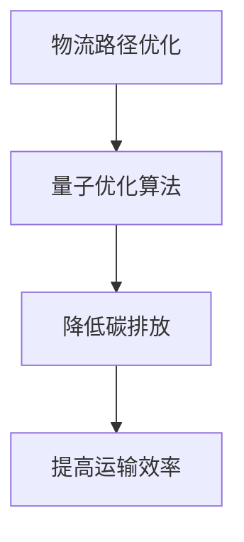
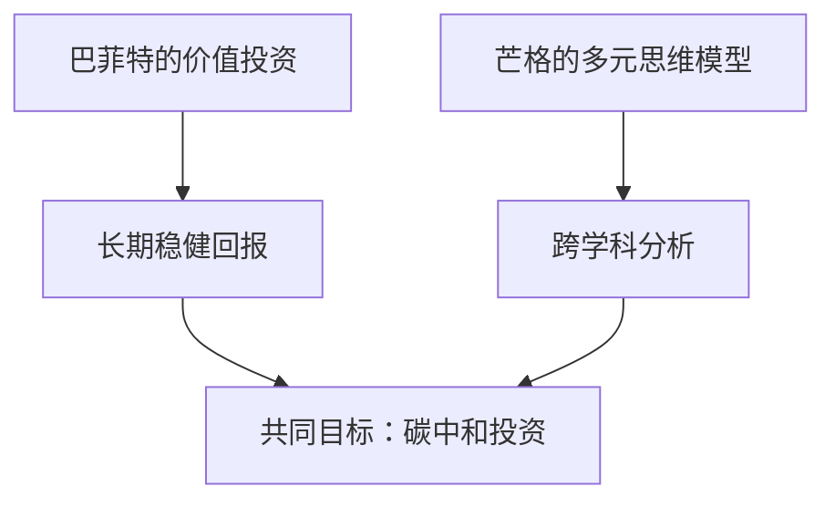
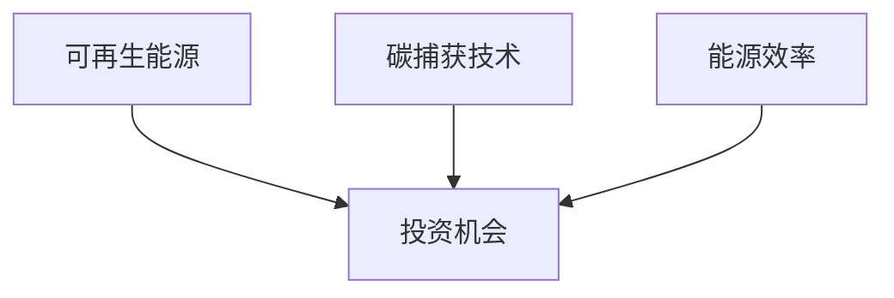
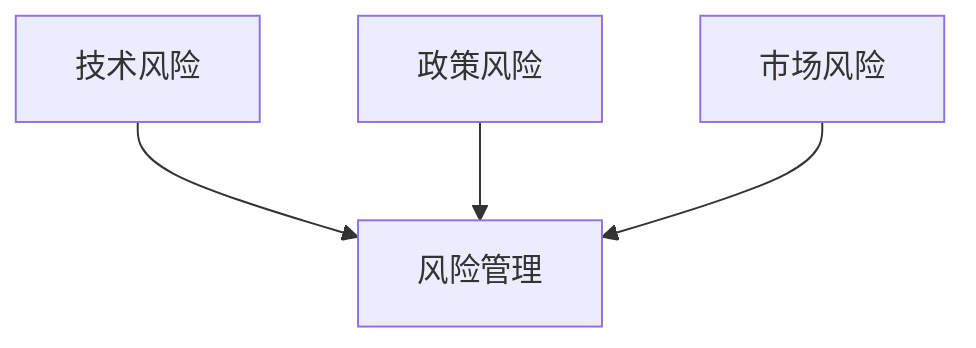
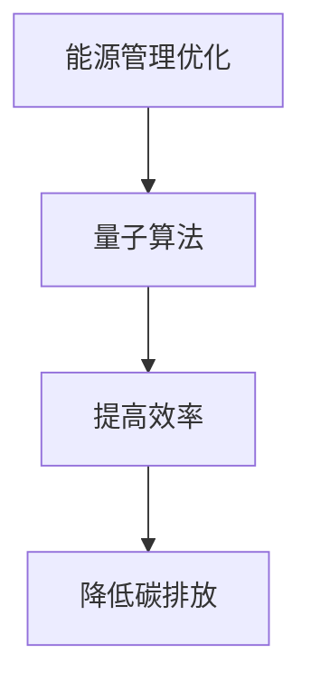

                 

# 巴菲特-芒格的碳中和技术投资：气候变化的量子解决方案

---

## 关键词

- 巴菲特投资策略
- 芮格投资哲学
- 碳中和
- 量子计算
- 气候变化解决方案

---

## 摘要

本文深入探讨了巴菲特和芒格在碳中和领域的投资策略，结合量子技术的前沿应用，分析了气候变化的潜在解决方案。文章从量子计算的基本原理出发，详细阐述了其在能源优化、材料科学和供应链管理中的应用，进而分析了巴菲特和芒格如何通过量子技术投资实现碳中和目标。文章最后总结了量子技术的投资机会和风险管理策略，为投资者提供了实用的建议。

---

## 第一部分：引言

---

### 第1章：巴菲特与芒格的投资理念

#### 1.1 投资理念概述

##### 1.1.1 巴菲特的价值投资哲学

沃伦·巴菲特的价值投资哲学强调长期稳健的投资策略，注重企业的基本面分析和内在价值。他主张投资那些具有强大竞争优势、良好治理结构和可持续增长潜力的企业。芒格的多元思维模型则强调跨学科思考，将物理学、心理学、经济学等领域的知识结合起来，寻找投资机会。

##### 1.1.2 芒格的多元思维模型

芒格的多元思维模型强调通过多个学科的交叉应用，发现投资机会和风险。他主张投资者应该像解决科学问题一样，通过系统性分析来评估投资项目。

##### 1.1.3 两人投资理念的结合

巴菲特和芒格的投资理念结合了长期价值投资和跨学科分析，形成了独特的投资策略。他们将目光投向碳中和领域，认为这将是未来几十年最重要的投资方向之一。

---

### 第2章：气候变化与碳中和的背景

#### 2.1 气候变化的现状

##### 2.1.1 气候变化的科学基础

气候变化是由人类活动（如化石燃料的使用、森林砍伐等）导致的全球变暖现象。科学模型和历史数据表明，全球平均气温上升主要由温室气体排放引起。

##### 2.1.2 人类活动对气候变化的影响

工业革命以来，人类活动导致的温室气体排放显著增加。根据IPCC报告，过去100年的气温上升速度远超自然变化的范围。

##### 2.1.3 气候变化的经济影响

气候变化可能导致全球经济损失，包括农业减产、自然灾害频发、基础设施损坏等。据估计，如果不采取行动，气候变化可能导致全球经济损失超过20%。

#### 2.2 碳中和的目标与挑战

##### 2.2.1 碳中和的定义与目标

碳中和是指通过减少温室气体排放和增加碳汇，使净碳排放量为零。其目标是到2050年实现全球碳中和，以防止气候变化的最严重影响。

##### 2.2.2 碳中和实现的路径

实现碳中和的主要路径包括发展可再生能源、提高能源效率、推广碳捕获技术等。

##### 2.2.3 实现碳中和的主要挑战

实现碳中和面临技术、经济和政策等多方面的挑战。例如，可再生能源的不稳定性、储能技术的不足、政策协调的困难等。

---

## 第二部分：量子技术与碳中和

---

### 第3章：量子计算的基本原理

#### 3.1 量子计算的概念

##### 3.1.1 量子位与经典位的区别

量子位（qubit）与经典位（bit）的区别在于，qubit可以同时处于多个状态的叠加态，而bit只能是0或1。

##### 3.1.2 量子叠加与量子纠缠

量子叠加是指量子系统可以处于多个状态的叠加态。量子纠缠是指两个或多个量子系统之间存在关联，一个系统的状态变化会立即影响另一个系统。

##### 3.1.3 量子计算的优势

量子计算在处理某些特定问题（如大数分解、优化问题）时，比经典计算快得多。

##### 图3-1：量子叠加与纠缠的对比

---

#### 3.2 量子算法的原理

##### 3.2.1 Grover算法

Grover算法用于在未排序数据库中搜索特定项，其复杂度远低于经典算法。

##### 3.2.2 Shor算法

Shor算法用于大数分解，是量子计算在密码学中的重要应用。

##### 3.2.3 量子傅里叶变换

量子傅里叶变换用于将量子状态从时域转换到频域。

---

### 第4章：量子技术在碳中和中的应用

#### 4.1 量子计算在能源优化中的应用

##### 4.1.1 量子算法在能源网络优化中的应用

量子计算可以优化能源网络的结构，提高能源传输效率。

##### 4.1.2 量子计算在可再生能源预测中的应用

量子计算可以提高天气预测的准确性，从而优化可再生能源的生产和分配。

##### 图4-1：量子计算在能源网络优化中的应用

#### 4.2 量子技术在材料科学中的应用

##### 4.2.1 新材料的量子模拟

量子计算可以模拟新材料的物理性质，加速材料研发。

##### 4.2.2 量子计算在电池研发中的应用

量子计算可以优化电池材料的结构，提高电池的能量密度和循环寿命。

##### 图4-2：量子计算在电池研发中的应用

#### 4.3 量子技术在优化问题中的应用

##### 4.3.1 量子计算在物流优化中的应用

量子计算可以优化物流路径，降低运输成本和碳排放。

##### 4.3.2 量子计算在供应链优化中的应用

量子计算可以优化供应链的结构，提高资源利用效率。

##### 图4-3：量子计算在物流优化中的应用

---

## 第三部分：巴菲特与芒格的碳中和投资策略

---

### 第5章：巴菲特与芒格的投资策略

#### 5.1 巴菲特与芒格的投资哲学

##### 5.1.1 长期投资策略

巴菲特和芒格强调长期投资，关注企业的长期价值和可持续发展。

##### 5.1.2 价值投资与成长投资的结合

他们将价值投资和成长投资结合起来，寻找具有强大增长潜力的企业。

##### 图5-1：巴菲特与芒格的投资策略对比

---

#### 5.2 碳中和领域的投资机会

##### 5.2.1 可再生能源领域的投资

巴菲特和芒格关注太阳能、风能等可再生能源的投资机会。

##### 5.2.2 碳捕获技术的投资

他们还投资于碳捕获和封存技术，以减少大气中的碳排放。

##### 图5-2：碳中和领域的投资机会

---

#### 5.3 投资风险管理

##### 5.3.1 量子技术的风险

量子技术仍处于发展阶段，存在技术不确定性和市场风险。

##### 5.3.2 碳中和政策的不确定性

碳中和政策的不确定性可能对投资产生影响。

##### 图5-3：投资风险管理

---

### 第6章：量子技术的投资机会

#### 6.1 量子计算在能源领域的应用

##### 6.1.1 新能源技术的量子模拟

量子计算可以模拟新能源材料的物理性质，加速技术开发。

##### 6.1.2 量子计算在能源管理中的应用

量子计算可以优化能源管理和分配，提高效率。

##### 图6-1：量子计算在能源管理中的应用

---

## 第四部分：结论与展望

---

### 第7章：结论与展望

#### 7.1 量子技术与碳中和的结合

量子技术在碳中和中的应用将推动能源、材料科学和优化问题的发展。

#### 7.2 未来的发展趋势

未来，量子技术将在碳中和领域发挥更重要的作用，成为解决气候变化的关键技术。

#### 7.3 投资者的建议

投资者应关注量子技术的发展，合理配置碳中和领域的投资组合。

---

## 总结

巴菲特和芒格的投资理念与量子技术的结合，为解决气候变化提供了新的思路。通过量子计算的应用，碳中和的目标将更加接近实现。投资者应关注这一领域的最新进展，抓住投资机会，同时注意风险管理。

---

## 实用小结

- **量子技术的核心优势**：量子计算在处理复杂优化问题和模拟物理系统方面具有显著优势。
- **碳中和投资的关键点**：关注可再生能源、碳捕获技术和能源效率提升等领域。
- **风险管理的注意事项**：保持投资组合的多样性，关注政策变化和技术发展。

---

## 参考文献

（此处可以添加具体的参考文献，如学术论文、书籍等。）

