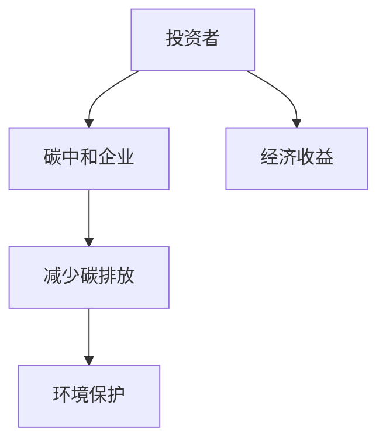
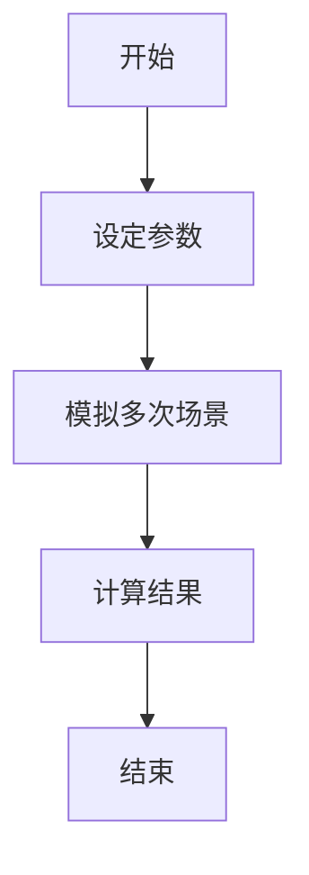
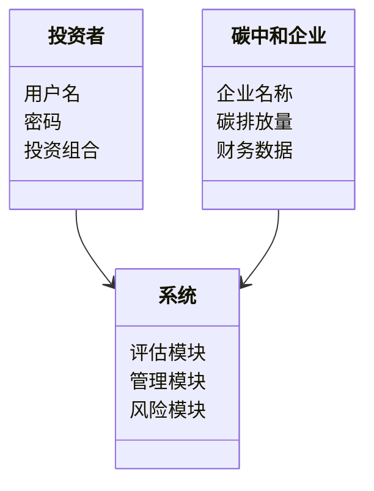
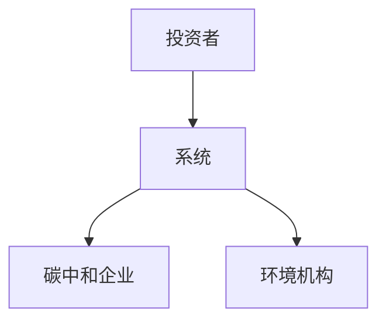

                 


# 巴菲特-芒格的碳中和投资策略：环保与盈利的平衡

> 关键词：巴菲特、芒格、碳中和、投资策略、环保、盈利、价值投资

> 摘要：本文详细探讨了巴菲特和芒格的碳中和投资策略，分析了如何在环保与盈利之间找到平衡点。通过介绍碳中和的背景、核心概念、策略实施、数学模型、系统架构以及项目实战，本文为投资者提供了从理论到实践的全面指导，帮助他们在追求经济利益的同时，也为环境保护做出贡献。

---

## 第一部分：背景介绍

### 第1章：什么是碳中和

#### 1.1 碳中和的定义
碳中和是指通过减少温室气体的排放，使得二氧化碳的净排放量为零，从而实现对环境的保护。这一目标是全球应对气候变化的重要举措。

#### 1.2 碳中和的背景与重要性
随着全球气候变化的加剧，碳中和已成为各国政府和企业的共同目标。环保不再仅仅是社会责任，而是企业可持续发展的关键因素。

#### 1.3 碳中和与投资的关联
碳中和的目标需要大量资金投入，特别是在清洁能源、节能环保等领域。投资者可以通过投资这些领域实现环保目标，同时获得经济回报。

---

### 第2章：碳中和投资的必要性

#### 2.1 环境保护的压力
全球气候变化带来的环境问题对企业经营和投资产生了深远影响。环保压力促使投资者重新审视其投资策略。

#### 2.2 碳中和对企业的长期影响
通过投资碳中和项目，企业可以降低运营成本、提高能源效率，并在未来的绿色经济中占据优势。

#### 2.3 投资者的社会责任
作为社会的一部分，投资者有责任通过投资行为推动环境保护，实现可持续发展。

---

## 第二部分：核心概念与联系

### 第3章：碳中和投资策略的核心要素

#### 3.1 碳中和投资的核心定义
碳中和投资策略是指通过投资于低碳排放或能够减少碳排放的企业，实现环保目标的同时获取经济收益。

#### 3.2 碳中和投资的属性特征对比
| 属性       | 传统投资         | 碳中和投资       |
|------------|------------------|------------------|
| 目标       | 追求收益         | 环保+收益       |
| 风险       | 高               | 中低             |
| 社会责任   | 较低             | 高               |

#### 3.3 实体关系图


---

## 第三部分：策略实施与数学模型

### 第4章：碳中和投资策略的实施

#### 4.1 行业分析与投资机会
在清洁能源、节能环保等领域寻找投资机会，评估企业的碳排放和环保表现。

#### 4.2 投资组合构建
根据企业的碳表现和财务状况，构建多元化的投资组合，分散风险。

#### 4.3 风险管理
通过设定碳排放阈值和定期评估企业表现，动态调整投资组合。

#### 4.4 案例分析
以巴菲特投资比亚迪为例，分析其如何通过投资低碳企业实现碳中和目标。

---

### 第5章：数学模型与算法

#### 5.1 评估模型
使用净现值法（NPV）评估碳中和项目的经济效益：
$$ NPV = \sum_{t=1}^{n} \frac{CF_t}{(1+r)^t} $$
其中，\( CF_t \) 是第t年的现金流，\( r \) 是贴现率。

#### 5.2 风险管理模型
使用蒙特卡洛模拟评估碳中和投资的风险：


#### 5.3 代码实现
```python
import numpy as np

def calculate_npv(cash_flows, discount_rate):
    return np.npv(discount_rate, *cash_flows)

cash_flows = [-100, 50, 60, 70]
discount_rate = 0.1

npv = calculate_npv(cash_flows, discount_rate)
print(f"净现值为：{npv}")
```

---

## 第四部分：系统架构与设计

### 第6章：碳中和投资管理系统设计

#### 6.1 系统功能设计


#### 6.2 系统架构


---

## 第五部分：项目实战

### 第7章：碳中和投资实战分析

#### 7.1 项目背景与目标
选择一家新能源公司作为投资标的，分析其财务状况、碳排放表现和市场前景。

#### 7.2 环境分析
评估公司的环保措施和碳排放数据，确保其符合碳中和目标。

#### 7.3 财务与风险评估
使用NPV和蒙特卡洛模拟评估项目的经济效益和风险。

#### 7.4 投资决策
基于评估结果，决定是否投资并制定投资计划。

---

## 第六部分：总结与展望

### 第8章：总结与未来方向

#### 8.1 碳中和投资策略的总结
通过本文的分析，我们可以看到，碳中和投资策略不仅能够实现环保目标，还能带来经济收益。

#### 8.2 未来的发展方向
随着技术的进步和政策的支持，碳中和投资将更加重要，投资者需要不断学习和调整策略。

---

### Tips: 投资者的最佳实践

- **长期视角**：关注企业的长期价值，而非短期收益。
- **多元化投资**：分散风险，避免过度集中。
- **持续学习**：关注环保技术和政策变化，及时调整投资策略。

---

通过本文的详细分析，读者可以全面了解巴菲特和芒格的碳中和投资策略，并能够在实际操作中应用这些方法，实现环保与盈利的双重目标。

