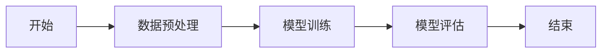
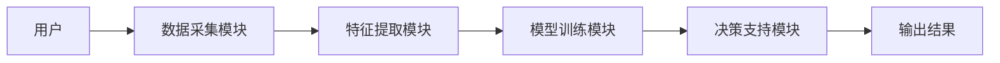
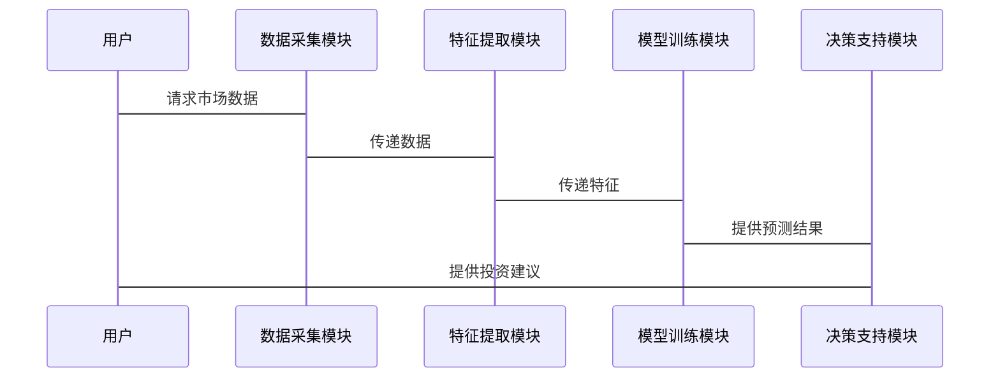

                 


# 巴菲特-芒格的神经形态工程投资：类脑计算的产业化

> **关键词**：神经形态工程、类脑计算、巴菲特、芒格、投资策略、深度学习

> **摘要**：本文探讨了神经形态工程与投资领域的结合，特别是巴菲特和芒格的投资理念在类脑计算中的应用。通过分析神经形态工程的核心原理、算法实现、系统架构设计以及项目实战，展示了如何利用类脑计算技术优化投资决策过程。

---

## 第一部分: 巴菲特-芒格的神经形态工程投资概述

### 第1章: 神经形态工程与投资的结合

#### 1.1 神经形态工程的基本概念

- **神经形态工程的定义**：神经形态工程是研究如何模拟人脑神经结构和功能的计算方式，以实现高效的信息处理和决策。
- **类脑计算的核心原理**：通过模拟生物神经网络，利用深度学习算法进行特征提取和模式识别。
- **神经形态工程在投资中的应用前景**：通过分析大量市场数据，识别潜在的投资机会和风险。

#### 1.2 巴菲特与芒格的投资理念

- **巴菲特的价值投资方法**：长期持有优质资产，注重企业的基本面分析。
- **芒格的多元思维模型**：强调多学科知识的交叉应用，以全面评估投资标的的价值。
- **投资理念与神经形态工程的联系**：神经形态工程通过数据驱动的方法，帮助投资者更高效地识别优质资产，符合巴菲特和芒格的价值投资理念。

---

## 第2章: 神经形态工程在投资中的应用背景

### 2.1 当前投资领域的技术挑战

- **传统投资分析的局限性**：依赖人工经验，难以处理海量数据，决策过程存在主观性。
- **数据爆炸与投资决策的复杂性**：市场数据的多样性和复杂性增加了投资决策的难度。
- **神经形态工程的优势**：通过自动化数据处理和深度学习，提高投资决策的准确性和效率。

### 2.2 神经形态工程的核心优势

- **类脑计算的自适应性**：能够根据市场变化动态调整投资策略。
- **神经网络的模式识别能力**：在复杂数据中发现潜在的模式和趋势。
- **神经形态工程在风险控制中的应用**：通过实时监控和预测，降低投资风险。

---

## 第二部分: 神经形态工程的核心概念与联系

### 第3章: 神经形态工程的核心原理

#### 3.1 神经网络模型

- **人工神经网络的结构**：包括输入层、隐藏层和输出层，模拟人脑神经网络的结构。
- **深度学习的基本原理**：通过多层神经网络，自动提取数据特征，进行分类和预测。
- **神经网络在投资中的应用**：用于市场趋势预测、风险评估和投资组合优化。

#### 3.2 特征提取与决策机制

- **特征提取的方法**：利用主成分分析、LSTM等技术，从海量数据中提取有价值的信息。
- **决策机制的构建**：基于提取的特征，构建决策树或随机森林模型，辅助投资决策。
- **神经网络在特征提取中的应用**：通过卷积神经网络（CNN）提取图像特征，用于分析K线图。

### 第4章: 投资方法与神经形态工程的对比分析

#### 4.1 传统投资方法的特点

- **基于财务指标的分析**：依赖财务报表中的数据，如市盈率、ROE等。
- **基于市场情绪的分析**：通过市场情绪指标预测市场走势。
- **传统方法的优缺点**：优点是易于理解和操作，缺点是缺乏对复杂市场动态的适应性。

#### 4.2 神经形态工程方法的特点

- **数据驱动的分析方式**：通过大量数据训练神经网络，实现自动化的投资决策。
- **高维数据的处理能力**：能够处理多维度、多类型的数据，发现潜在的模式和趋势。
- **自适应学习的能力**：能够根据市场变化动态调整模型参数，提高预测准确性。

#### 4.3 对比分析与优势总结

- **数据驱动 vs 经验驱动**：神经形态工程通过数据驱动的方式，提高了投资决策的科学性和客观性。
- **高维数据处理能力**：神经形态工程能够处理复杂的数据结构，发现传统方法难以识别的模式。
- **自适应学习能力**：神经网络能够不断学习和优化，适应市场的变化。

---

## 第三部分: 神经形态工程的算法原理

### 第5章: 神经网络算法实现

#### 5.1 基于深度学习的市场预测模型

- **模型结构设计**：使用LSTM网络进行时间序列预测。
- **算法实现步骤**：
  1. 数据预处理：标准化和分割训练集、验证集、测试集。
  2. 模型训练：使用随机梯度下降优化器，训练网络参数。
  3. 模型评估：计算均方误差（MSE）和准确率。

#### 5.2 算法流程图



#### 5.3 核心代码实现

```python
import numpy as np
import tensorflow as tf
from tensorflow.keras.models import Sequential
from tensorflow.keras.layers import LSTM, Dense, Dropout

# 数据预处理
data = np.random.rand(1000, 1)
train_data = data[:700]
test_data = data[700:]

model = Sequential()
model.add(LSTM(64, input_shape=(1, 1)))
model.add(Dropout(0.2))
model.add(Dense(1))

model.compile(loss='mean_squared_error', optimizer='adam')

# 模型训练
model.fit(train_data.reshape((700, 1, 1)), np.zeros(700), epochs=10, batch_size=32)

# 模型预测
predictions = model.predict(test_data.reshape((300, 1, 1)))
```

#### 5.4 数学模型与公式

- **损失函数**：均方误差（MSE）的公式为：
  $$ \text{MSE} = \frac{1}{n}\sum_{i=1}^{n}(y_i - \hat{y}_i)^2 $$
  
- **优化器**：随机梯度下降（SGD）的更新公式为：
  $$ \theta = \theta - \eta \frac{\partial L}{\partial \theta} $$

---

## 第四部分: 神经形态工程的系统架构设计

### 第6章: 系统分析与架构设计

#### 6.1 问题场景介绍

- **目标**：构建一个基于神经形态工程的投资决策系统。
- **用户角色**：投资者、投资顾问。
- **核心需求**：实时市场监控、自动投资决策、风险预警。

#### 6.2 系统功能设计

- **数据采集模块**：收集市场数据，包括股票价格、财务指标等。
- **特征提取模块**：使用神经网络提取数据特征。
- **模型训练模块**：训练投资决策模型。
- **决策支持模块**：提供投资建议和风险预警。

#### 6.3 系统架构设计



#### 6.4 系统接口设计

- **数据接口**：与数据源（如Yahoo Finance）对接，获取实时数据。
- **用户接口**：提供直观的用户界面，显示投资建议和风险预警。

#### 6.5 系统交互流程



---

## 第五部分: 项目实战

### 第7章: 项目实现

#### 7.1 环境安装

- **安装Python**：版本3.6以上。
- **安装TensorFlow和Keras**：使用pip安装。
- **安装其他依赖库**：如Pandas、NumPy等。

#### 7.2 核心代码实现

```python
import pandas as pd
import numpy as np
from sklearn.model_selection import train_test_split
from tensorflow.keras.models import Sequential
from tensorflow.keras.layers import LSTM, Dense, Dropout

# 数据加载与预处理
data = pd.read_csv('market_data.csv')
X = data.drop('target', axis=1).values
y = data['target'].values

X_train, X_test, y_train, y_test = train_test_split(X, y, test_size=0.2)

model = Sequential()
model.add(LSTM(64, input_shape=(X.shape[1], 1)))
model.add(Dropout(0.2))
model.add(Dense(1, activation='sigmoid'))

model.compile(loss='binary_crossentropy', optimizer='adam', metrics=['accuracy'])

# 模型训练
model.fit(X_train.reshape((X_train.shape[0], X_train.shape[1], 1)), y_train,
          epochs=10, batch_size=32, validation_data=(X_test.reshape((X_test.shape[0], X_test.shape[1], 1)), y_test))

# 模型预测
y_pred = model.predict(X_test.reshape((X_test.shape[0], X_test.shape[1], 1)))
```

#### 7.3 代码解读与分析

- **数据加载**：使用Pandas加载市场数据，包括股票价格、交易量等。
- **数据预处理**：将数据分为训练集和测试集。
- **模型构建**：构建LSTM网络，用于时间序列预测。
- **模型训练**：训练模型，并评估准确率。
- **模型预测**：使用测试数据进行预测，并与实际结果对比。

#### 7.4 实际案例分析

- **案例背景**：假设我们有一个股票数据集，包括过去100天的收盘价和成交量。
- **数据处理**：标准化数据，分割训练集和测试集。
- **模型训练**：训练LSTM网络，预测未来5天的股价走势。
- **结果分析**：比较预测值与实际值，评估模型的准确性。

#### 7.5 项目小结

- **项目总结**：神经形态工程能够有效地提高投资决策的准确性。
- **经验分享**：数据质量和模型调参对结果影响较大，需要仔细优化。
- **改进建议**：可以尝试使用更复杂的模型，如Transformer，进一步提高预测精度。

---

## 第六部分: 总结与注意事项

### 第8章: 总结

#### 8.1 最佳实践 tips

- **数据的重要性**：确保数据的完整性和质量，是模型准确性的基础。
- **模型调参**：合理选择超参数，如学习率、批量大小，可以提高模型性能。
- **风险管理**：结合神经形态工程的结果，制定科学的风险控制策略。

#### 8.2 小结

- **神经形态工程的优势**：通过数据驱动的方式，提高投资决策的效率和准确性。
- **技术与投资的结合**：神经形态工程为投资领域带来了新的可能性。

### 第9章: 注意事项

- **数据隐私**：在处理市场数据时，需要注意数据隐私和合规性。
- **模型的局限性**：神经网络模型可能存在过拟合的问题，需要进行充分的验证和测试。
- **技术更新**：投资领域技术发展迅速，需要持续关注最新的研究成果和技术动态。

### 第10章: 拓展阅读

- **推荐书籍**：
  - 《深度学习》——Ian Goodfellow
  - 《巴菲特的选股之道》——巴菲特
- **推荐博客和资源**：
  - TensorFlow官方文档
  - Keras官方文档
  - 计算机视觉和深度学习相关的技术博客

---

**摘要**：本文详细探讨了神经形态工程在投资领域的应用，特别是结合巴菲特和芒格的投资理念，展示了类脑计算在投资决策中的潜力和实际应用。通过理论分析和项目实战，本文为投资者提供了新的视角和工具，以应对复杂的市场挑战。

---

**结语**：神经形态工程的投资应用是科技与金融的完美结合，通过不断的技术创新和实践应用，未来将会有更多的可能性和突破。

