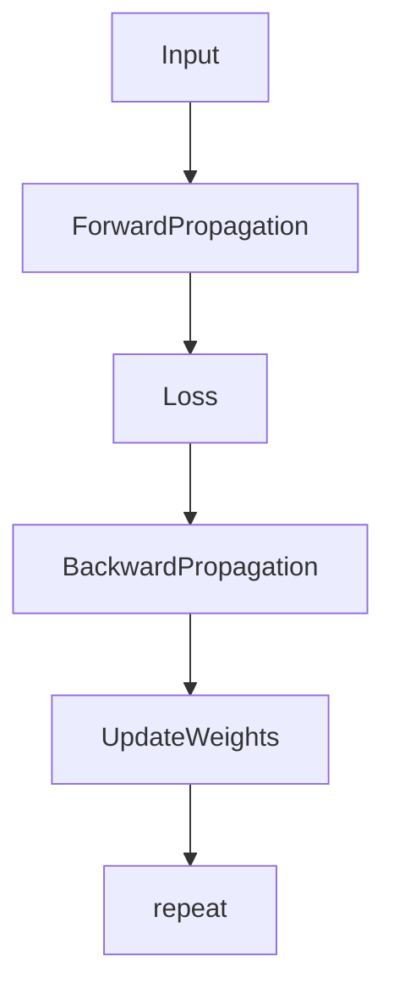

                 


# 《巴菲特-芒格的神经形态计算投资：类脑计算的未来》

## 关键词：神经形态计算，价值投资，巴菲特，芒格，类脑计算，投资决策，人工智能

## 摘要：  
本文探讨了神经形态计算在投资领域的潜力，特别是如何结合巴菲特和芒格的价值投资理念。通过分析神经形态计算的核心原理、算法与系统架构，本文展示了如何利用类脑计算技术提升投资决策的准确性和效率。文章还通过具体案例分析和代码实现，展示了神经形态计算在投资中的实际应用，并展望了其未来的发展方向。

---

## 目录

1. **摘要**  
2. **关键词**  
3. **目录**  
4. **第一章：神经形态计算与价值投资的背景**  
   - 1.1 神经形态计算的基本概念  
   - 1.2 价值投资的背景与巴菲特-芒格投资理念  
   - 1.3 神经形态计算与价值投资的结合  
5. **第二章：神经形态计算的核心原理**  
   - 2.1 神经形态计算的生物基础  
   - 2.2 神经形态计算的数学模型  
   - 2.3 神经形态计算的核心算法  
6. **第三章：神经形态计算在价值投资中的应用**  
   - 3.1 神经形态计算在投资分析中的优势  
   - 3.2 神经形态计算与巴菲特-芒格投资策略的结合  
   - 3.3 神经形态计算在投资决策中的实现步骤  
7. **第四章：神经形态计算的算法与实现**  
   - 4.1 神经网络的数学模型与训练方法  
   - 4.2 神经网络的优化策略  
   - 4.3 神经网络的实现与验证  
8. **第五章：神经形态计算的系统架构设计**  
   - 5.1 系统功能设计  
   - 5.2 系统架构图  
   - 5.3 系统接口设计  
9. **第六章：项目实战：神经形态计算在投资中的应用**  
   - 6.1 项目背景与目标  
   - 6.2 项目实现步骤  
   - 6.3 项目代码实现与解读  
10. **第七章：总结与展望**  
    - 7.1 本文总结  
    - 7.2 神经形态计算在投资中的未来发展方向  
    - 7.3 对投资者和科技从业者的建议  

---

## 第一章：神经形态计算与价值投资的背景

### 1.1 神经形态计算的基本概念

神经形态计算是一种模拟人脑神经网络结构和功能的计算范式，其核心在于通过模拟生物神经元和突触的行为，实现信息处理和计算。与传统计算不同，神经形态计算具有高度并行性、低功耗、强容错性和自适应性等特性。

#### 1.1.1 神经形态计算的定义  
神经形态计算（Neuromorphic Computing）是指通过模拟生物神经系统的结构和功能，设计新型计算架构和算法，以实现更高效、更智能的计算方式。  

#### 1.1.2 神经形态计算与传统计算的区别  
| 特性 | 传统计算 | 神经形态计算 |  
|------|------------|---------------|  
| 处理方式 | 串行处理，基于逻辑门 | 并行处理，基于神经网络 |  
| 功耗 | 高功耗 | 低功耗 |  
| 学习能力 | 无自学习能力 | 具备自学习能力 |  
| 数据处理 | 结构化数据为主 | 非结构化数据为主 |  

#### 1.1.3 神经形态计算的核心特征  
- **生物启发性**：模拟生物神经系统的结构和功能。  
- **并行性**：信息处理高度并行，提升计算效率。  
- **低功耗**：通过模拟生物神经元的特性，降低能耗。  
- **自适应性**：能够根据环境变化自动调整参数。  

### 1.2 价值投资的背景与巴菲特-芒格投资理念

#### 1.2.1 价值投资的起源与发展  
价值投资是一种以基本面分析为基础的投资策略，由本杰明·格雷厄姆和戴维·多德提出，强调以低于内在价值的价格购买优质股票。  

#### 1.2.2 巴菲特与芒格的投资策略  
- **巴菲特的投资理念**：注重企业基本面分析，寻找具有持续竞争优势和良好治理结构的企业。  
- **芒格的多元思维模型**：强调跨学科思维，将多个领域的知识融会贯通，形成对投资对象的全面认知。  

#### 1.2.3 价值投资的核心原则  
- **安全边际**：以低于内在价值的价格买入资产。  
- **长期视角**：关注企业的长期价值，而非短期波动。  
- **基本面分析**：通过对企业财务状况、行业地位和竞争优势的分析，评估其内在价值。  

### 1.3 神经形态计算与价值投资的结合

#### 1.3.1 神经形态计算在投资决策中的潜力  
神经形态计算的并行性和自适应性使其能够处理复杂的投资数据，发现传统方法难以察觉的模式和趋势。  

#### 1.3.2 巴菲特-芒格投资理念与神经形态计算的契合点  
- **基本面分析的自动化**：神经形态计算可以通过深度学习模型自动分析企业的财务数据和行业动态。  
- **多元思维模型的实现**：神经网络可以整合多个领域的知识，形成类似芒格的多元思维模型。  

#### 1.3.3 本书的研究目标与意义  
本文旨在探讨神经形态计算如何赋能价值投资，通过结合巴菲特和芒格的投资理念，提出一种基于神经网络的投资决策模型，并通过实际案例验证其有效性。  

---

## 第二章：神经形态计算的核心原理

### 2.1 神经形态计算的生物基础

#### 2.1.1 生物神经元的结构与功能  
生物神经元由树突、胞体和轴突组成，通过电信号和化学信号传递信息。  

**生物神经元的结构图（Mermaid）：**  


#### 2.1.2 神经网络的层次结构  
神经网络由输入层、隐藏层和输出层组成，各层之间通过突触连接，信息在层间传递。  

**神经网络的层次结构图（Mermaid）：**  


#### 2.1.3 突触的可塑性与学习过程  
突触的可塑性是神经网络学习的核心机制，通过调整突触权重实现对输入数据的适应性改变。  

**突触可塑性示意图（Mermaid）：**  
```mermaid
graph LR
    Neuron1[神经元1] --> Synapse[突触] --> Neuron2[神经元2]
    "输入刺激" --> Synapse
```

### 2.2 神经形态计算的数学模型

#### 2.2.1 神经元的数学模型  
霍金森方程（Hodgkin-Huxley model）描述了神经元的电压门控离子通道的动态行为。  

**霍金森方程：**  
$$ I(t) = g_K (V(t) - E_K) e^{- \frac{t}{\tau_K}} + g_{Na} (V(t) - E_{Na}) e^{- \frac{t}{\tau_{Na}}} + g_L (V(t) - E_L) $$  

#### 2.2.2 神经网络的数学表达  
神经网络的输出可以通过激活函数和权重矩阵的线性组合来表示。  

**神经网络的输出表达式：**  
$$ y = \sigma(w x + b) $$  
其中，$w$ 是权重矩阵，$x$ 是输入向量，$b$ 是偏置项，$\sigma$ 是激活函数。  

### 2.3 神经形态计算的核心算法

#### 2.3.1 神经网络的训练方法  
神经网络的训练包括前向传播和反向传播两个阶段。  

**训练流程图（Mermaid）：**  


#### 2.3.2 突触权重更新规则  
常用的突触权重更新规则包括随机梯度下降（SGD）和Adam优化器。  

**Adam优化器的权重更新公式：**  
$$ w_{t+1} = w_t - \eta \frac{g_t}{\beta_1(1-\beta_1^t) + \beta_2(1-\beta_2^t)} $$  

---

## 第三章：神经形态计算在价值投资中的应用

### 3.1 神经形态计算在投资分析中的优势

#### 3.1.1 数据处理能力  
神经形态计算能够高效处理非结构化数据，如新闻、社交媒体和财务报告。  

#### 3.1.2 模式识别能力  
通过深度学习模型，神经形态计算能够识别复杂市场中的隐藏模式。  

### 3.2 神经形态计算与巴菲特-芒格投资策略的结合

#### 3.2.1 基于神经网络的财务数据分析  
神经网络可以自动提取企业财务数据中的关键特征，帮助投资者识别具有投资价值的企业。  

#### 3.2.2 多元思维模型的实现  
通过整合多个领域的知识，神经网络可以模拟芒格的多元思维模型，提升投资决策的全面性。  

### 3.3 神经形态计算在投资决策中的实现步骤

#### 3.3.1 数据采集与预处理  
从多种数据源获取企业财务数据、市场新闻和行业报告，并进行清洗和特征提取。  

#### 3.3.2 模型训练与优化  
基于神经网络模型，利用历史数据进行训练，并通过验证集优化模型参数。  

#### 3.3.3 投资决策与风险控制  
通过神经网络模型生成投资建议，并结合传统投资策略进行风险评估和调整。  

---

## 第四章：神经形态计算的算法与实现

### 4.1 神经网络的数学模型与训练方法

#### 4.1.1 神经网络的结构设计  
根据具体任务需求，设计神经网络的层数、神经元数量和激活函数。  

#### 4.1.2 损失函数与优化目标  
常用的损失函数包括均方误差（MSE）和交叉熵损失。  

**均方误差公式：**  
$$ \text{MSE} = \frac{1}{n} \sum_{i=1}^{n} (y_i - \hat{y}_i)^2 $$  

### 4.2 神经网络的优化策略

#### 4.2.1 参数调节  
调整学习率、批量大小和动量参数，优化训练效果。  

#### 4.2.2 正则化技术  
通过L1/L2正则化防止模型过拟合。  

**L2正则化公式：**  
$$ \text{Loss} = \text{原始损失} + \lambda \sum_{i} w_i^2 $$  

### 4.3 神经网络的实现与验证

#### 4.3.1 Python代码实现  
使用深度学习框架（如TensorFlow或PyTorch）实现神经网络模型。  

**示例代码：**  
```python
import tensorflow as tf
from tensorflow.keras import layers

model = tf.keras.Sequential([
    layers.Dense(64, activation='relu'),
    layers.Dense(10, activation='softmax')
])
model.compile(optimizer='adam', loss='sparse_categorical_crossentropy', metrics=['accuracy'])
model.fit(x_train, y_train, epochs=10, batch_size=32)
```

#### 4.3.2 模型验证与优化  
通过测试集验证模型性能，并根据结果调整模型结构和超参数。  

---

## 第五章：神经形态计算的系统架构设计

### 5.1 系统功能设计

#### 5.1.1 数据采集模块  
从多种数据源获取投资相关数据，如企业财务数据、市场新闻和社交媒体数据。  

#### 5.1.2 特征提取模块  
对采集到的数据进行预处理和特征提取，生成可用于训练的特征向量。  

#### 5.1.3 模型训练模块  
利用特征向量训练神经网络模型，并保存最优模型参数。  

#### 5.1.4 投资决策模块  
基于训练好的模型生成投资建议，并输出投资决策结果。  

### 5.2 系统架构图

**系统架构图（Mermaid）：**  


### 5.3 系统接口设计

#### 5.3.1 数据输入接口  
支持多种数据格式的输入，如CSV、JSON和数据库。  

#### 5.3.2 模型接口  
提供API接口，方便其他系统调用模型进行投资决策。  

---

## 第六章：项目实战：神经形态计算在投资中的应用

### 6.1 项目背景与目标

#### 6.1.1 项目背景  
通过神经形态计算实现股票价格预测，验证其在投资中的应用潜力。  

#### 6.1.2 项目目标  
利用神经网络模型，预测股票价格走势，辅助投资者做出投资决策。  

### 6.2 项目实现步骤

#### 6.2.1 数据采集  
从股票市场获取历史价格数据和相关新闻数据。  

#### 6.2.2 数据预处理  
清洗数据，提取有用的特征，如收盘价、成交量和波动率。  

#### 6.2.3 模型训练  
使用LSTM网络模型训练时间序列数据，预测股票价格。  

### 6.3 项目代码实现与解读

#### 6.3.1 数据预处理代码  
```python
import pandas as pd
import numpy as np

# 读取数据
data = pd.read_csv('stock_prices.csv')

# 提取特征
features = data[['收盘价', '成交量', '波动率']]
labels = data['收盘价'].shift(-1).fillna(method='ffill')

# 划分训练集和测试集
train_features = features[:-100]
train_labels = labels[:-100]
test_features = features[-100:]
test_labels = labels[-100:]
```

#### 6.3.2 模型训练代码  
```python
from tensorflow.keras.models import Sequential
from tensorflow.keras.layers import LSTM, Dense

model = Sequential()
model.add(LSTM(64, input_shape=(train_features.shape[1], 1)))
model.add(Dense(1))
model.compile(optimizer='adam', loss='mean_squared_error')

model.fit(train_features.values.reshape((-1, train_features.shape[1], 1)), 
          train_labels, epochs=10, batch_size=32)
```

#### 6.3.3 模型预测与评估  
```python
predictions = model.predict(test_features.values.reshape((-1, test_features.shape[1], 1)))
# 计算均方误差
mse = np.mean((predictions - test_labels) ** 2)
print(f'均方误差：{mse}')
```

---

## 第七章：总结与展望

### 7.1 本文总结  
本文探讨了神经形态计算在投资领域的应用，通过结合巴菲特和芒格的价值投资理念，提出了基于神经网络的投资决策模型，并通过具体案例验证了其有效性。  

### 7.2 神经形态计算在投资中的未来发展方向  
- **算法优化**：进一步提升神经网络的训练效率和预测精度。  
- **硬件支持**：开发专用的神经形态计算硬件，提升计算速度和能效。  
- **跨领域应用**：将神经形态计算应用于更多金融领域，如风险管理、资产配置等。  

### 7.3 对投资者和科技从业者的建议  
- 对投资者：关注神经形态计算在投资中的潜在应用，结合技术手段优化投资决策。  
- 对科技从业者：深入研究神经形态计算的核心技术，探索其在金融领域的创新应用。  

---

**结语**  
神经形态计算作为一种新兴的计算范式，正在逐步改变传统的投资方式。通过结合巴菲特和芒格的价值投资理念，神经形态计算有望为投资者提供更高效、更智能的投资工具，开启类脑计算在金融领域的新时代。  

--- 

**全文完。**

