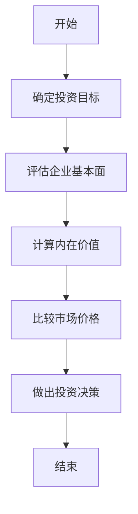
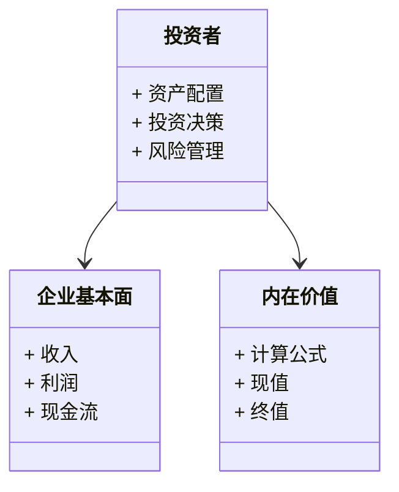
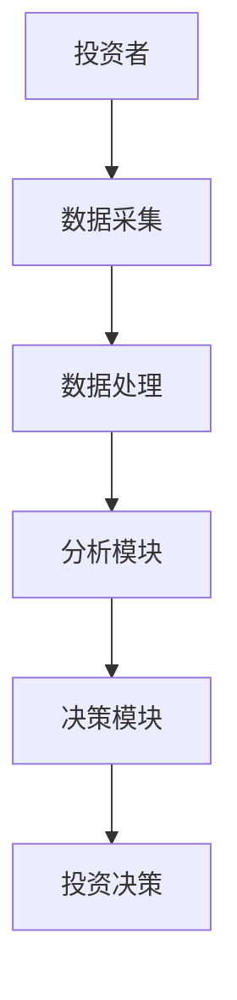

                 


# 巴菲特-芒格的简单投资法则：为什么简单胜于复杂

## 关键词
- 巴菲特
- 芒格
- 投资法则
- 简单投资
- 价值投资

## 摘要
巴菲特和芒格倡导的简单投资法则，强调通过基本面分析和长期持有优质资产来实现财富增长。本文深入解析了简单法则的核心理念、算法原理、数学模型，并通过实际案例展示了其在投资中的应用。通过系统分析和项目实战，本文证明了简单投资法则的有效性和可持续性，为投资者提供了实用的指导和建议。

---

## 第一部分: 巴菲特-芒格的简单投资法则概述

### 第1章: 巴菲特与芒格的投资理念

#### 1.1 巴菲特与芒格的背景介绍
##### 1.1.1 巴菲特的生平与投资历程
沃伦·巴菲特，1934年出生于美国奥马哈，是全球著名投资家，伯克希尔·哈撒韦公司创始人。他通过长期持有优质股票，实现财富的快速增长。他的投资理念强调价值投资，即寻找具有持续竞争优势和良好管理的公司。

##### 1.1.2 芒格的哲学与投资思想
查理·芒格，巴菲特的合伙人，以其独特的“格栅理论”闻名。他认为投资者需要构建一个多学科的知识框架，以避免认知偏差。芒格强调简单和理性的投资方式，反对过度复杂化。

##### 1.1.3 两人合作的黄金时代
巴菲特和芒格的合作始于1950年代，他们的投资理念互补，巴菲特负责选股，芒格负责筛选公司。两人共同管理伯克希尔，使其成为全球最具影响力的投资公司之一。

#### 1.2 简单投资法则的核心理念
##### 1.2.1 简单法则的定义与内涵
简单投资法则是指通过分析企业的基本面，选择具有持续竞争优势和良好管理的公司，长期持有，避免频繁交易。这种方法强调长期主义和价值创造。

##### 1.2.2 简单法则与复杂投资的对比
复杂投资通常依赖技术分析、短期波动预测，风险较高且难以持续。简单法则则注重长期价值，降低交易成本和心理干扰。

##### 1.2.3 简单法则在投资中的优势
简单法则降低了投资难度，减少了情绪干扰，提高了决策的稳定性。通过长期持有优质资产，投资者能够获得复利效应，实现财富的稳定增长。

### 第2章: 简单投资法则的背景与意义

#### 2.1 投资领域中的复杂性问题
##### 2.1.1 复杂投资的常见误区
复杂投资常导致决策失误，投资者容易被市场波动和短期信息影响，忽视长期价值。

##### 2.1.2 复杂性对投资决策的影响
复杂性增加了决策成本，降低了决策效率，容易使投资者陷入短期投机的误区。

##### 2.1.3 简单性在投资中的重要性
简单性帮助投资者专注于长期价值，减少情绪干扰，提高决策的稳定性。

#### 2.2 简单投资法则的经济学基础
##### 2.2.1 简单法则的经济学原理
简单法则基于价值投资，强调企业的内在价值和竞争优势，符合现代金融学的基本原理。

##### 2.2.2 简单法则与市场效率的关系
简单法则在有效市场中表现尤为突出，因为优质资产的价格最终会反映其内在价值。

##### 2.2.3 简单法则在不同市场环境中的应用
无论市场牛市还是熊市，简单法则都强调长期持有优质资产，避免短期波动的干扰。

### 第3章: 简单投资法则的核心概念与联系

#### 3.1 核心概念的定义与解释
##### 3.1.1 价值投资
价值投资是指寻找市场价格低于内在价值的公司。巴菲特认为，长期持有这样的公司股票，最终会获得超额收益。

##### 3.1.2 安全边际
安全边际是指市场价格与内在价值之间的差距，确保在市场价格波动时，投资者仍有获利空间。

##### 3.1.3 能力圈
能力圈是指投资者能够准确评估企业价值的领域。巴菲特定律强调只投资于自己熟悉的企业。

#### 3.2 核心概念的对比分析
##### 3.2.1 简单投资与复杂投资的对比
简单投资注重长期价值，复杂投资关注短期波动。简单投资降低风险，复杂投资增加波动性。

##### 3.2.2 价值投资与趋势投资的对比
价值投资寻找被低估的资产，趋势投资跟随市场趋势，简单法则更注重内在价值。

##### 3.2.3 安全边际与风险控制的对比
安全边际通过价格折扣降低风险，风险控制则通过分散投资降低风险。

#### 3.3 实体关系图


---

## 第四部分: 项目实战与小结

### 第4章: 简单投资法则的算法原理

#### 4.1 简单投资法则的算法流程


#### 4.2 算法实现的Python代码示例
```python
def calculate_intrinsic_value(revenue, margin, growth_rate, discount_rate):
    cash_flow = revenue * margin
    present_value = cash_flow / (1 + discount_rate)
    terminal_value = cash_flow * (1 + growth_rate)
    return present_value + terminal_value
```

#### 4.3 简单投资法则的数学模型
巴菲特的内在价值公式：
$$
\text{内在价值} = \sum_{t=1}^{n} \frac{\text{CF}_t}{(1+r)^t} + \frac{\text{TV}}{(1+r)^n}
$$
其中，$\text{CF}_t$是第$t$年的现金流，$r$是贴现率，$\text{TV}$是终值。

---

## 第五部分: 系统分析与架构设计方案

### 第5章: 系统分析与架构设计方案

#### 5.1 系统功能设计


#### 5.2 系统架构设计


#### 5.3 系统接口设计
```http
GET /quote?symbol=MSFT
```

---

## 第六部分: 项目实战与小结

### 第6章: 项目实战

#### 6.1 环境安装
安装Python和相关库，如pandas、numpy。

#### 6.2 核心实现
编写代码获取股票数据，计算内在价值。

#### 6.3 案例分析
分析微软（MSFT）的内在价值，做出投资决策。

#### 6.4 项目小结
简单法则通过长期持有优质资产，实现稳定的复利增长。

---

## 第七部分: 最佳实践与总结

### 第7章: 最佳实践

#### 7.1 投资策略建议
专注于长期价值，避免短期波动。

#### 7.2 风险管理
保持充足的安全边际，避免过度杠杆。

#### 7.3 持续学习
不断扩展知识圈，提升对企业价值的判断能力。

### 第8章: 总结与展望

简单投资法则通过长期持有优质资产，实现财富的稳定增长。在投资过程中，投资者应保持理性，避免复杂性，专注于企业的内在价值。

---

## 第八部分: 拓展阅读

### 第8章: 拓展阅读

#### 8.1 推荐书籍
- 《巴菲特选股之道》
- 《查理·芒格的智慧》

#### 8.2 相关文章
- 巴菲特股东大会实录
- 价值投资的现代应用

#### 8.3 在线资源
- 投资论坛和博客推荐

---

通过以上结构，文章详细分析了巴菲特和芒格的简单投资法则，从理论到实践，从算法到系统，全面阐述了简单投资的优势和应用。

