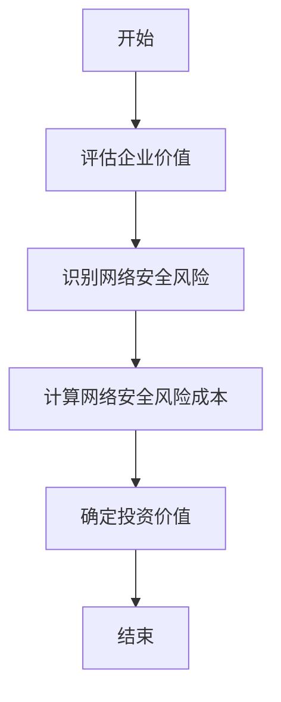
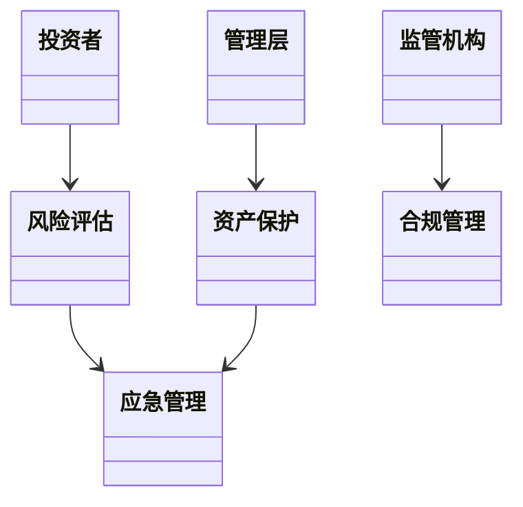
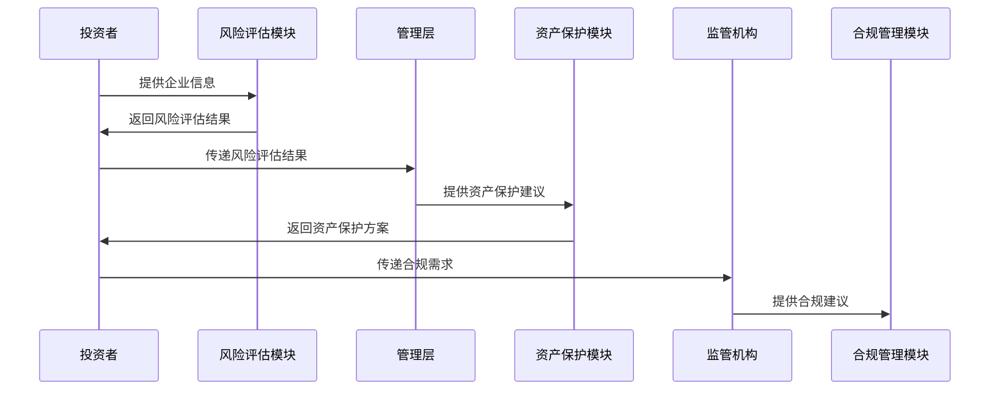

                 


# 巴菲特-芒格的网络安全投资：数字时代的新型风险

---

## 关键词：
- 网络安全投资
- 巴菲特投资理念
- 芒格投资理念
- 数字时代风险
- 网络安全策略
- 风险管理

---

## 摘要：
本文深入探讨了巴菲特和芒格在网络安全投资领域的独特见解，结合数字时代新型风险的分析，提出了基于价值投资和多元思维模型的安全投资策略。文章从网络安全的核心概念、算法原理、系统架构到项目实战，详细解析了如何将巴菲特和芒格的投资理念应用于数字安全领域，帮助投资者在数字化转型中规避风险、抓住机遇。

---

# 第一部分: 背景介绍

---

## 第1章: 网络安全投资的背景与重要性

### 1.1 网络安全的重要性

#### 1.1.1 网络安全的定义与核心要素
网络安全是指保护信息的机密性、完整性和可用性的过程，核心要素包括身份验证、访问控制、加密技术和安全审计。

#### 1.1.2 数字化时代网络安全的挑战
数字化转型带来了数据泄露、网络攻击和隐私保护等挑战，企业需要在技术、管理和合规方面投入更多资源。

#### 1.1.3 网络安全对企业和个人的影响
网络安全问题可能导致企业财务损失、声誉损害，甚至影响个人隐私和安全，已成为企业和个人的头等大事。

---

### 1.2 巴菲特与芒格的投资理念

#### 1.2.1 巴菲特的价值投资理论
巴菲特的价值投资强调长期持有优质资产，注重企业的基本面和内在价值，避免短期市场波动的干扰。

#### 1.2.2 芒格的多元思维模型
芒格强调通过跨学科思维，将多个领域的知识结合起来，形成全面的决策框架。

#### 1.2.3 两人投资理念的结合
巴菲特和芒格的理念结合体现在长期价值投资和多元思维模型的应用中，尤其是在网络安全领域的投资中，这种结合尤为重要。

---

### 1.3 巴菲特与芒格在网络安全领域的应用

#### 1.3.1 网络安全作为长期投资的价值
网络安全行业的高壁垒和高门槛使其具备长期投资价值，尤其是在数字化转型的推动下，行业需求持续增长。

#### 1.3.2 网络安全投资的长期性与稳定性
网络安全行业的波动性较低，具有较高的防御性，适合长期投资。

#### 1.3.3 数字化时代下网络安全投资的必要性
随着数字化转型的深入，网络安全已成为企业生存和发展的基础，投资网络安全是企业规避风险、提升竞争力的关键。

---

## 第2章: 数字时代新型风险的概述

### 2.1 数字化转型带来的新型风险

#### 2.1.1 数据泄露的风险
数据泄露可能导致企业核心竞争力的丧失，尤其是在数据驱动的业务模式下，数据安全的重要性更加凸显。

#### 2.1.2 网络攻击的多样化
黑客攻击手段日益多样化，从传统的病毒攻击到复杂的APT攻击，企业需要具备多层次的安全防护能力。

#### 2.1.3 云计算与物联网带来的新挑战
云计算和物联网的普及带来了新的安全挑战，例如云服务的安全性和物联网设备的易攻击性。

---

### 2.2 新型风险的特点与分类

#### 2.2.1 新型风险的特点
新型风险具有隐蔽性、多样性和快速变化的特点，企业需要具备快速响应的能力。

#### 2.2.2 新型风险的分类
根据风险来源，新型风险可以分为技术风险、管理风险和合规风险。

#### 2.2.3 新型风险与传统风险的对比
新型风险更加复杂，涉及的技术和场景更多，同时具有更强的传染性和扩散性。

---

### 2.3 新型风险对企业的影响

#### 2.3.1 对企业财务的影响
数据泄露和网络攻击可能导致企业面临巨额罚款和财务损失，尤其是在 GDPR 等严格法规下。

#### 2.3.2 对企业声誉的影响
网络安全事件可能损害企业的品牌形象，影响客户信任，进而影响业务发展。

#### 2.3.3 对企业运营的影响
网络安全问题可能导致业务中断，影响企业运营效率，甚至威胁企业的生存。

---

## 第3章: 巴菲特与芒格的安全投资策略

### 3.1 巴菲特的安全投资策略

#### 3.1.1 巴菲特的安全投资原则
巴菲特注重企业的护城河和管理层能力，选择具有长期竞争优势的公司进行投资。

#### 3.1.2 巴菲特的安全投资案例
例如，巴菲特对 IBM 的投资，基于其在 IT 领域的领先地位和长期稳定的收益能力。

#### 3.1.3 巴菲特的安全投资哲学
巴菲特强调长期投资、价值投资和风险管理，注重企业的内在价值和外部环境的稳定性。

---

### 3.2 芒格的安全投资策略

#### 3.2.1 芒格的安全投资原则
芒格注重多元思维模型的应用，通过跨学科的视角识别投资机会和风险。

#### 3.2.2 芒格的安全投资案例
例如，芒格对富国银行的投资，基于其强大的资产负债表和长期盈利能力。

#### 3.2.3 芒格的安全投资哲学
芒格强调知识的广度和深度，通过多元思维模型识别投资机会和风险。

---

### 3.3 巴菲特与芒格策略的结合

#### 3.3.1 结合的安全投资策略
结合巴菲特的价值投资和芒格的多元思维模型，形成一种全面的安全投资策略，既注重企业的内在价值，又注重外部环境的风险。

#### 3.3.2 结合的策略优势
这种结合策略能够更好地识别风险，同时抓住投资机会，具备较强的稳定性和防御性。

#### 3.3.3 结合策略的未来发展趋势
随着数字化转型的深入，这种结合策略在网络安全领域的应用将更加广泛，成为未来投资的重要方向。

---

## 第4章: 网络安全投资的核心概念与联系

### 4.1 核心概念原理

#### 4.1.1 安全投资的核心原理
安全投资的核心在于识别和评估网络安全风险，通过合理的资源配置和投资组合优化，降低风险，提高收益。

#### 4.1.2 安全投资的关键要素
包括风险评估、资产保护、合规管理、应急管理等关键要素。

#### 4.1.3 安全投资的系统性分析
从系统性角度分析网络安全投资，需要考虑技术、管理和合规等多个方面。

---

### 4.2 核心概念属性特征对比表格

| 核心概念      | 定义与特征               | 对比分析                           |
|---------------|--------------------------|------------------------------------|
| 风险评估      | 识别和评估安全风险       | 是安全投资的第一步，决定投资策略 |
| 资产保护      | 保护关键资产             | 是安全投资的核心，确保资产安全   |
| 合规管理      | 确保符合相关法规         | 是安全投资的外部约束，避免法律风险|
| 应急管理      | 制定应急响应计划           | 是安全投资的保障，降低损失扩大   |

---

### 4.3 ER实体关系图架构的 Mermaid 流程图

```mermaid
erDiagram
    actor 投资者
    actor 管理层
    actor 监管机构
    class 风险评估
    class 资产保护
    class 合规管理
    class 应急管理
    投资者 --> 风险评估
    管理层 --> 资产保护
    监管机构 --> 合规管理
    风险评估 --> 应急管理
    资产保护 --> 应急管理
```

---

## 第5章: 网络安全投资的算法原理

### 5.1 算法原理的数学模型和公式

网络安全投资的评估模型可以表示为：

$$
\text{投资价值} = \text{企业价值} - \text{网络安全风险成本}
$$

其中，$$ \text{企业价值} $$ 包括企业的收入、利润和资产价值，$$ \text{网络安全风险成本} $$ 包括潜在的财务损失和声誉损失。

---

### 5.2 算法原理的 mermaid 流程图



---

## 第6章: 系统分析与架构设计方案

### 6.1 问题场景介绍

在数字化转型背景下，企业需要构建一个全面的网络安全体系，涵盖技术、管理和合规等多个方面，确保企业的数据安全和业务连续性。

---

### 6.2 项目介绍

本项目旨在设计一个基于巴菲特和芒格投资理念的网络安全投资框架，帮助企业识别和评估网络安全风险，制定合理的投资策略。

---

### 6.3 系统功能设计（领域模型 Mermaid 类图）



---

### 6.4 系统架构设计（Mermaid 架构图）


---

### 6.5 系统接口设计

系统接口包括：

1. 投资者与风险评估模块的接口。
2. 管理层与资产保护模块的接口。
3. 监管机构与合规管理模块的接口。

---

### 6.6 系统交互设计（Mermaid 序列图）



---

## 第7章: 项目实战

### 7.1 环境安装

以下是项目实战的环境配置示例：

```bash
# 安装 Python 环境
python3 --version
pip install -r requirements.txt
```

---

### 7.2 系统核心实现源代码

以下是风险评估模块的核心代码示例：

```python
def calculate_risk_cost(revenue, profit, assets):
    risk_cost = (revenue * 0.1) + (profit * 0.2) + (assets * 0.3)
    return risk_cost

# 示例计算
revenue = 1000000
profit = 200000
assets = 500000
risk_cost = calculate_risk_cost(revenue, profit, assets)
print(f"网络安全风险成本为：{risk_cost}")
```

---

### 7.3 代码应用解读与分析

上述代码通过计算企业的收入、利润和资产，评估网络安全风险成本，帮助企业确定网络安全投资的价值。

---

### 7.4 实际案例分析

以某互联网公司为例，假设其年收入为 1000 万美元，净利润为 200 万美元，资产为 500 万美元，计算其网络安全风险成本为：

$$
\text{风险成本} = 1000000 \times 0.1 + 200000 \times 0.2 + 500000 \times 0.3 = 100000 + 40000 + 150000 = 290000
$$

---

### 7.5 项目小结

通过项目实战，我们可以看到网络安全投资的评估模型在实际应用中的有效性和实用性，为企业制定合理的网络安全投资策略提供了参考。

---

## 第8章: 最佳实践

### 8.1 小结

本文结合巴菲特和芒格的投资理念，提出了数字时代下网络安全投资的策略和方法，为企业在数字化转型中规避风险、抓住机遇提供了指导。

---

### 8.2 注意事项

1. 投资者需要结合企业的实际情况，灵活调整投资策略。
2. 网络安全投资需要长期坚持，避免短期波动的干扰。
3. 企业需要建立全面的网络安全体系，涵盖技术、管理和合规等多个方面。

---

### 8.3 拓展阅读

1. 巴菲特《巴菲特投资经典语录》
2. 芒格《芒格的多元思维模型》
3. 网络安全《网络安全投资的实践与案例》

---

## 结语

数字时代下，网络安全已成为企业生存和发展的核心竞争力之一。通过结合巴菲特和芒格的投资理念，企业可以在规避风险的同时，抓住数字化转型带来的机遇，实现长期稳定的收益。

--- 

**全文完**

