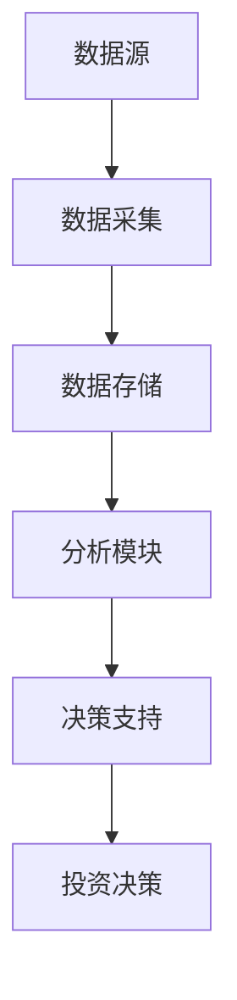
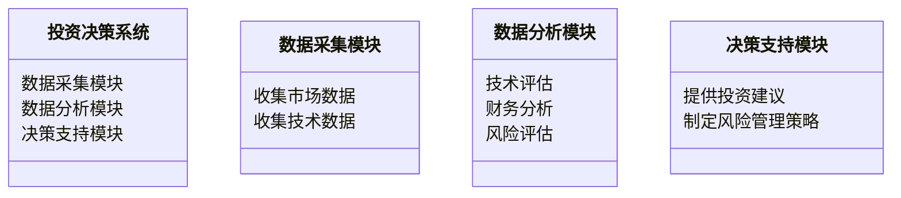
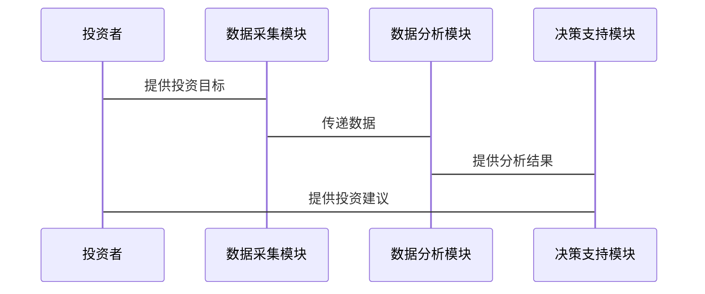

                 


# 巴菲特-芒格的能源转型投资：把握新能源革命的机遇

## 关键词
巴菲特, 芒格, 能源转型, 新能源, 投资策略, 风险管理, 技术分析

## 摘要
本文深入探讨了巴菲特和芒格在能源转型投资中的策略，分析了新能源技术的创新及其对投资的影响。通过数学模型和系统架构设计，结合具体案例，展示了如何在新能源革命中把握投资机遇并有效管理风险。

---

## 第一部分：巴菲特与芒格的投资理念

### 第1章：巴菲特与芒格的投资哲学

#### 1.1 巴菲特的价值投资理念
##### 1.1.1 价值投资的定义与核心原则
价值投资是一种长期投资策略，强调购买低于其内在价值的股票。其核心原则包括：
1. **安全边际**：购买价格远低于内在价值的资产。
2. **长期视角**：关注企业的长期盈利能力，而非短期波动。
3. **企业质量**：投资具有强大竞争优势和良好管理的企业。

##### 1.1.2 巴菲特的投资策略与成功案例
巴菲特的投资策略以价值投资为核心，成功案例包括可口可乐、IBM和比亚迪。他偏好具有持续增长潜力和高ROE（净资产收益率）的企业。

##### 1.1.3 芒格的多元思维模型
芒格的多元思维模型强调跨学科思考，将多个领域的基本原理结合起来，以做出更明智的决策。他认为，投资的成功不仅依赖于财务数据，还需要对人类心理、经济趋势等有深刻理解。

#### 1.2 能源转型的背景与投资机会
##### 1.2.1 全球能源转型的现状与趋势
全球能源转型正从化石能源向可再生能源转变，推动这一转变的因素包括气候变化、技术进步和政策支持。

##### 1.2.2 新能源革命对传统能源行业的冲击
新能源技术的快速发展导致传统能源行业的利润下降，但同时也创造了新的投资机会。

##### 1.2.3 巴菲特与芒格对新能源投资的重视
巴菲特和芒格认识到新能源行业的巨大潜力，认为其具备长期增长的条件，尤其是太阳能和风能等领域。

---

### 第2章：能源转型的核心驱动力

#### 2.1 新能源技术的创新与进步
##### 2.1.1 太阳能、风能等可再生能源的技术发展
- **太阳能**：转换效率提升，成本降低。
- **风能**：技术进步使发电效率提高，成本下降。

##### 2.1.2 新能源技术的经济性与规模化
随着技术进步，新能源发电成本已接近传统能源，规模化效应进一步降低成本。

#### 2.2 政策与市场的双重推动
##### 2.2.1 全球能源政策的变化
各国政府通过政策支持推动新能源发展，例如可再生能源配额制和碳交易机制。

##### 2.2.2 市场需求与投资机会的分析
新能源市场需求增长迅速，吸引了大量投资，尤其是电动汽车和储能技术领域。

---

### 第3章：巴菲特与芒格的新能源投资策略

#### 3.1 能源转型中的投资逻辑
##### 3.1.1 投资标的筛选标准
- **企业质量**：选择具有技术优势和市场领导地位的企业。
- **财务健康**：关注企业的盈利能力、现金流和债务水平。

##### 3.1.2 长期价值与短期波动的平衡
巴菲特和芒格注重长期价值，但也会关注短期波动对投资决策的影响。

#### 3.2 芒格的多元思维模型在能源投资中的应用
##### 3.2.1 多元思维模型的定义与特点
芒格的多元思维模型通过跨学科思考，帮助投资者识别投资机会和风险。

##### 3.2.2 能源投资中的具体应用
- **技术分析**：了解新能源技术的可行性和发展路径。
- **市场分析**：预测市场需求和价格趋势。
- **风险管理**：评估潜在风险并制定应对策略。

---

### 第4章：新能源投资的系统架构设计

#### 4.1 投资决策系统的构建
##### 4.1.1 系统功能模块设计
- **数据采集**：收集市场、技术和财务数据。
- **分析模块**：进行技术评估、财务分析和风险评估。
- **决策支持**：提供投资建议和决策支持。

##### 4.1.2 系统架构的mermaid图示



#### 4.2 投资风险的量化与管理
##### 4.2.1 风险评估模型的建立
使用蒙特卡洛模拟评估新能源投资的风险，考虑技术、市场和政策因素。

##### 4.2.2 风险管理的策略与实施
通过分散投资、设定止损点和风险对冲来管理风险。

---

### 第5章：案例分析与投资实战

#### 5.1 巴菲特对比亚迪的投资分析
##### 5.1.1 投资背景与决策过程
巴菲特在2008年投资比亚迪，看中其在电动汽车领域的领先地位和技术优势。

##### 5.1.2 投资回报与经验总结
比亚迪股价的大幅上涨证明了巴菲特投资的成功，经验包括选择具有技术优势和强大执行力的企业。

#### 5.2 芒格在能源转型中的其他投资案例
##### 5.2.1 其他新能源企业的投资分析
芒格投资的其他新能源企业包括NextEra Energy和 Dominion Energy，这些企业在可再生能源领域具有领先地位。

##### 5.2.2 投资成功的关键因素
注重企业的财务健康、技术优势和市场地位，结合多元思维模型进行决策。

---

### 第6章：总结与展望

#### 6.1 巴菲特与芒格投资理念的总结
##### 6.1.1 价值投资的核心要素
长期视角、安全边际和企业质量是价值投资的核心要素。

##### 6.1.2 新能源投资的未来趋势
随着技术进步和政策支持，新能源行业将继续增长，投资机会将更加丰富。

#### 6.2 投资者的最佳实践与注意事项
##### 6.2.1 最佳实践
- **持续学习**：保持对新能源技术和发展趋势的学习。
- **分散投资**：通过多样化降低风险。
- **长期持有**：避免短期波动影响投资决策。

##### 6.2.2 注意事项
- **风险控制**：制定合理的风险管理策略。
- **及时调整**：根据市场变化调整投资组合。

---

### 第7章：数学模型与系统设计

#### 7.1 投资回报分析模型
##### 7.1.1 内部收益率（IRR）计算
IRR是评估投资项目盈利能力的重要指标，公式为：
$$
IRR = r \text{ 满足 } \sum_{t=0}^{n} \frac{C_t}{(1+r)^t} = 0
$$

##### 7.1.2 净现值（NPV）计算
NPV是将未来现金流按折扣率折现后的总和，公式为：
$$
NPV = \sum_{t=0}^{n} \frac{C_t}{(1+r)^t}
$$

#### 7.2 系统架构设计
##### 7.2.1 系统功能设计
使用mermaid类图展示系统功能模块：



##### 7.2.2 系统交互流程图
使用mermaid序列图展示系统交互流程：



---

### 第8章：项目实战

#### 8.1 环境安装与系统部署
##### 8.1.1 安装Python和相关库
使用Python进行数据分析，安装pandas、numpy和scipy库。

#### 8.2 核心实现源代码
##### 8.2.1 计算IRR和NPV的Python代码
```python
import numpy as np

def calculate_irr(cash_flows):
    try:
        irr = np.irr(cash_flows)
        return irr
    except ValueError:
        return None

def calculate_npv(r, cash_flows):
    npv = np.npv(r, cash_flows)
    return npv

# 示例现金流
cash_flows = [-1000000, 300000, 400000, 500000, 400000]
discount_rate = 0.08

irr = calculate_irr(cash_flows)
npv = calculate_npv(discount_rate, cash_flows)

print(f"IRR: {irr}")
print(f"NPV: {npv}")
```

#### 8.3 实际案例分析
##### 8.3.1 投资项目选择
选择具有高IRR和正NPV的新能源项目进行投资。

##### 8.3.2 投资回报分析
通过IRR和NPV分析，评估投资项目的可行性和盈利能力。

#### 8.4 项目小结
通过系统化的方法和数学模型，投资者可以更科学地进行新能源投资决策，抓住能源转型带来的机遇。

---

### 第9章：风险管理与策略优化

#### 9.1 风险识别与量化
##### 9.1.1 市场风险
- **价格波动**：新能源市场价格波动较大，需通过多样化投资分散风险。
- **政策风险**：政府政策变化可能影响行业，需密切关注政策动向。

##### 9.1.2 技术风险
- **技术落后**：投资需关注企业的技术创新能力。
- **技术替代**：需评估技术的生命周期和替代风险。

#### 9.2 风险应对策略
##### 9.2.1 多样化投资组合
通过投资不同类型的新能源项目，降低单一项目的风险。

##### 9.2.2 风险对冲
使用金融工具如期权和期货进行风险对冲，降低投资组合的波动性。

---

### 第10章：结论与未来展望

#### 10.1 投资理念的总结
巴菲特和芒格的投资理念强调长期价值和风险管理，适用于新能源转型投资。

#### 10.2 未来投资趋势
随着技术进步和政策支持，新能源行业将继续增长，投资机会将更加多样化。

#### 10.3 投资者建议
- **保持学习**：关注新能源技术发展和市场动态。
- **科学决策**：利用数学模型和系统架构设计进行投资决策。
- **风险管理**：制定合理的风险管理策略，保护投资组合的安全。

---

## 参考文献
- 巴菲特股东大会演讲
-芒格的多元思维模型
- 新能源行业报告和技术分析

---

通过以上结构和内容，您可以撰写一篇详细且专业的技术博客文章，涵盖巴菲特和芒格的新能源投资策略，结合技术分析、系统设计和实际案例，帮助读者把握新能源革命的投资机遇。

