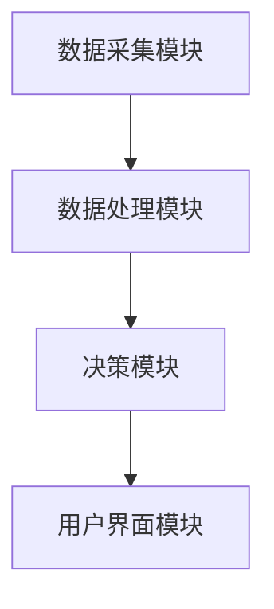
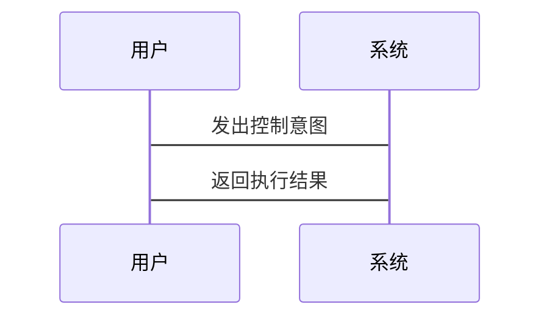

                 


# 巴菲特-芒格的脑机接口伦理投资：人类增强的未来

## 关键词：
- 巴菲特, 芒格, 脑机接口, 伦理投资, 人类增强,抽动症, 大数据, 神经科学, 价值投资, 伦理框架

## 摘要：
本文探讨了巴菲特和芒格的投资理念与脑机接口技术的结合，特别是伦理投资在人类增强技术中的应用。通过分析脑机接口的核心技术、伦理挑战和投资策略，结合数学模型和系统设计，展示了如何在追求投资回报的同时，确保技术的伦理和社会影响。文章从背景介绍到项目实战，全面解析了这一跨学科主题，为读者提供了深入的见解和实际的应用指导。

---

# 第一部分：脑机接口与投资的背景与基础

## 第1章：脑机接口技术概述

### 1.1 脑机接口的基本概念

#### 1.1.1 脑机接口的定义
脑机接口（BCI）是一种允许大脑与外部设备直接交流的技术，通过采集和分析神经信号，实现人与机器之间的信息交互。BCI的应用范围广泛，包括医疗康复、教育、娱乐和军事等领域。

#### 1.1.2 脑机接口的发展历程
脑机接口技术经历了从简单的信号检测到复杂的神经网络处理的发展。早期的研究集中在实验室环境中，如今已经逐步走向商业化应用，例如神经康复设备和增强现实设备。

#### 1.1.3 脑机接口的核心技术
- **神经信号采集**：通过电极采集大脑皮层的电信号，如EEG（脑电图）和fMRI（功能性磁共振成像）。
- **数据处理**：将采集到的信号进行滤波、降噪和特征提取，以便后续分析。
- **信号分类**：使用机器学习算法，如支持向量机（SVM）和随机森林，将神经信号分类为特定的意图。
- **用户界面设计**：设计直观的界面，让用户能够方便地控制外部设备。

#### 1.1.4 脑机接口的数学模型
脑机接口的核心算法涉及信号处理和分类，常用的支持向量机（SVM）模型如下：
$$
\text{max} \frac{1}{2} \|w\|^2 \\
\text{subject to} \quad y_i (w \cdot x_i + b) \geq 1
$$
其中，$w$ 是权重向量，$b$ 是偏置，$x_i$ 是输入特征，$y_i$ 是标签。

---

### 1.2 巴菲特与芒格的投资哲学

#### 1.2.1 巴菲特的价值投资理念
巴菲特的价值投资强调购买具有内在价值的股票，长期持有，而非频繁交易。他注重公司的基本面分析，如盈利能力、财务状况和行业地位。

#### 1.2.2 芒格的多元思维模型
芒格提倡多元思维，认为投资者需要跨学科的知识，才能做出明智的决策。他强调在决策中考虑伦理和道德因素。

#### 1.2.3 投资与伦理的结合
伦理投资要求投资者在追求利润的同时，考虑公司的社会影响。例如，投资于遵守环保标准和技术伦理的公司。

---

## 第2章：脑机接口的伦理与社会影响

### 2.1 脑机接口的伦理挑战

#### 2.1.1 人类增强的伦理问题
脑机接口可能用于增强人类能力，如提高记忆力或反应速度，这引发了关于人类自然状态和公平性的伦理争议。

#### 2.1.2 数据隐私与安全
脑机接口需要收集大量的神经数据，这些数据可能被滥用，导致隐私泄露或身份盗窃。

#### 2.1.3 社会公平与技术鸿沟
技术的不平等分布可能导致社会阶层的进一步分化，加剧贫富差距。

---

### 2.2 伦理投资的框架

#### 2.2.1 伦理投资的定义与原则
伦理投资（SRI，社会责任投资）强调在投资决策中考虑环境、社会和治理（ESG）因素。例如，避免投资于违反人权或破坏环境的公司。

#### 2.2.2 脑机接口技术的伦理评估
在投资前，需要评估脑机接口公司是否符合伦理标准，如数据隐私保护和产品安全性。

#### 2.2.3 投资中的伦理决策
投资者需要平衡短期收益和长期社会影响，例如选择那些在技术发展中有社会责任感的公司。

---

## 第3章：脑机接口技术的数学模型与算法

### 3.1 脑机接口的核心算法

#### 3.1.1 神经信号处理的数学模型
神经信号的处理通常涉及时频分析和统计建模。例如，使用小波变换提取信号特征：
$$
W(t) = \int_{-\infty}^{\infty} x(\tau) \psi(t - \tau) d\tau
$$
其中，$x(\tau)$ 是原始信号，$\psi$ 是小波基函数。

#### 3.1.2 信号分类的机器学习算法
支持向量机（SVM）和随机森林常用于神经信号分类。例如，使用SVM进行二分类：
$$
y = \text{sign}(w \cdot x + b)
$$
其中，$w$ 是权重向量，$x$ 是输入特征，$b$ 是偏置。

#### 3.1.3 神经网络在脑机接口中的应用
深度学习模型，如卷积神经网络（CNN），用于处理高维神经数据。例如，使用CNN提取图像特征：
$$
f(x) = \sigma(Wx + b)
$$
其中，$\sigma$ 是激活函数，$W$ 是权重矩阵，$b$ 是偏置向量。

---

### 3.2 投资决策的数学模型

#### 3.2.1 股票估值的数学模型
市盈率（P/E）和市净率（P/B）是常用的估值指标。例如，计算P/E：
$$
\text{P/E} = \frac{\text{股价}}{\text{每股收益}}
$$

#### 3.2.2 风险评估与概率分析
VaR（在险价值）和CVaR（条件在险价值）用于评估投资风险。例如，计算VaR：
$$
\text{VaR} = \text{损失的第α分位数}
$$

#### 3.2.3 投资组合优化的数学方法
使用均值-方差优化模型，如马科维茨的现代投资组合理论（MPT）：
$$
\text{min} \quad \sigma_p^2 \\
\text{subject to} \quad \mu_p \geq \text{目标收益}, \quad \mathbf{w}^T \mathbf{1} = 1
$$
其中，$\sigma_p^2$ 是组合的方差，$\mu_p$ 是组合的期望收益，$\mathbf{w}$ 是权重向量，$\mathbf{1}$ 是全一向量。

---

## 第4章：脑机接口的系统架构与设计

### 4.1 系统架构设计

#### 4.1.1 系统功能模块划分
- 数据采集模块：负责采集神经信号。
- 数据处理模块：对信号进行预处理和特征提取。
- 决策模块：基于特征进行分类和决策。
- 用户界面模块：显示结果和控制界面。

#### 4.1.2 系统架构的Mermaid图



#### 4.1.3 系统接口设计
系统接口包括数据输入接口（如EEG电极）和输出接口（如控制信号），需要定义清晰的接口规范，如API。

---

### 4.2 系统交互设计

#### 4.2.1 用户界面设计
用户界面需要直观，例如使用图形化界面显示神经信号和决策结果。

#### 4.2.2 系统交互流程图



#### 4.2.3 交互设计的优化
优化交互设计，减少用户等待时间，提高系统的响应速度。

---

## 第5章：项目实战与案例分析

### 5.1 项目环境搭建

#### 5.1.1 开发环境安装
安装必要的软件和库，如Python、NumPy、Matplotlib和Scikit-learn。

#### 5.1.2 数据集准备
获取公开的神经数据集，如EEG数据集。

#### 5.1.3 工具链配置
配置开发工具，如Jupyter Notebook和IDE。

---

### 5.2 核心代码实现

#### 5.2.1 脑机接口数据处理代码

```python
import numpy as np
from sklearn import svm

# 数据预处理
def preprocess(data):
    # 假设data是一个二维数组，每一行是一个样本
    # 这里进行归一化处理
    normalized_data = (data - np.mean(data, axis=0)) / np.std(data, axis=0)
    return normalized_data

# 特征提取
def extract_features(data, window_size=100):
    features = []
    for i in range(0, len(data), window_size):
        window = data[i:i+window_size]
        # 计算均值和标准差
        mean = np.mean(window)
        std = np.std(window)
        features.append([mean, std])
    return features

# 使用SVM进行分类
def classify(features, labels):
    model = svm.SVC()
    model.fit(features, labels)
    return model

# 测试模型
data = preprocess(...)  # 预处理后的数据
features = extract_features(data)
labels = [...]  # 标签
model = classify(features, labels)
```

---

#### 5.2.2 投资决策算法实现

```python
import pandas as pd
from sklearn.metrics import accuracy_score

# 数据加载
data = pd.read_csv('stock.csv')

# 特征选择
features = data[['PE', 'PB', 'ROE']]
labels = data['Target']

# 划分训练集和测试集
train_features = features[:-100]
train_labels = labels[:-100]
test_features = features[-100:]
test_labels = labels[-100:]

# 使用随机森林进行分类
from sklearn.ensemble import RandomForestClassifier
model = RandomForestClassifier(n_estimators=100)
model.fit(train_features, train_labels)

# 预测和评估
predictions = model.predict(test_features)
print("Accuracy:", accuracy_score(test_labels, predictions))
```

---

#### 5.2.3 系统集成与测试
将各个模块集成到系统中，进行全面的功能测试，确保各模块协同工作。

---

## 第6章：总结与展望

### 6.1 本书总结
本文从背景、技术、伦理和投资等多个角度，全面探讨了脑机接口与巴菲特、芒格投资理念的结合，展示了如何在追求投资回报的同时，确保技术的伦理和社会影响。

### 6.2 未来展望
随着技术的进步，脑机接口在投资中的应用将更加广泛。未来，需要更多的跨学科研究，以解决技术与伦理之间的矛盾，推动人类增强技术的可持续发展。

---

### 6.3 最佳实践 Tips

- 在投资时，始终考虑伦理因素，避免短期利益驱动。
- 关注脑机接口技术的长期影响，选择具有社会责任感的公司。
- 学习和应用先进的数学模型和算法，提高投资决策的科学性。

---

通过本文的探讨，我们可以看到，脑机接口技术与巴菲特、芒格的投资理念相结合，不仅为投资者提供了新的视角，也为技术的未来发展提供了重要的伦理指导。希望本文能为读者在这一领域的探索提供有价值的参考和启发。

