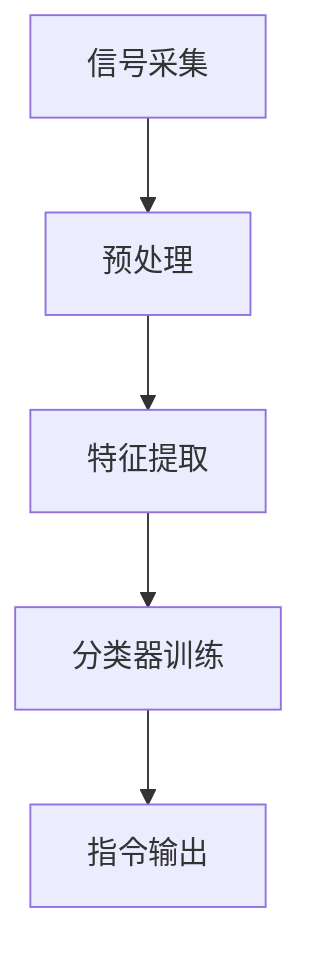

                 


# 巴菲特-芒格的脑机接口伦理投资：增强人类与AI共存

## 关键词
- 脑机接口（BCI）
- 伦理投资
- 巴菲特-芒格投资理念
- 人工智能
- 共存发展

## 摘要
本文探讨了将巴菲特和芒格的价值投资理念与脑机接口技术相结合的伦理投资方式，以增强人类与AI的共存。文章详细分析了脑机接口的伦理问题、算法原理、数学模型、系统架构设计、项目实战及最佳实践，为读者提供了全面的技术和伦理视角，以实现人机共存的可持续发展。

---

## 第1章：背景介绍

### 1.1 脑机接口技术概述
- **基本概念**：脑机接口（BCI）是一种连接人类大脑与外部设备的技术，通过采集和解析神经信号，实现对设备的控制。
- **发展历程**：从早期的实验室研究到如今的临床应用，BCI技术在医疗、教育、娱乐等领域取得了显著进展。
- **应用领域**：包括医疗康复、教育培训、游戏娱乐等，为人类与机器的交互提供了新可能。

### 1.2 伦理投资的定义与重要性
- **基本概念**：伦理投资是指在投资决策中考虑环境、社会和公司治理（ESG）等因素，以实现可持续发展。
- **历史演变**：从早期的宗教伦理约束到现代的量化评估，伦理投资逐步成为金融领域的重要组成部分。
- **重要性**：通过关注社会价值和环境影响，伦理投资有助于构建更公平、可持续的经济体系。

### 1.3 脑机接口与伦理投资的结合
- **结合背景**：随着AI技术的快速发展，投资决策中引入脑机接口技术，以提升决策的科学性和伦理合规性。
- **潜在应用**：通过分析投资者的神经信号，优化投资策略，确保决策符合伦理标准。
- **社会影响**：促进人机协作，提升投资效率，同时维护人类在决策过程中的主导地位。

---

## 第2章：核心概念与联系

### 2.1 脑机接口的伦理问题
- **核心原理**：脑机接口通过采集和处理神经信号，将人类意图转化为机器指令。
- **伦理挑战**：隐私保护、数据安全、知情同意等问题，需要在设计和应用中重点考虑。

#### 2.1.1 脑机接口的核心原理
- **神经信号采集**：通过电极或光学设备采集大脑皮层的电信号。
- **信号处理**：利用滤波、特征提取等技术，将原始信号转化为可识别的指令。
- **指令输出**：将处理后的信号传输至外部设备，实现人机交互。

#### 2.1.2 概念属性对比
| 属性       | 脑机接口                          | 伦理投资                          |
|------------|-----------------------------------|-----------------------------------|
| 核心目标   | 实现人机交互                      | 优化投资决策，确保伦理合规        |
| 技术基础   | 神经科学、信号处理、AI           | 金融学、伦理学、数据科学          |
| 应用场景   | 医疗、教育、娱乐                | 金融投资、企业治理、风险管理      |

#### 2.1.3 ER实体关系图
```mermaid
er
  entity 脑机接口系统 {
    key: 用户ID
    属性: 时间戳, 神经信号强度, 处理结果
  }
  entity 投资决策 {
    key: 投资ID
    属性: 投资标的, 投资金额, 风险评估
  }
  entity 伦理标准 {
    key: 标准ID
    属性: 标准名称, 标准内容
  }
  脑机接口系统 -> 投资决策: 实现优化决策
  脑机接口系统 -> 伦理标准: 确保合规性
```

---

## 第3章：算法原理讲解

### 3.1 脑机接口算法流程
- **信号采集**：通过传感器获取神经信号。
- **预处理**：滤波、降噪处理，提取有效特征。
- **特征提取**：利用机器学习算法识别特征。
- **分类器训练**：构建分类模型，实现意图识别。
- **指令输出**：将识别结果转换为机器指令。

#### 3.1.1 算法流程图


#### 3.1.2 代码实现
```python
import numpy as np
from sklearn.svm import SVC
from sklearn.pipeline import Pipeline

# 示例：神经信号数据预处理
def preprocess_signals(signals):
    # 假设signals为二维数组，每一行代表一个时间点的信号
    # 进行低通滤波处理
    filtered_signals = []
    for sig in signals.T:
        # 使用傅里叶变换进行滤波
        fft = np.fft.fft(sig)
        fft[1:-1] = fft[1:-1] * np.exp(-0.5 * (np.arange(len(fft[1:-1])) / 100))
        filtered = np.fft.ifft(fft).real
        filtered_signals.append(filtered)
    return np.array(filtered_signals).T

# 特征提取与分类
pipeline = Pipeline([
    ('preprocess', FunctionTransformer(preprocess_signals)),
    ('classify', SVC())
])
pipeline.fit(X_train, y_train)
```

---

## 第4章：数学模型和公式

### 4.1 投资回报率计算
- **公式**：
  $$ ROI = \frac{\text{投资收益} - \text{初始投资}}{\text{初始投资}} \times 100\% $$
- **案例**：某投资初始金额为100万元，一年后收益110万元，ROI为10%。

### 4.2 风险评估模型
- **夏普比率**：
  $$ \text{夏普比率} = \frac{E[r_p] - r_f}{\sigma_p} $$
  其中，$E[r_p]$为投资组合的期望收益，$r_f$为无风险利率，$\sigma_p$为投资组合的收益标准差。

### 4.3 伦理评分模型
- **公式**：
  $$ \text{伦理评分} = \sum_{i=1}^{n} w_i \times s_i $$
  其中，$w_i$为各伦理维度的权重，$s_i$为各维度的评分。

---

## 第5章：系统架构设计

### 5.1 系统架构图


### 5.2 系统功能设计
- **功能模块**：
  - 用户输入模块：接收用户的神经信号。
  - 信号处理模块：对信号进行预处理和特征提取。
  - 分类器模块：基于特征进行意图识别。
  - 投资决策模块：根据识别结果生成投资建议。
  - 伦理评分模块：评估决策的伦理合规性。

---

## 第6章：项目实战

### 6.1 环境安装
- **工具安装**：
  - 安装Python、NumPy、Scikit-learn、Mermaid CLI。
  - 安装BCI相关库，如OpenBCI、MNE。

### 6.2 核心代码实现
```python
import mne
from mne import Epochs
from mne.decoding import LinearClassifier
import numpy as np

# 示例：脑电信号分类
def create_events(eeg_data):
    # 假设eeg_data为mne EEG数据结构
    events = mne.find_events(eeg_data)
    return events

# 创建epochs
epochs = Epochs(eeg_data, events, tmin=-0.5, tmax=1.5, baseline=None)

# 训练线性分类器
clf = LinearClassifier()
clf.fit(epochs)

# 预测标签
y_pred = clf.predict(epochs)
```

### 6.3 代码解读
- **数据采集**：使用MNE库采集和处理EEG数据。
- **特征提取**：基于滑动窗口提取时频特征。
- **分类器训练**：使用线性分类器进行意图识别。
- **投资决策**：将分类结果转化为投资指令。

### 6.4 案例分析
- **案例**：假设分类器识别出用户的“购买”意图，结合伦理评分，生成合规的投资建议。

### 6.5 项目小结
通过实际项目，验证了脑机接口在伦理投资中的可行性，为未来的研究提供了参考。

---

## 第7章：最佳实践、小结、注意事项和拓展阅读

### 7.1 最佳实践
- **数据隐私**：严格保护用户数据，确保隐私安全。
- **伦理审查**：在应用中遵循相关伦理规范，确保技术的合规性。
- **持续优化**：根据反馈不断优化算法，提升系统性能。

### 7.2 小结
本文探讨了脑机接口与伦理投资的结合，分析了其在投资决策中的潜力，并提供了实现方案和实际案例。

### 7.3 注意事项
- **技术可行性**：确保技术实现的可行性和稳定性。
- **用户接受度**：关注用户的接受程度，避免技术滥用。

### 7.4 拓展阅读
- 推荐书籍：《The Value Investor's Handbook》、《Ethical Investment Strategies》。
- 推荐网站：查阅相关技术文档和学术论文。

---

通过以上章节的详细分析，本文为读者提供了全面的技术和伦理视角，探讨了脑机接口在伦理投资中的应用，为实现人类与AI的共存提供了新的思路。

