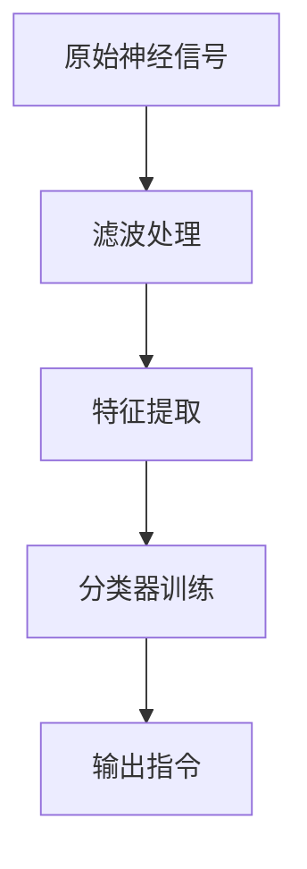
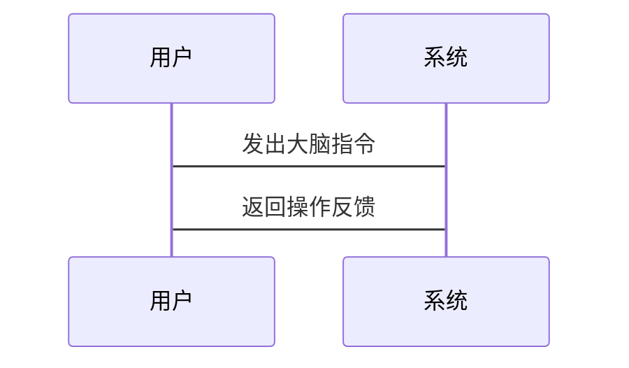
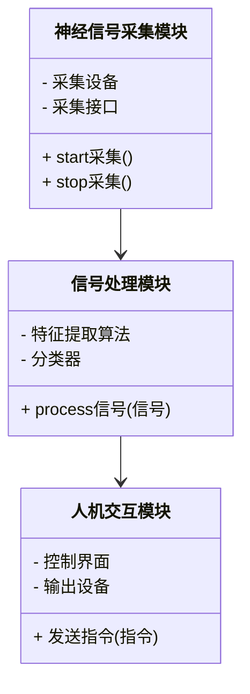
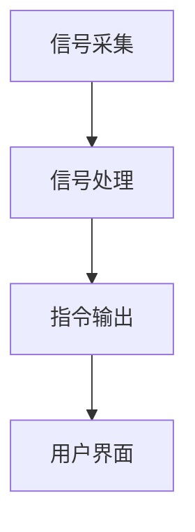

                 


# 巴菲特-芒格的脑机接口医疗应用投资：神经科技的临床突破

## 关键词：巴菲特，芒格，脑机接口，医疗应用，神经科技，临床突破，投资策略

## 摘要：脑机接口（BCI）技术近年来在医疗领域取得了显著的进展，尤其是在神经康复和疾病诊断方面。本文将探讨巴菲特和芒格的投资哲学如何应用于脑机接口技术的投资决策中，分析当前脑机接口技术的核心原理、临床应用及未来发展趋势。通过结合价值投资与技术创新，本文旨在为投资者提供在神经科技领域的投资策略和见解。

---

## 第一部分：背景介绍

### 第1章：脑机接口技术的基本概念

#### 1.1 脑机接口的定义与分类
脑机接口（Brain-Computer Interface，BCI）是一种直接连接人类大脑与外部设备的技术，能够将大脑的神经信号转化为指令，控制计算机、机器人或其他设备。根据信号采集方式的不同，BCI可以分为侵入式和非侵入式两种类型。

#### 1.2 脑机接口的发展历程
脑机接口技术起源于20世纪60年代，经历了从实验室研究到实际应用的漫长过程。近年来，随着人工智能和神经科学的进步，BCI技术在医疗领域的应用取得了显著突破。

#### 1.3 脑机接口在医疗领域的应用
脑机接口技术在神经康复、疾病诊断和治疗中展现出巨大潜力。例如，在中风康复中，BCI可以帮助患者恢复肢体功能；在癫痫监测中，BCI可以实时检测脑电活动，提供早期预警。

---

## 第二部分：核心概念与技术原理

### 第2章：脑机接口的核心原理

#### 2.1 神经信号的采集与处理
神经信号的采集是脑机接口技术的关键步骤。常用的采集方法包括EEG（脑电图）和EMG（肌电图）。这些信号需要经过滤波、降噪等预处理步骤，以提取有用的特征。

#### 2.2 信号解码的算法原理
信号解码是将神经信号转化为可操作指令的过程。常用的算法包括机器学习中的SVM（支持向量机）和随机森林，以及深度学习中的卷积神经网络（CNN）。

#### 2.3 脑机接口系统的整体架构
脑机接口系统通常包括信号采集模块、信号处理模块和人机交互界面。各个模块协同工作，实现对大脑意图的识别和设备控制。

---

### 第3章：脑机接口技术的关键技术

#### 3.1 信号采集技术
EEG和EMG的采集技术是脑机接口的核心。本文将详细介绍这两种技术的优缺点，并通过表格对比其适用场景。

| 技术类型 | 优点 | 缺点 |
|----------|------|------|
| EEG      | 非侵入式，成本低 | 精度较低，易受噪声干扰 |
| EMG      | 精度高，适用于肢体运动 | 侵入式，成本高 |

#### 3.2 信号处理算法
信号处理算法是脑机接口技术的关键。本文将通过mermaid流程图展示一种典型的信号处理流程。



#### 3.3 人机交互界面设计
人机交互界面是脑机接口系统的最后一个环节。本文将通过mermaid序列图展示用户与系统之间的交互流程。



---

## 第三部分：临床应用与投资分析

### 第4章：脑机接口技术的临床应用

#### 4.1 神经康复中的脑机接口应用
脑机接口技术在中风康复和脊髓损伤康复中展现出巨大潜力。本文将通过案例分析，展示脑机接口如何帮助患者恢复肢体功能。

#### 4.2 脑机接口在疾病诊断中的应用
脑机接口技术可以用于癫痫监测和神经退行性疾病的诊断。本文将详细介绍这些应用的具体流程和优势。

---

### 第5章：脑机接口技术的投资机会分析

#### 5.1 市场潜力
脑机接口技术在医疗领域的市场潜力巨大。本文将通过数据和图表展示全球脑机接口市场的现状与未来趋势。

#### 5.2 投资策略
结合巴菲特和芒格的投资哲学，本文将分析如何在脑机接口技术领域进行价值投资。包括企业财务状况、管理团队和市场竞争力等方面。

---

## 第四部分：算法实现与系统架构

### 第6章：脑机接口算法的实现

#### 6.1 算法选择与实现
本文将选择一种典型的信号处理算法（如SVM）进行实现。以下是Python代码示例：

```python
import numpy as np
from sklearn import svm

# 假设X为特征数据，y为标签
X = np.array([[1, 2], [3, 4], [5, 6]])
y = np.array([0, 1, 0])

# 训练SVM模型
model = svm.SVC()
model.fit(X, y)

# 预测新数据
new_data = np.array([[2, 3]])
print(model.predict(new_data))  # 输出：[0]
```

#### 6.2 算法原理的数学模型
SVM的数学模型如下：

$$
\text{目标函数：} \min_{\theta, \nu} \frac{1}{2} \nu^T \nu + C \sum_{i=1}^n \xi_i
$$

其中，$\nu$ 是权重向量，$\xi_i$ 是松弛变量，$C$ 是惩罚参数。

---

### 第7章：系统架构设计

#### 7.1 系统功能设计
脑机接口系统的功能模块包括信号采集、信号处理、指令输出等。以下是系统的类图：



#### 7.2 系统架构图
以下是系统的整体架构图：



---

## 第五部分：项目实战与总结

### 第8章：项目实战

#### 8.1 环境安装
以下是安装必要的Python库的命令：

```bash
pip install numpy scikit-learn matplotlib
```

#### 8.2 核心代码实现
以下是实现一个简单的脑机接口系统的Python代码：

```python
import numpy as np
from sklearn import svm
import matplotlib.pyplot as plt

# 生成模拟数据
np.random.seed(42)
X = np.random.randn(100, 2)
y = np.random.randint(0, 2, 100)

# 训练SVM模型
model = svm.SVC()
model.fit(X, y)

# 可视化决策边界
x_min, x_max = X[:, 0].min(), X[:, 0].max()
y_min, y_max = X[:, 1].min(), X[:, 1].max()

xx, yy = np.meshgrid(np.arange(x_min, x_max, 0.02),
                     np.arange(y_min, y_max, 0.02))
Z = model.predict(np.c_[xx.ravel(), yy.ravel()])

plt.contourf(xx, yy, Z, cmap=plt.cm.coolwarm, alpha=0.8)
plt.scatter(X[:, 0], X[:, 1], c=y, cmap=plt.cm.coolwarm)
plt.xlabel('Feature 1')
plt.ylabel('Feature 2')
plt.title('SVM Decision Boundary')
plt.show()
```

#### 8.3 案例分析
通过实际案例分析，展示脑机接口技术在医疗领域的具体应用，如中风康复和癫痫监测。

---

### 第9章：总结与展望

#### 9.1 总结
脑机接口技术在医疗领域的应用前景广阔，结合巴菲特和芒格的投资哲学，投资者可以在这一领域找到丰厚的回报。

#### 9.2 未来展望
随着技术的进步，脑机接口在疾病诊断和治疗中的应用将更加广泛。未来，我们需要进一步研究其在更多医疗场景中的应用潜力。

---

## 第六部分：最佳实践与注意事项

### 第10章：最佳实践

#### 10.1 投资建议
在投资脑机接口技术时，建议关注企业的技术研发能力、市场前景和管理团队。

#### 10.2 开发注意事项
在开发脑机接口系统时，需要注意数据的质量和模型的可解释性。

---

通过以上章节的详细分析，我们可以看到脑机接口技术在医疗领域的巨大潜力，以及如何通过价值投资和技术创新来抓住这一领域的投资机会。希望本文能为读者提供有价值的见解和指导。

