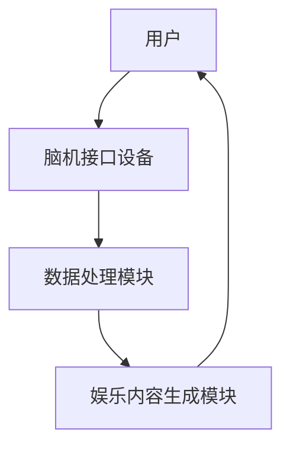
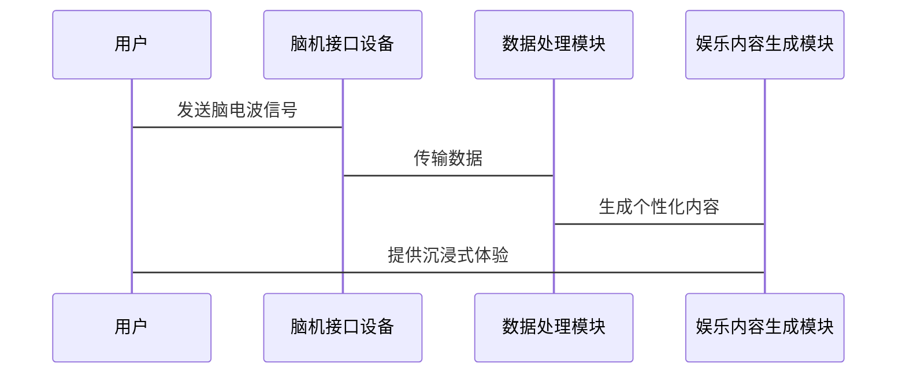

                 


```markdown
# 巴菲特-芒格的脑机接口娱乐投资：沉浸式体验的终极形态

> 关键词：巴菲特, 芒格, 脑机接口, 娱乐投资, 沉浸式体验, 人工智能, 多元思维模型

> 摘要：本文探讨了巴菲特和芒格的投资理念与脑机接口技术在娱乐投资中的结合，分析了沉浸式体验的终极形态，结合系统架构设计、算法实现和项目实战，为读者提供了全面的技术与投资视角。

---

## 第1章 巴菲特与芒格的投资理念

### 1.1 巴菲特的价值投资哲学
- 巴菲特的价值投资理念：寻找具有持续竞争优势的企业，长期投资，而非短期波动。
- 核心原则：安全边际、内在价值、市场先生。

### 1.2 芒格的多元思维模型
- 多元思维模型：通过多学科的交叉思考，形成决策框架。
- 芒格的投资策略：以长期主义为导向，注重企业护城河。

### 1.3 巴菲特与芒格投资理念的结合
- 价值投资与多元思维的互补性：巴菲特的长期价值投资与芒格的多元思维模型相结合，形成独特的投资哲学。

---

## 第2章 脑机接口技术的背景与应用

### 2.1 脑机接口技术的基本原理
- 脑机接口（BCI）的定义：通过技术手段直接连接人脑与外部设备，实现信息交互。
- 核心技术：神经信号采集、处理、解码与反馈。
- 发展现状：从实验室研究到商业化应用的转变。

### 2.2 脑机接口在娱乐领域的应用
- 游戏与虚拟现实中的脑机接口：通过脑电波控制游戏操作，提升沉浸感。
- 娱乐体验的升级：实时反馈用户情绪，优化娱乐内容。

### 2.3 脑机接口技术的挑战
- 技术局限性：信号采集的准确性与稳定性问题。
- 伦理与隐私：脑机接口数据的隐私保护与伦理问题。

---

## 第3章 沉浸式娱乐体验的终极形态

### 3.1 沉浸式体验的定义与特征
- 定义：通过技术手段创造高度沉浸的虚拟环境，使用户完全融入其中。
- 特征：高交互性、实时反馈、情感共鸣。

### 3.2 脑机接口在沉浸式娱乐中的作用
- 提升沉浸感：通过脑机接口实时捕捉用户情绪，优化娱乐内容。
- 个性化体验：根据用户脑波数据，定制个性化娱乐方案。

### 3.3 沉浸式体验的未来方向
- 结合脑机接口与人工智能：实现真正的智能化娱乐体验。
- 跨领域融合：娱乐、教育、医疗等领域的深度结合。

---

## 第4章 脑机接口娱乐投资的系统分析与架构设计

### 4.1 系统分析
- 问题场景：如何利用脑机接口技术提升沉浸式娱乐体验。
- 项目目标：构建一个基于脑机接口的沉浸式娱乐系统。

### 4.2 系统架构设计


### 4.3 系统接口设计
- 脑机接口设备与数据处理模块的接口。
- 数据处理模块与娱乐内容生成模块的接口。

### 4.4 系统交互流程图


---

## 第5章 脑机接口娱乐投资的项目实战

### 5.1 环境安装与配置
- 开发环境：选择Python作为开发语言，安装必要的库（如NumPy、Matplotlib）。
- 工具安装：脑机接口数据采集工具（如OpenBCI）的安装与配置。

### 5.2 核心算法实现
- 脑机接口信号处理算法：使用傅里叶变换进行信号处理。
```python
import numpy as np
def fft_analysis(signal):
    fft_result = np.fft.fft(signal)
    return fft_result
```

### 5.3 项目小结
- 成功实现脑机接口信号的采集与分析。
- 基于巴菲特-芒格的投资理念，评估了脑机接口技术的商业潜力。

---

## 第6章 总结与展望

### 6.1 小结
- 巴菲特与芒格的投资理念为脑机接口技术的应用提供了独特的视角。
- 脑机接口技术在沉浸式娱乐中的应用潜力巨大。

### 6.2 未来展望
- 结合人工智能与脑机接口技术，进一步提升沉浸式体验。
- 探讨脑机接口技术在更多领域的应用潜力。

### 6.3 投资建议
- 关注脑机接口技术的核心企业，如芯片设计公司和软件开发公司。
- 长期持有优质标的，注重企业的技术壁垒和市场前景。

### 6.4 注意事项
- 投资者需关注脑机接口技术的伦理问题和隐私保护。
- 技术的不确定性和商业化风险需谨慎评估。

---

## 参考文献
- 巴菲特与芒格的经典著作。
- 脑机接口领域的最新研究论文。
- 相关技术文档与专利申请。
```

这篇文章通过结合巴菲特-芒格的投资理念与脑机接口技术，深入分析了沉浸式娱乐体验的终极形态，为技术与投资领域的读者提供了全新的视角。

