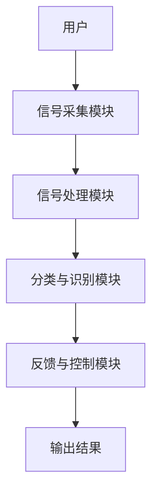
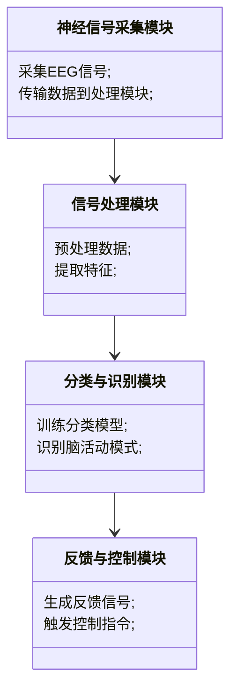

                 


# 巴菲特-芒格的脑机接口工作效率投资：认知增强的产业化

## 关键词：脑机接口，工作效率，巴菲特，芒格，认知增强，投资决策，技术应用

## 摘要：本文探讨了脑机接口技术在工作效率提升中的应用，特别是其在巴菲特和芒格投资理念中的潜在结合。通过分析脑机接口的核心原理、系统架构和实际案例，本文展示了如何利用这一技术增强认知能力，优化投资决策，并实现工作效率的产业化提升。

---

# 第一部分: 脑机接口技术与工作效率提升

## 第1章: 脑机接口技术的定义与背景

### 1.1 脑机接口技术的定义与背景

#### 1.1.1 脑机接口技术的定义
脑机接口（Brain-Computer Interface，BCI）是一种通过采集和解析大脑神经信号，将其转化为可被计算机或其他设备识别的指令的技术。其核心在于将人类的思维活动转化为数字化的输出，从而实现人与机器之间的直接交互。

#### 1.1.2 脑机接口技术的发展历程
1. **早期研究**：20世纪70年代，科学家开始尝试通过电极记录大脑电信号，探索其在控制外部设备中的潜力。
2. **非侵入式技术的发展**：随着技术的进步，非侵入式脑机接口（如EEG）逐渐成熟，应用场景扩展到医疗、教育和娱乐等领域。
3. **现代应用**：近年来，脑机接口技术在医疗康复、游戏控制、智能家居等领域取得了显著进展，尤其是在工作效率提升方面的潜力逐渐显现。

#### 1.1.3 工作效率提升的核心问题
在现代职场中，工作效率的提升成为企业和个人的共同追求。脑机接口技术通过实时监测和分析大脑活动，帮助用户优化注意力分配、减少干扰因素，从而提高工作产出。

#### 1.1.4 脑机接口技术的边界与外延
- **边界**：脑机接口技术主要用于辅助决策、提高注意力集中度，但其输出依赖于大脑活动的准确性。
- **外延**：结合人工智能和大数据分析，脑机接口技术可以扩展到更广泛的领域，如个性化学习、精准医疗等。

#### 1.1.5 脑机接口技术的核心要素组成
1. **信号采集模块**：负责采集大脑电信号（如EEG）。
2. **信号处理模块**：对采集到的信号进行降噪、特征提取等处理。
3. **分类与识别模块**：利用机器学习算法对信号进行分类，识别特定的脑活动模式。
4. **反馈与控制模块**：将识别结果转化为实际的控制指令或反馈信息。

### 1.2 巴菲特-芒格投资理念与脑机接口技术的结合

#### 1.2.1 巴菲特-芒格投资理念概述
巴菲特和芒格的投资理念强调长期价值、安全边际和独立思考。他们注重对企业基本面的深入分析，以及对市场情绪的理性判断。

#### 1.2.2 巴菲特-芒格理念与脑机接口技术的契合点
1. **理性决策**：脑机接口技术可以帮助投资者识别和抑制非理性决策，提高决策的客观性。
2. **情绪监控**：通过监测大脑活动，识别投资者的情绪波动，避免情绪化决策。
3. **认知优化**：利用脑机接口技术，投资者可以更好地集中注意力，提高分析效率。

#### 1.2.3 脑机接口技术在投资决策中的应用潜力
1. **实时反馈**：投资者可以通过脑机接口技术实时了解自己的注意力状态，调整投资策略。
2. **情绪管理**：通过监测大脑活动，识别潜在的情绪波动，提前采取应对措施。
3. **决策优化**：结合机器学习算法，脑机接口可以辅助投资者识别潜在的投资机会和风险。

#### 1.2.4 脑机接口技术对工作效率投资的启示
脑机接口技术可以作为投资者的“认知增强工具”，帮助他们在复杂的投资环境中保持冷静，做出更明智的决策。

---

## 第2章: 脑机接口技术的核心概念与原理

### 2.1 脑机接口技术的核心概念

#### 2.1.1 神经信号的采集与处理
- **EEG信号采集**：通过头皮电极采集大脑电信号。
- **信号降噪**：去除环境噪声和肌肉活动干扰，提取有用的神经信号。

#### 2.1.2 神经信号的特征提取
- **频域分析**：通过傅里叶变换提取信号的频谱特征。
- **时域分析**：分析信号的时间序列特征，如波形形态。

#### 2.1.3 神经信号的分类与识别
- **分类算法**：常用的分类算法包括支持向量机（SVM）、随机森林（RF）和深度学习模型（如CNN、RNN）。
- **特征选择**：选择具有高区分度的特征，提高分类准确率。

#### 2.1.4 神经信号的反馈与控制
- **反馈机制**：通过实时反馈（如视觉、听觉提示）引导用户调整注意力状态。
- **控制指令**：将分类结果转化为具体的控制指令，如选择股票或触发交易信号。

### 2.2 脑机接口技术的算法原理

#### 2.2.1 常见的脑机接口算法
1. **基于EEG的分类算法**：
   - **LDA（线性判别分析）**：常用于二分类问题。
   - **SVM（支持向量机）**：适用于高维特征空间的分类。
2. **深度学习算法**：
   - **CNN（卷积神经网络）**：适用于图像特征提取。
   - **RNN（循环神经网络）**：适用于时间序列数据的处理。

#### 2.2.2 信号处理流程
1. **数据预处理**：
   - 去除噪声：使用滤波器（如Butterworth滤波器）去除高频噪声和慢波干扰。
   - 分段处理：将信号分成固定长度的时间段，便于后续分析。
2. **特征提取**：
   - 时间域特征：均值、标准差、峰峰值等。
   - 频率域特征：功率谱密度、特定频带的能量等。

#### 2.2.3 分类算法的选择与优化
1. **算法选择**：根据数据集的特征和分类任务选择合适的算法。
2. **模型优化**：通过交叉验证调整模型参数，提高分类准确率。

#### 2.2.4 神经网络在脑机接口中的应用
1. **深度学习模型**：
   - **CNN**：用于EEG信号的图像化处理，提取空间和时间特征。
   - **RNN**：用于时间序列数据的分析，捕捉信号的时间依赖性。

### 2.3 脑机接口技术的数学模型与公式

#### 2.3.1 神经信号的时间序列模型
- **ARIMA模型**：用于预测时间序列数据。
  $$ ARIMA(p, d, q) $$
  其中，p为自回归阶数，d为差分阶数，q为移动平均阶数。

#### 2.3.2 分类算法的数学表达式
- **SVM分类器**：通过优化目标函数和约束条件实现分类。
  $$ \text{minimize } \frac{1}{2}w^Tw + C\sum_{i=1}^n \xi_i $$
  $$ \text{subject to } y_i(w \cdot x_i + b) \geq 1 - \xi_i, \xi_i \geq 0 $$

#### 2.3.3 信号处理的数学变换
- **傅里叶变换**：将时间序列数据转换为频域数据。
  $$ X(f) = \sum_{n=0}^{N-1} x_n e^{-j2\pi fn/N} $$

#### 2.3.4 神经网络的数学基础
- **神经网络的激活函数**：如ReLU、Sigmoid等。
  $$ \text{ReLU}(x) = \max(0, x) $$

---

## 第3章: 脑机接口技术的系统架构与设计

### 3.1 系统架构设计

#### 3.1.1 系统整体架构图


#### 3.1.2 神经信号采集模块设计
- **硬件设备**：使用EEG头盔或帽式设备采集神经信号。
- **数据接口**：通过蓝牙或USB连接到计算机。

#### 3.1.3 信号处理模块设计
- **数据预处理**：去除噪声，分割数据段。
- **特征提取**：提取EEG信号的时间和频率特征。

#### 3.1.4 分类与识别模块设计
- **算法选择**：基于实验数据选择最优分类算法。
- **模型训练**：使用训练数据对模型进行训练和优化。

#### 3.1.5 反馈与控制模块设计
- **反馈机制**：通过视觉或听觉提示反馈分类结果。
- **控制指令**：将分类结果转化为具体的控制指令，如触发交易信号。

### 3.2 系统功能设计

#### 3.2.1 系统功能模块划分


#### 3.2.2 功能模块之间的交互关系
- **数据流**：神经信号采集模块的数据依次传递到信号处理模块、分类与识别模块，最终由反馈与控制模块生成反馈信号或控制指令。
- **控制流**：用户通过脑活动控制系统，系统根据反馈信号调整输出结果。

---

## 第4章: 脑机接口技术在工作效率投资中的应用案例

### 4.1 巴菲特-芒格投资理念的脑机接口实现

#### 4.1.1 投资决策的神经机制分析
- **注意力集中**：投资者在分析股票时，大脑特定区域的活动增强。
- **情绪波动**：市场波动可能导致投资者情绪紧张，影响决策。

#### 4.1.2 脑机接口在投资决策中的具体应用
- **实时监控**：通过EEG信号实时监测投资者的注意力和情绪状态。
- **决策优化**：基于脑机接口的反馈，帮助投资者做出更理性的决策。

#### 4.1.3 投资决策的神经信号特征提取
- **注意力特征**：θ频带（4-8 Hz）活动增强。
- **情绪特征**：β频带（13-30 Hz）活动变化。

#### 4.1.4 投资决策的神经信号分类与识别
- **分类任务**：识别投资者的注意力集中状态和情绪波动。
- **分类算法**：使用SVM或随机森林进行分类。

### 4.2 工作效率提升的实际案例分析

#### 4.2.1 案例一：金融投资领域的应用
- **应用场景**：投资者通过脑机接口技术实时监控自己的注意力和情绪状态，优化投资决策。
- **实现步骤**：
  1. 采集EEG信号。
  2. 提取注意力和情绪相关的特征。
  3. 使用SVM分类器识别注意力集中状态和情绪波动。
  4. 生成反馈信号，帮助投资者调整注意力状态。

#### 4.2.2 案例二：企业管理决策中的应用
- **应用场景**：企业高管通过脑机接口技术优化决策过程，提高决策效率。
- **实现步骤**：
  1. 采集高管的EEG信号。
  2. 分析信号特征，识别高管的注意力和情绪状态。
  3. 提供反馈建议，帮助高管保持冷静和专注。

#### 4.2.3 案例三：个人工作效率优化中的应用
- **应用场景**：个人通过脑机接口技术提高学习和工作效率。
- **实现步骤**：
  1. 采集个人的EEG信号。
  2. 分析信号特征，识别注意力集中状态。
  3. 提供实时反馈，帮助个人保持高效工作状态。

#### 4.2.4 案例分析总结与经验分享
- **总结**：脑机接口技术在金融、企业管理和个人效率提升中的应用潜力巨大。
- **经验分享**：结合实际情况选择合适的脑机接口技术方案，注重数据采集和模型优化。

---

## 第5章: 项目实战：基于脑机接口的投资效率优化系统

### 5.1 项目介绍

#### 5.1.1 项目背景
- **目标**：开发一个基于脑机接口的投资效率优化系统，帮助投资者提高决策效率和准确率。
- **需求分析**：
  - 实时采集投资者的EEG信号。
  - 分析EEG信号，识别注意力集中状态和情绪波动。
  - 提供实时反馈，优化投资决策。

#### 5.1.2 项目目标
- **目标1**：实现EEG信号的实时采集和处理。
- **目标2**：构建一个高效的分类模型，识别投资者的注意力和情绪状态。
- **目标3**：设计一个反馈系统，帮助投资者优化决策。

### 5.2 环境安装与配置

#### 5.2.1 系统环境
- **操作系统**：Linux或Windows。
- **开发工具**：Python（推荐）、MATLAB。
- **硬件设备**：EEG采集设备（如OpenBCI或NeuroNode）。

#### 5.2.2 软件安装
- **Python库**：
  - `numpy`：用于数据处理。
  - `scipy`：用于科学计算。
  - `scikit-learn`：用于机器学习算法。
  - `pyplot`：用于数据可视化。

### 5.3 系统核心实现

#### 5.3.1 数据采集与预处理
- **数据采集**：
  ```python
  import numpy as np
  from openBCI import OpenBCI
  def采集EEG信号():
      board = OpenBCI()
      data = board.read_data()
      return data
  ```
- **数据预处理**：
  ```python
  def预处理数据(data):
      # 去除噪声
      data_filtered = butterworth_filter(data)
      # 分段时间段
      segmented_data = split_into_segments(data_filtered, 1秒)
      return segmented_data
  ```

#### 5.3.2 特征提取与分类

- **特征提取**：
  ```python
  def提取特征(segmented_data):
      # 时间域特征
      time_features = [计算均值、标准差、峰峰值等]
      # 频率域特征
      freq_features = [计算功率谱密度等]
      return np.concatenate([time_features, freq_features])
  ```

- **分类实现**：
  ```python
  from sklearn.svm import SVC
  def分类模型训练(train_features, train_labels):
      clf = SVC()
      clf.fit(train_features, train_labels)
      return clf
  ```

#### 5.3.3 反馈与控制

- **反馈机制**：
  ```python
  def生成反馈信号(分类结果):
      if 分类结果 == '注意力集中':
          return '保持当前状态'
      else:
          return '需要调整注意力'
  ```

- **控制指令**：
  ```python
  def触发控制指令(反馈信号):
      if 反馈信号 == '保持当前状态':
          print('继续分析股票')
      else:
          print('调整注意力，重新分析')
  ```

### 5.4 项目小结

#### 5.4.1 项目实现的关键点
- **数据采集**：确保EEG信号的高质量采集。
- **模型优化**：选择合适的分类算法，提高分类准确率。
- **反馈设计**：设计有效的反馈机制，帮助用户优化决策。

#### 5.4.2 项目中的问题与解决
- **问题**：信号干扰严重。
  - **解决**：使用更好的滤波器和校准设备。
- **问题**：分类准确率低。
  - **解决**：增加训练数据，优化模型参数。

---

## 第6章: 总结与展望

### 6.1 总结

#### 6.1.1 核心内容回顾
- **脑机接口技术**：通过采集和分析大脑神经信号，实现人与机器的直接交互。
- **工作效率提升**：脑机接口技术在金融投资、企业管理和个人效率提升中的应用潜力。
- **巴菲特-芒格理念**：通过脑机接口技术优化投资决策，提高工作效率。

#### 6.1.2 技术优势与挑战
- **优势**：提高决策效率，优化注意力分配。
- **挑战**：技术成熟度不足，用户接受度有待提高。

### 6.2 未来展望

#### 6.2.1 技术发展趋势
- **非侵入式技术的进步**：提高信号采集的准确性和舒适性。
- **人工智能的融合**：结合深度学习和大数据分析，提升分类算法的性能。

#### 6.2.2 巴菲特-芒格理念的深化
- **个性化投资决策支持**：根据投资者的神经特征，提供个性化的投资建议。
- **智能化投资辅助系统**：开发更智能的脑机接口系统，实现自动化的投资决策。

### 6.3 最佳实践 tips

#### 6.3.1 巴菲特-芒格理念与脑机接口技术的结合
- **理性决策**：通过脑机接口技术识别和抑制非理性决策。
- **情绪管理**：实时监测情绪波动，避免情绪化决策。
- **认知优化**：利用脑机接口技术提高注意力集中度，优化分析效率。

#### 6.3.2 工作效率提升的小结
- **系统设计**：合理设计脑机接口系统的架构，确保各模块协同工作。
- **数据采集**：确保信号采集的高质量，减少干扰因素。
- **模型优化**：选择合适的算法，提高分类准确率。

#### 6.3.3 注意事项
- **隐私保护**：确保用户数据的安全性和隐私性。
- **用户体验**：优化系统界面和反馈机制，提高用户体验。
- **技术可靠性**：确保系统的稳定性和可靠性，避免因技术问题影响决策。

#### 6.3.4 拓展阅读
- **相关书籍**：《脑机接口入门》、《投资的思维》。
- **学术论文**：搜索关于脑机接口技术和投资决策优化的学术论文，获取最新的研究成果。
- **技术博客**：关注技术博客和论坛，了解脑机接口技术的最新动态和应用案例。

---

## 结语

脑机接口技术在工作效率提升中的应用潜力巨大，尤其是在投资决策领域。通过结合巴菲特和芒格的投资理念，脑机接口技术可以帮助投资者优化决策过程，提高工作效率。未来，随着技术的进步和应用的深化，脑机接口技术将在更多领域发挥重要作用，成为认知增强的重要工具。

