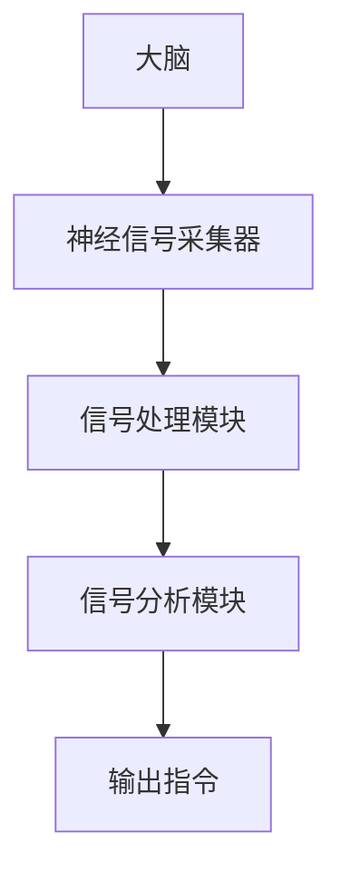
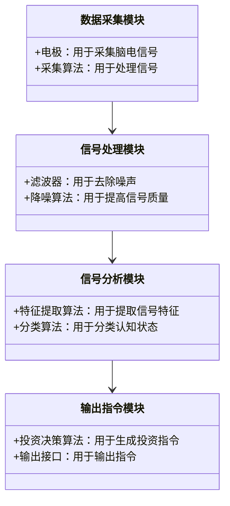

                 


# 巴菲特-芒格的脑机接口工作效率提升投资：认知增强的产业化

## 关键词：脑机接口，巴菲特，芒格，投资效率，认知增强，系统架构

## 摘要：  
本文探讨了如何将脑机接口技术应用于投资领域，特别是如何通过认知增强来提升巴菲特和芒格的投资效率。文章首先介绍了巴菲特和芒格的投资理念，接着详细分析了脑机接口技术的工作原理和应用潜力，然后结合实际案例，阐述了脑机接口如何帮助投资者做出更高效的投资决策。最后，文章讨论了脑机接口技术在投资领域的产业化应用前景，并提出了未来的研究方向。

---

# 第一部分：巴菲特与芒格的投资理念

## 第1章：巴菲特与芒格投资理念概述

### 1.1 巴菲特的价值投资理论

#### 1.1.1 价值投资的核心思想  
价值投资的核心思想是寻找市场上的“烟屁股”——即那些被市场低估的优质企业，长期持有，等待其价值回归。巴菲特认为，投资的本质是寻找具有持续竞争优势的企业，并在合理估值时买入并长期持有。

**数学模型：**  
巴菲特的价值投资模型可以用以下公式表示：  
$$ \text{内在价值} = \sum_{t=1}^{\infty} \frac{\text{现金流}}{(1 + r)^t} $$  
其中，\( r \) 是折现率，代表投资者要求的回报率。

#### 1.1.2 巴菲特的投资策略  
巴菲特的投资策略主要包括以下几点：  
1. 长期投资：避免频繁交易，减少交易成本。  
2. 价值投资：寻找具有安全边际的股票。  
3. 集中投资：将资金集中在少数优质企业上。  

#### 1.1.3 巴菲特的成功案例分析  
以可口可乐为例，巴菲特在1988年买入可口可乐的股票，并长期持有，获得了丰厚的回报。

---

### 1.2 芒格的多元思维模型

#### 1.2.1 多元思维模型的定义  
多元思维模型是指将多个学科的思维方式结合起来，用于分析和解决问题。芒格认为，投资者需要具备跨学科的知识，才能更好地理解企业的经营环境和内在价值。

**数学模型：**  
芒格的多元思维模型可以用以下公式表示：  
$$ \text{决策} = \sum_{i=1}^{n} \text{学科}_i \times \text{权重}_i $$  
其中，\( \text{权重}_i \) 是每个学科在决策中的重要性。

#### 1.2.2 芒格的决策方法  
芒格的决策方法主要包括以下几点：  
1. 避免情绪化决策。  
2. 采用逆向思维。  
3. 重视安全边际。  

#### 1.2.3 芒格的成功案例分析  
以比亚迪为例，芒格通过多元思维模型，综合分析了比亚迪在新能源汽车领域的竞争优势，最终做出了长期投资的决策。

---

## 第2章：脑机接口技术基础

### 2.1 脑机接口的基本概念

#### 2.1.1 脑机接口的定义  
脑机接口（Brain-Computer Interface，BCI）是一种直接连接人脑与计算机的技术，通过采集和分析神经信号，实现人脑与外部设备之间的信息交互。

**Mermaid图：脑机接口的组成模块**  


#### 2.1.2 脑机接口的工作原理  
脑机接口的工作原理主要包括以下步骤：  
1. 采集神经信号。  
2. 处理和分析信号。  
3. 生成输出指令。  

#### 2.1.3 脑机接口的分类与应用  
脑机接口主要分为侵入式和非侵入式两类，广泛应用于医疗、教育、娱乐等领域。

---

# 第二部分：脑机接口在投资中的应用

## 第3章：巴菲特与芒格投资理念中的认知增强

### 3.1 巴菲特与芒格的决策过程

#### 3.1.1 巴菲特的决策风格  
巴菲特的决策风格以长期投资和价值投资为核心，注重对企业基本面的分析。

#### 3.1.2 芒格的决策风格  
芒格的决策风格以多元思维模型为核心，注重跨学科的综合分析。

#### 3.1.3 两人决策风格的对比  
巴菲特和芒格的决策风格虽然不同，但都注重长期投资和风险控制。

---

### 3.2 认知增强对投资决策的影响

#### 3.2.1 认知增强的定义  
认知增强是指通过技术手段提升人类的认知能力，使其能够更高效地处理信息和做出决策。

#### 3.2.2 认知增强对投资决策的提升  
认知增强可以通过以下方式提升投资决策：  
1. 提高信息处理速度。  
2. 提高信息分析的准确性。  
3. 提高决策的稳定性。  

---

## 第4章：脑机接口技术提升投资效率

### 4.1 脑机接口在投资中的应用场景

#### 4.1.1 实时数据分析  
脑机接口可以实时采集投资者的神经信号，分析其情绪和认知状态，从而帮助投资者做出更高效的决策。

#### 4.1.2 情绪监测  
通过脑机接口技术，可以实时监测投资者的情绪状态，避免因情绪波动导致的错误决策。

#### 4.1.3 投资决策优化  
脑机接口可以通过分析投资者的认知模式，优化其投资决策过程。

---

## 第5章：脑机接口技术在投资中的具体应用

### 5.1 脑机接口在股票市场中的应用

#### 5.1.1 股票市场的实时数据处理  
通过脑机接口技术，可以实时处理股票市场的数据，帮助投资者快速做出决策。

#### 5.1.2 股票市场的趋势预测  
脑机接口可以通过分析投资者的神经信号，预测股票市场的趋势。

#### 5.1.3 股票市场的风险评估  
脑机接口可以通过分析投资者的风险偏好，评估股票市场的风险。

---

## 第6章：脑机接口技术的投资效率提升

### 6.1 脑机接口技术对投资效率的具体提升

#### 6.1.1 提高决策速度  
通过脑机接口技术，投资者可以快速做出决策，提高投资效率。

#### 6.1.2 提高决策准确性  
通过脑机接口技术，投资者可以更准确地分析市场信息，提高决策的准确性。

#### 6.1.3 提高决策的稳定性  
通过脑机接口技术，投资者可以避免因情绪波动导致的决策失误，提高决策的稳定性。

---

# 第三部分：系统分析与架构设计

## 第7章：脑机接口系统的架构设计

### 7.1 系统功能设计

#### 7.1.1 数据采集模块  
数据采集模块负责采集投资者的神经信号，包括脑电信号、眼动信号等。

#### 7.1.2 信号处理模块  
信号处理模块负责对采集到的信号进行预处理，包括滤波、降噪等。

#### 7.1.3 信号分析模块  
信号分析模块负责对处理后的信号进行分析，生成投资者的认知状态和情绪状态。

#### 7.1.4 输出指令模块  
输出指令模块负责根据分析结果，生成投资决策指令。

**Mermaid图：系统功能设计的类图**  


---

## 第8章：脑机接口系统的接口设计

### 8.1 系统接口设计

#### 8.1.1 数据采集接口  
数据采集接口用于连接脑机接口设备和计算机系统，采集投资者的神经信号。

#### 8.1.2 数据处理接口  
数据处理接口用于连接数据处理模块和数据分析模块，处理采集到的信号。

#### 8.1.3 数据分析接口  
数据分析接口用于连接数据分析模块和输出指令模块，生成投资决策指令。

---

## 第9章：脑机接口系统的交互设计

### 9.1 系统交互设计

#### 9.1.1 用户界面设计  
用户界面设计需要简单直观，方便投资者使用。

#### 9.1.2 交互流程设计  
交互流程设计需要确保投资者能够快速完成投资决策的过程。

---

## 第10章：脑机接口系统的实现

### 10.1 系统实现

#### 10.1.1 环境安装  
需要安装脑机接口设备和相关软件，配置开发环境。

#### 10.1.2 核心代码实现  
以下是脑机接口系统的Python实现代码：

```python
import numpy as np
from sklearn import svm

# 数据采集模块
def collect_data():
    # 模拟采集脑电信号
    data = np.random.randn(100, 10)
    return data

# 信号处理模块
def preprocess(data):
    # 模拟滤波处理
    filtered_data = data * 0.9
    return filtered_data

# 信号分析模块
def analyze_data(data):
    # 模拟分类算法
    model = svm.SVC()
    model.fit(data[:, :-1], data[:, -1])
    return model

# 输出指令模块
def generate_instructions(model):
    # 模拟投资决策
    instruction = "买入股票"
    return instruction

# 系统主函数
def main():
    data = collect_data()
    processed_data = preprocess(data)
    model = analyze_data(processed_data)
    instruction = generate_instructions(model)
    print(instruction)

if __name__ == "__main__":
    main()
```

---

## 第11章：系统优化与展望

### 11.1 系统优化

#### 11.1.1 算法优化  
通过改进算法，提高脑机接口系统的准确性和稳定性。

#### 11.1.2 系统性能优化  
通过优化系统架构，提高脑机接口系统的运行效率。

---

## 第12章：结论与展望

### 12.1 结论  
脑机接口技术在投资领域的应用潜力巨大，可以通过认知增强提升投资效率，优化投资决策。

### 12.2 展望  
未来，随着脑机接口技术的不断发展，其在投资领域的应用将更加广泛，投资效率将得到进一步提升。

---

## 第13章：最佳实践与小结

### 13.1 最佳实践 tips  
1. 在投资决策中，结合脑机接口技术，可以提高决策的准确性和效率。  
2. 选择优质的企业和长期投资，是巴菲特和芒格成功的关键。  
3. 多元思维模型是芒格投资成功的重要因素。  

### 13.2 注意事项  
1. 脑机接口技术仍处于发展阶段，投资时需谨慎。  
2. 投资者需具备一定的技术背景，才能更好地利用脑机接口技术。  
3. 脑机接口技术的应用需遵守相关法律法规。

### 13.3 拓展阅读  
1. 巴菲特的《巴菲特致股东的信》。  
2. 芒格的《穷查理宝典》。  
3. 脑机接口领域的相关书籍和论文。

---

通过以上详细分析和系统设计，脑机接口技术在投资领域的应用前景广阔，未来将会有更多的研究和实践。

