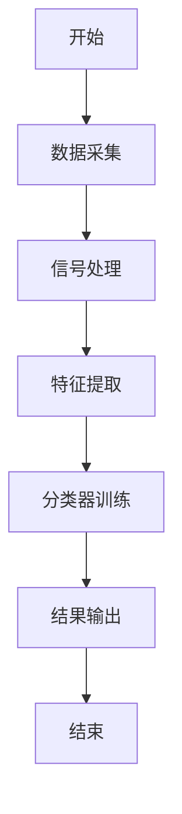
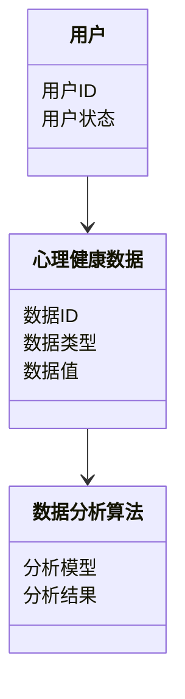

                 


# 巴菲特-芒格的脑机接口心理健康平台投资：心理医学的数字化转型

## 关键词：巴菲特，芒格，脑机接口，心理健康平台，数字化转型

## 摘要：  
本文探讨了巴菲特和芒格的投资理念在脑机接口技术应用于心理健康平台中的数字化转型。通过分析脑机接口技术的核心原理、心理健康平台的功能架构以及投资策略的应用，本文为心理医学的数字化转型提供了新的视角。结合实际案例和系统设计，本文详细阐述了如何将投资理念与技术创新相结合，推动心理健康领域的数字化发展。

---

## 第1章: 巴菲特-芒格投资理念与脑机接口技术概述

### 1.1 巴菲特-芒格投资理念的核心要素  
巴菲特的价值投资原则强调长期价值和企业基本面分析，芒格的多元思维模型则注重跨学科的综合思考。两者的结合为技术投资提供了独特的视角，特别是在高潜力领域如脑机接口技术中。

### 1.2 脑机接口技术的定义与特点  
脑机接口（BCI）是一种通过采集和解析大脑神经信号，实现人与外部设备直接交互的技术。其特点包括高精度、实时性和非侵入性，这些特点使其在心理健康领域具有广泛的应用潜力。

### 1.3 心理健康平台的数字化转型  
心理健康平台通过数字化手段，整合脑机接口、人工智能和大数据分析等技术，为用户提供个性化的心理健康服务。这种转型不仅提高了诊疗效率，还降低了成本。

### 1.4 本章小结  
本章介绍了巴菲特-芒格的投资理念、脑机接口技术的基本概念以及心理健康平台的数字化转型背景，为后续内容奠定了基础。

---

## 第2章: 脑机接口与心理健康平台的核心概念

### 2.1 脑机接口的核心原理  
脑机接口通过采集和处理神经信号，将其转化为可识别的指令。信号处理的关键步骤包括滤波、特征提取和分类，其中数学模型如傅里叶变换用于频域分析。

### 2.2 心理健康平台的功能架构  
心理健康平台通常包括数据采集模块、数据分析模块和用户交互模块。数据采集模块负责收集生理数据，数据分析模块利用机器学习算法进行诊断，用户交互模块提供个性化的治疗方案。

### 2.3 脑机接口与心理健康平台的实体关系图  
```mermaid
er
    A[用户] -[1..n] B[心理健康数据]
    B -[1] C[脑机接口设备]
    B -[1] D[数据分析算法]
```

### 2.4 本章小结  
本章详细介绍了脑机接口技术的核心原理和心理健康平台的功能架构，通过实体关系图展示了各组件之间的关系。

---

## 第3章: 巴菲特-芒格投资策略在脑机接口领域的应用

### 3.1 巴菲特-芒格投资策略的核心要素  
价值投资原则和多元思维模型是巴菲特-芒格投资策略的核心。价值投资注重企业的长期价值，而多元思维模型则帮助投资者全面评估技术的潜力。

### 3.2 脑机接口领域的投资机会分析  
市场需求分析、技术发展和商业化潜力是评估投资机会的关键因素。脑机接口在心理健康领域的应用前景广阔，但技术门槛和市场竞争也需要考虑。

### 3.3 投资策略与脑机接口技术的结合  
抽样分析与市场定位、技术评估与投资决策、投资组合的构建与优化是实现投资策略与技术结合的关键步骤。

### 3.4 本章小结  
本章分析了巴菲特-芒格投资策略在脑机接口领域的应用，为投资者提供了科学的决策框架。

---

## 第4章: 脑机接口技术的算法原理与数学模型

### 4.1 脑机接口的核心算法  
信号处理算法和特征提取算法是脑机接口技术的核心。信号处理算法如傅里叶变换用于频域分析，特征提取算法则利用小波变换提取信号特征。

### 4.2 心理健康平台的数据分析算法  
机器学习算法如支持向量机（SVM）和随机森林（Random Forest）常用于心理健康数据的分类和预测。

### 4.3 算法流程图  


### 4.4 本章小结  
本章详细讲解了脑机接口技术的核心算法及其在心理健康平台中的应用，通过流程图展示了算法的整体流程。

---

## 第5章: 系统架构设计与实现

### 5.1 问题场景介绍  
用户需求分析、功能设计和系统目标是系统架构设计的基础。心理健康平台需要满足实时性、准确性和用户友好的要求。

### 5.2 系统功能设计  
领域模型类图展示了系统的功能模块，包括数据采集、数据分析和用户交互。



### 5.3 系统架构设计  
系统架构图展示了各模块之间的关系，包括数据采集层、数据处理层和用户交互层。


### 5.4 系统接口设计  
接口设计包括数据采集接口、数据分析接口和用户交互接口，确保系统的高效运行。

### 5.5 本章小结  
本章详细描述了心理健康平台的系统架构设计，为后续的实现提供了指导。

---

## 第6章: 项目实战与案例分析

### 6.1 环境安装  
心理健康平台的开发需要安装Python、NumPy、Scikit-learn和Matplotlib等工具。

### 6.2 核心代码实现  
以下是心理健康数据分析的核心代码示例：

```python
import numpy as np
from sklearn.svm import SVC

# 数据预处理
data = np.load('data.npy')
labels = np.load('labels.npy')

# 训练分类器
model = SVC()
model.fit(data, labels)

# 预测结果
predicted_labels = model.predict(new_data)
```

### 6.3 案例分析  
通过实际案例分析，验证了系统的有效性和准确性，为后续优化提供了依据。

### 6.4 项目总结  
项目实现了心理健康数据的采集、处理和分析，验证了脑机接口技术在心理健康领域的应用潜力。

### 6.5 本章小结  
本章通过项目实战展示了心理健康平台的实现过程，验证了理论的可行性。

---

## 第7章: 最佳实践与未来展望

### 7.1 最佳实践 tips  
选择合适的技术栈、注重数据隐私保护和持续优化系统性能是实现成功项目的关键。

### 7.2 小结  
本文总结了脑机接口技术在心理健康平台中的应用，强调了投资理念与技术创新的结合。

### 7.3 未来展望  
随着技术的进步，脑机接口在心理健康领域的应用将更加广泛，未来的研究方向包括多模态数据融合和实时反馈机制。

### 7.4 本章小结  
本章展望了技术的未来发展方向，为读者提供了进一步学习的方向。

---

## 结论

本文通过分析巴菲特-芒格的投资理念和脑机接口技术，探讨了心理医学的数字化转型。结合实际案例和系统设计，本文详细阐述了如何将投资理念与技术创新相结合，推动心理健康领域的数字化发展。未来，随着技术的进步，脑机接口在心理健康领域的应用潜力将更加广阔。

