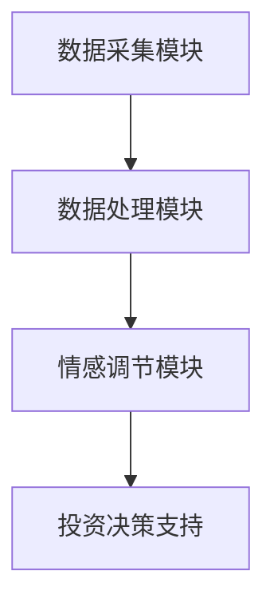

                 


```markdown
# 巴菲特-芒格的脑机接口情感调节投资：心理健康的新方法

> 关键词：巴菲特，芒格，脑机接口，情感调节，投资心理学，心理健康，技术实现

> 摘要：本文探讨了如何利用脑机接口技术调节投资者情绪，从而优化投资决策。结合巴菲特和芒格的投资理念，分析了脑机接口技术的核心原理、情感调节算法的数学模型，以及系统的架构设计。通过实际案例展示了如何将脑机接口应用于投资决策，并提出了未来的发展方向。

---

## 第一部分：引言

### 第1章：巴菲特与芒格的投资理念与心理学基础

#### 1.1 巴菲特的价值投资理念
- 巴菲特的价值投资哲学
- 投资中的心理学因素
- 巴菲特的长期思维模型

#### 1.2 芮格的多元思维模型
- 多元思维模型的定义
- 芮格的决策框架
- 投资中的心理偏差

#### 1.3 脑机接口技术的基本原理
- 神经科学基础
- 脑机接口的定义与分类
- 技术现状与应用领域

#### 1.4 情感调节与投资决策的关系
- 情绪对投资决策的影响
- 常见心理偏差及其影响
- 情感调节在投资中的重要性

#### 1.5 本章小结
- 总结本章的核心内容
- 引入后续章节的思考方向

---

## 第二部分：脑机接口技术的核心概念与实现原理

### 第2章：脑机接口技术的核心概念与实现原理

#### 2.1 脑机接口的核心概念
- 神经信号的采集与处理
- 信号处理算法
- 输出指令的生成

#### 2.2 脑机接口的实现流程
- 数据采集阶段
- 数据处理阶段
- 指令生成阶段

#### 2.3 脑机接口在情感调节中的应用
- 情感识别的神经机制
- 情感调节的算法实现
- 情感调节的反馈机制

#### 2.4 本章小结
- 总结脑机接口技术的核心原理
- 强调情感调节在投资中的潜力

---

## 第三部分：情感调节算法的数学模型与实现

### 第3章：情感调节算法的数学模型与实现

#### 3.1 情感识别的数学模型
- 神经网络模型
- 支持向量机模型
- 随机森林模型

#### 3.2 情感调节的算法实现
- 基于神经网络的情感调节模型
- 情感调节的反馈机制
- 算法的优化与调参

#### 3.3 情感调节算法的数学公式
- 神经网络的损失函数
  $$L = -\sum_{i=1}^{n} y_i \log(p_i) + (1 - y_i) \log(1 - p_i)$$
- 情感调节的回归方程
  $$y = \beta_0 + \beta_1x_1 + \beta_2x_2 + \cdots + \beta_kx_k$$

#### 3.4 本章小结
- 总结情感调节算法的数学模型
- 强调算法在投资中的应用潜力

---

## 第四部分：脑机接口情感调节系统的架构设计

### 第4章：脑机接口情感调节系统的架构设计

#### 4.1 系统架构概述
- 系统整体架构
- 系统模块划分
- 系统功能设计

#### 4.2 系统功能实现
- 数据采集模块
- 数据处理模块
- 情感调节模块

#### 4.3 系统架构图


#### 4.4 本章小结
- 总结系统架构设计
- 强调模块化设计的优势

---

## 第五部分：系统实现与实战案例

### 第5章：系统实现与实战案例

#### 5.1 环境安装
- 安装Python环境
- 安装必要的库（如numpy, pandas, scikit-learn）

#### 5.2 系统核心实现源代码
- 数据采集代码
```python
import numpy as np

def collect_data():
    # 模拟数据采集
    data = np.random.randn(100, 10)
    return data
```

- 数据处理代码
```python
import pandas as pd

def preprocess_data(data):
    df = pd.DataFrame(data)
    return df
```

- 情感调节代码
```python
from sklearn.neural_network import MLPClassifier

def emotional_regulation_model(X_train, y_train):
    model = MLPClassifier(hidden_layer_sizes=(100, 50))
    model.fit(X_train, y_train)
    return model
```

#### 5.3 实际案例分析
- 案例背景
- 数据采集与处理
- 情感调节模型的应用
- 投资决策支持

#### 5.4 本章小结
- 总结系统实现的关键步骤
- 强调案例分析的实际意义

---

## 第六部分：总结与展望

### 第6章：总结与展望

#### 6.1 总结
- 回顾全书的核心内容
- 强调脑机接口技术在投资中的潜力

#### 6.2 展望
- 未来的技术发展趋势
- 可能的挑战与解决方案
- 投资心理学与技术的结合前景

#### 6.3 本章小结
- 总结全书的主要内容
- 展望未来的研究方向

---

## 参考文献
-巴菲特的投资哲学书籍
-芒格的多元思维模型书籍
-脑机接口技术相关论文
-情感调节算法相关研究

---

## 附录
- 系统实现代码的详细说明
- 数据采集与处理的详细流程
- 情感调节算法的优化建议
```

