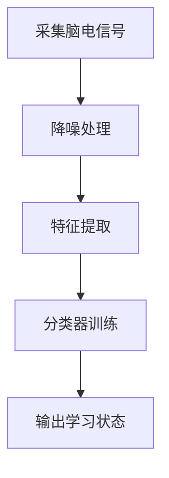
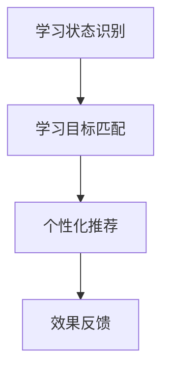
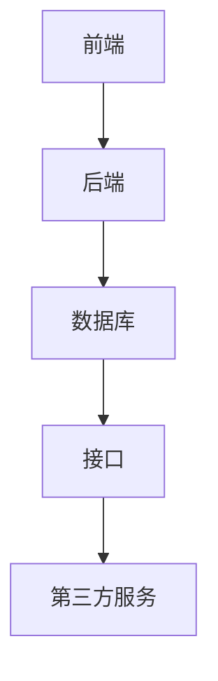
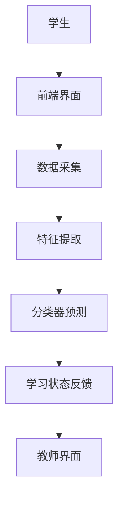

                 


# 巴菲特-芒格的脑机接口教育平台投资：认知增强的学习革命

---

## 关键词

- 巴菲特
- 芒格
- 脑机接口
- 教育平台
- 认知增强
- 人工智能
- 投资策略

---

## 摘要

本文探讨了巴菲特和芒格在脑机接口（BCI）教育平台投资中的策略和理念，分析了BCI技术在教育领域的应用前景，并通过技术实现、系统架构和项目实战等多维度，详细阐述了认知增强学习革命的实现路径。文章结合实际案例，为读者提供了从理论到实践的全面解析。

---

## 第1章: 背景与概念

### 1.1 脑机接口技术的起源与发展

#### 1.1.1 脑机接口的定义与核心原理

**脑机接口（Brain-Computer Interface, BCI）**是一种通过采集和解析大脑电信号，将人类思维活动转化为计算机可识别指令的技术。其核心原理包括：

1. **数据采集**：通过 EEG（脑电图）、fMRI（功能性磁共振成像）等设备采集大脑活动信号。
2. **信号处理**：对采集到的信号进行降噪、特征提取和模式识别。
3. **指令生成**：将识别出的信号转化为具体的控制指令。

#### 1.1.2 脑机接口在教育领域的应用背景

随着人工智能技术的快速发展，教育领域正经历一场技术驱动的变革。脑机接口技术能够实时监测学生的注意力水平、情绪状态和认知负荷，从而提供个性化的学习建议和动态调整教学内容。

#### 1.1.3 脑机接口如何解决学习中的问题

脑机接口技术能够实时监测学生的学习状态，识别学习瓶颈，并提供针对性的解决方案。例如：

- **注意力分散**：通过实时监测学生的注意力水平，系统可以及时提醒学生集中注意力。
- **学习效率低下**：通过分析学生的学习行为，系统可以优化教学内容，提高学习效率。

### 1.2 巴菲特与芒格的投资哲学

#### 1.2.1 巴菲特的价值投资理念

巴菲特的价值投资理念强调长期价值和企业基本面分析。他认为，投资的核心是寻找那些具有持续竞争优势、良好管理团队和合理估值的企业。

#### 1.2.2 芒格的多元思维模型

芒格的多元思维模型强调通过跨学科的视角来分析问题。他认为，只有通过多维度的思考，才能全面评估一个投资标的的价值和风险。

#### 1.2.3 巴菲特和芒格对脑机接口技术的共同认知

- **技术的颠覆性**：脑机接口技术能够彻底改变传统教育模式，提高学习效率。
- **市场需求潜力**：随着教育信息化的推进，脑机接口技术在教育领域的应用前景广阔。
- **长期投资价值**：脑机接口技术属于高成长性行业，具有较大的投资潜力。

### 1.3 脑机接口教育平台的核心概念

#### 1.3.1 脑机接口教育平台的功能

- **实时监测**：实时监测学生的学习状态，包括注意力、情绪和认知负荷。
- **个性化推荐**：根据学生的学习状态和特点，推荐适合的学习内容和方法。
- **数据反馈**：提供学习效果反馈，帮助教师和家长优化教学策略。

#### 1.3.2 脑机接口教育平台的关键技术

- **脑电采集技术**：通过 EEG 设备采集学生的脑电信号。
- **数据处理与分析算法**：利用机器学习算法对脑电信号进行分析和分类。
- **个性化学习推荐系统**：基于分析结果，推荐个性化的学习方案。

#### 1.3.3 脑机接口教育平台的商业模式

- **订阅模式**：学生或学校按月或按年支付订阅费用。
- **按需付费**：根据使用的功能模块或时间收费。
- **合作伙伴模式**：与教育机构合作，提供定制化服务。

---

## 第2章: 脑机接口教育平台的技术实现

### 2.1 脑机接口教育平台的算法原理

#### 2.1.1 脑电数据采集与处理

**流程图**：


- **降噪处理**：通过滤波技术去除 EEG 信号中的噪声。
- **特征提取**：提取与注意力、情绪相关的特征，如theta频段功率、alpha频段功率等。
- **分类器训练**：使用 SVM（支持向量机）或 LSTM（长短期记忆网络）对特征进行分类，识别学生的学习状态。

#### 2.1.2 个性化学习推荐算法

**流程图**：


- **学习状态识别**：根据脑电信号分析学生的学习状态（如注意力集中、情绪波动等）。
- **学习目标匹配**：将学生的学习状态与学习目标进行匹配，确定需要优化的方面。
- **个性化推荐**：基于匹配结果，推荐适合的学习内容和方法。
- **效果反馈**：实时反馈学习效果，优化推荐策略。

#### 2.1.3 系统架构设计

**架构图**：


- **前端**：负责用户界面设计和交互，包括学习界面和反馈界面。
- **后端**：负责处理业务逻辑，接收前端请求并返回处理结果。
- **数据库**：存储用户信息、学习数据和推荐策略。
- **接口**：与第三方服务（如学习管理系统）进行数据交互。

### 2.2 系统实现与项目实战

#### 2.2.1 环境搭建与开发工具

- **开发环境**：建议使用 Python 3.8+，安装必要的库如 numpy、scipy、scikit-learn、pymermaid等。
- **开发工具**：推荐使用 VS Code 或 PyCharm 进行开发。

#### 2.2.2 核心功能实现

**代码实现**：

```python
import numpy as np
from sklearn.svm import SVC
from sklearn.metrics import accuracy_score

# 数据预处理
def preprocess_eeg(eeg_data):
    # 假设eeg_data为一个二维数组，其中每行是一个样本的脑电信号
    # 这里进行降噪处理，例如滤除50Hz的噪声
    return eeg_data

# 特征提取
def extract_features(eeg_data):
    # 提取theta频段和alpha频段的功率
    theta_power = np.mean(eeg_data[:, 4:8], axis=1)
    alpha_power = np.mean(eeg_data[:, 8:12], axis=1)
    return np.column_stack((theta_power, alpha_power))

# 分类器训练
def train_classifier(features, labels):
    clf = SVC(kernel='rbf', C=1)
    clf.fit(features, labels)
    return clf

# 预测学习状态
def predict_learning_state(clf, new_eeg_data):
    features = extract_features(new_eeg_data)
    return clf.predict(features)

# 示例数据和标签
eeg_data = np.random.randn(100, 12)  # 100个样本，12个通道
labels = np.random.randint(0, 3, 100)  # 3种学习状态

# 训练分类器
preprocessed_data = preprocess_eeg(eeg_data)
features = extract_features(preprocessed_data)
clf = train_classifier(features, labels)

# 预测新样本的状态
new_eeg = np.random.randn(1, 12)
predicted_state = predict_learning_state(clf, new_eeg)
print(f"预测的学习状态：{predicted_state[0]}")
```

**代码解读**：

1. **数据预处理**：对脑电信号进行降噪处理，确保数据质量。
2. **特征提取**：提取theta和alpha频段的功率，作为分类器的输入特征。
3. **分类器训练**：使用SVM算法对特征进行分类，训练学习状态识别模型。
4. **状态预测**：基于训练好的模型，预测新样本的学习状态。

#### 2.2.3 案例分析与实际应用

**案例分析**：

假设某学校引入了脑机接口教育平台，通过实时监测学生的学习状态，教师可以及时调整教学策略，提高课堂效率。例如：

- **学生A**：注意力分散，系统推荐专注训练任务。
- **学生B**：情绪波动较大，系统建议教师调整教学节奏。

**实际应用**：

脑机接口教育平台可以与学校现有的学习管理系统（LMS）集成，提供无缝化学习体验。教师可以通过平台实时了解学生的学习状态，优化教学内容和节奏。

---

## 第3章: 项目实战与未来展望

### 3.1 项目实战

#### 3.1.1 环境搭建与代码实现

- **环境搭建**：
  - 安装必要的库：`pip install numpy scipy scikit-learn pymermaid`
  - 配置 EEG 数据采集设备（如 OpenBCI 或 Emotiv）

- **代码实现**：
  ```python
  import numpy as np
  from sklearn.ensemble import RandomForestClassifier
  from sklearn.metrics import classification_report

  # 假设我们已经采集了 EEG 数据和对应的学习状态标签
  eeg_data = np.load('eeg_samples.npy')  # 假设为100个样本，每个样本12通道
  labels = np.load('labels.npy')        # 对应的标签，0、1、2代表不同学习状态

  # 划分训练集和测试集
  from sklearn.model_selection import train_test_split
  X_train, X_test, y_train, y_test = train_test_split(eeg_data, labels, test_size=0.2, random_state=42)

  # 特征提取
  def extract_features(data):
      features = []
      for sample in data:
          theta_power = np.mean(sample[4:8], axis=1)
          alpha_power = np.mean(sample[8:12], axis=1)
          features.append(np.concatenate((theta_power, alpha_power)))
      return np.array(features)

  X_train_features = extract_features(X_train)
  X_test_features = extract_features(X_test)

  # 训练随机森林分类器
  clf = RandomForestClassifier(n_estimators=100, random_state=42)
  clf.fit(X_train_features, y_train)

  # 预测测试集
  y_pred = clf.predict(X_test_features)
  print(classification_report(y_test, y_pred))
  ```

**代码解读**：

1. **数据加载**：从文件加载 EEG 数据和标签。
2. **数据划分**：将数据划分为训练集和测试集。
3. **特征提取**：提取theta和alpha频段的功率作为特征。
4. **模型训练**：使用随机森林分类器训练模型。
5. **模型预测**：在测试集上进行预测，并输出分类报告。

#### 3.1.2 实际案例分析

**案例：专注力训练**

- **目标**：提高学生的专注力，延长注意力集中时间。
- **方法**：
  - 通过 EEG 监测学生的注意力水平。
  - 根据注意力水平动态调整学习任务的难度和节奏。
  - 提供实时反馈，激励学生保持专注。

### 3.2 未来展望

#### 3.2.1 脑机接口技术的未来发展

- **更高的精度**：随着算法的优化和硬件的进步，脑机接口的识别精度将进一步提高。
- **更广泛的应用**：除了教育领域，脑机接口技术还可应用于医疗、娱乐等多个领域。
- **更智能化的系统**：未来的系统将更加智能化，能够实时适应用户的需求和行为。

#### 3.2.2 认知增强学习的未来趋势

- **个性化学习**：通过脑机接口技术，实现真正的个性化学习，满足每个学生的需求。
- **实时反馈与优化**：系统能够实时监测学习状态，并动态调整学习内容和策略。
- **跨学科融合**：脑机接口技术将与教育学、心理学等学科深度融合，推动教育模式的全面革新。

---

## 第4章: 最佳实践与小结

### 4.1 最佳实践 tips

1. **数据质量**：确保 EEG 数据的采集质量，避免噪声干扰。
2. **算法优化**：不断优化特征提取和分类算法，提高识别精度。
3. **用户体验**：设计直观易用的界面，提升用户体验。
4. **隐私保护**：高度重视用户数据的隐私保护，确保数据安全。

### 4.2 小结

本文详细探讨了巴菲特和芒格在脑机接口教育平台投资中的理念和策略，分析了脑机接口技术在教育领域的应用前景，并通过技术实现和项目实战，深入阐释了认知增强学习革命的实现路径。脑机接口技术的引入，不仅能够提高学习效率，还能够实现真正的个性化教育，推动教育模式的全面革新。

### 4.3 注意事项

- **技术局限性**：目前脑机接口技术仍处于发展阶段，存在一定的技术局限性，如识别精度、设备成本等问题。
- **伦理问题**：需要关注脑机接口技术的伦理问题，确保技术的合理使用。
- **市场接受度**：需要考虑市场对脑机接口教育平台的接受度和需求。

### 4.4 拓展阅读

1. **脑机接口技术**：推荐阅读《脑机接口：从原理到应用》。
2. **巴菲特投资哲学**：推荐阅读《巴菲特的智慧》。
3. **教育技术**：推荐参考《教育技术的发展与创新》。

---

## 附录

### 附录1: 脑机接口技术的数学模型

**傅里叶变换公式**：
$$
X(f) = \int_{-\infty}^{\infty} x(t) e^{-j2\pi f t} dt
$$

**支持向量机分类器**：
$$
y = \text{sign}\left( \sum_{i=1}^{n} \alpha_i y_i x_i \cdot x + b \right)
$$

### 附录2: 系统交互流程图



---

## 结语

脑机接口技术正在逐步改变我们的生活方式和学习方式。通过本文的分析，我们看到了脑机接口技术在教育领域的巨大潜力，也看到了巴菲特和芒格投资理念的深远影响。未来，随着技术的不断进步和应用的不断拓展，脑机接口教育平台将为认知增强学习革命带来更多的可能性。

