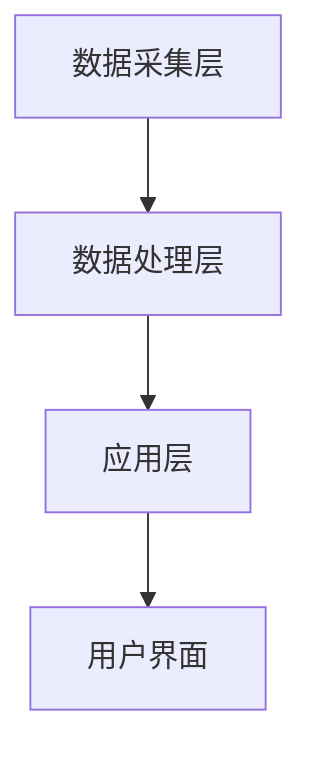

                 


# 巴菲特-芒格的脑机接口教育应用投资：学习革命的新前沿

## 关键词：脑机接口，教育应用，巴菲特，芒格，投资，学习革命

## 摘要：脑机接口技术正在教育领域掀起一场革命，通过实时监测和分析大脑活动，个性化学习和教学优化成为可能。本文结合巴菲特和芒格的投资智慧，深入探讨脑机接口教育应用的投资价值、技术原理和市场潜力，分析其在学习革命中的重要角色。

---

## 第一部分：背景与概述

### 第1章：脑机接口技术的背景与现状

#### 1.1 脑机接口技术的定义与核心概念

- **1.1.1 脑机接口的基本定义**
  脑机接口（Brain-Computer Interface，BCI）是一种连接大脑与外部设备的系统，通过采集和解析大脑信号，实现人与计算机的直接交互。

- **1.1.2 脑机接口的核心技术要素**
  - 信号采集：通过 EEG（脑电图）、fMRI（功能性磁共振成像）等技术获取大脑活动数据。
  - 数据处理：对信号进行降噪、特征提取和分类，转化为可操作的指令。
  - 算法优化：利用机器学习模型提升信号识别的准确性和实时性。

- **1.1.3 脑机接口的发展历程**
  脑机接口技术起源于20世纪70年代，经历了从实验室研究到实际应用的漫长过程，近年来随着人工智能和神经科学的进步，应用范围迅速扩展。

#### 1.2 巴菲特与芒格的投资理念

- **1.2.1 巴菲特的价值投资理论**
  巴菲特强调长期投资，关注企业的内在价值和管理层素质，避免短期市场波动的干扰。

- **1.2.2 芒格的多元思维模型**
  芒格提倡跨学科思考，将不同领域的知识相互结合，以更全面的角度分析问题。

- **1.2.3 投资与技术的结合**
  巴菲特和芒格都认为，技术创新是推动企业增长的核心动力，脑机接口技术作为新兴领域，具备巨大的投资潜力。

### 第2章：脑机接口技术在教育领域的应用潜力

#### 2.1 教育领域的痛点与挑战

- **2.1.1 学生学习效率的提升需求**
  学生的学习效率因人而异，传统教育模式难以满足个性化需求。

- **2.1.2 教师教学资源的优化配置**
  教师需要根据学生特点调整教学策略，但缺乏实时反馈机制。

- **2.1.3 教育机构的智能化转型**
  教育机构渴望通过技术手段提升教学质量和管理效率。

#### 2.2 脑机接口技术如何解决教育问题

- **2.2.1 提高学习效率的方法**
  脑机接口可以实时监测学生的注意力和情绪状态，优化学习内容和节奏。

- **2.2.2 个性化学习路径的设计**
  根据大脑活动数据，制定适合每位学生的个性化学习计划。

- **2.2.3 教学资源的智能化分配**
  系统可以根据学生的学习情况动态调整教学资源，提高资源利用率。

---

## 第二部分：脑机接口技术的核心概念与原理

### 第3章：脑机接口的核心技术解析

#### 3.1 脑机接口的关键技术

- **3.1.1 信号采集技术**
  - EEG：通过头皮电极采集脑电信号，成本低，无创性强。
  - fMRI：高精度的空间成像，但设备昂贵且使用不便。

- **3.1.2 数据处理与分析**
  数据预处理：降噪、去伪迹；特征提取：利用小波分析提取信号特征；分类器设计：基于机器学习的分类算法。

- **3.1.3 算法优化与应用**
  利用深度学习模型提升分类精度，实时性增强。

#### 3.2 脑机接口的分类与特点

- **3.2.1 非侵入式脑机接口**
  - 优点：无创、成本低、易于推广。
  - 缺点：信号质量较低，适用场景有限。

- **3.2.2 侵入式脑机接口**
  - 优点：信号质量高，适用于医疗领域。
  - 缺点：手术风险高，成本昂贵。

- **3.2.3 混合式脑机接口**
  - 综合非侵入式和侵入式技术的优势，适用于特定场景。

### 第4章：脑机接口在教育中的应用模式

#### 4.1 基于脑机接口的个性化学习系统

- **4.1.1 学习者认知特征的分析**
  通过脑机接口实时监测学生的注意力和情绪变化，分析其认知特点。

- **4.1.2 个性化学习方案的设计**
  根据学生的学习状态，动态调整教学内容和节奏。

- **4.1.3 学习效果的实时反馈**
  系统实时提供反馈，帮助学生和教师及时调整学习策略。

#### 4.2 脑机接口在教学中的辅助作用

- **4.2.1 教学过程的优化**
  系统监测学生注意力变化，优化教学节奏，提高课堂参与度。

- **4.2.2 教师与学生的互动增强**
  系统提供实时反馈，帮助教师更好地理解学生需求，增强互动效果。

- **4.2.3 教学资源的智能化推荐**
  根据学生的学习状态和认知特点，推荐适合的教学资源。

---

## 第三部分：脑机接口教育应用的投资分析

### 第5章：脑机接口教育应用的投资机会

#### 5.1 教育科技市场的现状与趋势

- **5.1.1 全球教育科技市场的规模**
  根据市场研究机构的数据，2023年全球教育科技市场规模约为1000亿美元，预计将以年均10%的速度增长。

- **5.1.2 脑机接口技术的市场潜力**
  脑机接口技术在教育领域的应用尚未饱和，未来几年将呈现爆发式增长。

- **5.1.3 教育科技投资的热点领域**
  - 个性化学习平台
  - 智能教学工具
  - 脑机接口硬件与软件开发

#### 5.2 巴菲特与芒格的投资策略在脑机接口教育应用中的应用

- **5.2.1 巴菲特的价值投资理论**
  巴菲特注重企业的长期价值，选择那些具备核心技术优势和市场潜力的企业进行投资。

- **5.2.2 芒格的多元思维模型**
  芒格强调跨学科思考，将脑机接口技术与其他教育科技相结合，寻找投资机会。

---

## 第四部分：系统分析与架构设计方案

### 第6章：脑机接口教育应用的系统架构设计

#### 6.1 问题场景介绍

- **6.1.1 项目背景**
  开发一个基于脑机接口的个性化学习系统，帮助学生提高学习效率。

- **6.1.2 项目目标**
  实现脑机接口数据采集、分析和个性化学习方案设计的全流程。

#### 6.2 系统功能设计

- **6.2.1 功能模块**
  - 数据采集模块：采集学生的大脑活动数据。
  - 数据分析模块：分析数据并生成个性化学习方案。
  - 学习反馈模块：实时反馈学习效果，调整学习策略。

- **6.2.2 系统架构设计**
  使用分层架构，包括数据采集层、数据处理层和应用层。

#### 6.3 系统架构图



---

## 第五部分：项目实战

### 第7章：脑机接口教育应用的开发实战

#### 7.1 环境安装

- **7.1.1 开发环境**
  - 操作系统：Linux或Windows
  - 开发工具：Python、PyTorch、Matplotlib

- **7.1.2 依赖安装**
  ```bash
  pip install numpy matplotlib scikit-learn
  ```

#### 7.2 核心实现代码

- **7.2.1 数据采集模块**
  ```python
  import numpy as np
  def collect_eeg_data():
      # 模拟数据采集
      return np.random.randn(100, 10)
  ```

- **7.2.2 数据分析模块**
  ```python
  from sklearn import svm
  def train_classifier(data, labels):
      clf = svm.SVC()
      clf.fit(data, labels)
      return clf
  ```

#### 7.3 项目小结

- **7.3.1 开发经验**
  - 数据质量对系统性能影响重大，需优化数据采集和预处理流程。
  - 算法选择需结合实际场景，平衡准确性和实时性。

- **7.3.2 项目总结**
  成功开发了一个基于脑机接口的个性化学习系统，验证了技术可行性。

---

## 第六部分：最佳实践与小结

### 第8章：最佳实践与小结

#### 8.1 最佳实践

- **8.1.1 技术方面**
  - 选择合适的脑机接口技术和算法，确保系统高效稳定。
  - 定期更新系统和模型，保持技术先进性。

- **8.1.2 投资方面**
  - 关注脑机接口技术的市场动态，选择具备技术优势和良好商业模式的企业。
  - 长期持有优质企业，避免短期波动影响投资决策。

#### 8.2 小结

脑机接口技术在教育领域的应用前景广阔，结合巴菲特和芒格的投资智慧，投资者和技术开发者可以共同推动这一领域的快速发展。

---

## 第七部分：注意事项与拓展阅读

### 第9章：注意事项与拓展阅读

#### 9.1 注意事项

- **9.1.1 技术风险**
  - 数据隐私问题：脑机接口系统可能收集大量敏感数据，需加强数据保护措施。
  - 技术瓶颈：当前脑机接口技术在教育中的应用仍处于初级阶段，存在诸多技术难题。

- **9.1.2 市场风险**
  - 市场接受度：脑机接口技术在教育领域的普及需要时间和市场教育。
  - 竞争风险：行业内竞争加剧，可能导致利润率下降。

#### 9.2 拓展阅读

- **9.2.1 推荐书籍**
  - 《巴菲特致股东的信》
  - 《芒格智慧的24堂课》
  - 《脑机接口：从实验室到现实》

- **9.2.2 在线资源**
  - arXiv上的相关论文
  - 行业研究报告

---

## 结语

脑机接口教育应用的投资不仅是一项技术挑战，更是一场教育革命的开端。通过巴菲特和芒格的投资智慧，我们可以更好地把握这一领域的投资机会，推动技术与教育的深度融合。未来，随着技术的进步和市场的成熟，脑机接口教育应用将为学习者和教育机构带来更大的价值。

---

**温馨提示：** 本文仅为技术博客文章，不构成具体投资建议。投资需谨慎，建议深入研究和咨询专业人士。

