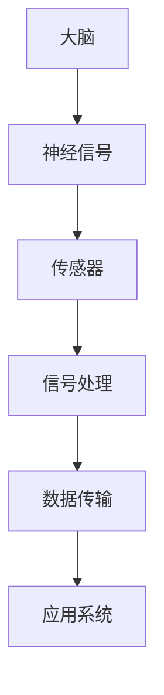
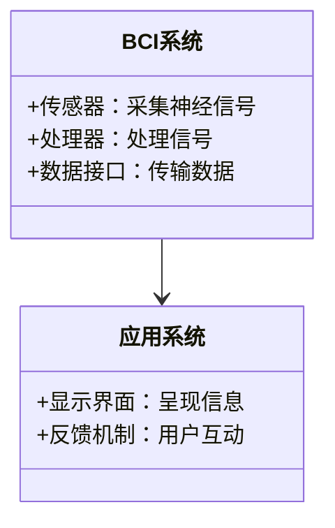
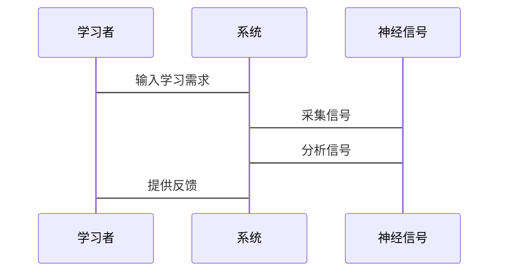
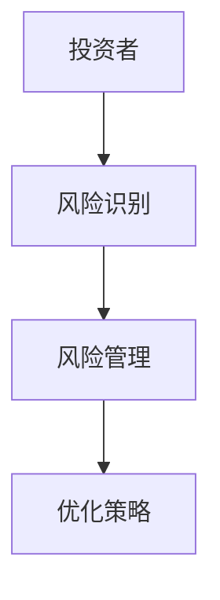
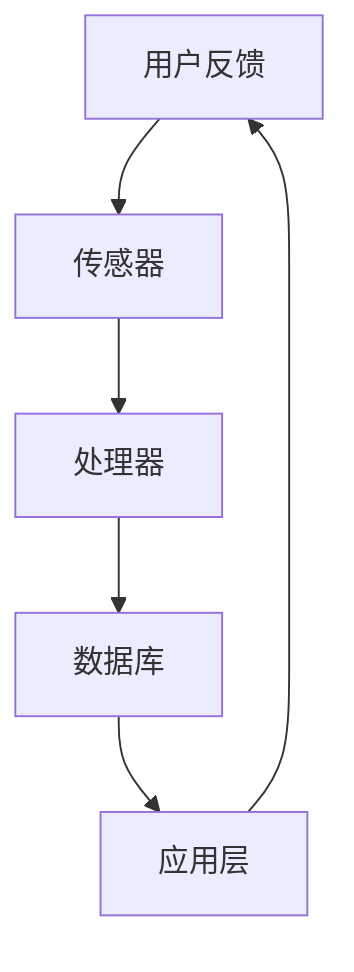

                 


# 巴菲特-芒格的脑机接口教育应用投资：认知增强的新范式

## 关键词：巴菲特，芒格，脑机接口，教育应用，认知增强，投资策略，技术分析

## 摘要：  
本文探讨了巴菲特和芒格在脑机接口（BCI）教育应用领域的投资策略，分析了BCI技术如何通过认知增强改变教育模式。文章从技术背景、投资逻辑、系统架构到实际应用案例，全面解析了这一新范式的核心要素，并展望了其未来的潜力和挑战。

---

## 第一章：引言

### 1.1 背景介绍  
脑机接口（BCI）技术近年来迅速发展，成为教育科技领域的热点。巴菲特和芒格作为投资界传奇人物，他们的投资策略和技术洞察力为这一领域提供了新的视角。本章将介绍BCI的基本概念及其在教育中的潜力。

### 1.2 投资背景与动机  
巴菲特和芒格对教育科技的投资动机是什么？他们为何选择脑机接口技术？本节将深入分析他们的投资逻辑。

---

## 第二章：脑机接口技术原理

### 2.1 技术定义与分类  
脑机接口是什么？它分为哪些类型？本节将通过**mermaid流程图**展示BCI的基本工作原理。



### 2.2 BCI技术的核心组件  
BCI系统由哪些部分组成？通过**mermaid类图**展示系统架构。



### 2.3 技术优势与挑战  
BCI技术在教育中的优势是什么？目前面临哪些技术挑战？通过对比分析，总结其优缺点。

---

## 第三章：认知增强的理论与实践

### 3.1 认知科学基础  
认知增强的理论基础是什么？通过**mermaid序列图**展示认知过程。



### 3.2 BCI在教育中的应用  
BCI如何提升学习效果？本节将通过具体案例分析其应用。

---

## 第四章：巴菲特与芒格的投资策略

### 4.1 投资逻辑分析  
巴菲特和芒格为何选择投资BCI教育应用？他们的投资逻辑是什么？

### 4.2 投资案例分析  
通过具体案例，分析他们如何通过BCI技术实现教育创新。

---

## 第五章：投资评估与风险管理

### 5.1 评估标准  
如何评估BCI教育应用的投资价值？本节将介绍评估标准。

### 5.2 风险管理策略  
如何规避BCI教育应用的投资风险？通过**mermaid风险图**展示策略。



---

## 第六章：技术实现与系统架构

### 6.1 系统架构设计  
通过**mermaid架构图**展示BCI教育应用的系统架构。



### 6.2 算法原理  
BCI的核心算法是什么？通过Python代码示例展示算法实现。

```python
# 简单的信号处理算法示例
def process_signal(signal):
    import numpy as np
    filtered_signal = np.convolve(signal, [0.2, 0.3, 0.2], mode='same')
    return filtered_signal
```

### 6.3 数学模型  
通过**latex公式**展示BCI系统的数学模型。

$$ y = f(x) $$

---

## 第七章：项目实战与案例分析

### 7.1 环境安装  
如何搭建BCI教育应用的开发环境？

### 7.2 核心实现  
通过代码示例展示系统核心功能的实现。

```python
# 示例代码：数据采集与处理
import numpy as np
from sklearn import svm

def train_model(data):
    model = svm.SVC()
    model.fit(data, labels)
    return model
```

### 7.3 案例分析  
通过实际案例分析，总结BCI教育应用的成功经验。

---

## 第八章：总结与展望

### 8.1 核心结论  
总结全文的核心观点。

### 8.2 未来展望  
展望BCI教育应用的未来发展方向。

---

## 附录：拓展阅读与工具推荐

### 1. 巴菲特与芒格的经典著作  
推荐巴菲特和芒格的经典书籍。

### 2. BCI技术的前沿研究  
推荐相关的技术论文和研究机构。

---

通过以上结构，本文系统地探讨了巴菲特和芒格在脑机接口教育应用领域的投资策略，结合技术分析和实际案例，为读者提供了全面的视角。

