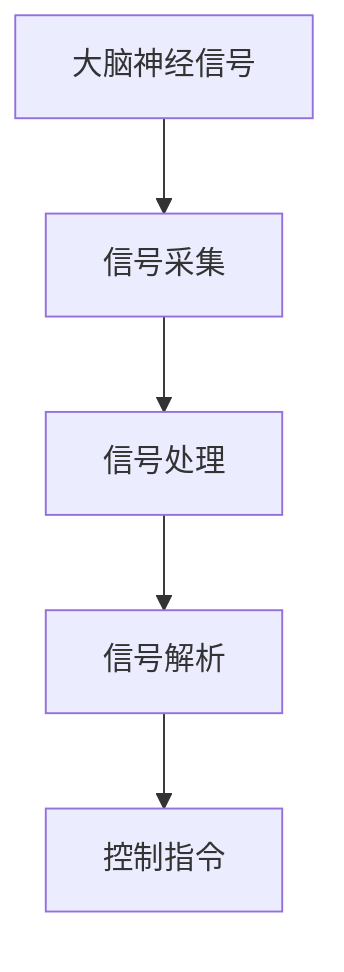
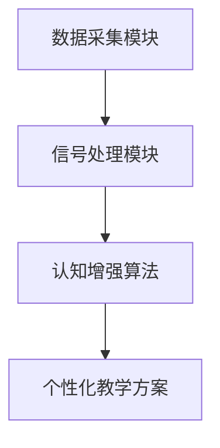

                 


# 巴菲特-芒格的脑机接口教育投资：认知增强的教育革命

## 关键词：脑机接口，教育投资，认知增强，巴菲特，芒格

## 摘要：  
脑机接口（BCI）技术作为一种革命性的技术，正在改变教育领域。本文探讨了巴菲特和芒格的教育投资理念，以及他们如何通过脑机接口技术实现认知增强，推动教育革命。文章详细分析了脑机接口的基本概念、技术原理、发展历程、在教育中的应用，以及其对教育投资的深远影响。通过系统架构设计、算法原理和实际案例分析，本文揭示了脑机接口在教育中的巨大潜力。

---

## 第1章: 脑机接口的基本概念

### 1.1 脑机接口的定义与基本原理

#### 1.1.1 脑机接口的定义  
脑机接口（Brain-Computer Interface, BCI）是一种通过直接连接大脑与外部设备的技术，使用户能够通过思维控制计算机或其他设备。BCI的核心在于解析大脑神经信号，并将其转化为可被机器识别的指令。

#### 1.1.2 脑机接口的基本原理  
脑机接口通过采集和分析大脑的神经信号，将其转化为控制指令。常见的神经信号包括EEG（脑电图）、fMRI（功能性磁共振成像）和EMG（肌电图）等。

#### 1.1.3 脑机接口的核心技术  
- 信号采集：通过传感器或成像设备采集神经信号。  
- 信号处理：对采集到的信号进行滤波、降噪和特征提取。  
- 信号解析：通过算法将神经信号转化为控制指令。  

**示例代码：**  
以下是一个简单的脑电图信号处理代码，使用Python和MNE库：  

```python
import mne

# 导入数据
raw = mne.io.read_raw('sample_data.fif')

# 绘制数据
raw.plot()
```

**mermaid流程图：**  


### 1.2 教育领域的脑机接口应用背景

#### 1.2.1 教育的痛点  
传统教育模式存在效率低下、个性化不足等问题。学生的学习能力差异大，教师难以兼顾所有学生的需求。

#### 1.2.2 脑机接口在教育中的潜在价值  
脑机接口可以通过实时监测学生的神经活动，提供个性化的学习方案，提升学习效率。

#### 1.2.3 认知增强的教育革命  
认知增强技术将彻底改变教育方式，使学习变得更加高效和个性化。

---

## 第2章: 巴菲特与芒格的教育投资理念

### 2.1 巴菲特与芒格的投资哲学

#### 2.1.1 巴菲特的价值投资理念  
巴菲特强调长期投资、价值投资和安全边际。他倾向于投资那些具备持续竞争优势和良好管理的公司。

#### 2.1.2 芒格的多元思维模型  
芒格提倡通过跨学科思维来解决问题，强调知识的广泛性和相互联系。

#### 2.1.3 投资与教育的结合  
巴菲特和芒格都认为教育是人类最重要的投资之一，脑机接口技术在教育中的应用将释放巨大的投资价值。

### 2.2 教育投资的核心要素

#### 2.2.1 教育的经济价值  
高质量的教育能够带来更高的收入和职业机会。

#### 2.2.2 教育的社会价值  
教育是社会进步的重要推动力，能够减少贫困和不平等。

#### 2.2.3 教育的个人价值  
个人通过教育能够实现自我提升和职业发展。

---

## 第3章: 脑机接口技术的发展历程

### 3.1 脑机接口技术的起源

#### 3.1.1 脑机接口的起源与发展  
脑机接口技术起源于20世纪70年代，最初用于帮助瘫痪患者恢复运动能力。

#### 3.1.2 脑机接口的关键技术突破  
- 1990年代：非侵入式BCI技术的发展。  
- 2010年代：高精度和实时性技术的突破。  

#### 3.1.3 脑机接口的商业化进程  
近年来，脑机接口技术逐渐从实验室走向商业化，应用于医疗、教育和娱乐等领域。

### 3.2 脑机接口技术的现状

#### 3.2.1 当前主流脑机接口技术  
- 基于EEG的BCI：非侵入式，成本低。  
- 基于fMRI的BCI：高精度，但成本高。  

#### 3.2.2 脑机接口技术的瓶颈与挑战  
- 信号噪声比低。  
- 用户适应性问题。  

#### 3.2.3 脑机接口技术的未来趋势  
- 更高的精度和实时性。  
- 更广泛的应用场景。  

---

## 第4章: 脑机接口在教育中的应用现状

### 4.1 脑机接口在教育领域的应用案例

#### 4.1.1 个性化学习中的应用  
脑机接口可以根据学生的学习状态实时调整教学内容。

#### 4.1.2 注意力提升的应用  
通过监测学生的注意力水平，优化教学节奏。

#### 4.1.3 情绪管理的应用  
帮助学生识别和调节情绪，提升学习效果。

### 4.2 脑机接口教育应用的现状分析

#### 4.2.1 当前应用的主要领域  
- 个性化学习。  
- 注意力训练。  

#### 4.2.2 应用中的优势与不足  
- 优势：提升学习效率，个性化教学。  
- 不足：技术成熟度有限，成本较高。  

#### 4.2.3 应用的未来发展方向  
- 更广泛的技术应用。  
- 更低的成本和更高的用户体验。  

---

## 第5章: 认知增强的核心原理

### 5.1 认知增强的定义与特征

#### 5.1.1 认知增强的定义  
认知增强是指通过技术手段提升人类的认知能力，包括学习能力、记忆能力和决策能力。

#### 5.1.2 认知增强的核心特征  
- 实时性：即时反馈。  
- 个性化：根据个体差异调整。  

### 5.2 脑机接口如何实现认知增强

#### 5.2.1 通过神经信号解析实现认知增强  
通过解析大脑信号，识别学生的学习状态。

#### 5.2.2 通过反馈机制实现认知增强  
实时反馈学习效果，帮助学生调整学习策略。

#### 5.2.3 通过实时数据分析实现认知增强  
分析学生的行为数据，优化教学方案。

---

## 第6章: 脑机接口教育应用的系统架构

### 6.1 系统架构设计

#### 6.1.1 系统功能设计  
- 数据采集：采集学生的大脑信号。  
- 信号处理：对信号进行滤波和特征提取。  
- 认知增强算法：根据信号生成个性化教学方案。  

#### 6.1.2 系统架构设计  


#### 6.1.3 系统接口设计  
- 数据接口：与传感器连接。  
- 用户接口：与教师和学生交互。  

---

## 总结

脑机接口技术正在改变教育领域，认知增强的教育革命即将到来。巴菲特和芒格的投资理念与脑机接口技术的结合，将推动教育投资的未来发展方向。通过技术创新和投资策略的优化，脑机接口教育应用将实现更大的突破，为教育领域带来深远的影响。

